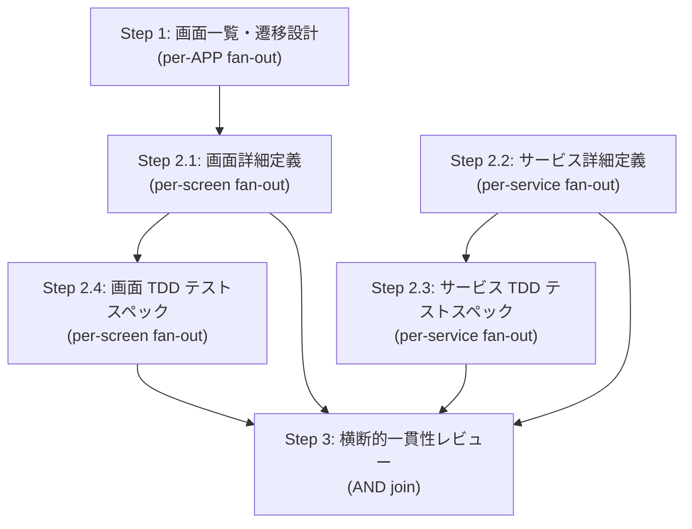

# AAD-WEB: Web App Detail Design

AAS（アーキテクチャ設計）の出力を根拠に、Web アプリケーションの画面設計・マイクロサービス設計・TDD テストスペックを作成し、最後に横断的な一貫性レビューを行うワークフロー。

## 前提条件

AAS が完了しており、以下が `docs/catalog/` に存在すること。

- `domain-analytics.md`
- `service-catalog.md`
- `data-model.md`
- `app-catalog.md`（アプリケーション一覧。APP-ID の根拠）
- `service-catalog-matrix.md`
- `test-strategy.md`
- `persona-screen-catalog.md`（存在すれば参照。AAS Step 8 で生成されるペルソナ別共通画面骨格）

不足がある場合は AAD-WEB に着手せず、先に AAS（`/hve-aas`）を完了させる。

## ワークフロー全体（DAG）

- Step 2.2（サービス詳細）は AAS の成果物のみを根拠にするため、Step 1 の完了を待たずに開始できる。
- Step 3 は Step 2.1〜2.4 の fan-out 子が **全件完了してから** 実行する（AND join）。

## ステップ一覧

| Step | 内容 | fan-out 単位 | テンプレート |
|---|---|---|---|
| 1 | 画面一覧・遷移設計 | APP-ID ごと | `templates/step-1-screen-list.md` |
| 2.1 | 画面詳細定義 | 画面 ID ごと | `templates/step-2.1-screen-detail.md` |
| 2.2 | サービス詳細定義 | サービス ID ごと | `templates/step-2.2-service-detail.md` |
| 2.3 | サービス TDD テストスペック | サービス ID ごと | `templates/step-2.3-tdd-test-service.md` |
| 2.4 | 画面 TDD テストスペック | 画面 ID ごと | `templates/step-2.4-tdd-test-screen.md` |
| 3 | 横断的一貫性レビュー | なし（AND join） | `templates/step-3-consistency-review.md` |

## 実行手順

1. 前提条件のファイルが揃っているか確認する。欠落があればユーザーに提示し、AAS を先に完了させる。
2. Step 1 を実行する。`docs/catalog/app-catalog.md` から APP-ID を列挙し、`templates/step-1-screen-list.md` の指示に従って APP-ID ごとに fan-out する。
3. Step 1 の全 fan-out 子が完了したら、Step 2.1（画面詳細）を実行する。`docs/catalog/screen-catalog-APP-*.md` から画面 ID を列挙し、`templates/step-2.1-screen-detail.md` の指示に従って画面ごとに fan-out する。
4. Step 2.2（サービス詳細）を実行する。Step 1 と並列に開始してよい。`docs/catalog/service-catalog.md` からサービス ID を列挙し、`templates/step-2.2-service-detail.md` の指示に従ってサービスごとに fan-out する。
5. Step 2.2 の全 fan-out 子が完了したら、Step 2.3（サービス TDD テストスペック）を実行する。`templates/step-2.3-tdd-test-service.md` の指示に従ってサービスごとに fan-out する。
6. Step 2.1 の全 fan-out 子が完了したら、Step 2.4（画面 TDD テストスペック）を実行する。`templates/step-2.4-tdd-test-screen.md` の指示に従って画面ごとに fan-out する。
7. Step 2.1・2.2・2.3・2.4 の全 fan-out 子が完了したら、Step 3（横断的一貫性レビュー）を実行する。`templates/step-3-consistency-review.md` の指示に従う（fan-out なし、単発実行）。
8. Step 3 の出力（`docs/catalog/screen-service-consistency-report.md`）に `critical` の指摘があれば、着手前にユーザーへ報告し、修正方針を確認する。

## テンプレートの使い方

各テンプレートは「目的・入力・出力・実行手順・出力フォーマット」の構造で書かれている。fan-out ステップ（1, 2.1, 2.2, 2.3, 2.4）は、カタログファイルの表から対象 ID を列挙し、各 ID に対して Agent tool（`subagent_type: hve-architect`）でサブエージェントを並列起動する。このときテンプレートの内容をプロンプトとして渡し、`{key}` を対象 ID に置換する。

Step 3 は AND join のため fan-out せず、メインループ自身（または単一の Agent 呼び出し）で実行する。

## 注意事項

- Azure 固有ステップ（Azure サービス選定、Agentic Retrieval 仕様）はクラウド非依存化のため本ワークフローには含まない。
- 出力言語は日本語。捏造禁止・オーバーエンジニアリング禁止・最小差分原則は `CLAUDE.md` の規律に従う。
