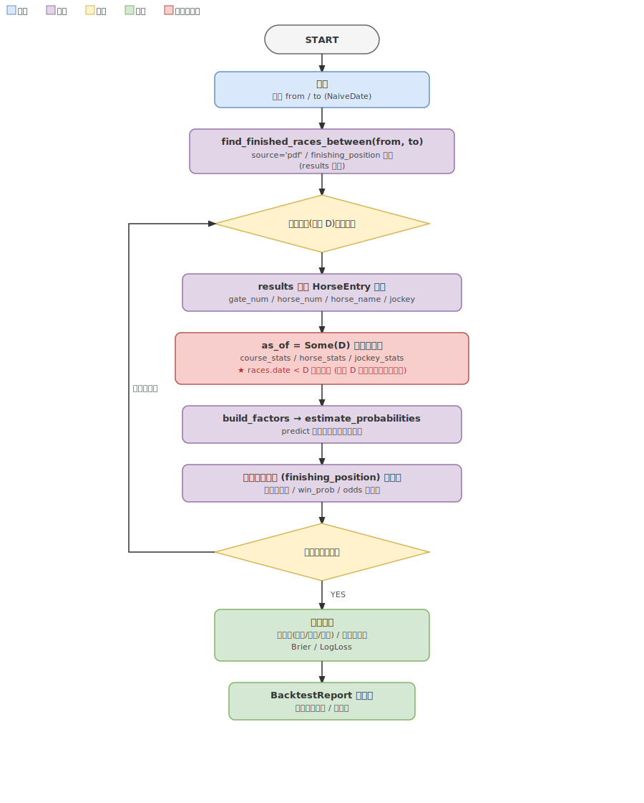

# 予想精度バックテスト/評価基盤 仕様書

Issue #30 対応。DB に蓄積された過去の `races`/`results` に対して予想ロジック
(`paddock_domain::prediction`) を再現し、予測と実着順を突合して的中率・回収率・キャリブレーション
指標を算出する。特徴量拡充 (#31)・品質改善 (#32) の before/after 比較の土台。

## 概要



> 図は `diagrams/backtest-flow.drawio` を正本とし、`.svg` はその描画（編集時は両者を揃える）。

期間 (`from`〜`to`) を受け取り、その期間に確定済みの各レースについて「**そのレース日より前**の
成績だけ」で確率推定を再現し（walk-forward／リーク防止）、実着順と突合して指標レポートを返す。

---

## 用語定義

| 用語 | 定義 |
|-----|-----|
| 評価レース | 期間内かつ `source='pdf'`・`finishing_position` を持つ確定済みレース |
| as-of 統計 | レース日 D に対し `races.date < D` の成績のみで集計した統計（リーク防止） |
| walk-forward | 各評価レースで「その時点までに得られた情報のみ」を使う時系列評価方式 |
| トップ選好馬 | `win_prob` が最大の馬（単勝の本命として扱う） |

---

## 入力

| 項目 | 型 | 説明 |
|------|----|----|
| `from` | `NaiveDate` | 評価期間の開始日（含む） |
| `to` | `NaiveDate` | 評価期間の終了日（含む） |

CLI: `paddock-analyze backtest --from YYYY-MM-DD --to YYYY-MM-DD`

## 出力

`BacktestReport`（`paddock_domain::backtest`）。

| フィールド | 型 | 説明 |
|----------|----|----|
| `races_evaluated` | `u32` | 突合できた評価レース数 |
| `win_hit_rate` | `f64` | 単勝的中率（0.0〜1.0） |
| `place_hit_rate` | `f64` | 連対的中率（2 着以内, 0.0〜1.0） |
| `show_hit_rate` | `f64` | 複勝的中率（3 着以内, 0.0〜1.0） |
| `payout_rate` | `Option<f64>` | 想定回収率。オッズ取得可能レースが 0 件なら `None` |
| `payout_races` | `u32` | 回収率の母数（オッズ取得できたレース数） |
| `brier` | `f64` | Brier スコア（win, 小さいほど良い） |
| `log_loss` | `f64` | 対数損失（win, 小さいほど良い） |

---

## 評価アルゴリズム

### ステップ 1: 評価レースの取得

`Repository::find_finished_races_between(from, to)` で期間内の確定済みレースを `results` 付きで取得する。
`races.source='pdf'`（既存 `find_races_by_date` と同じ列）かつ `finishing_position IS NOT NULL` を含む
レースのみを対象とする。出馬表 (`race_cards`) ではなく `results` を使うため、出馬表が無い過去レースも
評価できる。`from > to` のときは結果が空集合になり、評価レース数 0 で正常終了する（期間の前後関係を
特別扱いするバリデーションは設けない）。

### ステップ 2: レースごとの予測再現（リーク防止）

各評価レース（レース日 D）について:

1. `results` の各行から `HorseEntry`（gate_num / horse_num / horse_name / jockey）を復元する。
2. `as_of = Some(D)` で `course_stats` / `horse_stats` / `jockey_stats` を取得する。
   gateway 側で `races.date < D` を付与し、**D 当日・D 以降の結果を集計に含めない**。
3. `build_factors`（`predict_race` と共有）で `HorseFactors` を構築する。
4. `paddock_domain::prediction::estimate_probabilities` を呼び、`Vec<HorseProbability>` を得る。

> 本番 `predict_race` は `as_of = None`（全期間集計）。バックテストのみ `Some(D)` を渡す。
> stats メソッドへの `as_of` 追加は単一コードパスで、本番は完全後方互換。

### ステップ 3: 実着順との突合

各馬の予測 `HorseProbability` と `results.finishing_position` を突合し、レース単位で以下を蓄積:

- トップ選好馬（`win_prob` 最大）の `finishing_position`（的中判定に使用）
- トップ選好馬の `odds`（`results.odds`、回収率に使用。`None` ならそのレースは回収率の母数外）
- 全馬の `(win_prob, 1着か否か)` ペア（Brier / LogLoss に使用）

トップ選好馬の決定と着順欠落の扱い:

- **タイブレーク**: `win_prob` が同値の馬が複数（全馬均等フォールバック等）のときは **馬番昇順で最小** の
  馬をトップ選好馬とし、的中率・回収率を決定論的に再現可能にする。
- **着順欠落**: トップ選好馬の `finishing_position` が `None`（除外・失格・取消等で着順なし）の場合は
  **非的中（外れ）扱い**。回収率では `payout = 0`（賭けは成立したとみなし、`odds` があれば stake 母数に
  含める）。Brier / LogLoss の `y` も「1 着でない＝0」として扱う。

### ステップ 4: 指標集計

| 指標 | 定義 |
|-----|-----|
| 単勝的中率 | (トップ選好馬が 1 着のレース数) / 評価レース数 |
| 連対的中率 | (トップ選好馬が 2 着以内のレース数) / 評価レース数 |
| 複勝的中率 | (トップ選好馬が 3 着以内のレース数) / 評価レース数 |
| 想定回収率 | Σ payout / Σ stake。各レース 100 円をトップ選好馬の単勝に賭け、1 着なら `payout = odds×100`、他は 0。`results.odds` が取れたレースのみ母数 |
| Brier (win) | `mean((win_prob − y)²)`、y=1 if 1 着。全馬エントリ単位 |
| LogLoss (win) | `−mean(y·ln p + (1−y)·ln(1−p))`。`p` は `[ε, 1−ε]` にクランプして `ln(0)` を回避（ε=1e-15） |

> **的中率の母数と本命固定について**: 連対・複勝の的中率も「`win_prob` 最大のトップ選好馬」が
> 2/3 着以内に入ったかで測る（`place_prob`/`show_prob` 最大馬ではない）。これは「単勝本命を軸に、
> その馬が連対・複勝で保険的中したか」を見る評価方針で、同一の馬を母数にするため
> `単勝的中率 ≤ 連対的中率 ≤ 複勝的中率` の包含関係が常に成立する。`place_prob`/`show_prob` 自体の
> 較正は Brier/LogLoss（下記）で測る。評価レース数（`races_evaluated`）は、エントリが 1 頭以上あり
> トップ選好馬を決定できたレース数（突合できなかったレースは母数から除外）。

> **Brier/LogLoss の確率モデル前提**: `win_prob` はレース内で Σ=1.0 に正規化された「各馬が 1 着になる
> 周辺確率」（probability-estimation.md）。本指標は各馬の単勝的中を**独立な二値事象**とみなし、その
> 周辺確率の較正（calibration）を全馬エントリ単位で測る。レース全体の同時分布に対する多クラス
> LogLoss（`−ln p_winner`）ではない点に注意（#31/#32 の before/after 比較では同一定義で一貫して
> 比較できれば足りるため、解釈の容易な二値較正を採る）。スタッツ希薄でスコア 0 → `win_prob=0` の馬
> （ADR 0002 の既知制約）が実際に勝った場合、ε クランプにより LogLoss が大きく効く。

---

## リーク防止 (walk-forward)

レート集計モデルは非パラメトリックで別途の学習フェーズを持たないため、リーク防止は統計の
**as-of 日付カットオフ**で成立する（ADR 0006 案A）。各評価レースは「レース日より厳密に前」の
成績のみで予測されるため、本番の予想（常に直近までの統計を使う）と同じ条件で評価できる。

固定の train/test 期間分割（案B）は採用しない。test 期間後半のレースが古い統計しか使えず、本番と
条件が乖離するため。

---

## レイヤー別実装方針

### Domain (`paddock_domain::backtest`)

```rust
pub struct BacktestReport {
    pub races_evaluated: u32,
    pub win_hit_rate: f64,
    pub place_hit_rate: f64,
    pub show_hit_rate: f64,
    pub payout_rate: Option<f64>,
    pub payout_races: u32,
    pub brier: f64,
    pub log_loss: f64,
}

/// 1 レース分の予測と実着の突合結果（純粋な集計入力）。
pub struct RaceEvaluation {
    /// 全馬の (win_prob, 1着か否か)。Brier/LogLoss 用。
    pub win_outcomes: Vec<(f64, bool)>,
    /// トップ選好馬の着順（突合できなければ None）。
    pub top_pick_position: Option<u32>,
    /// トップ選好馬のオッズ（None なら回収率の母数外）。
    pub top_pick_odds: Option<f64>,
}

pub fn evaluate(races: &[RaceEvaluation]) -> BacktestReport
```

指標計算は IO を持たない純粋関数として実装し、既知入力に対する期待値を単体テストする。

### Use-Case (`use_case::interactor::race::backtest`)

```rust
pub async fn backtest(&self, from: NaiveDate, to: NaiveDate) -> Result<BacktestReport>
```

1. `find_finished_races_between(from, to)` で評価レースを取得
2. 各レースで `HorseEntry` を復元し、`as_of=Some(race.date)` の factors を組み、
   `estimate_probabilities` を再現
3. `RaceEvaluation` を構築し、`paddock_domain::backtest::evaluate` で集計

`build_factors` は `predict.rs` と共有する（`pub(crate)` 化）。共有するのは「取得済みの stats 行
（`CourseStatsRow`/`HorseStatsRow`/`JockeyStatsRow`）から `HorseFactors` を組み立てる純粋な変換」だけで、
`build_factors` 自体は `as_of` に依存しない。stats の取得呼び出し（`as_of` を `None`/`Some(D)` で出し分ける
部分）は predict と backtest の各 interactor 側に残る。

### Use-Case Repository（トレイト変更）

- `horse_stats` / `course_stats` / `jockey_stats` に `as_of: Option<NaiveDate>` を追加。
- `find_finished_races_between(from, to) -> Vec<Race>`（results 付き）を新設。

既存呼び出し側（predict / horse / course / jockey interactor）は `None` を渡す。

### Interface (rdb-gateway)

- `horse_stats` / `course_stats` / `jockey_stats` クエリに、`as_of = Some(d)` のとき `races.date < $d`
  を付与。`races` を JOIN していない `FROM results` 単独のサブクエリ（horse の overall / popularity /
  枠順グループ、jockey の overall / 枠順グループ）には `INNER JOIN races` を足す。`by_surface` /
  `by_distance_band` / course の枠順グループは既に `races` を JOIN 済みのため述語追加のみでよい。日付は
  プレースホルダでバインドし、SQL 文字列連結はしない。スコアリングに直接使うのは course 枠順・horse 芝ダ・
  horse 距離帯・jockey 芝ダだが、`as_of` を 1 つのメソッドに通す単一コードパスを保つため、同メソッドが
  返す全サブ統計に一貫して日付カットオフを掛ける（一部だけ未カットオフの内部不整合を作らない）。
- `find_finished_races_between` を新設し、`races`（`source='pdf'`）と `results` を JOIN して期間内の
  確定レースを results 付きで取得する。

### Apps (analyze)

```
paddock-analyze backtest --from 2026-01-01 --to 2026-03-31
```

出力例:
```
# バックテスト 2026-01-01 〜 2026-03-31
評価レース数        : 432
単勝的中率          : 24.3%
連対的中率          : 41.7%
複勝的中率          : 55.6%
想定回収率          : 78.2%  (母数 410 レース)
Brier (win)         : 0.0712
LogLoss (win)       : 0.2841
```

`results.odds` がどのレースでも取れず回収率の母数が 0 の場合は、NaN を出さず母数 0 を明示する:
```
想定回収率          : —  (母数 0 レース)
```
評価対象レースが 0 件（期間に確定レースなし／`from > to`）の場合は、各指標を計算せず
「評価対象レースなし」を表示して正常終了する。

---

## 既知の制約

- `results.odds` は単勝倍率（払戻 = `odds × 賭け金`、元本込み。回収率 100% がトントン）。`results.odds`
  が未取り込みのレースが多い場合、回収率の母数（`payout_races`）が小さくなる。的中率・Brier・LogLoss は
  全評価レースで算出される。
- 想定回収率は JRA 実払戻の端数処理（100 円あたり 10 円未満切り捨て）を行わない概算。
- 評価対象は `races.source='pdf'` の確定レースのみ。netkeiba 由来の近走（`source='netkeiba'`）は評価
  対象から除外するが、as-of 統計の集計母数には（過去日付の成績として）含まれうる。同一馬・同一実レースが
  pdf と netkeiba の両方で取り込まれている場合は二重計上され統計を歪めうる（確率推定側と共通の既存課題で、
  本 issue では対処しない）。
- 確率推定側の既知制約（単調性非保証・騎手なしペナルティ・スタッツ希薄馬のゼロスコア, ADR 0002）は
  バックテスト結果にもそのまま反映される。バックテストはそれらの改善 (#32) の効果測定に使う。
- 想定回収率は単勝（トップ選好馬への 100 円固定賭け）のみを対象とする。EV/Kelly 配分（ADR 0003）を
  反映した回収率評価は将来の拡張とする。
- Brier / LogLoss は全馬エントリ単位の二値較正のため、出走頭数分布に依存する（多頭数レースほど y=0 側の
  サンプルが増える）。#31/#32 の before/after を比較する際は、対象期間の頭数構成が大きく変わらない前提で
  相対比較する（絶対値の期間横断比較には注意）。
- as-of カットオフは `races.date`（開催日）に依存する。同一開催日内のレース順序（R 番号）までは
  考慮せず、同日レースは相互に統計へ寄与しない（D 当日を一律除外）。これはリーク回避を優先した意図的な
  割り切りで、本番 predict（`as_of=None`・全期間）とはこの点だけ条件が非対称になる。
