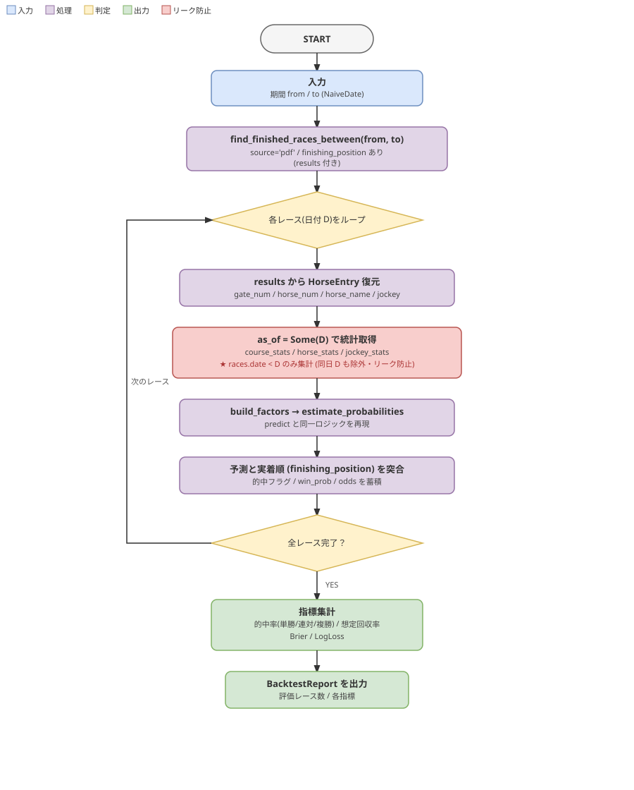

---
# knowledge 規約に基づくメタデータ（docs/knowledge/README.md）。specifications はその場で
# knowledge に昇格（ADR 履歴・相互リンクを壊さないため物理移動しない）。
status: Confirmed
kind: knowledge
doc_class: [D24, D17, D19]
tags: [D24, D17, D19]
updated: "2026-08-12"
---

# 予想精度バックテスト/評価基盤 仕様書

Issue #30 対応。DB に蓄積された過去の `races`/`results` に対して予想ロジック
(`paddock_domain::prediction`) を再現し、予測と実着順を突合して的中率・回収率・キャリブレーション
指標を算出する。特徴量拡充 (#31)・品質改善 (#32) の before/after 比較の土台。

## 概要



> 図は `diagrams/backtest-flow.drawio` を正本とし、`.svg` はその描画（編集時は両者を揃える）。

期間 (`from`〜`to`) を受け取り、その期間に確定済みの各レースについて「**そのレース日より前**の
成績だけ」で確率推定を再現し（walk-forward／リーク防止）、実着順と突合して指標レポートを返す。

---

## 用語定義

| 用語 | 定義 |
|-----|-----|
| 評価レース | 期間内かつ `source='pdf'`・`finishing_position` を持つ確定済みレース |
| as-of 統計 | レース日 D に対し `races.date < D` の成績のみで集計した統計（リーク防止） |
| walk-forward | 各評価レースで「その時点までに得られた情報のみ」を使う時系列評価方式 |
| トップ選好馬 | `win_prob` が最大の馬（単勝の本命として扱う） |

> 横断の用語索引は [用語集](../knowledge/glossary.md)（D07）。定義の正本は本書で、用語集はここを指す。

---

## 入力

| 項目 | 型 | 説明 |
|------|----|----|
| `from` | `NaiveDate` | 評価期間の開始日（含む） |
| `to` | `NaiveDate` | 評価期間の終了日（含む） |

CLI: `paddock-analyze backtest --from YYYY-MM-DD --to YYYY-MM-DD [--blend-alpha <α>]`

`--blend-alpha <α>`（任意, [0,1]）を渡すと確率推定を市場オッズ(単勝)の implied 確率と
α（モデル重み）でブレンドして評価する（#72）。当時 `race_odds` が無い過去レースは PDF 確定
成績の単勝で代替する。詳細・α スイープ結果は `probability-estimation.md` のステップ 4 を参照。

`--from` / `--to` は `String` で受け取り、`main` 内で `NaiveDate::parse_from_str(_, "%Y-%m-%d")` で
手動パースする（既存 `predict <race_id>` が `String` 受け→`RaceId::try_from` する流儀に合わせる）。
パース失敗は `anyhow` エラーとして stderr に出力し exit code 1 で終了する（clap の型パーサに任せると
exit code 2 になり既存コマンドと不揃いになるため、手動パースで統一する）。

## 出力

`BacktestReport`（`paddock_domain::backtest`）。

| フィールド | 型 | 説明 |
|----------|----|----|
| `races_evaluated` | `u32` | 突合できた評価レース数 |
| `win_hit_rate` | `f64` | 単勝的中率（0.0〜1.0） |
| `place_hit_rate` | `f64` | 連対的中率（2 着以内, 0.0〜1.0） |
| `show_hit_rate` | `f64` | 複勝的中率（3 着以内, 0.0〜1.0） |
| `payout_rate` | `Option<f64>` | 想定回収率。オッズ取得可能レースが 0 件なら `None` |
| `payout_races` | `u32` | 回収率の母数（オッズ取得できたレース数） |
| `brier` | `f64` | Brier スコア（win, 小さいほど良い）。`place_calibration`/`show_calibration` と区別するため単勝のみ平坦フィールドで保持 |
| `log_loss` | `f64` | 対数損失（win, 小さいほど良い） |
| `place_calibration` | `CalibrationMetrics` | 連対（2 着以内）確率の `{ brier, log_loss }` |
| `show_calibration` | `CalibrationMetrics` | 複勝（3 着以内）確率の `{ brier, log_loss }` |
| `win_reliability` | `Vec<ReliabilityBin>` | 単勝確率の信頼度曲線（等幅 10 ビン、空ビンも含む） |
| `by_field_size` | `Vec<FieldSizeSegment>` | 頭数帯別の的中率＋単勝校正（データのある帯のみ） |
| `by_popularity` | `Vec<PopularitySegment>` | 人気帯別の単勝校正（データのある帯のみ） |

`ReliabilityBin` = `{ lower, upper, count, mean_predicted, observed_rate }`。
`FieldSizeSegment` = `{ label, races, win/place/show_hit_rate, win_calibration }`。
`PopularitySegment` = `{ label, entries, mean_win_prob, observed_win_rate, win_calibration }`。

**セグメントの band 定義**:

- 頭数帯（レース単位）: `～9頭` / `10-12頭` / `13-15頭` / `16頭以上`
- 人気帯（馬エントリ単位、`results.popularity`）: `1番人気` / `2-3番人気` / `4-6番人気` / `7-9番人気` / `10番人気以下` / `人気不明`（人気欠落）

頭数帯の的中率は全体と同じ母数定義で、トップ選好馬の着順が無いレース（除外・失格等）もその帯のレース数（分母）に含め、非的中として数える。

---

## 評価アルゴリズム

### ステップ 1: 評価レースの取得

`Repository::find_finished_races_between(from, to)` で期間内の確定済みレースを `results` 付きで取得する。
`races.source='pdf'`（既存 `find_races_by_date` と同じ列）かつ `finishing_position IS NOT NULL` を含む
レースのみを対象とする。出馬表 (`race_cards`) ではなく `results` を使うため、出馬表が無い過去レースも
評価できる。`from > to` のときは結果が空集合になり、評価レース数 0 で正常終了する（期間の前後関係を
特別扱いするバリデーションは設けない）。

粒度: `find_finished_races_between` は「着順ありの `results` 行を 1 件以上含むレース」を返す（レース単位の
フィルタ）。個々の馬の `finishing_position` が `None`（除外・失格等）であることは許容し、馬単位の欠落は
ステップ 3 で扱う。

### ステップ 2: レースごとの予測再現（リーク防止）

各評価レース（レース日 D）について:

1. `results` の各行から `HorseEntry`（gate_num / horse_num / horse_name / jockey）を復元する。
   ただし**出走取消（`status=cancelled`）・競走除外（`status=scratched`）の馬は発走していない**ため、
   本番 `predict` の出馬表と母集合を揃える目的で除外する（確率推定の正規化分母に含めると確率が歪む）。
   競走中止（`status=did_not_finish`）は発走済みなので母集合に含め、着順なしの非的中として扱う。
2. `as_of = Some(D)` で `course_stats` / `horse_stats` / `jockey_stats` を取得する。
   gateway 側で `races.date < D` を付与し、**D 当日・D 以降の結果を集計に含めない**。
3. `build_factors`（`predict_race` と共有）で `HorseFactors` を構築する。
4. `paddock_domain::prediction::estimate_probabilities` を呼び、`Vec<HorseProbability>` を得る。

> 本番 `predict_race` は `as_of = None`（全期間集計）。バックテストのみ `Some(D)` を渡す。
> stats メソッドへの `as_of` 追加は単一コードパスで、本番は完全後方互換。

### ステップ 3: 実着順との突合

各馬の予測 `HorseProbability` と `results.finishing_position` を突合し、レース単位で以下を蓄積:

- トップ選好馬（`win_prob` 最大）の `finishing_position`（的中判定に使用）
- トップ選好馬の `odds`（`results.odds`、回収率に使用。`None` ならそのレースは回収率の母数外）
- 全馬の `(win_prob, 1着か)` / `(place_prob, 2着以内か)` / `(show_prob, 3着以内か)` ペア（各校正に使用）
- 全馬の `popularity`（`results.popularity`）と出走頭数（セグメント分類に使用）

トップ選好馬の決定と着順欠落の扱い:

- **タイブレーク**: `win_prob` が同値の馬が複数（全馬均等フォールバック等）のときは **馬番昇順で最小** の
  馬をトップ選好馬とし、的中率・回収率を決定論的に再現可能にする。
- **着順欠落**: トップ選好馬の `finishing_position` が `None`（除外・失格・取消等で着順なし）の場合は
  **非的中（外れ）扱い**。回収率では `payout = 0`（賭けは成立したとみなし、`odds` があれば stake 母数に
  含める）。Brier / LogLoss の `y` も「1 着でない＝0」として扱う。

### ステップ 4: 指標集計

| 指標 | 定義 |
|-----|-----|
| 単勝的中率 | (トップ選好馬が 1 着のレース数) / 評価レース数 |
| 連対的中率 | (トップ選好馬が 2 着以内のレース数) / 評価レース数 |
| 複勝的中率 | (トップ選好馬が 3 着以内のレース数) / 評価レース数 |
| 想定回収率 | Σ payout / Σ stake。各レース 100 円をトップ選好馬の単勝に賭け、1 着なら `payout = odds×100`、他は 0。`results.odds` が取れたレースのみ母数 |
| Brier (win) | `mean((win_prob − y)²)`、y=1 if 1 着。全馬エントリ単位 |
| LogLoss (win) | `−mean(y·ln p + (1−y)·ln(1−p))`。`p` は `[ε, 1−ε]` にクランプして `ln(0)` を回避（ε=1e-15） |
| Brier / LogLoss (place) | 上と同じ式を `place_prob` と y=1 if 2 着以内 に適用 |
| Brier / LogLoss (show) | 上と同じ式を `show_prob` と y=1 if 3 着以内 に適用 |
| reliability 曲線 (win) | `win_prob` を等幅 10 ビン（`[0,0.1)…[0.9,1.0]`）に分け、ビンごとに「平均予測確率」と「実測勝率（1 着率）」を出す。上端 1.0 は最終ビン |
| セグメント別 | 頭数帯（レース単位）・人気帯（エントリ単位）で上記の的中率・単勝校正を再集計 |

#### reliability 曲線の読み方

各ビンで **平均予測 ≒ 実測勝率** なら校正良好（理想は対角線 `predicted = observed`）。

- 平均予測 > 実測勝率 → その確率帯を**過大評価**（自信過剰）
- 平均予測 < 実測勝率 → **過小評価**（自信不足）

単勝確率は大半の馬が低確率（< 0.3）に集中するため高位ビンは空になりやすい。`analyze` 出力では空ビンを省略する。人気帯別（`by_popularity`）は「`mean_win_prob` vs `observed_win_rate`」で同じ校正を人気の軸で確認でき、「○番人気帯の予測勝率が実測とどれだけ乖離するか」を読む。

> Brier/LogLoss は **小さいほど良い**。`win`/`place`/`show` は別母数（同一馬でも outcome 定義が異なる）なので絶対値の大小比較ではなく、#31/#32 の特徴量追加 before/after で**同一定義の値が下がるか**を見る用途。

> **的中率の母数と本命固定について**: 連対・複勝の的中率も「`win_prob` 最大のトップ選好馬」が
> 2/3 着以内に入ったかで測る（`place_prob`/`show_prob` 最大馬ではない）。これは「単勝本命を軸に、
> その馬が連対・複勝で保険的中したか」を見る評価方針で、同一の馬を母数にするため
> `単勝的中率 ≤ 連対的中率 ≤ 複勝的中率` の包含関係が常に成立する。`place_prob`/`show_prob` 自体の
> 較正は Brier/LogLoss（下記）で測る。評価レース数（`races_evaluated`）は、エントリが 1 頭以上あり
> トップ選好馬を決定できたレース数（突合できなかったレースは母数から除外）。

> **Brier/LogLoss の確率モデル前提**: `win_prob` はレース内で Σ=1.0 に正規化された「各馬が 1 着になる
> 周辺確率」（probability-estimation.md）。本指標は各馬の単勝的中を**独立な二値事象**とみなし、その
> 周辺確率の較正（calibration）を全馬エントリ単位で測る。レース全体の同時分布に対する多クラス
> LogLoss（`−ln p_winner`）ではない点に注意（#31/#32 の before/after 比較では同一定義で一貫して
> 比較できれば足りるため、解釈の容易な二値較正を採る）。スタッツ希薄でスコア 0 → `win_prob=0` の馬
> （ADR 0002 の既知制約）が実際に勝った場合、ε クランプにより LogLoss が大きく効く。

---

## リーク防止 (walk-forward)

レート集計モデルは非パラメトリックで別途の学習フェーズを持たないため、リーク防止は統計の
**as-of 日付カットオフ**で成立する（ADR 0006 案A）。各評価レースは「レース日より厳密に前」の
成績のみで予測されるため、本番の予想（常に直近までの統計を使う）と同じ条件で評価できる。

固定の train/test 期間分割（案B）は採用しない。test 期間後半のレースが古い統計しか使えず、本番と
条件が乖離するため。

---

## レイヤー別実装方針

### Domain (`paddock_domain::backtest`)

```rust
pub struct BacktestReport {
    pub races_evaluated: u32,
    pub win_hit_rate: f64,
    pub place_hit_rate: f64,
    pub show_hit_rate: f64,
    pub payout_rate: Option<f64>,
    pub payout_races: u32,
    pub brier: f64,
    pub log_loss: f64,
}

/// 1 レース分の予測と実着の突合結果（純粋な集計入力）。
pub struct RaceEvaluation {
    /// 全馬の (win_prob, 1着か否か)。Brier/LogLoss 用。
    pub win_outcomes: Vec<(f64, bool)>,
    /// トップ選好馬の着順（突合できなければ None）。
    pub top_pick_position: Option<u32>,
    /// トップ選好馬のオッズ（None なら回収率の母数外）。
    pub top_pick_odds: Option<f64>,
}

pub fn evaluate(races: &[RaceEvaluation]) -> BacktestReport
```

指標計算は IO を持たない純粋関数として実装し、既知入力に対する期待値を単体テストする。

### Use-Case (`use_case::interactor::race::backtest`)

```rust
pub async fn backtest(&self, from: NaiveDate, to: NaiveDate) -> Result<BacktestReport>
```

1. `find_finished_races_between(from, to)` で評価レースを取得
2. 各レースで `HorseEntry` を復元し、`as_of=Some(race.date)` の factors を組み、
   `estimate_probabilities` を再現
3. `RaceEvaluation` を構築し、`paddock_domain::backtest::evaluate` で集計

`build_factors` は `predict.rs` と共有する（`pub(crate)` 化）。共有するのは「取得済みの stats 行
（`CourseStatsRow`/`HorseStatsRow`/`JockeyStatsRow`）から `HorseFactors` を組み立てる純粋な変換」だけで、
`build_factors` 自体は `as_of` に依存しない。stats の取得呼び出し（`as_of` を `None`/`Some(D)` で出し分ける
部分）は predict と backtest の各 interactor 側に残る。

### Use-Case Repository（トレイト変更）

- `horse_stats` / `course_stats` / `jockey_stats` に `as_of: Option<NaiveDate>` を追加。
- `find_finished_races_between(from, to) -> Vec<Race>`（results 付き）を新設。

既存呼び出し側（predict / horse / course / jockey interactor）は `None` を渡す。

### Interface (rdb-gateway)

- `horse_stats` / `course_stats` / `jockey_stats` クエリに、`as_of = Some(d)` のとき `races.date < $d`
  を付与。`races` を JOIN していない `FROM results` 単独のサブクエリ（horse の overall / popularity /
  枠順グループ、jockey の overall / 枠順グループ）には `INNER JOIN races` を足す。`by_surface` /
  `by_distance_band` / course の枠順グループは既に `races` を JOIN 済みのため述語追加のみでよい。日付は
  プレースホルダでバインドし、SQL 文字列連結はしない。スコアリングに直接使うのは course 枠順・horse 芝ダ・
  horse 距離帯・jockey 芝ダだが、`as_of` を 1 つのメソッドに通す単一コードパスを保つため、同メソッドが
  返す全サブ統計に一貫して日付カットオフを掛ける（一部だけ未カットオフの内部不整合を作らない）。
- `find_finished_races_between` を新設し、`races`（`source='pdf'`）と `results` を JOIN して期間内の
  確定レースを results 付きで取得する。

### Apps (analyze)

```
paddock-analyze backtest --from 2026-01-01 --to 2026-03-31
```

出力例:
```
# バックテスト 2026-01-01 〜 2026-03-31
評価レース数        : 432
単勝的中率          : 24.3%
連対的中率          : 41.7%
複勝的中率          : 55.6%
想定回収率          : 78.2%  (母数 410 レース)
Brier (win)         : 0.0712
LogLoss (win)       : 0.2841
```

`results.odds` がどのレースでも取れず回収率の母数が 0 の場合は、NaN を出さず母数 0 を明示する:
```
想定回収率          : —  (母数 0 レース)
```
評価対象レースが 0 件（期間に確定レースなし／`from > to`）の場合は、各指標を計算せず
「評価対象レースなし」を表示して正常終了する。

---

## 既知の制約

- `results.odds` は単勝倍率（払戻 = `odds × 賭け金`、元本込み。回収率 100% がトントン）。`results.odds`
  が未取り込みのレースが多い場合、回収率の母数（`payout_races`）が小さくなる。的中率・Brier・LogLoss は
  全評価レースで算出される。
- 想定回収率は JRA 実払戻の端数処理（100 円あたり 10 円未満切り捨て）を行わない概算。
- 評価対象は `races.source='pdf'` の確定レースのみ。netkeiba 由来の近走（`source='netkeiba'`）は評価
  対象から除外するが、as-of 統計の集計母数には（過去日付の成績として）含まれうる。同一馬・同一実レースが
  pdf と netkeiba の両方で取り込まれている場合は二重計上され統計を歪めうる（確率推定側と共通の既存課題で、
  本 issue では対処しない）。
- 確率推定側の既知制約（単調性非保証・騎手なしペナルティ・スタッツ希薄馬のゼロスコア, ADR 0002）は
  バックテスト結果にもそのまま反映される。バックテストはそれらの改善 (#32) の効果測定に使う。
- 想定回収率は単勝（トップ選好馬への 100 円固定賭け）のみを対象とする。EV/Kelly 配分（ADR 0003）を
  反映した回収率評価は将来の拡張とする。
- 回収率は `results.odds`（レース確定後の単勝確定オッズ）ベースで、本番 predict が買い目を決める時点の
  締切前取得オッズとは別物。確定オッズで後知恵的に賭けた場合の概算であり、EV/Kelly の予想時点前提とは
  乖離しうる点に注意する。
- 統計・突合は `horse_name` 文字列一致をキーにするため、同名異馬の混同は backtest でも本番 predict と
  同様に残る（`results.horse_id` による厳密な同定は本 issue では使わない）。
- Brier / LogLoss は全馬エントリ単位の二値較正のため、出走頭数分布に依存する（多頭数レースほど y=0 側の
  サンプルが増える）。#31/#32 の before/after を比較する際は、対象期間の頭数構成が大きく変わらない前提で
  相対比較する（絶対値の期間横断比較には注意）。
- as-of カットオフは `races.date`（開催日）に依存する。同一開催日内のレース順序（R 番号）までは
  考慮せず、同日レースは相互に統計へ寄与しない（D 当日を一律除外）。これはリーク回避を優先した意図的な
  割り切りで、本番 predict（`as_of=None`・全期間）とはこの点だけ条件が非対称になる。

---

## 決定ログ

<!-- この節は append-only です。既存エントリの変更・削除は CI が検出します。 -->

### ADR 0002: 着順確率推定モデルの実装 (Issue #11) (2026-06-04) — 承認済み

#### コンテキスト
Issue #11 で、DB に蓄積された過去成績をもとに出走馬ごとの 1 着・2 着・3 着確率を
推定するモデルが求められた。

既存のスタッツ基盤（`horse_stats` / `course_stats` / `jockey_stats`）はすでに実装済みで、
枠順・芝ダ・距離帯・騎手別の勝率・連対率は取得可能である。ただし複勝率（3 着以内）は
保持していない。

Issue 本文に「精密さより動くことを優先」とあり、機械学習ではなくルールベーススコアリングで十分。

#### 決定

1. **ルールベーススコアリングを Domain 層に実装する。**  
   `paddock_domain::prediction` モジュールを新設し、`HorseProbability` 型と
   `estimate_probabilities` 純粋関数を置く。IO なし・テスト容易な設計にする。

2. **`GroupStat` に `shows: u32`（複勝カウント）を追加する。**  
   既存の `places`（連対カウント、top-2）に加え `shows`（複勝カウント、top-3）を追加する。
   スキーマ変更ではなく既存クエリへの集計カラム追加で対応する。

3. **スコアリング重みは固定値とする。**  
   `course_gate_rate(×2) + horse_surface_rate(×1) + horse_distance_rate(×1) + jockey_surface_rate(×1)`  
   `course_gate_rate` を 2 倍にする理由: 会場・距離・馬場・枠順の組み合わせは個別レースへの適合度が最も直接的で信頼度が高いため。  
   チューニングより動くことを優先し、パラメータ化は行わない。

4. **`find_race_card(race_id)` を Repository に追加する。**  
   `predict_race` ユースケースは race_id を受け取り DB からエントリを取得する。
   CLI 引数でエントリを逐一渡す方式は操作性が低いため採用しない。

5. **`analyze` アプリに `predict <race_id>` サブコマンドを追加する。**  
   既存の `horse` / `course` / `jockey` サブコマンドと同列に配置する。

#### 理由

- 純粋関数として Domain 層に置くことで、ユニットテストが外部依存なしで書ける
- `GroupStat` への `shows` 追加は破壊的変更だが、変更箇所が repository 実装に局所化しており、
  コンパイラが変更漏れを全て検出する
- `find_race_card` は既存の `save_race_card` と対をなす自然な拡張であり、
  リポジトリトレイトのセマンティクスを壊さない

#### 影響

- `GroupStat` の全コンストラクタと SQL クエリを更新する必要がある
  （horse_stats × 6 パターン、course_stats × 1 パターン、jockey_stats × 3 パターン）
- `shows` フィールドは `predict` ユースケース以外では即座には参照されない。将来 `print_section` で複勝率を表示する際に自然に解消する
- 複勝率カラムは既存の `print_section` 出力には含めない（stats 表示の変更はスコープ外）
- 確率値はあくまで参考値であり、オッズ等他の情報と組み合わせて使うことを想定する

### ADR 0003: 期待値計算・買い目選択・Kelly 配分の実装 (Issue #12) (2026-06-04) — 提案中

#### コンテキスト
Issue #12 で、推定確率とオッズから期待値（EV）を計算し、馬連重視で買い目を選択、
Kelly 基準で賭け額を決定するロジックが求められた。

Issue #11 で `estimate_probabilities` が Domain 層に実装済みであり、`RaceOdds` 型も存在する。
これらを組み合わせて、CLIから呼び出せる形で EV・Kelly 計算を提供する必要がある。

#### 決定

1. **Domain 層に `betting` モジュールを新設する。**  
   `src/domain/src/betting/mod.rs` に `BettingConfig`、`BetCombination`、`BettingRecommendation` 型と
   `select_bets` 純粋関数を置く。IO なし・状態なし・テスト容易な設計。

2. **組み合わせ確率は Harville 公式で近似する。**  
   単一馬の `win_prob` から多頭組み合わせ確率を導出する。精度より実装の単純さを優先する。
   複雑な統計モデル（Plackett-Luce 等）は将来の改善余地として残す。

3. **EV 閾値は馬券種ごとに設定可能にする。**  
   三連単は還元率が低く分散が大きいため、デフォルト 2.0 とより高い閾値を設ける。
   他の馬券種はデフォルト 1.0（理論的プラス期待値）。

4. **Kelly 計算は「簡易版 + キャップ」を採用する。**  
   `f = (p × b − q) / b` を計算し `[0.0, kelly_cap]` にクランプする。
   フルケリーは過剰リスクになるため、デフォルト上限 0.25（資金の 25%）を設ける。

5. **馬連優先ソートを固定する。**  
   馬連 > 馬単 > 三連複 > 単勝 > 複勝 > 三連単（最後尾・優先度 5）の順。  
   三連単は EV > trifecta_ev_threshold を満たした場合のみ候補に追加し、常に最後尾に表示する。  
   この優先順位は Issue #12 本文に明記されており、パラメータ化しない。

#### 理由

- Domain 層の純粋関数として実装することで、use-case/apps 側が依存関係なく呼び出せる
- Harville 公式は単純だが、ルールベーススコアリング（Issue #11）と同程度の精度水準に合致する
- Kelly キャップを設けることで、確率推定誤差が大きい場合でも過大な賭け額を防ぐ
- `BetCombination` enum で馬券種と組み合わせを一体管理し、型安全性を高める

#### 影響

- `src/domain/src/lib.rs` に `betting` モジュールの re-export を追加する
- 将来の `predict` バイナリ（Issue #13）は `select_bets` を呼び出す主要なコンシューマとなる
- Harville 公式の精度限界により、EV > 1.0 が実際のプラス期待値を保証しないことをドキュメントに明記する

### ADR 0006: 予想精度のバックテスト/評価基盤 (Issue #30) (2026-06-08) — 提案中

#### コンテキスト
確率推定 (`paddock_domain::prediction`) や買い目選択 (EV/Kelly, ADR 0003/0005) を変更しても、
その良し悪しを定量比較する手段が無い。過去の `races`/`results` に対して予想ロジックを再現し、
予測と実着順を突合して的中率・回収率・キャリブレーション指標を算出する**バックテスト基盤**を
追加する。これは特徴量拡充 (#31)・品質改善 (#32) の before/after 比較の土台であり、予想ロジック
強化トラックの最優先と位置づける。

##### 核心的な課題: データリーク

現状の `horse_stats` / `course_stats` / `jockey_stats` (rdb-gateway) は**日付フィルタ無しで全
`results` を集計**する。レース日 D のレースを評価する際、D 当日・D 以降の結果まで統計に混入すると、
「未来の情報で過去を予測する」データリークになり、評価が過大になる。

評価のために検討した選択肢:

- **案A（as-of 日付カットオフ・walk-forward）**: 各評価レースについて「レース日 D より厳密に前
  (`races.date < D`) の成績のみ」で統計を再計算する。レート集計モデルは非パラメトリックで別途の
  学習フェーズを持たないため、リーク防止 = 統計の as-of カットオフで成立する。
- **案B（固定の train/test 期間分割）**: 期間を train/test に二分し、train 期間の統計で test 期間を
  予測する。実装は単純だが、test 期間の後半レースは古い統計しか使えず、本番の予想 (常に直近まで
  の統計を使う) と条件が乖離する。

オッズ再現について: ADR 0005 で `race_odds` の DB 永続化は撤去済みのため、過去のオッズはスクレイパー
では再現できない。一方 `results.odds`（成績取り込み時に記録された確定オッズ）はテーブルに存在する。

#### 決定
**案A（as-of 日付カットオフ・walk-forward）を採用する。**

1. **既存 stats メソッドに `as_of: Option<NaiveDate>` を通す単一コードパス方式**を取る。
   `Repository::horse_stats` / `course_stats` / `jockey_stats` に `as_of` 引数を追加し、
   - `Some(d)` のとき各集計 SQL に `races.date < $d` を付与する（D 当日も除外し未来リークを断つ）。
     `races` を JOIN していない `FROM results` 単独のクエリ（horse の overall / popularity / 枠順、
     jockey の overall / 枠順）は `INNER JOIN races` を足して日付で絞る。`by_surface` / `by_distance_band` /
     course 枠順は既に `races` を JOIN 済み。`as_of` を 1 メソッドに通す単一コードパスを保つため、その
     メソッドが返す全サブ統計に一貫してカットオフを掛ける。
   - 本番 predict (`predict_race`) と analyze の horse/course/jockey コマンドは `None` を渡し、
     従来どおり全期間集計のまま（後方互換・コードパス重複なし）。
2. **過去レース取得用に `Repository::find_finished_races_between(from, to)` を新設**する。
   `source='pdf'` かつ `finishing_position` を持つ確定済みレースを results 付きで返す。
   出馬表 (`find_race_card`) ではなく `results` から `HorseEntry` を復元するため、出馬表が
   無い過去レースもバックテストできる。
3. **指標計算は domain の純粋ロジック `paddock_domain::backtest` に置く**。IO を持たず、
   予測 (`HorseProbability`) と実着順から指標を計算する純粋関数として単体テスト可能にする。
4. **オーケストレーションは `interactor::race::backtest`** に置く。期間内レースを取得し、
   各レースで `as_of=Some(race.date)` の factors を組んで `estimate_probabilities` を再現し、
   実着順と突合する。factors 構築 (`build_factors`) は `predict.rs` と共有する。
5. **CLI は `analyze backtest --from YYYY-MM-DD --to YYYY-MM-DD`** で実行する。
6. **回収率は `results.odds`** を用いる。オッズ欠落レースは回収率の母数から除外し、その他の指標
   （的中率・Brier・LogLoss）は算出する。

##### 指標

| 指標 | 定義 |
|-----|-----|
| 単勝的中率 | (win_prob 最大の馬が 1 着のレース数) / 評価レース数 |
| 連対的中率 | 同馬が 2 着以内のレース数 / 評価レース数 |
| 複勝的中率 | 同馬が 3 着以内のレース数 / 評価レース数 |
| 想定回収率 | Σ payout / Σ stake。各レース 100 円を win_prob 最大馬の単勝に賭け、1 着なら `payout = odds×100`、他は 0。`results.odds` が取れるレースのみ母数 |
| Brier (win) | mean((win_prob − y)²)、y=1 if 1 着。全馬エントリ単位 |
| LogLoss (win) | −mean(y·ln p + (1−y)·ln(1−p))。p は `[ε, 1−ε]`（ε=1e-15）にクランプして ln(0) を回避 |

> Brier/LogLoss は、レース内 Σ=1.0 に正規化された `win_prob`（各馬が 1 着になる周辺確率）の較正を、
> 各馬の単勝的中を独立な二値事象とみなして全馬エントリ単位で測る。レース全体の同時分布に対する
> 多クラス LogLoss（`−ln p_winner`）ではない。#31/#32 の before/after を同一定義で一貫比較できれば
> 足りるため、解釈の容易な二値較正を採る。詳細・限界は設計書「指標」「既知の制約」を参照。

#### 理由
- 案A は本番予想（常に直近までの統計を使う）と評価条件が一致し、各レースで「その時点で得られた
  情報のみ」を使う walk-forward により評価のリアリズムが高い。案B の固定分割は実装こそ単純だが、
  本番と乖離した条件で測ってしまう。
- `as_of: Option` を既存メソッドに通す方式は、`*_as_of` を別実装するより SQL 重複が無く、本番側は
  `None` で完全後方互換。リーク防止という横断関心を 1 箇所（日付述語）に閉じ込められる。
- 指標を domain の純粋関数に置くことで、DB を伴わず既知入力で期待値を単体テストでき、#31/#32 の
  before/after 比較に安定して使える。
- オッズは `results.odds` を使うことで、撤去済みの `race_odds` 永続化（ADR 0005 案B）を蒸し返さずに
  回収率を概算できる。

#### 影響
- `Repository` トレイトの stats 3 メソッドのシグネチャが変わり、全 impl（rdb-gateway）と全呼び出し側
  （predict / horse / course / jockey interactor）に `as_of` 引数の追加・`None` 受け渡しが波及する。
- `results.odds` が未取り込みのレースが多い場合、回収率の母数が小さくなる（的中率・キャリブレーション
  指標は全評価レースで算出可能）。設計書「既知の制約」に明記する。
- バックテストは「statsは全 `results` を横断集計する」前提に乗るため、netkeiba 由来の近走
  (`source='netkeiba'`、過去日付の合成レース) も as-of 統計に含まれる。評価対象レース自体は
  `find_finished_races_between` が `source='pdf'` で絞る。
- 単調性 (`win ≤ place ≤ show`) 非保証や騎手なしペナルティ等、確率推定側の既知制約 (ADR 0002) は
  バックテストの結果にもそのまま現れる。バックテストはそれらの改善 (#32) の効果測定に使う。

#### 関連
- ADR 0002（着順確率推定モデル, #11）— 評価対象のロジック
- ADR 0003（EV/Kelly 買い目選択, #12）/ ADR 0005（オッズ結線, #25）— 将来の回収率評価対象
- 設計書 `docs/specifications/backtest.md`
- 設計書 `docs/specifications/probability-estimation.md`
