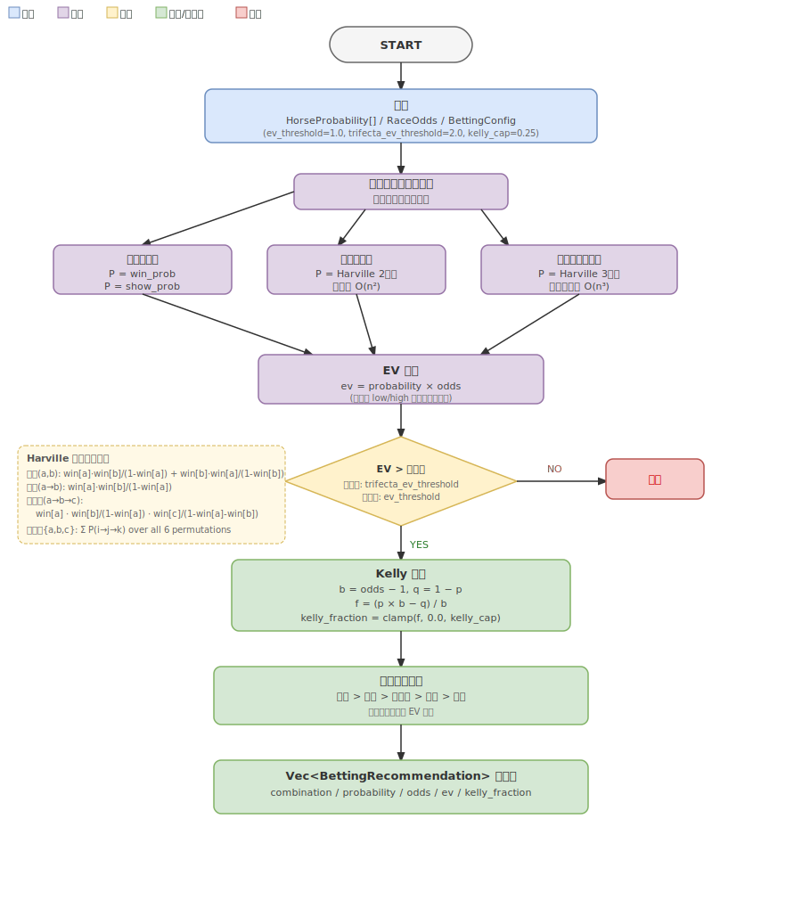

# 期待値計算・買い目選択・Kelly 配分ロジック仕様書

Issue #12 対応。推定確率とオッズから期待値（EV）を計算し、馬連重視で買い目を選択、
Kelly 基準で賭け額を決定する。

## 概要



`HorseProbability[]`（Issue #11 で実装済みの確率推定結果）と `RaceOdds`（オッズスクレイパー結果）
を受け取り、EV が閾値を超える買い目を Kelly 配分付きで返す純粋関数を Domain 層に実装する。

---

## 用語定義

| フィールド名 | 日本語 | 定義 |
|------------|-------|-----|
| `ev` | 期待値 | `probability × odds`（1.0 を超えると理論的にプラス期待値） |
| `kelly_fraction` | Kelly 比率 | 総資金に対する賭け割合（0.0〜kelly_cap） |
| `ev_threshold` | EV 閾値 | これ以上の EV を持つ買い目のみ推奨候補にする（デフォルト 1.0） |
| `trifecta_ev_threshold` | 三連単 EV 閾値 | 三連単専用のより高い閾値（デフォルト 2.0） |
| `kelly_cap` | Kelly 上限 | kelly_fraction の最大値（デフォルト 0.25 = 25%） |

---

## 入力

| 項目 | 型 | 説明 |
|------|----|----|
| `probabilities` | `&[HorseProbability]` | 各馬の win/place/show 推定確率 |
| `odds` | `&RaceOdds` | 馬券種ごとのオッズマップ |
| `config` | `&BettingConfig` | EV 閾値・Kelly 上限などのパラメータ |

## 出力

| 項目 | 型 | 説明 |
|------|----|----|
| 戻り値 | `Vec<BettingRecommendation>` | EV 閾値を超えた買い目一覧（優先度順） |

優先度: **馬連 > 馬単 > 三連複 > 単勝 > 複勝 > 三連単**  
三連単は `EV > trifecta_ev_threshold` を満たした場合のみ候補に追加され、常に最後尾（優先度 5）に表示される。  
同一馬券種内は EV 降順でソートする。

---

## 型定義

### BettingConfig

```rust
pub struct BettingConfig {
    pub ev_threshold: f64,
    pub trifecta_ev_threshold: f64,
    pub kelly_cap: f64,
}

impl Default for BettingConfig {
    fn default() -> Self {
        Self { ev_threshold: 1.0, trifecta_ev_threshold: 2.0, kelly_cap: 0.25 }
    }
}
```

### BetCombination

```rust
pub enum BetCombination {
    Win(HorseNum),
    Place(HorseNum),
    Quinella(Pair),
    Exacta(OrderedPair),
    Trio(Triple),
    Trifecta(OrderedTriple),
}
```

馬券種と組み合わせを 1 つの enum で表現することで、型不一致を防ぐ。

### BettingRecommendation

```rust
pub struct BettingRecommendation {
    pub combination: BetCombination,
    pub probability: f64,
    pub odds: f64,
    pub ev: f64,
    pub kelly_fraction: f64,
}
```

---

## アルゴリズム詳細

### 1. 組み合わせ確率推定（Harville 公式）

単一馬の `win_prob`（Issue #11 実装の `HorseProbability` 型のフィールド）をベースに多頭組み合わせ確率を近似する。

| 馬券種 | 確率計算式 |
|-------|----------|
| 単勝 | `win_prob[i]` |
| 複勝 | `show_prob[i]` |
| 馬連 `{a,b}` | `win[a]·win[b]/(1−win[a]) + win[b]·win[a]/(1−win[b])` （= 馬単 a→b + 馬単 b→a） |
| 馬単 `a→b` | `win[a]·win[b]/(1−win[a])` |
| 三連複 `{a,b,c}` | 全 6 順列 `(i,j,k)` の三連単確率 `P(i→j→k)` の合計（`Σ P(i→j→k)` over all permutations of `{a,b,c}`） |
| 三連単 `a→b→c` | `win[a]·win[b]/(1−win[a])·win[c]/(1−win[a]−win[b])` |

Harville 公式の前提: 1 着馬が抜けた後のフィールドで各馬が独立に競う。
精度は限定的だが、EV 計算に十分な近似値を提供する。

**除算ゼロ対策**: `1 − win[i]` が極端に小さい（win_prob ≒ 1.0）場合は分母を最小値 `1e-6` でクランプする（`f64::EPSILON` ≈ 2.2e-16 では除算結果が天文学的な値になるため実用的な下限を使用）。

### 2. EV 計算

```
ev = probability × odds
```

複勝（PlaceOdds）は `(low + high) / 2.0` を代表値として使用する。

### 3. EV フィルタ

- 三連単以外: `ev > config.ev_threshold`
- 三連単: `ev > config.trifecta_ev_threshold`

EV ≤ 閾値の組み合わせは候補から除外する。

### 4. Kelly 計算（簡易版）

```
b = odds − 1.0      # net odds
q = 1.0 − p         # 外れ確率
f = (p × b − q) / b
kelly_fraction = clamp(f, 0.0, kelly_cap)
```

`f` が負の場合は 0.0 にクランプ（賭けない）。

### 5. 優先度マッピング

```rust
fn priority(c: &BetCombination) -> u8 {
    match c {
        BetCombination::Quinella(_)  => 0,
        BetCombination::Exacta(_)    => 1,
        BetCombination::Trio(_)      => 2,
        BetCombination::Win(_)       => 3,
        BetCombination::Place(_)     => 4,
        BetCombination::Trifecta(_)  => 5,
    }
}
```

`sort_by_key(|r| (priority(&r.combination), OrderedFloat(-r.ev)))` で安定ソートする。

---

## 実装配置

| 内容 | パス |
|------|------|
| 型定義・関数 | `src/domain/src/betting/mod.rs` |
| Domain lib re-export | `src/domain/src/lib.rs` |

Domain 層に純粋関数として実装し、IO・状態なし。

---

## 制約・注意事項

- Harville 公式はあくまで近似。オッズの市場効率を考慮しないため、EV > 1.0 が実際のプラス期待値を保証しない
- 三連複は C(n,3) 通り（18 頭で 816 組み合わせ）、三連単は P(n,3) 通り（18 頭で 4896 組み合わせ）であり、どちらも O(n³)。プロファイリング未実施のため、問題が生じた場合は上位 N 頭に絞るプルーニングを検討する。EV フィルタ後の推奨数が膨大にならないよう閾値設定が重要
- `kelly_cap` のデフォルト 0.25 はフル Kelly の計算値が 25% を超える場合に 25% で打ち切るキャップ（保守的な上限設定）
