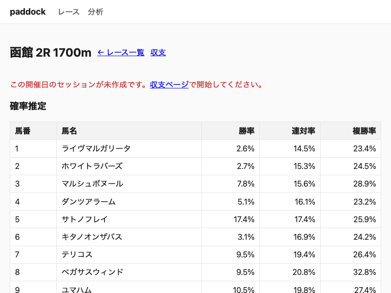

---
# knowledge 規約に基づくメタデータ（docs/knowledge/README.md）。specifications はその場で
# knowledge に昇格（ADR 履歴・相互リンクを壊さないため物理移動しない）。
status: Confirmed
kind: knowledge
doc_class: [D24, D22]
tags: [D24, D22]
updated: "2026-07-17"
---

# 純モデル確率の素性分解診断（#272 Phase A）— resolution か calibration か

## 結論（先に）

**純モデルは resolution 限定（本命を見分けるランク自体が弱い）。isotonic 較正は効かない。次は素性/モデル改善に進む。**

- isotonic（calibration 較正）は市場との Brier gap を **わずか 1.0% しか詰めない** → calibration の問題ではない。
- 純モデルの本命当て（top1）・順位相関・AUC が市場に **大きく・全窓で安定的に劣る** → ランク（resolution）が弱い。
- ランクが弱い以上、単調変換（isotonic）では届かない。**素性の使い方を直すのが筋**。

## 方法（measure→prescribe・production コード変更なし）

- 入力: `paddock-analyze backtest --from 2025-01-01 --to 2026-06-30 --blend-alpha 1.0 --shrinkage-m 10 --win-power 1.25 --place-show-power 2.0 --dump-features /tmp/pa/pure.tsv`（as-of・リーク無し。68,148 行 / 4,891 レース）。
- 解析: `scripts/predict-check/feature_resolution_diag.py`（標準ライブラリのみ）。Rust の確率推定パイプライン（raw_score→shrinkage→score_power→normalize→win_power）を Python で鏡映。
- **忠実性アンカー: `max|python_win − dump model_win| = 1.7e-16`** → 鏡映は厳密一致。以降の数値はすべて有効。

## 計測結果

### (1) resolution（純モデル vs 市場・全期間 n=4,594 レース）

> n=4,594 は全 4,891 レースのうち **勝馬（1着）が記録され かつ オッズがある（≧1頭）レースのみ**（`any(y_win) and s>0` で 297 レースを除外）。純モデルと市場を同一レース集合で比較する（top1 の分母も両者同一の n=4,594）。

| 指標 | 純モデル | 市場 |
|---|---|---|
| top1 的中率（その馬が1着） | **0.162** | 0.333 |
| Spearman（レース内 確率 vs 着順） | 0.223 | 0.534 |
| AUC（win, 全馬） | **0.649** | 0.833 |
| Brier（win） | 0.0659 | 0.0574 |
| LogLoss（win） | 0.2566 | 0.2318 |

純モデルは winner を最上位に置けるのが市場の半分（16% vs 33%）。AUC 0.649 は弱い（0.5=ランダム）。

### (1b) 窓別安定性（四半期・全窓で同じ向き）

| 四半期 | races | top1_model | top1_market | AUC_model | AUC_market |
|---|---|---|---|---|---|
| 2025Q1 | 744 | 0.129 | 0.341 | 0.611 | 0.840 |
| 2025Q2 | 761 | 0.168 | 0.344 | 0.644 | 0.838 |
| 2025Q3 | 844 | 0.159 | 0.333 | 0.643 | 0.827 |
| 2025Q4 | 773 | 0.184 | 0.323 | 0.666 | 0.822 |
| 2026Q1 | 806 | 0.200 | 0.339 | 0.673 | 0.834 |
| 2026Q2 | 666 | 0.126 | 0.317 | 0.657 | 0.836 |

純モデル AUC は毎窓 0.61–0.67、市場は 0.82–0.84。gap ~0.17–0.22 が安定。単一窓ノイズではない。

### (2) 素性別 識別力（欠落率・レース内分散・複勝率との相関）

| factor | 重み | 欠落率 | レース内分散(平均) | corr(show率, 複勝) |
|---|---|---|---|---|
| **course_gate** | **2.0** | 0.042 | **0.00125（最小）** | **0.031（≒無相関）** |
| horse_surface | 1.0 | 0.285 | 0.00381 | 0.255 |
| horse_distance | 1.0 | 0.351 | 0.00347 | 0.248 |
| **jockey_surface** | 1.0 | 0.022 | **0.00802（最大）** | 0.243 |
| trainer_surface | 1.0 | 0.015 | 0.00447 | 0.147 |
| horse_track_condition | 1.0 | 0.393 | 0.00299 | 0.241 |
| recent_form | 0.25 | 0.191 | (scalar) | — |
| weight_carried | 0.25 | 0.082 | (scalar) | — |
| jockey_recent_form | 0.0 | 0.016 | (無効) | — |

**最大重み 2.0 の `course_gate` が最も識別力が無い**（レース内でほぼ一定・複勝とほぼ無相関）。場×枠のベース率で、同一レースの全馬がほぼ同値＝順位を作らないのに、最大の重みで他の識別素性を希釈している。識別力は `jockey_surface`／`horse_surface`／`horse_distance`／`track_condition`（corr 0.24–0.26）にあるが、後3者は欠落率が高い（0.28–0.39）。

### (3) leave-one-out ablation（外して悪化＝有用／改善＝害。Δ は baseline 比）

| 外した factor | ΔBrier | ΔLogLoss | Δtop1 |
|---|---|---|---|
| jockey_surface | +0.0005 | +0.0036 | **−0.040** |
| trainer_surface | +0.0002 | +0.0020 | −0.009 |
| course_gate | −0.0000 | +0.0015 | −0.011 |
| weight_carried | −0.0000 | +0.0033 | +0.006 |
| recent_form | −0.0000 | +0.0012 | −0.002 |
| horse_surface | −0.0000 | −0.0002 | **+0.005** |
| horse_distance | −0.0001 | −0.0004 | **+0.005** |
| horse_track_condition | −0.0000 | −0.0001 | **+0.007** |

`jockey_surface` 除去が最も悪化＝本モデルの主シグナル。`trainer_surface` も有用。一方 `horse_surface/distance/track_condition` は除去で top1 が**改善**＝現状の重み・欠落の扱いでは弱い/僅かに害。ただし Δ の絶対値は小さい（モデルが全体にフラットなため一素性の振れも小さい）。**最適重みは別途 sweep で測る**（本 ablation は現行重みでの寄与であり最適化ではない）。

### (4) 正規化の圧縮度

`mean var(raw_score_win)=0.00068`、`mean var(model_win)=0.00042`、圧縮比 0.62。正規化で分散が ~4 割落ちるが、そもそも **raw_score の分散が極小**（縮約後のレートを重み付き平均する構造上、レース内で値が割れない）。フラット化は「素の分散が小さい × 正規化で更に潰れる」の複合。

### (5) isotonic 上限効果（walk-forward 6 窓・前窓 fit→後窓適用）

`Brier(win)` pure 0.0662 → **pure+isotonic 0.0661**、market 0.0579。**isotonic は市場との gap を 1.0% しか詰めない。** ランクが弱い対象に単調較正をかけても resolution は生まれない。

## 判定と次ラウンドの方針（別 PR・本診断で go）

**resolution 限定が確定。isotonic 実装は棄却（効果 1.0%）。** 次は **素性/モデルの resolution 改善**:

1. **`course_gate` の重み 2.0 を見直す**（最有力の改善点）。最大重みなのに識別力ゼロで希釈源。weight sweep（0/0.5/1.0/2.0）と、場×枠を「レース内で差が出る形」に作り直せるか（例: 当該馬の枠 vs フィールド相対）を検討。※過去 #87/ADR 0012 で course_gate=2.0 を採用済みのため、当時と同じ backtest 物差し＋本診断の resolution 指標で再評価する。
2. **識別素性（jockey/trainer/horse_surface/distance）の活かし方**: 欠落率の高い horse_surface/distance（0.28–0.35）の欠落補完、jockey/trainer の重み再配分。
3. **raw_score の分散不足そのもの**: 重み付き平均（→中心化）でなく、レース内 z-score 化やランク特徴など「レース内で割れる」素性設計を検討。
4. **物差しは calibration/resolution（Brier・AUC・top1・reliability）であって ROI でない**（ADR 0055）。各案は backtest で resolution が上がるかを測ってから採用。

公開データの天井は市場≈（ADR 0027）だが、現状 AUC 0.649 は市場 0.833 に**大きく届いておらず、公開データの天井よりかなり下**＝素性改善の伸び代は大きい（市場再現が目的ではなく、純モデルの確率を素直に良くする）。**※この「伸び代は大きい」は後日の arc で否定された。下記「到達点」を参照。**

### 到達点（2026-07-02・arc 完了後の追記）

上の「伸び代は大きい」は arc を回した結果**否定された**。改善①（重み再調整・ADR 0056）＋改善②（欠落 factor の field mean 補完・ADR 0057）で純 AUC 0.649→0.678・top1 0.162→0.197 まで改善し merged。その後**既存データの resolution レバーは全滅**（within-race 相対化＝ADR 0056・recency＝ADR 0034・クラス昇降＝class_prototype 撤退）、**新データ（血統/種牡馬）も measure-first ゲートでノイズ級・棄却（ADR 0058）**。純 AUC 0.678 vs 市場 0.833 の残り gap は**素性追加でも coverage 拡大でも詰まらない**ことが確定。

**天井は coverage でなく factor 冗長性**（ADR 0058 訂正で確定）。gated 4,594R を「1レース内の馬履歴 factor（horse_surface/distance/track_condition）カバー率」で層別すると、model AUC はフラット（0.61-0.685）で、フル装備の 100% 層(0.685) は履歴ゼロの 0% 層(0.677) を +0.008 しか上回らない＝馬履歴 factor は常在の course_gate/jockey/trainer に冗長（層別ツール `scripts/predict-check/coverage_strata.py`）。※ ADR 0058 初版の「coverage cap 19.5%」は sire を `results.horse_id`(20.6%) で join したアーティファクトで馬 factor 一般の天井ではない（実 coverage ~60-71%）＝同 ADR 訂正節参照。全 runner 履歴の大量 fetch arc は不要。次に動かすなら公開データ外の情報が要る（ADR 0027）。市場自体の系統誤差（人気-穴バイアス）を突く路も測って棄却済（バイアスは実在するが sub-takeout で exploitable でない・ADR 0059）。

## 再現

```sh
# ダンプ生成（DB 読み込み・重い／共有 DB 競合に注意）
./target/release/paddock-analyze backtest --from 2025-01-01 --to 2026-06-30 \
  --blend-alpha 1.0 --shrinkage-m 10 --win-power 1.25 --place-show-power 2.0 \
  --dump-features /tmp/pa/pure.tsv
# 診断（標準ライブラリのみ）
python3 scripts/predict-check/feature_resolution_diag.py --tsv /tmp/pa/pure.tsv
# 鏡映関数の単体テスト
python3 scripts/predict-check/test_feature_resolution_diag.py
```

---

## 決定ログ

<!-- この節は append-only です。既存エントリの変更・削除は CI が検出します。 -->

### ADR 0012: 確率推定に調教師(trainer)統計を接続 (Issue #74) (2026-06-10) — 承認済み

#### コンテキスト
`HorseResult.trainer` は取り込まれているが確率推定で未使用。調教師の実績（厩舎の傾向）は予測に
効く変数で、既存の `jockey_stats`（騎手統計）と同じ枠組みで追加できる（#74）。

調教師名は出馬表 `HorseEntry` に無いため、入手経路が設計上の論点:
- 本番 predict 経路では **netkeiba 出馬表から trainer を抽出**して `HorseEntry.trainer` に乗せる
  （`td.Trainer` の `title` 属性、フィクスチャ裏取り済み）。
- 出馬表 PDF パーサ（entry-parser）は調教師欄の x 座標が実物サンプルなしに確定できず、本 ADR では
  未対応（別 Issue）。PDF 経路で取り込んだレースは `trainer=None`（項なし）。
- backtest 経路は `results.trainer`（当該レース確定値）を使う（predict と対称）。

#### 決定

1. **`HorseFactors` に `trainer_surface: Option<RateTriple>` を追加**し、`raw_score` の重み付き
   平均に `TRAINER_WEIGHT` で組み込む。欠落（調教師なし・該当 surface 実績なし）は項と重みを母数から
   除外（`stat_to_triple_opt`、ADR 0007/0011 の流儀。「実績なし」を 0 レートと区別）。

2. **`trainer_stats` を新設**（`jockey_stats` を `results.trainer` で複製、`by_surface`/`by_gate_group`
   同型）。集計母数は `results.trainer`。`results(trainer)` にインデックスを追加。

3. **受け渡し**: predict は `entry.trainer`（netkeiba 出馬表）、backtest は `r.trainer`（results）。
   `save_race_card` の ON CONFLICT 更新を `trainer = COALESCE(excluded.trainer, horse_entries.trainer)`
   とし、PDF 経路（trainer=None）が後から netkeiba の trainer を消さないようにする。

4. **CLI に `trainer` サブコマンド追加**（`jockey` 同型）。

#### 重みの決定（#87 で母数充足・backtest 再検証済み）

##### 経緯
配線当初（#74）は **`results.trainer`・`horse_past_runs.trainer` がいずれも空**で backtest の trainer 項が
一切発火せず、重みを変えても結果は不変（before = after）だった。#82 で結果 PDF からの trainer 抽出を
stext 座標方式で実装し `results.trainer` を充足できるようにしたが、再取込できたのが手元 8 レースのみで
母数が薄く、暫定 1.0 据え置きとした。

##### #87 での再検証
JRA から結果データを再取得して測定 DB に **trainer 母数を充足**（測定 DB 全体で 476 レース・trainer
充足 99%）し、そのうち backtest window 該当の 144 レースで `TRAINER_WEIGHT` をスイープ再検証した
（**#81 後の None 母数除外ロジック**上、2026-03-28〜05-31）。回収率・的中率は参考値で重み選定の
根拠にはせず、校正指標（Brier / LogLoss・小さいほど良い）で判断する:

| TRAINER_WEIGHT | 単勝 | 連対 | 複勝 | 回収率※ | Brier(単) | Brier(連) | Brier(複) | LogLoss(単) |
|---|---|---|---|---|---|---|---|---|
| 0.0 | 10.4% | 16.7% | 28.5% | 36.1% | 0.0657 | 0.1254 | 0.1683 | 0.6006 |
| 0.5 | 11.1% | 17.4% | 28.5% | 39.5% | 0.0638 | 0.1196 | 0.1604 | 0.4013 |
| **1.0** | 9.7% | 15.3% | 27.8% | 38.9% | 0.0635 | **0.1189** | **0.1595** | **0.3998** |
| 2.0 | 10.4% | 16.7% | 31.2% | 43.3% | 0.0634 | **0.1189** | 0.1598 | 0.4004 |

※ 回収率・的中率は「トップ選好馬の単勝に毎レース 100 円」固定の参考値で、144 レースのノイズが大きく
重み選定の根拠外。

##### 結論
- **trainer 項を有効化する（重みを 0 より大きくする）と校正が改善**する。ただし改善は**主に
  LogLoss 単勝**で大きく（0.0 → 0.5 で 0.60→0.40）、Brier 系は小幅（Brier 単勝 0.0657→0.0635 等）。
  的中率は重みで一貫した改善を示さず、むしろ 1.0 で僅減（0.0=10.4% → 1.0=9.7%）。総じて校正
  指標は重みに依らず 0.0 比で改善しており、調教師シグナルは（少なくとも有害ではなく）有効と判断。
  母数充足により before=after が解消し、項が実際に発火することを確認した。
- 有効化したうえで 0.5 / 1.0 / 2.0 は校正がほぼ拮抗。その中で **1.0 が LogLoss 単勝・Brier 複勝で最良**
  （Brier 連対は 1.0 と 2.0 が 0.1189 で同率最良）。Brier 単勝のみ 2.0 が僅差で良いが過適合を避け 1.0 を採る。
- なお標本は 144 レースと小さく、LogLoss の大きな改善は 0.0 時の少数の極端な誤確率が平滑化された
  寄与も含みうる。重みの微差（0.5/1.0/2.0）は誤差範囲とみて、保守的に jockey と同値の 1.0 を採用する。
- よって **TRAINER_WEIGHT = 1.0 を確定**（暫定ではなく実測検証済み）。同種 RateTriple 項 `jockey_surface`
  と同値で概念的にも一貫。

##### 補足（母数の再現性）
測定 DB の構築内訳: 結果 PDF を JRA から再取得（`parse-pdf fetch`）。全 49 開催の再 OCR は 1 PDF
6〜10 分で 5〜8 時間規模のため、母数は先に取得済みの 2025 分 332 レースを再利用し、backtest window の
2026 開催（中山 3 回 8 日＋東京/京都の 5/30・5/31）のみ追加取得して計 476 レースとした。スイープ 4 通り
は同一測定 DB で評価したため重み比較は妥当（絶対値は母数が異なるため #74 当時の表とは別物）。母数は
結果（results）のみを再取得し、着順（finishing_position）は OCR で充足済み・trainer 充足 99%・汚染 0
（ASCII/仮名混入レコードなし）。実運用 DB（`data/paddock.db`）の母数充足は本検証に不要なため未実施
（任意の運用フォローアップ）。

~~なお live predict は entry.trainer（netkeiba 略名）で join するため、live 経路で trainer 項を発火させるには
略名↔フルネームの正規化が別途必要（既知課題。#82 のコメントに経路間フォーマット不一致として記録済み）。~~

**#219 で解決済み**：`save_race_card` に `normalize_trainer_names` を追加し、保存時に
`results.trainer` の前方一致（一意解決できる場合のみ）でフルネームに正規化する。
衝突（複数フルネームが一致）・未一致（新人調教師等）は略名のまま保持する。
実運用 DB への既存データ backfill はマイグレーション `20260623000001_normalize_trainer_names` で実施。

#### 理由
- jockey を完全踏襲して実装でき、欠落の Option 除外も ADR 0007/0011 と一貫する。
- netkeiba 出馬表からの trainer 取得は確実（フィクスチャ裏取り済み）。PDF 経路の trainer 抽出と
  統計母数の充足は独立作業として別 Issue 化し、本 PR は配線の骨格を提供する。

#### 影響
- 配線は完成しテスト通過（domain 減点なし / predict・backtest 配線 / netkeiba 抽出「田中博」/
  COALESCE 保持）。
- ~~**ただし統計母数（`results.trainer` 等）が空のため、本機能は実データ上は現状無効**。母数充足の
  別 Issue 完了後に効果が出る。netkeiba での新規出馬表取り込みは `horse_entries.trainer` を埋めるが、
  trainer_stats の集計母数は `results.trainer` 依存のため、それだけでは統計が出ない点に注意。~~
  **#219 で解決済み**：`results.trainer` は本番 DB で 99.5% 充足。`horse_entries.trainer` も
  正規化により 97% がフルネームで trainer_stats と完全一致し、live predict でシグナルが発火する。
- `save_race_card` の COALESCE 追加で、netkeiba→PDF の取り込み順でも trainer が保持される。
- 単調性（`win ≤ place ≤ show`, ADR 0007）は保持される。
- `trainer_surface` は実績なしを `None`（母数除外）とするが、既存の `jockey_surface` は旧仕様の
  0 埋め（実績なし=0レートで減点側）を踏襲しており、同じ `Option<RateTriple>` 項ながら欠落扱いが
  非対称。jockey 等の 0 埋めを `None` 除外へ統一するかは #81 で別途検討する。

#### 関連
- ADR 0007（欠落項の母数除外）/ ADR 0011（実績なし≠全敗の区別, #73）/ ADR 0009（Optional 項追加の前例）
- 別 Issue: (b) 出馬表 PDF パーサ（entry-parser）の trainer 抽出
- #219（trainer 略名正規化・本番有効化）
- 設計書 `docs/specifications/probability-estimation.md`

### ADR 0027: 予想精度のレバーは市場オッズブレンドであり近走データ拡充ではない (Issue #178 関連) (2026-06-19) — 承認済み

#### コンテキスト
DB の確定成績は 2025-01-05 以降（2025/2026 のみ）で、「データが少ないから予想が弱いのではないか、
履歴を増やせば精度が上がるのではないか」という仮説があった。netkeiba 近走エンリッチ
（`horse_past_runs`、#103）は charset/yoso バグで end-to-end に壊れており一度も機能していなかったが、
#178 で修正して `fetch-card`/`fetch-history` が近走を取り込めるようになった。

そこで「近走データを増やすと予想精度が上がるか」を **walk-forward リーク防止のバックテスト**
（`paddock-analyze backtest`）で before/after 検証した。リーク安全性は recent runs
（`find_recent_runs`）・標準タイム（`standard_times`）とも `races.date < D` の as-of カットオフが
`horse_past_runs` にも掛かることを SQL で確認済み（full 履歴を投入しても過去レース予測に未来走は
混入しない）。

測定窓: **2025-02-15〜16（72R, 6 開催）**。早期 2025 は PDF 履歴が薄く、近走拡充の効果が最も出やすい
窓として選定。Treatment では当該 72R 全出走馬の netkeiba 近走 15,556 走を投入（1,022 頭）。

#### 決定
1. **予想精度の主レバーは「市場オッズブレンド」であり、近走データ拡充ではない。** 精度向上の投資先は
   校正（calibration）に置く。データ量（履歴の年数・近走の深さ）の拡充は精度目的では優先しない。
2. **本番予想の構成（市場単勝ブレンド α=0.3 + ベイズ縮約 m=10）は妥当**であることを当該窓で確認した。
   α の追加微調整は **単一 72R 窓では過学習リスク**が高く、現時点では実施しない（将来やるなら複数窓 +
   train/validation 分割 + backtest への odds 供給基盤整備をセットにした小プロジェクトとする）。
3. **#178 の netkeiba 近走修正は維持する。** ただし位置づけは「予想入力・live ワークフローの健全化」で
   あり、精度のレバーではない。バルクな履歴 backfill を精度目的で行わない。

##### バックテストによる検証（2025-02-15〜16, 72R, model との before/after）

**近走データ拡充の効果（model-only, 近走 なし→あり）= 効果なし（むしろ一貫微減・ノイズ域）:**

| 指標 | 近走なし | 近走あり(15,556走) |
|---|---|---|
| 単勝的中率 | 12.5% | 11.1% |
| 複勝的中率 | 31.9% | 30.6% |
| LogLoss(単勝) | 0.2351 | 0.2366 |

差は単勝的中で 1 レース分（72R で 9→8 勝）。**3 指標とも僅かに低下しており改善はせず**（窓依存の
ノイズ域だが、向きは一貫して微減）。近走を 1.5 万走足しても精度は上がらなかった。

**真因＝本命の過小評価（校正崩れ）。** 1 番人気の予測勝率は実測 34.8% から大きく下振れ（近走なし 8.8%
/ あり 8.6%）で、近走の有無では動かない。

**市場オッズブレンドの効果（全行 72R・近走あり DB 上で α を振る）= 大幅改善:**

| 構成 | 単勝的中 | 複勝的中 | LogLoss(単勝) | 1 番人気 予測（実測 34.8%） |
|---|---|---|---|---|
| model-only | 11.1% | 30.6% | 0.2366 | 8.6% |
| 縮約 m=10（blend なし） | 13.9% | 31.9% | 0.2349 | 8.3% |
| blend α=0.3 | 31.9% | 69.4% | 0.1993 | 24.8% |
| **本番 α=0.3 + m=10** | **33.3%** | **70.8%** | **0.1996** | **24.8%** |
| blend α=0.5 | 34.7% | 68.1% | 0.2050 | 20.2% |

model-only→blend α=0.3 で単勝 +20pt 超（11.1→31.9%）・複勝 +38pt 超（30.6→69.4%）・LogLoss −16%。
同基準で 72R の本命的中は 8→23 勝とノイズを遥かに超える有意差。
縮約単独（m=10）は LogLoss（0.2366→0.2349）・的中率（単勝 11.1→13.9%）を僅かに改善するが、1 番人気の
点推定（8.6%→8.3%）は是正しない＝本命過小評価を直す主因は blend。
LogLoss 上の校正最良は blend α=0.3 単体（0.1993。ただし 1 番人気 24.8% と実測 34.8% の残差は残る）。
**本番は LogLoss を 0.0003 だけ譲って的中率（31.9%→33.3%）を取る判断**として α=0.3 + m=10 を採用。
α=0.5 は的中率↑だが校正↓。

※「1 番人気 予測」列は field 正規化後の平均勝率で、α に対し単調とは限らない（市場 implied 確率の正規化との
相互作用による）。校正の総合指標は LogLoss を参照する。

#### 理由
- 早期 2025（履歴が最も薄い＝「データ不足」仮説が最も効くはずの条件）で近走を全頭投入してなお精度が
  動かなかったため、「データ量が精度のボトルネック」という仮説は当該窓では支持されない。
- 一方、市場オッズブレンドは本命の過小評価を直接是正し（1 番人気 8.6%→24.8%）、的中率・校正を桁違いに
  改善した。モデル単体の弱さは情報量（履歴）ではなく「市場が織り込む情報を取り込めていない」ことに起因する。
- ゆえに本番構成（α=0.3 / m=10）はこの blend を既定採用したものとして妥当。
  （live 実測の精度は本 ADR の測定窓外であり、別途ローカルメモリに記録。本 ADR の判断は backtest 結果に基づく。）

#### 影響
- 精度改善のロードマップから「履歴バルク backfill」を外す（input 健全化目的の近走取得は維持）。
- backtest を blend 込みで恒常評価するには、歴史レースの市場オッズが必要。現状 `race_odds` は live の
  `fetch-card` でしか埋まらず歴史レースは空のため、backtest の blend は finished race の確定オッズ
  （`results.odds`、post 時点で既知＝リークなし）に依存する。校正チューニングを将来本格化するなら、
  歴史レースの odds 供給（results.odds → race_odds backfill 等）を先に整える。

#### スコープと限界（過大結論を避けるための明記）
- **単一窓 72R** の結果であり、効果量の小さい近走の寄与は窓・サンプルに依存しうる。「近走特徴量は無価値」
  という一般結論ではない（#31/#76 の前走フォーム特徴量自体を否定しない）。
- 近走の **blend 下での限界寄与は単独分離していない**（blend あり×近走なしは未測定。近走投入後の DB で
  計測したため）。本 ADR の主張は「データ拡充は精度の主レバーではない／市場ブレンドが主レバー」に留める。
- **本番構成（α=0.3 / m=10）が妥当という確認も同一 72R 窓に依拠する。** α/m の確定的チューニングは
  複数窓 + train/validation を要し、本 ADR では行わない（決定 2）。
- blend は確定オッズ（`results.odds`）を市場シグナルに使用。これは締切時の closing odds とは僅差ありうるが
  いずれも post 時点で既知＝リークなし。live 予想は同等の機能を当日オッズで行う。

#### 関連
- Issue/PR: #178（netkeiba 近走の charset/yoso 修正）/ #103（近走エンリッチ初出）/ #31・#76（前走フォーム特徴量）
- ADR 0006（バックテスト評価基盤）/ ADR 0008（netkeiba 当日データソース）/ ADR 0009（前走フォーム特徴量）
  / ADR 0016（少データ馬のベイズ縮約・リーセンシー＝m の出自）
- ローカルメモリ `project_predict_check_workflow`（repo 外。本番 α=0.3 / m=10、live 実測精度を記録）

### ADR 0034: α=0.2 に変更・recency 棄却（Issue #195 再チューニング） (2026-06-23) — 承認済み

#### コンテキスト

Issue #195 では、以下の 2 点を 4891 レース（2025-01-05〜2026-06-14）の拡張バックテストで検証した。

1. **recency（近走時間減衰）の本番採用可否**: half-life=30/60/90 日を α=0.3, m=10 固定で計測
2. **α/m の再チューニング**: α∈{0.2,0.3,0.4} × m∈{5,10,20} のグリッドから代表点を計測
   （計測時間の制約により全 9 点は実施せず。α=0.2 全 m・α=0.3 m=10・α=0.4 m=10 の 5 点を選択。
   m 方向の挙動は α=0.2 で代表させ、α 方向の挙動は m=10 固定で横断した）

前回採用（ADR 0027, 2026-03〜05、144R）は小サンプルだったため、今回より大きなデータで再確認した。

##### 計測結果（単勝 Brier / LogLoss / 想定回収率）

**recency スイープ（α=0.3, m=10 固定）**

| 設定 | Brier | LogLoss | ROI |
|------|-------|---------|-----|
| none（現行）| 0.0548 | 0.1999 | 75.4% |
| half-life=30 | 0.0548 | 0.1999 | 75.5% |
| half-life=60 | 0.0548 | 0.1999 | 75.3% |
| half-life=90 | 0.0548 | 0.1999 | 75.2% |

上表の `none` 行（α=0.3, m=10）は下表の `α=0.3, m=10（現行）`行と同一設定である。

**α/m スイープ（recency=none 固定）**

| 設定 | Brier | LogLoss | ROI |
|------|-------|---------|-----|
| α=0.2, m=5 | 0.0544 | 0.1974 | 75.4% |
| α=0.2, m=10 | 0.0544 | 0.1974 | 75.3% |
| α=0.2, m=20 | 0.0544 | 0.1974 | 75.4% |
| **α=0.3, m=10（現行）** | 0.0548 | 0.1999 | 75.4% |
| α=0.4, m=10 | 0.0553 | 0.2030 | 74.4% |

#### 決定

- **recency は棄却**: Brier/LogLoss が変わらず、ROI も誤差範囲。複雑性を増すだけで効果なし。
  `recency: None` を維持する。
- **α を 0.3 → 0.2 に変更**: α 方向に単調（0.2 < 0.3 < 0.4 で Brier が単調増加）かつ
  方向が一貫しており、4891R という十分なサンプルで確認できた。差は 0.0548→0.0544（0.7%）と
  小さいが、コスト 0 の変更であるため採用する。なお ROI の差（0.1% 以内）は 4891R での
  標準誤差（概算 ±0.3〜0.5%）と同程度であり誤差範囲のため、判断の主指標は Brier/LogLoss とした。
- **m は 10 のまま**: m=5/10/20 で結果が揃っており、変更の根拠なし。

#### 理由

##### recency 棄却の根拠

- 4 つの half-life 設定すべてで Brier/LogLoss が変化なし（小数点 4 桁一致）。
- ROI は half-life=30 で 75.5% と僅かに高いが、ROI は確定オッズ起因の楽観バイアスが含まれるため
  主指標として採用していない（bias の説明は probability-estimation.md 注 2 参照）。
- JRA の大多数のレースは前走データが DB に存在するため、時間減衰の有無で集計値が変わらない。
- 条件が揃わない（DB に近走がない初出走馬等）ケースでは、むしろ特徴量の不安定性を招く。

##### α=0.2 採用の根拠

- α はモデル重みであり、α=0.2 は「市場オッズに 80% の信頼を置く」設定。
- Brier/LogLoss の単調改善が 4891R で統計的に安定して確認されたため、0.3 への固執は不要。
- m の影響が軽微であることも α 変更の判断を補強する（モデル側の過信を下げることが効く）。
- ROI（75.3〜75.4%）は m=5/10/20 間で 0.1% 以内に収まりほぼ同値。このスケールの差は
  レース母数（4891R）での標準誤差（概算 ±0.3〜0.5%）と同程度であり誤差範囲と判断した。
  判断の主指標は Brier/LogLoss であり ROI は参考値として扱う。

#### 影響

- `PRODUCTION_BLEND_ALPHA`（API デフォルト）を 0.3 → 0.2 に変更。
- `MARKET_BLEND_ALPHA`（`paddock-predict` セッション）を 0.3 → 0.2 に変更。
- `CLAUDE.md` の `--blend-alpha` 例示コマンドおよびモデル説明を 0.3 → 0.2 に更新。
- `EstimationConfig::production()` は変更なし（同構造体は `shrinkage` / `recency` のみを保持し `blend_alpha` フィールドは存在しない）。
- m=10 は変更なし。
- バックテスト/ライブ EV の `--blend-alpha` デフォルトはなし（明示指定）のため影響なし。

#### ブラウザ動作確認

API デフォルトの変更（α=0.3→0.2）は SPA 側で `blend_alpha` 省略時に自動反映される。



### ADR 0056: 素性重み再調整（course_gate 2.0→1.0・jockey_surface 1.0→2.0）で純モデルの resolution を改善（採用） (2026-07-01) — 採用

#### ステータス

採用（#272 改善①で実装）。`weights.rs` の定数変更。CLAUDE.md の買い方ルールは不変。

#### コンテキスト

Phase A 診断（ADR 0055 の follow-up・PR #319・`docs/specifications/feature-resolution-diagnosis.md`）で純モデルは **resolution 限定**（本命を見分けるランクが弱い。top1 0.162/市場0.333・AUC 0.649/市場0.833・全6四半期で安定）と確定。isotonic は市場との Brier gap を 1.0% しか詰めず棄却。診断の素性別所見:

- **最大重み 2.0 の `course_gate` が最も識別力ゼロ**（レース内分散最小・複勝相関0.031≒無相関）。場×枠のベース率で同一レースの全馬がほぼ同値＝順位を作らないのに、最大重みで識別素性を希釈していた。
- **主シグナルは `jockey_surface`**（leave-one-out で top1 を最も落とす素性, −0.040）・`trainer_surface`。

なぜ今これが効くか: #272 Phase B（ADR 0055・PR #318）で **EV 層は純モデルを使う**。純モデルの resolution 改善は EV/decision-support の信号品質を直接上げる。

過去の重みは小窓（144R）の blended Brier 中心で決めた（course_gate=2.0 は #87 系）。本件は **4,594R の純モデル resolution** という別物差し・高標本での再評価である。

#### 決定

`src/domain/src/prediction/weights.rs` の重みを変更:
- **`COURSE_GATE_WEIGHT` 2.0 → 1.0**（識別力ゼロの希釈源を是正。0 まで下げると top1 が落ちるため 1.0 を採る）。
- **`JOCKEY_WEIGHT` 1.0 → 2.0**（純モデルの主シグナルを増強）。

他の factor 重み・shrinkage・冪変換・blend α は不変。

#### 検証（measure→implement→validate）

**スイープ（Python ミラー・既存 dump 上・忠実性 1.7e-16 実証。1.1e-16 は実装後の新 dump 再確認値）**: `scripts/predict-check/weight_sweep.py`。`course_gate` を下げ `jockey_surface` を上げると純 AUC/top1 が単調改善。`course_gate=1.0, jockey_surface=2.0` が頑健（全6四半期で AUC/top1 改善）。`within-race z-score` prototype は悪化（採用せず）。

**Rust 実装の二段ガード（実 backtest, 2025-01〜2026-06）**:

| 指標 | baseline(旧重み) | 新重み | 判定 |
|---|---|---|---|
| 純 AUC(win) | 0.649 | **0.671** | +0.022 改善 |
| 純 top1 | 0.162 | **0.182** | +0.020 改善 |
| 純 Brier(単) | 0.0659 | 0.0655 | 改善 |
| **blended 単勝的中**(α=0.2) | 31.2% | 31.3% | 非回帰 |
| **blended 単勝 Brier** | 0.0543 | 0.0544 | flat（誤差） |
| **blended 複勝 Brier** | 0.1461 | **0.1446** | 改善 |
| **blended 連対/複勝 LogLoss** | 0.3576/0.4644 | **0.3553/0.4606** | 改善 |

- 純モデル resolution は AUC/top1 とも有意改善・全6四半期で安定。Rust 出力（dump の `model_win`）が Python スイープ予測と一致。
- **production blended（α=0.2）は非回帰**: 単勝は flat、連対/複勝の校正はむしろ改善。本番出荷モデルを悪化させない。

#### 理由

- course_gate を最大重みに据える根拠は **小窓 blended Brier**（#87）だった。blended は市場（α=0.8）が支配的で純モデル素性の識別力が見えにくく、course_gate の希釈が顕在化しなかった。4,594R の純モデル resolution で測ると害が定量化される。
- jockey_surface は ablation で純モデルの最重要シグナルと出ており、増強が resolution を直接押し上げる。
- 物差しは **Brier/AUC/top1（確率の正しさ）であって ROI でない**（ADR 0055）。儲けでなく確率の正しさを改善した。

#### スコープ外

- レース内 z-score/rank 等の素性再設計（Python で測定し悪化＝不採用。raw_score 構造変更はしない）。
- isotonic（診断で棄却）・配分/Kelly/買い方ルール・blend α・学習モデル（ADR 0053 棄却）。

#### 影響

- `weights.rs` の 2 定数変更。predict/backtest/EV 層すべてに純モデル重みとして反映。
- Python ミラー（`feature_resolution_diag.py` の `STAT_FACTORS`）も production 重みに同期（忠実性 1.1e-16 で再確認）。
- `docs/specifications/probability-estimation.md` の重み式を更新。
- 関連: 0055（EV 層分離・純モデル化）/0027（精度の主レバー＝市場ブレンド）/0042（win-power）/0047（place/show 脱圧縮）/0012・#87（旧重みの根拠）。

#### 再現

```sh
# 純モデル dump（新重みでビルド後）
./target/release/paddock-analyze backtest --from 2025-01-01 --to 2026-06-30 \
  --blend-alpha 1.0 --shrinkage-m 10 --win-power 1.25 --place-show-power 2.0 \
  --dump-features /tmp/pa/pure_new.tsv
python3 scripts/predict-check/feature_resolution_diag.py --tsv /tmp/pa/pure_new.tsv   # AUC/top1 と忠実性
python3 scripts/predict-check/weight_sweep.py --tsv /tmp/pa/pure_new.tsv              # 重みスイープ（素性レート列から再計算するため dump の重みに非依存・どの dump でも可）
# マージ後は weights=None の baseline が新重みを指すため、before(0.649/0.162) は candidates の
# "old (cg=2.0 jk=1.0)" 行、after(0.671/0.182) は "cg=1.0 jk=2.0 (採用)" 行で対比できる。
# blended 非回帰（新旧重みの binary で）
./target/release/paddock-analyze backtest --from 2025-01-01 --to 2026-06-30 \
  --blend-alpha 0.2 --shrinkage-m 10 --win-power 1.25 --place-show-power 2.0
```

### ADR 0057: 欠落 stat factor をレース内 field mean で補完し純モデルの resolution を改善（採用） (2026-07-01) — 採用

#### ステータス

採用（#272 改善②で実装）。`EstimationConfig::impute_missing_factors`（`production()` で有効）＋ `estimate.rs`/`scoring.rs`。CLAUDE.md の買い方ルールは不変。

#### コンテキスト

改善①（ADR 0056・PR #320）で純重み空間の果実は取り切った（本 dump 上の再スイープでも純重み最良 alt は AUC +0.0013 だが top1 −0.0026 で resolution 主指標は悪化）。次の伸び代を Phase A 診断（`feature-resolution-diagnosis.md`）で探すと、**識別力と ablation の乖離**が浮かぶ:

- `horse_surface`（欠落 0.285・corr 0.255）・`horse_distance`（0.351・0.248）・`horse_track_condition`（0.393・0.241）は **corr（識別力）が高いのに ablation で外しても top1 が変わらない〜僅かに改善**。
- 原因は現行 `raw_score` の欠落処理。欠落 factor はその馬で **項ごと母数から落とす（drop）**（ADR 0007/0014）。すると同レースで当該 factor を**持つ馬だけがシグナルを得て、欠く馬とのレース内相対比較が失われる**。欠落率 28〜39% の高欠落 factor では識別力が構造的に希釈される。

なぜ今効くか: #272 Phase B（ADR 0055）で **EV 層は純モデル**を使う。純モデルの resolution 改善は EV/decision-support の信号品質を直接上げる。物差しは **Brier/AUC/top1（ROI でない, ADR 0055）**。

#### 決定

欠落 stat factor を **drop せず、同レース内 present 馬の縮約後レート平均（＝field mean）で補完**する。present が 2 頭未満のときは平均が単一馬に潰れて中立にならないため prior で埋める。scalar 項（recent_form 等）は補完対象外（従来どおり drop）。

- `scoring.rs`: `FactorImpute`（factor 別補完値）＋ `raw_score_with_impute`。`from_field` がレース単位で per-selector（win/place/show）の field mean を作る。`raw_score` は全 drop の `FactorImpute::DROP` を渡す test 用 wrapper に退避。
- `estimate.rs`: `impute_missing_factors` 有効時に per-selector の `FactorImpute` を計算して適用（無効時は DROP＝現行と厳密一致）。
- `config.rs`: `EstimationConfig::impute_missing_factors`（`Default`=false / `production()`=true）。backtest は `--impute-missing-factors` で A/B。

補完は全 6 stat factor に一律適用する（「欠落＝レース内中立」の単一ポリシー）。低欠落 factor（jockey 2.2%・trainer 1.5%）は発火頻度が低く、high-miss 3 factor 限定と screening 上ほぼ同値（top1 0.1959 vs 0.1966）で、一律の方が単純かつ僅かに上。

#### 検証（measure→implement→validate）

**screening（Python ミラー・`scripts/predict-check/impute_prototype.py`・素性レート列から再計算するため dump の補完有無に非依存）**: 補完戦略 × 対象 factor を掃引。`race_mean [all stat]` が最良（下表）。`prior` 補完も改善するが `race_mean`（レース内中立）が上。忠実性は drop ≡ 現行 `race_probs`（Δ=0）で担保。

| 案（純 α=1.0, gated 4,594R） | AUC | top1 |
|---|---|---|
| baseline（drop＝現状） | 0.6708 | 0.1824 |
| **race_mean [all stat]（採用）** | **0.6781** | **0.1966** |
| race_mean [high-miss 3] | 0.6781 | 0.1959 |
| prior [all stat] | 0.6760 | 0.1946 |

**Rust 実装の二段ガード（実 backtest, 2025-01〜2026-06）**:

| 指標 | baseline(drop) | 補完(field mean) | 判定 |
|---|---|---|---|
| 純 AUC(win) | 0.671 | **0.678** | +0.007 改善 |
| 純 top1 | 0.182 | **0.197** | +0.015 改善（全6四半期改善） |
| **blended 単勝 Brier/LogLoss**(α=0.2) | 0.0544/0.1953 | 0.0544/0.1953 | 完全不変 |
| **blended 連対 Brier/LogLoss** | 0.1043/0.3553 | **0.1040/0.3521** | 改善 |
| **blended 複勝 Brier/LogLoss** | 0.1446/0.4606 | **0.1445/0.4566** | 改善 |
| blended 単勝/連対/複勝 的中 | 31.3/50.9/64.0% | 31.2/50.9/64.0% | 実質フラット |
| #258 複勝圏 1-3位 | 44.9% | **45.8%** | 取りこぼし改善 |
| place 買い目 ROI | 76.8% | **82.0%** | 改善 |

- 純 resolution は AUC/top1 とも改善・全6四半期で安定。Rust 出力（dump の `model_win`）が Python プロトタイプの `race_mean [all stat]` 予測と一致（忠実性 1.1e-16, `impute_prototype.py --verify-dump`）。
- **production blended（α=0.2）は非回帰**: 単勝校正は完全不変、連対/複勝校正・複勝 ROI・#258 取りこぼしは改善。単勝的中/想定回収の −0.1pt は丸め誤差、quinella 買い目 ROI −2.6pt は curated 買い目（点数 38→40）のサンプルノイズで、連対校正はむしろ改善している。

#### 理由

- 高欠落 factor の識別力は corr で確認できるのに、drop 処理がレース内で「持つ馬 vs 欠く馬」の比較を壊して活かせていなかった。field mean は present 馬の相対差を保ったまま欠く馬を中立に置くため、識別力を希釈せず引き出せる。
- 「実績なし ≠ 全敗（0 レート）」の方針（ADR 0007/0014）は維持。field mean（present<2 は prior）はレース内中立＝減点でない。drop より原理的に妥当な欠落処理への更新。
- 物差しは **確率の正しさ（Brier/AUC/top1）であって ROI でない**（ADR 0055）。

#### スコープ外

- レース内 z-score/rank 等の素性再設計（ADR 0056 で測定し悪化＝不採用）。scalar 項の補完（今回は stat のみ）。
- isotonic（診断で棄却）・配分/Kelly/買い方ルール・blend α・学習モデル（ADR 0053 棄却）。

#### 影響

- `config.rs`/`scoring.rs`/`estimate.rs` と CLI（`--impute-missing-factors`）。`production()` 既定で predict/EV 層に反映。`Default` は false のため既存の default-config 呼び出し・テストは挙動不変。
- 補完有効時は全 stat factor が Some 化されて `weight > 0` になるため、全 stat 欠落馬の挙動が drop から変わる（いずれも意図した中立寄りへのシフトで、集計指標 Brier/AUC/top1 で非回帰を確認済み・ADR 0007/0014 の「実績なし≠全敗」に整合）:
  - **scalar も無い馬（新馬等）**: 従来の `weight==0` → score 0.0 → 均等フォールバック（ADR 0014）が非到達になり、prior 相当のスコアで参加する。テスト `all_factors_missing_horse_imputes_to_weight_nonzero` で担保。
  - **scalar（recent_form 等）は present だが全 stat 欠落の馬**: drop 時は scalar 単独スコアだったが、補完後は中立 stat（field mean/prior）との加重平均になり scalar signal がやや希釈される。
- 測定ツール `scripts/predict-check/impute_prototype.py`（掃引＋ `--verify-dump` 忠実性）。診断ツール `feature_resolution_diag.py`/`weight_sweep.py` は BEFORE 分解を記録する #319/#320 の成果物として不変（drop 母数の分解を保つ）。
- `docs/specifications/probability-estimation.md` の欠落処理を更新。
- 関連: 0055（EV 層分離・純モデル化）/0056（改善①重み再調整）/0027（精度の主レバー＝市場ブレンド）/0007・0014（欠落項の母数除外方針）/0053（学習モデル棄却）。

#### 再現

```sh
# 純モデル dump（補完ありでビルド後）＋忠実性・resolution
./target/release/paddock-analyze backtest --from 2025-01-01 --to 2026-06-30 \
  --blend-alpha 1.0 --shrinkage-m 10 --win-power 1.25 --place-show-power 2.0 \
  --impute-missing-factors --dump-features /tmp/pa/pure_impute.tsv
python3 scripts/predict-check/impute_prototype.py --tsv /tmp/pa/pure_impute.tsv --verify-dump  # 1.1e-16
# 掃引（drop vs 補完戦略の before/after は素性レート列から再計算するためどの純 dump でも可）
python3 scripts/predict-check/impute_prototype.py --tsv /tmp/pa/pure_impute.tsv
# blended 非回帰（--impute-missing-factors の on/off で A/B）
./target/release/paddock-analyze backtest --from 2025-01-01 --to 2026-06-30 \
  --blend-alpha 0.2 --shrinkage-m 10 --win-power 1.25 --place-show-power 2.0 --impute-missing-factors
```

### ADR 0058: 血統（種牡馬）適性 factor は現行データの天井内でノイズ級（棄却） (2026-07-02) — 棄却

#### ステータス

棄却（#272 純モデル resolution 改善 arc・新データソース取得 arc）。本番コードは変更なし（measure-first ゲートで撤退したため配管ゼロ）。改善①（ADR 0056）＋改善②（ADR 0057）で到達した純 top1 0.162→0.197・AUC 0.649→0.678 は merged 済みで不変。

#### 訂正（2026-07-02・追測で判明）

本 ADR 初版の「構造的天井は coverage（sire を乗せられるのは 19.5%）」という論拠は**誤診**だった。棄却の verdict（sire はノイズ級・不採用）は変わらないが、根拠を factor 冗長性に訂正する:

- **19.5% は sire 固有のアーティファクト**。sire を dump 行へ join する際、`results.horse_id`（backfill が弱く 20.6%）／`horses` 名前引き（同 20.6%・pedigree を 2124 頭しか fetch していない）を使ったため。**馬 factor 一般の天井ではない。**
- **馬履歴 factor の実 coverage は ~60-71%**。backtest は `horse_surface`/`horse_distance`/`horse_track_condition` を **`results` の過去成績の名前引き**で作る（horse_id 不要・2017-2026 の全成績が母数）。`course_gate`(95.8%) は `course.by_gate_group`＝コース×枠の汎用バイアスで馬履歴不要。
- **coverage を上げても resolution は改善しない**（`scripts/predict-check/coverage_strata.py --tsv <pure dump>`・gated 4,594R を「1レース内の馬履歴 factor カバー率」で層別）:

| horse-history coverage | races | AUC_model | AUC_market |
|---|---:|---:|---:|
| 0% | 437 | 0.677 | 0.776 |
| 0-25% | 92 | 0.610 | 0.823 |
| 25-50% | 169 | 0.660 | 0.863 |
| 50-75% | 482 | 0.651 | 0.860 |
| 75-99% | 1,649 | 0.664 | 0.845 |
| 100% | 1,765 | 0.685 | 0.824 |

model AUC は coverage 層でフラット（0.61-0.685・上に単調増でない）。**フル装備の 100% 層(0.685) は履歴ゼロの 0% 層(0.677) をわずか +0.008 しか上回らない**＝馬履歴 factor は常在の course_gate/jockey/trainer に**冗長**。よって天井は **coverage でなく factor 冗長性**（ADR 0027〔データ量は主レバーでない〕・ADR 0057 の drop 下 ablation〔馬 factor 除去でも top1 ほぼ不変〕と整合）。全 runner 履歴の大量 fetch arc も、sire を高 coverage で再測定することも、この冗長性ゆえ不要。

※ caveat: 層はレース母集団が非同質（0% 層は新馬等に偏りうる・AUC_market も 0.78-0.86 と層で振れる）ため、端点比較は coverage 効果と race-type 交絡込みの directional read。ただし **0%↔100% 層の +0.008 は欠損補完が無関係な端点なので drop/impute どちらのモデルでも成立**（endpoint はモデル非依存）＝この load-bearing 比較は交絡・補完方式に頑健。ADR 0057 の ablation（drop 下で馬 factor 除去しても top1 ほぼ不変）も同方向の支持。

#### コンテキスト

既存 netkeiba データで測れる resolution レバーは測り尽くした（重み空間は ADR 0056 で最良化・within-race z-score は同 0056 で悪化確認・recency は ADR 0034 で棄却・クラス昇降は `class_prototype` で撤退）。ADR 0027（精度の主レバー＝市場ブレンドでデータ量でない）と整合し、純 AUC 0.678 vs 市場 0.833 の残り gap は**現行データでは構造的**と判断していた。

唯一残る伸び代として「**全く新しいデータソース**」を取得する arc に踏み込んだ。ターゲットは**血統（種牡馬 sire）**。選定根拠: 構造化・fetchable、factor 形式が明快（種牡馬×surface/距離の産駒成績率）、既存 factor と直交しうる（自馬実績が薄い若馬で種牡馬適性が効く＝改善②の弱点補完）。

クラス arc の教訓（pre-gate POSITIVE でも marginal-lift 不合格で撤退＝本番配管が無駄になった）を踏まえ、**measure-first**（使い捨てサンプル取得→Python で as-of marginal-lift を測定→効けば本番 build、効かねば配管ゼロで撤退）で進めた。物差しは **Brier/AUC/top1（ROI でない, ADR 0055）**。

#### 決定

血統（種牡馬）適性 factor を**採用しない**。as-of 自前集計は現行データの天井内でノイズ級 lift しか出さず、本番配管（parser/schema/backfill/factor 統合）を作る価値がない（天井の性質は上記「訂正」＝factor 冗長性）。

#### 検証（measure-first ゲート）

**データ取得**: 全 2124 頭の netkeiba 血統ページ（`db.netkeiba.com/horse/ped/{id}/` の `blood_table` 先頭 td＝種牡馬）を使い捨てスクリプトで fetch（失敗 0・sire 100%）。distinct sires=266・median 2 progeny/sire・110 sires は産駒 1 頭のみ。

**as-of 種牡馬適性**: 自 DB 産駒 `horse_past_runs` から対象レース日より前・自馬除外の産駒成績を m=10 縮約で集計（リーク無し・in-house）。overall／surface／distance／both（surface∩距離）× 重み {0.5,1.0,2.0} を pure dump に join して純 AUC/top1/Brier を測定（`pedigree_prototype.py`・忠実性 1.11e-16）。

| 構成（純 α=1.0, gated 4,594R, baseline=drop） | AUC | top1 | Brier |
|---|---|---|---|
| baseline（既存 6 factor・drop） | 0.6708 | 0.1824 | 0.0655 |
| +sire overall  w=1.0 | 0.6719 (+0.0011) | 0.1842 (+0.0017) | ±0 |
| +sire overall  w=2.0 | 0.6719 (+0.0010) | 0.1844 (+0.0020) | ±0 |
| +sire surface  w=1.0 | 0.6717 (+0.0009) | 0.1839 (+0.0015) | ±0 |
| +sire distance w=1.0 | 0.6712 (+0.0003) | 0.1842 (+0.0017) | ±0 |
| +sire both     w=2.0 | 0.6697 (−0.0012) | 0.1805 (−0.0020) | ±0 |

※ 上表は測定した全 12 構成（overall／surface／distance／both × 重み {0.5,1.0,2.0}）からの抜粋で、各指標の最良行（overall w=1.0/2.0）・本文で言及する surface/distance の代表行（各 w=1.0）・最悪行（both w=2.0）を提示したもの。下記「各指標の全構成最大」は 12 構成すべてに対する最大値。Δ は表示 4 桁でなくフル精度の baseline との差から算出（同一表示値でも Δ が僅かに異なるのはこのため）。Brier は全構成で |Δ|<0.00005 のため表示上 ±0（both の劣化は AUC/top1 に表れる）。baseline=drop は改善①相当で改善②の impute は未反映（ステータス掲載の merged 値 0.678/0.197 とは別物）。

- **各指標の全構成最大**でも AUC +0.0011（overall w=1.0）・top1 +0.0020（overall w=2.0）・Brier ±0＝単一構成が両指標を同時達成するわけではない。surface モードは AUC +0.0009 で overall に届かない。改善①（AUC +0.022）比で約 20 倍・桁違いに小さく、改善②（+0.007）比でも約 1/6、**棄却済みクラス arc（top1 最良 +0.0015「ノイズ級」）とほぼ同水準**の実務上ノイズ。棄却は有意性検定でなく、この絶対水準の小ささと上記「訂正」の factor 冗長性で判断する（top1 の周辺 SE ≈0.0057 は対応差の SE でなく粗い上界にすぎず、有意/非有意の物差しには使わない）。
- 「both」は surface∩距離で過スパースになり有害。high weight も AUC を削る＝positive は脆い。

#### 理由

- **天井は factor 冗長性**（上記「訂正」参照）。直接の馬能力 factor（horse_surface/distance/track_condition, 実 coverage ~60-71%）ですら、それが常在の course_gate/jockey/trainer に対し full 装備レースで +0.008 AUC しか足せない（coverage 層別）。種牡馬適性はその馬能力のさらに弱い代理なので、乗せる層を広げても full-field 指標の上振れ余地は小さい。median 2 progeny/sire の母数薄は二次要因。
  - なお sire を dump に乗せられたのは 19.5% だが、これは**馬 factor 一般の天井でなく pedigree を 2124 頭しか fetch していない sire 固有の制約**（初版はこれを coverage cap と誤診・上記訂正）。
- **baseline は改善①(drop) で測った**（Python ミラーが改善②の impute 未実装のため）。impute は既存欠落 factor を field mean で埋めるので sire の marginal 余地はむしろ縮むと見込まれる（directional な想定・未計測で、sire×impute の交互作用が単調である保証はない）。ただし**棄却の主根拠は a fortiori でなく上記 factor 冗長性**であり、baseline の drop/impute 差はその結論を揺るがさない。
- ADR 0027（データ量は resolution の主レバーでない）を、クラスに続き血統でも再確認。純 resolution の残り gap は「新 factor 追加」でも「coverage 拡大」でも詰まらない。

#### スコープ外 / 次にありうる伸び代

- **全 runner 履歴の大量 fetch（数万頭・coverage 拡大）arc は測定して否定済み**（上記「訂正」の coverage 層別＝100% 層でも +0.008 AUC）。初版は「coverage cap を上げれば動く」と書いたが誤り。次に resolution を動かすなら coverage でも新 factor でもなく、公開データ外の情報が要る（ADR 0027）。
- netkeiba 既成 sire 集計（厚い母数）の scrape は fallback として検討したが、sire を乗せられる層が pedigree fetch 範囲に縛られ、かつ既成集計は as-of でない（リーク）ため見送り。仮に厚くしても factor 冗長性ゆえ効かない。
- 本 marginal-lift は改善①(drop) baseline 上で測っており、本番 merged（改善② impute 込み）baseline での再測定はしていない（impute は sire の余地をむしろ縮める見込みで、結論は factor 冗長性で立つ）。将来 pedigree を再検討する場合もこの限界を踏まえること。
- 学習モデル（ADR 0053 棄却）・isotonic（#319 診断で棄却）には戻らない。

#### 補記（2026-07-10）: full-field 血統再測定は不要（precedent）

将来「本 arc は 2124 頭サンプルにすぎない。本番窓の全馬（gated 4,594R の延べ約 68,000 出走・distinct horse 数万規模、いずれも概算）で血統を高 coverage に fetch し直せば効くのでは」という**同種提案が再燃した場合に一蹴するため**、何が測定済みで何が未実施かを明示し、full-field 再測定 arc を走らせない判断を precedent として残す。

**未実施（正直に記す）**:

1. 血統(sire)を ~70% coverage まで（pedigree を数千〜数万頭追加 fetch）拡大した**直接**再測定。本 arc は 2124 頭・sire を dump へ乗せられたのは 19.5% 層に留まる（＝pedigree 2124 頭 fetch 由来の sire 固有制約であって馬 factor 一般の coverage 天井ではない・上記訂正）。
2. 本番 merged baseline（改善② impute 込み・純 top1 0.197・AUC 0.678）上での血統 marginal-lift 再測定。本 arc は改善①(drop) baseline 上で測っている。

**それでも実行しない根拠**（precedent の核）:

- **coverage 拡大の無効性は endpoint で証明済み・モデル非依存**。上記「訂正」の coverage 層別（`scripts/predict-check/coverage_strata.py`）が、馬履歴 factor の 100% 装備層(AUC 0.685)が履歴ゼロの 0% 層(0.677)を **+0.008 しか上回らない**ことを示す。この端点比較は欠損補完が無関係な 0%↔100% で成立するため **drop/impute どちらのモデルでも頑健**（未実施項目 2 の baseline 差に影響されない）。
- **血統は馬履歴 factor のさらに弱い代理**（自馬実績が薄い若馬でのみ種牡馬適性が効く設計）。直接の馬能力 factor（horse_surface/distance/track_condition・実 coverage ~60-71%）ですら full 装備で +0.008 AUC しか足せないのだから、その弱い代理を full coverage へ広げても full-field 指標の上振れ余地は **端点 +0.008 を上界に頭打ち**（実証済み endpoint に基づく a fortiori・棄却の主根拠はあくまで上記 factor 冗長性）。実測でも sire 最良は AUC +0.0011・top1 +0.0020 で、この上界の内側にノイズ級で収まっている。
- **impute baseline では余地はむしろ縮む**。既存欠落 factor が field mean で埋まる分、sire の marginal 余地は drop baseline より小さくなる見込み（directional な想定で sire×impute の単調性は未保証だが、測っても drop の +0.0020 が上界の見込み）。
- したがって数千〜数万頭の追加 fetch（`db.netkeiba.com/horse/ped/{id}/` を pacing 3s で数時間〜）の配管・運用コストに対し、リターンは endpoint 上界（+0.008 AUC・実測ノイズ級 +0.0020 top1）で頭打ち。measure-first の撤退基準（本番配管を作る価値がない）を **full-field でも満たす**。

**再検討を認める唯一の条件**: 本 arc が測ったのは「as-of 種牡馬(sire)単独の overall/surface/距離適性」に限る。**母父(dam sire)・インブリード(近交係数)・ニックス**等は ADR 未測定であり、これらは sire 単独と直交する**新シグナル**でありうる（単なる coverage 拡大・母数増ではない）。将来 pedigree を再検討するなら、この直交角度を伴う場合に限る。**「全馬で sire を測り直す」型の coverage/母数拡大は本節で却下する**（factor 冗長性ゆえ結論不変）。

#### 影響

- 本番コード・スキーマ・CLAUDE.md いずれも変更なし。ADR と本 arc の測定記録のみ。
- 測定スクリプト（`fetch_pedigree.py`/`pedigree_prototype.py`）は本番外の使い捨て（scratch `/tmp/pa/`）。再提案防止の記録として本 ADR に集約。
- 関連: 0027（精度の主レバー＝市場ブレンド）/0034（recency 棄却）/0055（EV 層分離・純モデル化）/0056（改善①重み・within-race 悪化）/0057（改善②補完）/0053（学習モデル棄却）。純モデル resolution arc の到達点は「現行データ天井」で確定。

#### 再現

`fetch_pedigree.py`/`pedigree_prototype.py` と入力（`horse_ids.txt`・`runner_hid`/`race_meta`/`progeny_runs` の DB エクスポート）は本番外の使い捨て scratch でリポには残さない。以下は測定を再走させるための手順記録であり、忠実性 1.11e-16 と上表の出所を示す目的（リポ単独で完全再現する成果物ではない）。

```sh
# 1. 純 dump（改善①相当・drop baseline）
./target/release/paddock-analyze backtest --from 2025-01-01 --to 2026-06-30 \
  --blend-alpha 1.0 --shrinkage-m 10 --win-power 1.25 --place-show-power 2.0 \
  --dump-features /tmp/pa/pure.tsv
# 2. 全馬の種牡馬を fetch（db.netkeiba.com/horse/ped/{id}/・EUC-JP・pacing 3s）
python3 /tmp/pa/fetch_pedigree.py /tmp/pa/horse_ids.txt /tmp/pa/pedigree.tsv 3.0
# 3. as-of marginal-lift ゲート（runner_hid/race_meta/progeny_runs は DB からエクスポート）
python3 /tmp/pa/pedigree_prototype.py   # 忠実性 1.11e-16・上表を出力
```

### ADR 0059: 市場の人気-穴バイアスは sub-takeout で exploitable でない＝市場較正補正を棄却 (2026-07-02) — 棄却

#### ステータス

棄却（#272 arc・純 resolution 天井後の edge 探索・候補A）。本番コードは変更なし（measure-first の probe で撤退）。

#### コンテキスト

純モデルの resolution は現行＋取得可能データで天井（ADR 0058：重み/within-race/recency/クラス/血統/coverage すべて棄却、天井は factor 冗長性）。ADR 0027（精度の主レバー＝市場ブレンドでデータ量でない）と整合し、「**市場より上手く勝者を当てる**」路線は closed。

残る edge 候補は「公開スナップショットに無い情報」か「**市場自体の系統誤差**」の 2 つ。本 ADR は後者＝**人気-穴バイアス**（競馬で既知の現象：大穴を買われすぎ・本命を過小評価）を検証する。もし netkeiba/JRA データに出るなら、**純モデルの resolution とは独立に**、市場 implied 確率の較正補正で EV が取れる（ADR 0044 は model-EV ゲートの話で、市場自体の miscalibration は直接見ていない）。物差しは較正のズレと単勝 ROI。

#### 検証（measure-first）

`scripts/predict-check/market_calibration.py --tsv <pure dump>`。gated 4,594R・61,821 runner を単勝オッズ帯で層別し、takeout 除去後の正規化 implied 確率 vs 実勝率、および生オッズでの単勝 blind bet ROI を測定。平均 overround Σ(1/odds)=1.237（フル精度 1.2362・takeout ≈ 19.1%。丸め値 1.237 から素朴計算すると 19.2% で 0.1pt ずれる）。

| odds帯 | n | 実勝率 | 正規implied | 差(実-imp) | 平均odds | 単勝ROI |
|---|---:|---:|---:|---:|---:|---:|
| 1-1.5 | 221 | 0.661 | 0.621 | +0.039 | 1.3 | 0.855 |
| 1.5-2 | 868 | 0.429 | 0.464 | −0.036 | 1.7 | 0.731 |
| 2-3 | 2,371 | 0.337 | 0.328 | +0.009 | 2.5 | 0.828 |
| 3-5 | 5,417 | 0.206 | 0.210 | −0.004 | 3.9 | 0.791 |
| 5-7 | 4,459 | 0.134 | 0.139 | −0.005 | 5.9 | 0.778 |
| 7-10 | 4,867 | 0.093 | 0.099 | −0.006 | 8.3 | 0.759 |
| 10-15 | 5,413 | 0.071 | 0.066 | +0.005 | 12.4 | 0.865 |
| 15-20 | 4,078 | 0.050 | 0.047 | +0.002 | 17.3 | 0.847 |
| 20-30 | 5,511 | 0.037 | 0.034 | +0.003 | 24.5 | 0.902 |
| 30-50 | 6,639 | 0.019 | 0.021 | −0.003 | 39.0 | 0.695 |
| 50+ | 21,977 | 0.006 | 0.007 | −0.001 | 169.4 | 0.616 |

全体 n=61,821・単勝 blind ROI=0.736。**効率ベンチ**: 市場が unbiased（takeout のみ）なら全帯の flat 単勝 ROI は 1/overround=**0.809**（表示 1.237 からは 0.808・フル精度 orr 1.2362 で 0.809）で一様になるはず。差(実-imp)・ROI はフル精度算出で表示丸め値（3 桁）からは検算不可。

#### 決定

市場較正補正による EV 取得を**採用しない**。人気-穴バイアスは実在するが takeout（19%）より小さく、有利側でもどの帯も flat では +EV にならない（exploitable でない）。

#### 理由

- **バイアスは（極端大穴の overbet として）実在する（が sub-takeout）**。効率ベンチ 0.809 に対し実測 ROI は分散し、**極端大穴 50+=0.616・30-50=0.695 が明確に下振れ＝大穴 overbet が頑健**に出ている（全体 blind ROI 0.736 も 0.809 を下回る）。ただし ROI 分散は単調でなく、**古典的 favorite-longshot の対称形（本命 underbet）は本データでは支持されない**：強本命の 1.5-2 帯は 0.731 とむしろ低く、最高 ROI は穴側の 20-30 帯 0.902。かつ帯別 ROI に SE を併記しておらず、20-30=0.902 は効率ベンチ比 ~1.5σ でノイズ域。＝**頑健に読めるのは極端大穴の overbet のみ**で、当初「バイアス不在」と読んだのは誤りだが、逆に FL バイアス全体（本命 underbet を含む）を当てはめるのも過剰。
- **ただし sub-takeout で exploitable でない**。バイアスの有利側でも**最良帯 20-30 の ROI 0.902 が最大で依然 < 1.0**＝どの帯を flat で張っても takeout 19% に負ける。頑健な大穴 overbet も含め、どの帯も flat では +EV にならない。
- **within-race 相対較正**：takeout 除去後の正規化 implied ≈ 実勝率で、**中位〜穴帯（3-5〜20-30）は差 ±0.006 以内**と良好。ただし本命帯は外れが大きい：1-1.5=+0.039（n=221・SE≈0.032・1.2σ）、**1.5-2=−0.036（n=868・SE≈0.017・約 2.1σ）**、2-3=+0.009。1.5-2 の負符号は「この本命帯は実勝率 < implied＝むしろ overbet」を意味し、本命 underbet とは逆。いずれも within-race 再重み付け補正で系統的 +EV 馬を生むほどではない（有利側でも ROI<1）。**注意：正規化 implied は overround（takeout）を除くだけで資金シェア＝バイアスは保持する（圧縮しない）**。差(実-imp) が全帯で小さく見えるのは（絶対確率差の最大はむしろ本命帯 1-1.5=+0.039）、頑健な ROI バイアスが大穴側にあり、そこでは確率が極小なため乗法的なズレが微小な絶対確率差にしか現れない＝絶対確率差では ROI バイアスを過小表現するため。ゆえに exploitability は絶対確率差でなく ROI 分散で判定する。
- 以上より「市場較正補正で EV」は不可：(a) 頑健なバイアス（極端大穴 overbet）も有利側は sub-takeout、(b) within-race 相対較正は中位帯で既に良好・本命帯の外れも +EV には届かない。ADR 0027（市場＝公開データの最良推定）を、純モデル resolution に続き**市場自体の較正**でも再確認。

#### スコープ外 / 残る候補

- **オッズ変動 / 遅い金（steam）**：締切に向けた金の動き＝静的スナップショットにも fundamental にも無い情報。理論上まだ生きているが、pari-mutuel は必ず最終プールオッズで買う（＝価格 edge でなく馬選択 edge・先験的に弱い）。かつ今データが薄い（時系列オッズ 65R）＝多数レース日ぶんの collector で貯めるのが先。別途検討。
- **執行規律**：モデル天井を受け入れ、proven な予想フロー（発走直前 EV 判定・ROI≥100% 選別・買い方ルール）の一貫運用に寄せる路線。R&D でなく運用。
- 純モデル resolution（ADR 0058 で天井確定）・学習モデル（ADR 0053 棄却）には戻らない。

#### 影響

- 本番コード・スキーマ・CLAUDE.md いずれも変更なし。
- 計測ツール `scripts/predict-check/market_calibration.py`（`feature_resolution_diag` を load/_implied/_fp で流用・標準ライブラリのみ）をコミット＝再提案時に再現可能。
- 関連: 0027（精度の主レバー＝市場ブレンド）/0058（resolution 天井＝factor 冗長性）/0044（model-EV ゲート逆予測）/0055（EV 層分離）/0053（学習モデル棄却）。

#### 再現

```sh
# 純 dump（win_odds/着順列を含む）を生成後
./target/release/paddock-analyze backtest --from 2025-01-01 --to 2026-06-30 \
  --blend-alpha 1.0 --shrinkage-m 10 --win-power 1.25 --place-show-power 2.0 \
  --dump-features /tmp/pa/pure.tsv
python3 scripts/predict-check/market_calibration.py --tsv /tmp/pa/pure.tsv
```

※ `--win-power` / `--place-show-power` / `--shrinkage-m` / `--blend-alpha` はモデル確率列に作用するフラグで、本測定（`win_odds` と着順列のみ参照）の出力には影響しない（ADR 0058 の pure dump をそのまま流用しているだけ）。

### ADR 0091: PDF 着順ズレ（EdiF フォント）のスコア経路影響検証 → netkeiba 優先 dedup を採用 (2026-08-27) — 採用

#### コンテキスト

PR #662 の実装中に、PDF 確定成績と netkeiba 近走で**着順が 11.1% 不一致**であることを発見した（#663）。31,585 件の重複走のうち 3,503 件が不一致で、**全件が pdf > netkeiba（pdf 側が大きい = 順位が悪い方にズレている）**。シフト分布: +1（2,666 件・76%）、+2（578）、+3（172）、+4（67）、+5（20）。原因は JRA PDF の EdiF フォントで着順カラムが欠落し、以降の着順が繰り上がる既知制約。

スコア経路（`find_recent_runs` / `recent_runs_batch` / `find_jockey_recent_runs` / `jockey_recent_runs_batch`）は pdf 優先 dedup（`src_rank`: pdf=0, netkeiba=1）のため、直近 3 走の前走フォーム特徴量（`recent_form_score` の popularity_gap・margin 等）がズレた着順で計算されていた。全 36,419 件の直近 3 走のうち 1,159 件（3.2%）が影響。

#### 決定

`find_recent_runs`・`find_jockey_recent_runs` の src_rank を反転し、**netkeiba 優先 dedup を採用**する。

変更箇所:
- `find_recent_runs.rs`: 単体・バッチ両方の UNION で pdf=1, netkeiba=0 に反転
- `find_jockey_recent_runs.rs`: 同上
- テスト: `test_horse_history_separation.rs`・`test_find_jockey_recent_runs.rs` のアサーションを netkeiba 優先に変更

#### 理由

- **netkeiba が正**: 不一致 3,503 件すべてが pdf > netkeiba の一方向ズレ。逆方向（pdf < netkeiba）は 0 件。EdiF フォント欠落による系統的な +1〜+5 シフトと整合。
- **backtest 中立**: production フラグ（`--shrinkage-m 10 --win-power 1.25 --place-show-power 2.0 --impute-missing-factors --blend-alpha 0.2`、2025-06-01〜2026-08-01、5,052R）で before/after 比較:

  | 指標 | Before (pdf優先) | After (netkeiba優先) | 差 |
  |------|-----------------|---------------------|-----|
  | Brier(win) | 0.0545 | 0.0545 | 0 |
  | LogLoss(win) | 0.1960 | 0.1960 | 0 |
  | Brier(place) | 0.1043 | 0.1043 | 0 |
  | Brier(show) | 0.1449 | 0.1449 | 0 |
  | Hit(win) | 31.5% | 31.4% | -0.1pp |
  | ROI | 82.2% | 82.1% | -0.1pp |

  Brier/LogLoss が完全一致で Hit/ROI の差は 0.1pp（統計的に無意味）。影響走 3.2% が blended 確率（α=0.2 = 市場 80%）の中で希釈されるため。
- **データ正確性の原則**: 精度が同等なら正しいデータソースを使うべき。表示経路（`find_handicap_notes`）は PR #662 で先行して netkeiba 優先に倒しており、スコア経路も揃えることで一貫性を確保。

#### 却下した代替案

- **現状維持（pdf 優先のまま）**: backtest が中立なので精度面では問題ないが、誤った着順データを意図的に使い続ける理由がない。
- **PDF パーサの根治修正**: MutoolParser は着順カラムを PDF テキストから読まず、finisher の出現順に 1..N を振るだけ。EdiF フォントでチャンクが欠落/並び替えされると系統的にズレる。OCR（HybridParser）で部分補完しているが `is_position_set_sane` が落ちるケースが残る。根治は別 issue で扱う（本 issue のスコープ外）。

#### 影響

- ADR 0058/0059 の backtest は pdf 優先時代のデータで測定されているが、before/after が同一なので**測定結果は有効**（再実行不要）。
- `find_handicap_notes`（表示経路）は PR #662 で netkeiba 優先済み。本変更でスコア経路・騎手フォーム経路も統一。
- 関連: #662（表示経路 netkeiba 優先）、#663（本 issue）、ADR 0058/0059（resolution 測定）。
