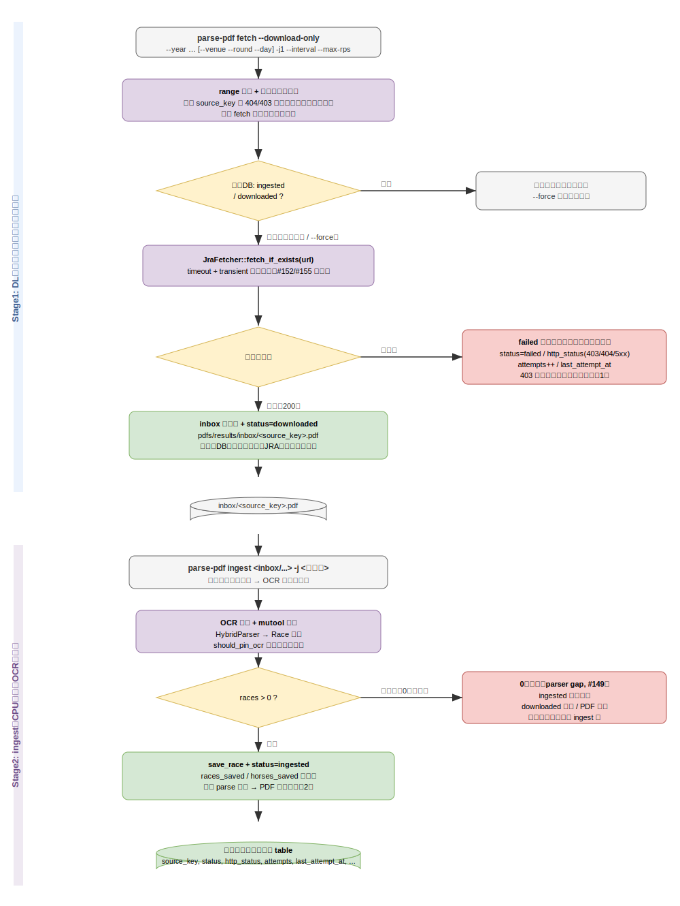
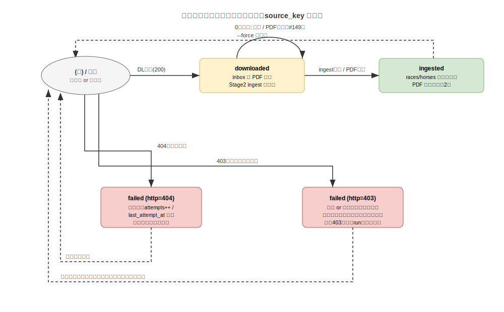

# fetch/parse ステージ分割 + 取得状態管理 仕様書

Issue #147 対応。`parse-pdf fetch`（結果 seiseki PDF の取得）を **取得（ネットワーク律速）** と
**解析（CPU 律速・OCR）** の 2 ステージに分割し、取得状態を DB で一貫管理する。

## 概要

現状 `parse-pdf fetch` は 1 開催ごとに「DL（礼儀ペーシング）→ mutool＋OCR 解析 → DB 保存」を
**同期実行**し、PDF はディスクに書かずメモリ内で parse する。重いのは OCR（CPU バウンド、~50 秒/開催）
で、年単位バックフィルの所要時間の大半を占める。一方 DL はネットワーク律速で、礼儀ペーシング
（`-j 1 --interval 3 --max-rps 0.3`）のため JRA 接続を長時間占有する。

両者を分けると:

- **Stage1（DL専用）**: JRA から PDF を礼儀ペーシングで `pdfs/results/inbox/` に保存するだけ。数分で
  完了し JRA 接続を即解放。解析・DB 保存はしない。
- **Stage2（ingest）**: ネットワーク不要なので `ingest -j <コア数>` で OCR を**並列**実行。
  壁時計時間 ≒ 総OCR ÷ コア数。

既存の inbox/ingest 動線・OCR スレッド調整（`should_pin_ocr`）にそのまま乗る。重い Stage2 は
#146（コンテナ化）で CPU キャップ付き隔離実行の対象になる。

---

## スコープ

### 本仕様で実装する

| 項目 | 内容 |
|------|------|
| DL 専用モード | `fetch --download-only`。range 列挙・礼儀ペーシングは現状踏襲、PDF を inbox に保存 |
| 取得状態の DB 管理 | 取得ライフサイクル（`downloaded`/`ingested`/`failed`）を 1 テーブルで管理（dedup 統一） |
| 失敗の記録 | HTTP コード＋試行回数＋最終試行時刻を記録。**永久スキップにしない**（403 ブロック対策） |
| ingest 後の削除 | 完全 parse 完了後に PDF を**デフォルト削除**（移動でなく） |
| Stage2 の inbox 消費 | ファイル名 `source_key` から状態行を更新し、成功で `ingested`・削除 |

### スコープ外（別 Issue / フォロー）

| 項目 | 理由 |
|------|------|
| OCR の任意化（`--no-ocr`） | 最大レバーだが独立論点。別 Issue で切り出し（補足参照） |
| コンテナ化（dev/pipeline 分離） | #146 |
| 出馬表（entries）側の状態管理 | 本仕様は結果 PDF パイプラインに限定。entries は別途 |

---

## ステージ設計

### Stage1: DL 専用（`fetch --download-only`）

- 既存 `fetch` の range 列挙（年/会場/回/日、404/403 境界での打ち切り）と礼儀ペーシング
  （`-j 1 --interval --max-rps`）を**そのまま流用**。
- 各候補 `source_key` について:
  1. 状態 DB を引く。`ingested` または `downloaded` なら**スキップ**（`--force` で再取得）。
  2. `JraFetcher::fetch_if_exists(url)` で取得。
  3. 成功 → `pdfs/results/inbox/<source_key>.pdf` に保存し、状態を `downloaded` に。
  4. 不在/失敗（403/404/5xx 等）→ 状態を `failed`＋`http_status`＋`attempts++`＋`last_attempt_at`。
     PDF は保存しない。
- ファイル名は `source_key`（`{年}-{回}-{会場}-{日}`、例 `2026-3-tokyo-4`）。PDF に綺麗な title は
  無いため `source_key` を一意キーとして採用。
- **論点1（403）**: 詳細は「失敗とリトライ方針」。

### Stage2: ingest（既存 `ingest` を拡張）

- `pdfs/results/inbox/` の PDF を入力に、既存 `ingest`（並列 OCR）で解析・DB 保存。
- 入力ファイル名から `source_key` を導出し、ライフサイクル行を更新:
  - 解析成功（races 保存）→ 状態 `ingested`＋`races_saved`/`horses_saved`、**PDF を削除**。
  - 0 レース（parser gap, #149 の `Empty`）→ **`ingested` にしない**。PDF は**保持**し状態を
    `downloaded` のまま（or `failed`＋理由）に残す。パーサ改善後に再 ingest できる。
- 既存のローカル ad-hoc `ingest <file>`（任意パス）動線は維持（source_key 不明なファイルは
  状態 DB を更新せず従来どおり）。

---

## 取得状態スキーマ（ライフサイクル 1 テーブル統一）

現状 dedup は 2 系統（fetch 経路＝`fetch_history`〔成功時のみ記録〕、ローカル ingest 経路＝`done/`
移動）。これを**取得ライフサイクルの単一テーブルに統一**する（既存 `fetch_history` を拡張/置換）。

### テーブル定義（案）

| カラム | 型 | 説明 |
|--------|----|----|
| `source_key` | `TEXT PRIMARY KEY` | 開催日キー（`{年}-{回}-{会場}-{日}`） |
| `url` | `TEXT NOT NULL` | JRA PDF URL |
| `status` | `TEXT NOT NULL` | `downloaded` / `ingested` / `failed` |
| `http_status` | `INT` | 失敗時の最終 HTTP コード（403/404/5xx…）。成功時 NULL |
| `attempts` | `INT NOT NULL DEFAULT 0` | DL 試行回数 |
| `races_saved` | `BIGINT NOT NULL DEFAULT 0` | `ingested` 時に設定 |
| `horses_saved` | `BIGINT NOT NULL DEFAULT 0` | 同上 |
| `last_attempt_at` | `TIMESTAMPTZ NOT NULL` | 最終試行時刻（バックオフ判定に使用） |
| `updated_at` | `TIMESTAMPTZ NOT NULL` | 行更新時刻 |

- 現行 `fetched_at` は `TEXT`(RFC3339) だったが、本テーブルは時刻比較（バックオフ）を行うため
  `TIMESTAMPTZ` を採用する。
- マイグレーションは新規ファイル（baseline へ追記でなく）で `fetch_history` を拡張/移行する。
  既存行（`ingested` 相当）は `status='ingested'` として移送する。

### 状態遷移

| 現状態 | イベント | 次状態 | 付随 |
|--------|---------|--------|------|
| (無) | DL 成功 | `downloaded` | inbox に保存、attempts++ |
| (無) | DL 失敗(404) | `failed` | http=404、attempts++、後日リトライ |
| (無) | DL 失敗(403) | `failed` | http=403、attempts++、**バックオフ再試行**（永久スキップしない） |
| `downloaded` | ingest 成功 | `ingested` | races/horses 保存、PDF 削除 |
| `downloaded` | ingest 0 レース | `downloaded`（据置） | PDF 保持。parser 改善後に再 ingest |
| `failed` | 再 fetch | `downloaded` / `failed` | リトライ結果で更新 |
| `ingested` | 再 fetch | `ingested`（skip） | `--force` でのみ再取得 |

### dedup（再実行時の挙動）

- `ingested` → スキップ（完了）。`--force` 時のみ再 DL。
- `downloaded` → DL はスキップ（PDF 取得済み）。Stage2 ingest の対象。
- `failed(404)` → 再 DL（未公開が公開された可能性）。
- `failed(403)` → `last_attempt_at` からの経過でバックオフ。十分経過なら再 DL。

---

## 失敗とリトライ方針（論点1）

JRA は「開催が無い」ときだけでなく**レート制限/IP ブロック時にも 403 を返す**（実例: 実在する
`2026-2tokyo12` すら一時 403 になった）。「403=不在」として以後スキップすると、**単にブロックされて
いた実在開催を永久に取りに行かなくなる**。よって:

- **記録は残すが永久スキップにしない。** `failed` 行は再試行の入力であって除外フラグではない。
- `404`（未公開）→ 後日リトライ（再 fetch で再 DL）。
- `403` → ブロックの可能性。即「不在」確定せず**バックオフ付き再試行**。
  - **境界ヒューリスティクス**: range 列挙の最中、連続成功の直後に出た単発 403 は、その**実行内では
    当該 round/day の境界**とみなして列挙を打ち切る（現状の 404/403 境界挙動を踏襲）。ただし DB には
    `failed(403)` として残し、**次回 fetch で再試行**する。これにより「ブロックで全滅 → 永久スキップ」
    を避けつつ、正常時の境界 discovery を保つ。
- 成功 → `downloaded`（Stage1）/ `ingested`（Stage2）として記録。

---

## PDF 保持/削除（論点2）

**結論: デフォルト削除。** PDF を残す唯一の理由は「**パーサ／抽出ロジック自体を改善したときに過去分を
再抽出する**」場合のみ。解析の充実（新集計・予想シグナル・派生指標）は OCR 後の構造化データ（DB）から
何度でも回せるため PDF は不要。再抽出が必要になった時に、意図的な一括再 DL（バックフィル）を行う。
JRA ブロックの痛みは「再抽出するときだけ」払うコストで、常時保持より安い。

- ingest が**完全 parse 完了**（OCR 含む）した時点で削除する（移動でなく削除）。
- 0 レース（parser gap）は完全成功ではないため**削除せず保持**し、再 ingest 余地を残す。

---

## CLI 設計

| コマンド | 役割 |
|---------|------|
| `parse-pdf fetch --download-only --year … [--venue --round --day] [-j1 --interval --max-rps]` | Stage1。inbox に保存し状態 DB を更新。解析しない |
| `parse-pdf fetch --year …`（従来形） | 後方互換: 取得＋即解析（現状挙動）。状態 DB も更新 |
| `parse-pdf ingest <inbox/...> -j <コア数>` | Stage2。inbox を並列 OCR、成功で `ingested`＋削除 |

- `--download-only` は range 列挙・ペーシング引数を従来 `fetch` と共有する。
- 既存の即時 fetch（`--download-only` なし）は後方互換として残すが、内部的には同じ状態 DB を更新する
  （`downloaded` を経ず一気に `ingested`）。

---

## 触る範囲（実装 PR で）

- `deployments/db/migrations/`（ライフサイクルテーブルへの移行マイグレーション + down）
- `src/use-case/src/repository.rs`（状態取得/更新メソッド・レコード型）
- `src/interface/rdb-gateway/src/repositories/fetch_history.rs`（SQL: status/http/attempts クエリ）
- `src/use-case/src/dto/pdf/fetch.rs`（Outcome・状態・サマリ）
- `src/use-case/src/interactor/pdf/fetch.rs`（Stage1 DL 専用分岐・状態遷移の中核）
- `src/apps/parse-pdf/src/{cli.rs,bin.rs}`（`--download-only`・inbox 保存・ingest の状態更新・削除）

---

## テスト方針

CLI/パイプラインのため**ブラウザテストは N/A**（画面なし）。代わりに:

- 状態遷移のユニットテスト（mock Repository）: 各 status 遷移、403/404 のリトライ可否、0 レースの
  非 `ingested` 据置。
- range 列挙の境界ヒューリスティクス（連続成功中の単発 403 が当該 run の境界・DB は `failed(403)`）。
- Stage1 が PDF を inbox に保存し解析しないこと / Stage2 が成功で `ingested`＋削除すること
  （mock fetcher/parser/fs）。
- マイグレーションの up/down と既存 `ingested` 行の移送。

---

## 補足

- 最大のレバーは依然 **OCR 自体の任意化**（README どおり OCR は実質「着順 override」専用）。`--no-ocr`
  等で外せれば分割と並列の効果がさらに跳ね上がる。**本仕様のスコープ外**として別 Issue で切り出す。
- 関連: #146（コンテナ化）、#149（`Empty`/0 レース非記録の経緯）、#152/#155（fetcher のタイムアウト/
  リトライ・共有化＝本 DL 専用モードが乗る基盤）。
