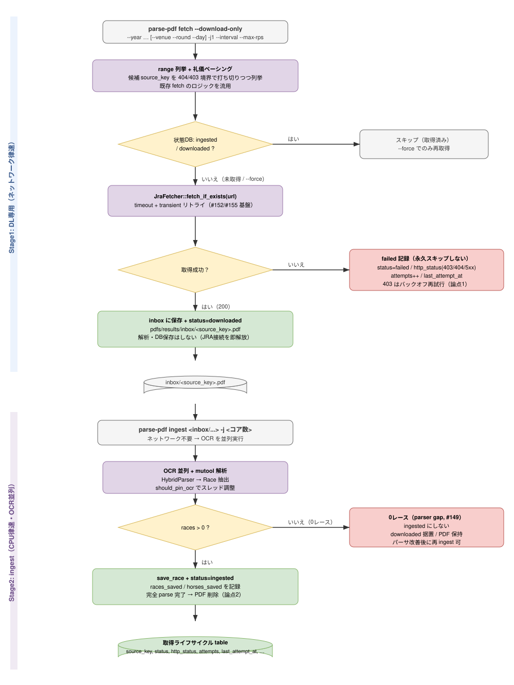
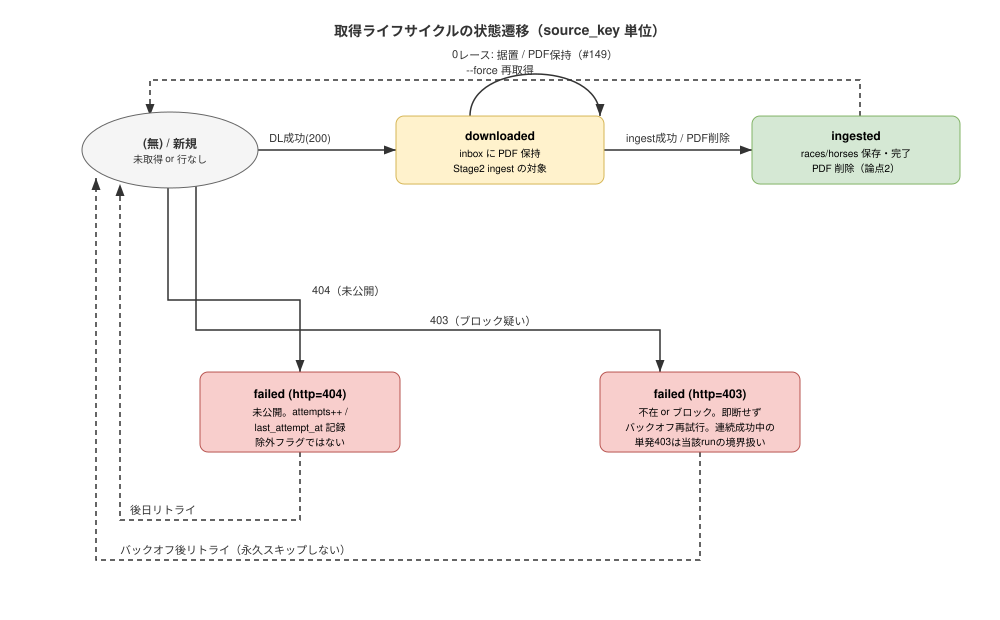

---
# knowledge 規約に基づくメタデータ（docs/knowledge/README.md）。specifications はその場で
# knowledge に昇格（ADR 履歴・相互リンクを壊さないため物理移動しない）。
status: Confirmed
kind: knowledge
doc_class: [D19, D08, D15]
tags: [D19, D08, D15]
updated: "2026-08-11"
---

# fetch/parse ステージ分割 + 取得状態管理 仕様書

Issue #147 対応。`parse-pdf fetch`（結果 seiseki PDF の取得）を **取得（ネットワーク律速）** と
**解析（CPU 律速・OCR）** の 2 ステージに分割し、取得状態を DB で一貫管理する。

## 概要

現状 `parse-pdf fetch` は 1 開催ごとに「DL（礼儀ペーシング）→ mutool＋OCR 解析 → DB 保存」を
**同期実行**し、PDF はディスクに書かずメモリ内で parse する。重いのは OCR（CPU バウンド、~50 秒/開催）
で、年単位バックフィルの所要時間の大半を占める。一方 DL はネットワーク律速で、礼儀ペーシング
（`-j 1 --interval 3 --max-rps 0.3`）のため JRA 接続を長時間占有する。

両者を分けると:

- **Stage1（DL専用）**: JRA から PDF を礼儀ペーシングで `pdfs/results/inbox/` に保存するだけ。数分で
  完了し JRA 接続を即解放。解析・DB 保存はしない。
- **Stage2（ingest）**: ネットワーク不要なので `ingest -j <コア数>` で OCR を**並列**実行。
  壁時計時間 ≒ 総OCR ÷ コア数。

既存の inbox/ingest 動線・OCR スレッド調整（`should_pin_ocr`）にそのまま乗る。重い Stage2 は
#146（コンテナ化）で CPU キャップ付き隔離実行の対象になる。

---

## スコープ

### 本仕様で実装する

| 項目 | 内容 |
|------|------|
| DL 専用モード | `fetch --download-only`。range 列挙・礼儀ペーシングは現状踏襲、PDF を inbox に保存 |
| 取得状態の DB 管理 | 取得ライフサイクル（`downloaded`/`ingested`/`failed`）を 1 テーブルで管理（dedup 統一） |
| 失敗の記録 | HTTP コード＋試行回数＋最終試行時刻を記録。**永久スキップにしない**（403 ブロック対策） |
| ingest 後の削除 | 完全 parse 完了後に PDF を**デフォルト削除**（移動でなく） |
| Stage2 の inbox 消費 | ファイル名 `source_key` から状態行を更新し、成功で `ingested`・削除 |

### スコープ外（別 Issue / フォロー）

| 項目 | 理由 |
|------|------|
| OCR の任意化（`--no-ocr`） | 最大レバーだが独立論点。別 Issue で切り出し（補足参照） |
| コンテナ化（dev/pipeline 分離） | #146 |
| 出馬表（entries）側の状態管理 | 本仕様は結果 PDF パイプラインに限定。entries は別途 |

---

## 実装状況（#147 と follow-up #170）

本仕様は最終形（取得ライフサイクルの完全管理）を記述する。#147 ではステージ分割の核に絞って実装し、
失敗追跡（論点1）は **follow-up #170** に切り出した。以下が現時点の差分:

| 範囲 | #147 で実装 | #170 へ送った |
|------|-----------|--------------|
| ステージ分割（`--download-only` / inbox / Stage2 削除） | ✅ | — |
| `fetch_history.status`（`downloaded`/`ingested`）と dedup 一本化 | ✅ | — |
| `failed` 状態・`http_status`・`attempts`・`last_attempt_at` | — | ✅ |
| `fetched_at` の `TIMESTAMPTZ` 化 | — | ✅ |
| 403/404 のバックオフ再試行・境界ヒューリスティクスの DB 記録 | — | ✅ |

#147 時点では 403/404 は記録せず再取得可能のまま（#149 の 0 レースと同じ扱い）とし、「永久スキップに
しない」という論点1の意図は満たしている。`failed` 行をジャンクで埋めない設計（grid 総当りの非実在組合せの
扱い）が #170 の主眼。下記スキーマ表・状態遷移・「失敗とリトライ方針」は #170 完了後の最終形。

---

## ステージ設計

### Stage1: DL 専用（`fetch --download-only`）

- 既存 `fetch` の range 列挙（年/会場/回/日、404/403 境界での打ち切り）と礼儀ペーシング
  （`-j 1 --interval --max-rps`）を**そのまま流用**。
- 各候補 `source_key` について:
  1. 状態 DB を引く。`ingested` または `downloaded` なら**スキップ**（`--force` で再取得）。
  2. `JraFetcher::fetch_if_exists(url)` で取得。
  3. 成功 → `pdfs/results/inbox/<JRA ファイル名>.pdf` に保存し、状態を `downloaded` に。
  4. 不在（403/404）→ 記録せず再取得可能のまま（#149 の 0 レースと同じ扱い）。失敗追跡（`failed`/
     `http_status`/`attempts`）は #170（下記「実装状況」参照）。
- ファイル名は JRA の結果 PDF ファイル名（`{年}-{回}{会場slug}{日}.pdf`、例 `2026-3nakayama6.pdf`）。
  `MeetingSpec::from_pdf_filename` で `source_key`（`{年}-{回}-{会場}-{日}`）に復元でき、Stage2 が状態行の
  更新と PDF 削除に使う。
- **論点1（403）**: 詳細は「失敗とリトライ方針」。

### Stage2: ingest（既存 `ingest` を拡張）

- `pdfs/results/inbox/` の PDF を入力に、既存 `ingest`（並列 OCR）で解析・DB 保存。
- 入力ファイル名から `source_key` を導出し、ライフサイクル行を更新:
  - 解析成功（races 保存）→ 状態 `ingested`＋`races_saved`/`horses_saved`、**PDF を削除**。
  - 0 レース（parser gap, #149 の `Empty`）→ **`ingested` にしない**。PDF は**保持**し状態を
    `downloaded` のまま（or `failed`＋理由）に残す。パーサ改善後に再 ingest できる。
- 既存のローカル ad-hoc `ingest <file>`（任意パス）動線は維持（source_key 不明なファイルは
  状態 DB を更新せず従来どおり）。

---

## 取得状態スキーマ（ライフサイクル 1 テーブル統一）

現状 dedup は 2 系統（fetch 経路＝`fetch_history`〔成功時のみ記録〕、ローカル ingest 経路＝`done/`
移動）。これを**取得ライフサイクルの単一テーブルに統一**する（既存 `fetch_history` を拡張/置換）。

### テーブル定義（案）

| カラム | 型 | 説明 |
|--------|----|----|
| `source_key` | `TEXT PRIMARY KEY` | 開催日キー（`{年}-{回}-{会場}-{日}`） |
| `url` | `TEXT NOT NULL` | JRA PDF URL |
| `status` | `TEXT NOT NULL` | `downloaded` / `ingested` / `failed` |
| `http_status` | `INT` | 失敗時の最終 HTTP コード（403/404/5xx…）。成功時 NULL |
| `attempts` | `INT NOT NULL DEFAULT 0` | DL 試行回数 |
| `races_saved` | `BIGINT NOT NULL DEFAULT 0` | `ingested` 時に設定 |
| `horses_saved` | `BIGINT NOT NULL DEFAULT 0` | 同上 |
| `last_attempt_at` | `TIMESTAMPTZ NOT NULL` | 最終試行時刻（バックオフ判定に使用） |
| `updated_at` | `TIMESTAMPTZ NOT NULL` | 行更新時刻 |

- 現行 `fetched_at` は `TEXT`(RFC3339) だったが、本テーブルは時刻比較（バックオフ）を行うため
  `TIMESTAMPTZ` を採用する。
- マイグレーションは新規ファイル（baseline へ追記でなく）で `fetch_history` を拡張/移行する。
  既存行（`ingested` 相当）は `status='ingested'` として移送する。

### 状態遷移

| 現状態 | イベント | 次状態 | 付随 |
|--------|---------|--------|------|
| (無) | DL 成功 | `downloaded` | inbox に保存、attempts++ |
| (無) | DL 失敗(404) | `failed` | http=404、attempts++、後日リトライ |
| (無) | DL 失敗(403) | `failed` | http=403、attempts++、**バックオフ再試行**（永久スキップしない） |
| `downloaded` | ingest 成功 | `ingested` | races/horses 保存、PDF 削除 |
| `downloaded` | ingest 0 レース | `downloaded`（据置） | PDF 保持。parser 改善後に再 ingest |
| `failed` | 再 fetch | `downloaded` / `failed` | リトライ結果で更新 |
| `ingested` | 再 fetch | `ingested`（skip） | `--force` でのみ再取得 |

### dedup（再実行時の挙動）

- `ingested` → スキップ（完了）。`--force` 時のみ再 DL。
- `downloaded` → DL はスキップ（PDF 取得済み）。Stage2 ingest の対象。
- `failed(404)` → 再 DL（未公開が公開された可能性）。
- `failed(403)` → `last_attempt_at` からの経過でバックオフ。十分経過なら再 DL。

---

## 失敗とリトライ方針（論点1）

JRA は「開催が無い」ときだけでなく**レート制限/IP ブロック時にも 403 を返す**（実例: 実在する
`2026-2tokyo12` すら一時 403 になった）。「403=不在」として以後スキップすると、**単にブロックされて
いた実在開催を永久に取りに行かなくなる**。よって:

- **記録は残すが永久スキップにしない。** `failed` 行は再試行の入力であって除外フラグではない。
- `404`（未公開）→ 後日リトライ（再 fetch で再 DL）。
- `403` → ブロックの可能性。即「不在」確定せず**バックオフ付き再試行**。
  - **境界ヒューリスティクス**: range 列挙の最中、連続成功の直後に出た単発 403 は、その**実行内では
    当該 round/day の境界**とみなして列挙を打ち切る（現状の 404/403 境界挙動を踏襲）。ただし DB には
    `failed(403)` として残し、**次回 fetch で再試行**する。これにより「ブロックで全滅 → 永久スキップ」
    を避けつつ、正常時の境界 discovery を保つ。
- 成功 → `downloaded`（Stage1）/ `ingested`（Stage2）として記録。

### 取得層の実装（ADR 0021 / 0029）

**無限ハングを構造的に起こさない**ことと、**transient と permanent を分けて不在判定を壊さない**ことが要点。

- **全体タイムアウトを必須にする**（両フェッチャ共通）。設定済み `ureq::Agent` を再利用し、
  `timeout_connect = 10s` / `timeout_global = 60s`（接続〜ボディ読み取りまでのデッドライン）。
  stall は最長 60s で `Timeout` になり、無限待機は起きない。**根治にはタイムアウトが必須十分**で、
  リトライはその上の resilience。
- **transient は最大 3 回（初回 + 2 回）指数バックオフ（1s / 2s）で再試行**する。transient は
  `Timeout` / `Io` / `ConnectionFailed` / `HostNotFound` / `Protocol` / 5xx。
- **`403` / `404` は「PDF 不在」として即返す**（再試行しない）。JRA は未公開日を 404、存在しない
  回/日や非開催会場を 403 で返すため、両者を不在として扱う契約を維持する——ここを transient 扱いに
  すると上記の境界 discovery が壊れる。
- **リトライ時も毎回 `RateGate` を通す**。礼儀ペーシング（`--max-rps` 等）の上限はリトライで破らない。
- **取得ロジックは共有 crate `src/interface/jra-fetcher` に集約**する（ADR 0029）。タイムアウト定数・
  リトライと `is_transient` 分類・不在判定・`RateGate` が単一実装で、`parse-pdf` / `parse-entries` の
  両アプリが `JraFetcher` を直接使う。`pdf_parser` は本来パーサであり fetcher の同居は偶発的だった。
  `JraFetcher::new(min_interval)` は単発（entries）が `None`、バルクが `--max-rps` 由来の interval。
- **エラー分類**: `paddock_use_case::Error` に `Fetch(String)` / `Timeout(String)` を持ち、ureq エラーを
  timeout → `Timeout` / その他 → `Fetch` にマップする（`Internal` への丸めを廃止）。ネットワーク障害を
  内部バグと区別してログ・監視できる。
- 最悪所要は `60s × 3 + backoff(1s+2s)` 程度に上振れするが、**ハングは消える**。健全時（〜700KB・即時応答）
  には影響しない。

### 0 レース parse を成功として記録しない（ADR 0020）

**「成功＝DB に races が入った」を不変条件にする。** 0 レースを成功として `fetch_history` に記録すると、
パーサ未対応の PDF が**自己ブロック**して二度と再取得されなくなる。

- `fetch_meeting` は parse 結果が 0 レースなら `record_fetch` を**呼ばず**、`FetchMeetingOutcome::Empty`
  を返す。履歴に行を残さないので再取得の対象に残り続ける。
- `empty` は `failed` とは**別カウンタ**にする。「PDF は存在するがパーサが空」は fetch エラーと性質が
  異なり、運用上の切り分け（再 fetch すべきか / パーサを直すべきか）に効く。range 列挙では Empty を
  計上しつつ round/day の境界（NotFound）とは扱わず列挙を継続する。
- 単一指定 fetch は Empty を**非ゼロ終了**で報告し（明示対象の取得失敗）、range fetch では done 行に
  `empty` 件数を出す（best-effort スイープなので恒久 fail にはしない）。
- 実例（**2 つの別々の不具合**）: 2025 秋 PDF が **0 レース**になっていた根本原因はレース見出しの
  正規表現（`\d{5}\s+` → `\s*`。コードと日付の間の空白が無い版に当たらなかった）。天候クラス
  （`[晴曇雨雪]` → `[晴曇雨雪小]`）が起こしていたのは別の不具合で、`小雨` / `小雪` のレースが
  前ブロックへ併合される＝**1 開催あたり 1 レース欠落**。**「0 → 12 レース」は両方を直した後の数字**
  （当該 PDF は `小雨` のレースを含むため、正規表現だけなら 11 レース）。

---

## PDF 数値列の抽出方針（ADR 0018）

**OCR・EdiF グリフ復号・image クレートを一切使わず、読める CID テキストと順位から決定的に取得する。**

| 項目 | 取得方法 |
|---|---|
| 斤量 | `stext.json` の座標索引。馬番アンカー＋x オフセット帯（92–117）にある妥当域（48.0–63.5kg）の数値トークン |
| 人気 | **単勝オッズ（読める）の昇順順位から算出**。人気はオッズ順位そのものなので EdiF 復号が要らない |
| 着順 | mutool の行順（完走順）。元から OCR 非依存で 100% |

- 索引に無い行は従来挙動へフォールバックする（後退させない）。
- **同オッズの人気**は同順位（`1,2,2,4`）に丸める。JRA の印刷人気は同オッズでも枠順等で一意の番号を
  振る運用があるため、将来 EdiF 人気列を実値復号して照合する場合に微差が出る（実害は無いが留意点）。
- **LLM / MCP を採らない理由**: LLM ホストの無い単一バッチ CLI に MCP は過剰。全件 LLM はコスト・
  非決定性・サイレント汚染・オフライン性喪失を招く。CID テキストと順位で決定的に解ける。
- レイアウト定数は実測ハードコードなので、開催場・年度差の退行は `parse_weights` の 0 件ログと
  統合テスト（充足率・既知値）で気づく前提（騎手・調教師の抽出と同じ運用）。
- **上り 3F は依然 EdiF で未対応**（`HorseResult` に該当フィールドが無い）。

---

## PDF 保持/削除（論点2）

**結論: デフォルト削除。** PDF を残す唯一の理由は「**パーサ／抽出ロジック自体を改善したときに過去分を
再抽出する**」場合のみ。解析の充実（新集計・予想シグナル・派生指標）は OCR 後の構造化データ（DB）から
何度でも回せるため PDF は不要。再抽出が必要になった時に、意図的な一括再 DL（バックフィル）を行う。
JRA ブロックの痛みは「再抽出するときだけ」払うコストで、常時保持より安い。

- ingest が**完全 parse 完了**（OCR 含む）した時点で削除する（移動でなく削除）。
- 0 レース（parser gap）は完全成功ではないため**削除せず保持**し、再 ingest 余地を残す。

---

## CLI 設計

| コマンド | 役割 |
|---------|------|
| `parse-pdf fetch --download-only --year … [--venue --round --day] [-j1 --interval --max-rps]` | Stage1。inbox に保存し状態 DB を更新。解析しない |
| `parse-pdf fetch --year …`（従来形） | 後方互換: 取得＋即解析（現状挙動）。状態 DB も更新 |
| `parse-pdf ingest <inbox/...> -j <コア数>` | Stage2。inbox を並列 OCR、成功で `ingested`＋削除 |

- `--download-only` は range 列挙・ペーシング引数を従来 `fetch` と共有する。
- 既存の即時 fetch（`--download-only` なし）は後方互換として残すが、内部的には同じ状態 DB を更新する
  （`downloaded` を経ず一気に `ingested`）。

---

## 触る範囲（実装 PR で）

- `deployments/db/migrations/`（ライフサイクルテーブルへの移行マイグレーション + down）
- `src/use-case/src/repository.rs`（状態取得/更新メソッド・レコード型）
- `src/interface/rdb-gateway/src/repositories/fetch_history.rs`（SQL: status/http/attempts クエリ）
- `src/use-case/src/dto/pdf/fetch.rs`（Outcome・状態・サマリ）
- `src/use-case/src/interactor/pdf/fetch.rs`（Stage1 DL 専用分岐・状態遷移の中核）
- `src/apps/parse-pdf/src/{cli.rs,bin.rs}`（`--download-only`・inbox 保存・ingest の状態更新・削除）

---

## テスト方針

CLI/パイプラインのため**ブラウザテストは N/A**（画面なし）。代わりに:

- 状態遷移のユニットテスト（mock Repository）: 各 status 遷移、403/404 のリトライ可否、0 レースの
  非 `ingested` 据置。
- range 列挙の境界ヒューリスティクス（連続成功中の単発 403 が当該 run の境界・DB は `failed(403)`）。
- Stage1 が PDF を inbox に保存し解析しないこと / Stage2 が成功で `ingested`＋削除すること
  （mock fetcher/parser/fs）。
- マイグレーションの up/down と既存 `ingested` 行の移送。

---

## 補足

- 最大のレバーは依然 **OCR 自体の任意化**（README どおり OCR は実質「着順 override」専用）。`--no-ocr`
  等で外せれば分割と並列の効果がさらに跳ね上がる。**本仕様のスコープ外**として別 Issue で切り出す。
- 関連: #146（コンテナ化）、#149（`Empty`/0 レース非記録の経緯）、#152/#155（fetcher のタイムアウト/
  リトライ・共有化＝本 DL 専用モードが乗る基盤）。

---

## 決定ログ

<!-- この節は append-only です。既存エントリの変更・削除は CI が検出します。 -->

### ADR 0018: 成績 PDF の数値列（斤量・人気）を OCR 無しで決定的に取得 (Issue #124) (2026-06-15) — 承認済み

#### ステータス

承認済み（採用）

#### コンテキスト
JRA 成績 PDF は一部の数値列が `EdiF-DscmvGZ6k94VUY-NNN` という埋め込みサブセットフォントで
描画され、ToUnicode が壊れているため `mutool`/`stext`/OCR いずれもテキストとして取れない、と
されていた（README「既知の制約」、欠落列＝着順・斤量・人気・上り3F）。`MutoolParser` は
`weight_carried`/`popularity` を `None` 固定とし、OCR（`HybridParser`/`pdf-ocr`）で補完していた。

#124 はこの精度改善を扱う。MCP 導入・全件 LLM 化は見送り済みで、安く決定的な手から潰す方針。

##### ① tesseract 数字 whitelist は不採用（回帰）
最初に #124 ① として「ページ全体 OCR に数字ホワイトリスト（`tessedit_char_whitelist`）＋psm
調整」を実装・計測したが、**充足率が悪化**した（サンプル `samples/2026-3nakayama6.pdf`、完走 164 頭）:

| 列 | 既存(OCRのみ) | ① whitelist |
|---|---|---|
| 斤量 | 11.6% | 7.9% |
| 人気 | 26.2% | 17.1% |

生 OCR を精査すると、whitelist が漢字ヘッダ等の区切りを消すため tesseract が**隣接する数値
セルを 1 トークンに併合**し（例 `5.900.0002.400.000`）、値が壊れていた。問題は「数字の誤読」
ではなく「表のセル分割」で、tesseract はここが構造的に弱い。psm 4/11 でも改善せず。① は破棄した。

##### 調査で判明した実態（trace で確認）
`mutool draw -F trace` で各グリフの unicode/グリフ名と座標を観察した結果:
- 馬名・騎手・調教師・**タイム・オッズ・馬体重・斤量**は CID フォント（FutoGo/FutoMin 等）で
  **読める**。当初「斤量も EdiF」という前提は、現行 PDF 形式では**誤り**だった
  （斤量「57/55」は CID 数字で、牡57/牝55 が性別と一致）。
- **EdiF で描画されるのは実質「人気」列のみ**（と上り3F）。EdiF は 1 グリフ=1 サブセット
  フォントの**置換暗号**（グリフ名 `cNNN` は 33 から順の不透明コード、文書ごとに割当が変わる）。
- `stext.json` は EdiF グリフを落とすが、CID は座標付きで取れる（`jockey_stext` が利用済み）。

#### 決定
**OCR・EdiF グリフ復号・image クレートを一切使わず、読める CID テキストと順位から決定的に取得する。**

- **斤量**: `stext.json` の座標索引から取る。`jockey_stext` の幾何（馬番アンカー＋x オフセット帯）を
  再利用し、`parse_weights` を追加（騎手・調教師と同骨格 `parse_column`）。斤量列 x 帯
  （馬番からのオフセット 92–117）にある妥当域(48.0–63.5kg)の数値トークンを採る。
  `WeightIndex(race_num→horse_num→kg)` を `parse_text` へ渡して `weight_carried` を確定。
- **人気**: 単勝オッズ（読める）の昇順順位から算出する（`popularity_ranks`、同オッズは競争順位で
  同順位）。人気はオッズ順位そのものなので EdiF 復号不要で決定的・正確。
  - 注（同オッズ時）: JRA の印刷人気は同オッズでも枠順等で一意の番号を振る運用がある。本実装は
    同オッズを同順位（`1,2,2,4`）に丸めるため、将来 EdiF 人気列を実値復号して照合する場合、
    同オッズ馬の番号付けが PDF と微差になりうる（実害は無いが照合時の留意点）。
- **着順**: 既存どおり mutool 行順（完走順）で確定（既に 100%）。変更なし。
- 索引に無い行は従来挙動へフォールバック（後退させない）。

##### なぜ MCP / 全件 LLM を採らないか（#124 調査の再掲）
LLM ホストの無い単一バッチ CLI に MCP は過剰。全件 LLM はコスト・非決定性・サイレント汚染・
オフライン性喪失を招く。本件は CID テキスト＋順位で決定的に解けるため、そもそも不要だった。

#### 計測（サンプル PDF・完走 164 頭、`measure_column_fill_rates`）

| 列 | before | after |
|---|---|---|
| 着順 | 100.0% | 100.0% |
| 斤量 | 11.6% | **100.0%** |
| 人気 | 26.2% | **100.0%** |

OCR 非実行のため計測も高速（約 12s）。`weight_and_popularity_are_sane` で斤量 48–63.5・人気
1..N を実 PDF で検証。純ロジック（`popularity_ranks`・`parse_weights`）はユニットテストで固定。

#### 影響・将来
- 斤量・人気は MutoolParser だけで決定的に埋まるため、**これらに対する `HybridParser`/`pdf-ocr`
  の OCR 経路は冗長**。撤去は別 PR で検討（着順は元から行順で OCR 非依存）。
- **上り3F** は依然 EdiF で未対応。現状 `HorseResult` に該当フィールドが無く本 PR の対象外。
  必要になれば、EdiF 置換暗号を「孤立グリフ OCR or 順位/値域制約」で解く（暗号は文書ごとに
  変わる前提で PDF 毎に解決）方針を別途検討する。
- レイアウト定数は実測ハードコードのため、開催場・年度差での退行は `parse_weights` の 0 件
  ログと統合テスト（充足率・既知値）で気づく前提（騎手・調教師と同じ運用）。

### ADR 0020: 0 レース parse を成功記録しない + 2025 秋 PDF のレース見出し抽出を修正 (Issue #149) (2026-06-17) — 承認済み

#### ステータス

承認済み（採用）

#### コンテキスト
2025 年の成績を `parse-pdf fetch --year 2025` で取り込んだところ、**2025 年秋〜年末
（10〜12 月）の 70 開催がまるごと 0 レース**で記録された。PDF は JRA に存在し DL も成功して
いるのに、`mutool` 一次抽出・OCR フォールバックともに 0 レースしか返さない。2025 春（〜9 月）と
2026 は正常で、この期間特有の現象だった。

##### ① パーサ側の根本原因（決定的）
失敗 PDF のレース見出し行は、mutool のテキスト抽出で **5 桁レースコードと日付の間のスペースを
欠く**（例 `2700110月4日曇`）。正常 PDF はスペース有り（`14001␣6月7日晴`）。レース見出しの
検出・ヘッダ解析の両正規表現が `\d{5}\s+`（**空白 1 個以上を必須**）を要求していたため、
全レース行が非マッチ → ブロック 0 個 → `race_count=0`。OCR は既存レースを enrich するのみで
新規レースを生成しないため、mutool が 0 なら最終出力も 0 になる。
（`file` 差分の「失敗=非 deflate / 正常=zip deflate」はテキスト抽出量に影響せず、本質は
スペースグリフの有無のみ。）

加えて、見出し検出 `is_race_start_line` の天候文字クラスが `[晴曇雨雪]` で `小`（`小雨`/`小雪`）を
含まず、`parse_header` 側の `[晴曇雨雪小]+` と不整合だった。`小雨` のレースは見出しとして検出
されず前レースのブロックに併合され、**1 開催あたり 1 レース欠落**していた（本 PDF では race10
`2701010月4日小雨`）。

##### ② 0 レース parse を「成功」記録する設計欠陥（二次被害）
`fetch_meeting` は `races_saved=0` でも無条件に `record_fetch` を呼んでいた。このため上記 70 開催が
`fetch_history` に「ingested(0 レース)」として記録され、以降の通常 `fetch` は
`fetch_history_contains → Skipped` で**ネットワークも叩かずスキップ**し、二度と取りに行かない
（自己ブロック）。「DL は成功・抽出は失敗」を成功として確定する誤りである。

#### 決定
1. **パーサ（`pdf-parser/src/extract/header.rs`）**
   - レース見出し検出 `is_race_start_line` とヘッダ解析 `parse_header` の `\d{5}\s+` を
     `\d{5}\s*` に変更し、コードと日付の間の空白を任意化する。コードは固定長 5 桁なので、
     空白を任意化しても `\d{5}` が日付桁へ食い込む誤マッチは起きない。
   - `is_race_start_line` の天候クラスを `[晴曇雨雪]` → `[晴曇雨雪小]` とし、`parse_header` と
     整合させる（`小雨`/`小雪` レースの欠落を防止）。
2. **取得状態（`use-case`/`apps/parse-pdf`）**
   - `fetch_meeting` は parse 結果が **0 レースなら `record_fetch` を呼ばず**、新設の
     `FetchMeetingOutcome::Empty` を返す。`fetch_history` に行を残さないため、再取得の対象に
     残り続ける（自己ブロックしない）。
   - `FetchRangeSummary` に `empty` カウンタを追加。range 列挙では Empty を計上しつつ、
     「PDF は存在する」ため round/day の境界（NotFound）とは扱わず列挙を継続する。
   - 単一指定 fetch（`run_fetch_single`）では Empty を**非ゼロ終了**で報告（明示対象の取得失敗）。
     range fetch では done 行に `empty` 件数を表示（best-effort スイープのため恒久 fail にはしない）。

#### 理由
- ①の修正は最小（正規表現 2 箇所の `\s+→\s*` と 1 文字追加）で、実 PDF（`2025-4tokyo1.pdf`）で
  **0 → 12 レース**に復旧することを確認済み。代替案（見出し行を正規化してスペースを補う）より
  変更面が小さく、既存の正常 PDF も従来どおりマッチする。
- ②は「成功＝DB に races が入った」を不変条件とする素直な設計。0 レースを失敗として扱えば、
  パーサ未対応 PDF が将来現れても自己ブロックせず再取得余地を残せる。`Empty` を `failed`
  （ネットワーク等のエラー）と別カウンタにしたのは、**PDF は存在するがパーサが空**という状態が
  fetch エラーとは性質が異なり、運用上の切り分け（再 fetch すべきか・パーサを直すべきか）に
  効くため。

#### 影響・将来
- 既に 0 レースで記録済みの 70 行（`SELECT source_key FROM fetch_history WHERE source_key
  LIKE '2025-%' AND races_saved=0`）は、本コード修正だけでは消えない。**復旧（該当行削除 →
  2025 秋を再 fetch）は本 PR とは別の運用作業**として実施する（本番 DB アクセス・礼儀ペーシングの
  長時間 fetch を伴うため）。手順は PR に runbook を添付。
- 今後 `parse-pdf fetch` のサマリに `empty` 列が増える（出力フォーマットの軽微な変更）。
- 本件は #147（fetch/parse ステージ分割・取得状態管理）の前段にあたる。恒久的には取得済み/
  失敗ステータスを DB で持つ方向（#147）で、`Empty` を「取得済みだが未パース」状態として
  昇格させる余地がある。

### ADR 0021: PDF 取得の HTTP にタイムアウト＋リトライを追加 (Issue #152) (2026-06-18) — 承認済み

#### ステータス

承認済み（採用）

#### コンテキスト
JRA の PDF 取得（`pdf_parser::UreqFetcher` / `parse-entries` の `UreqFetcher`）は
`ureq::get(url).call()` を**タイムアウト未設定・リトライ無し**で呼んでいた。ureq は既定で
タイムアウトを持たないため、接続が stall（FIN もデータも来ない）すると呼び出しスレッドが
**無限に待機**する。

実害は #149 の復旧時に顕在化した。2025 秋 70 開催の再 fetch（`-j 1 --interval 3 --max-rps 0.3`）
で 66/70 件まで正常に進んだ後、67 件目の GET がネットワーク一時停止で stall し、**プロセス生存の
まま約 8.7 時間 進捗ゼロ**でハングした。network 復帰後は同 URL が `200 / 0.23s` で即取得できた
ため、恒久障害ではなく client 側のタイムアウト欠如が原因と判明。

#### 決定
取得経路に**全体タイムアウト**を必須化し、バルク経路には**指数バックオフのリトライ**を加える。

- **タイムアウト（両フェッチャ共通）**: 設定済み `ureq::Agent` を保持して再利用する。
  - `timeout_connect = 10s`（接続確立の上限）
  - `timeout_global = 60s`（接続〜レスポンス〜ボディ読み取りまでの全体デッドライン）
  - これにより stall は最長 60s で `Timeout` エラーになり、**無限ハングは構造的に起きない**。
- **リトライ（`pdf_parser::UreqFetcher` のみ）**: transient な失敗を最大 3 回（初回＋2 回）
  指数バックオフ（1s, 2s）で再試行する。
  - transient と見なすのは `Timeout` / `Io` / `ConnectionFailed` / `HostNotFound` /
    `Protocol`（不完全な HTTP 応答）/ `StatusCode >= 500`。
  - **`403`/`404` は「PDF 不在」**として即返す（再試行しない）。JRA は未公開日を 404、
    存在しない回/日や非開催会場を 403 で返すため、両者を「不在」として扱う既存契約を維持。
  - リトライ時も毎回 `RateGate` を通すため、礼儀ペーシング（`--max-rps` 等）の上限は保たれる。

`parse-entries` の取得は単発（バルクループが無い）ため、ハング防止に効くタイムアウトのみを適用し
リトライは載せない。リトライ policy はバルク経路の `pdf_parser::UreqFetcher` に集約する。
なお `parse-entries` の不在判定は**従来どおり 404 のみ**を維持する（`pdf_parser` 側は seiseki の
実挙動に合わせ 403/404 両方を不在とするが、entries エンドポイントが 403 を不在として返すかは未確認の
ため、本 PR では挙動を変えない。必要が判明すれば 403 追加を別途検討）。

#### 理由
- 無限ハングの根治には**全体タイムアウトが必須十分**。リトライは一時的ネットワーク揺らぎ・5xx に
  対する resilience の上乗せで、バルク取得（数十〜数百開催を逐次取得）で効果が大きい。
- transient と permanent（4xx・URI 不正）を分けることで、不在（403/404）の即時確定という既存の
  列挙ロジック（境界検出）を壊さずに済む。
- リトライを 2 フェッチャに重複実装せず canonical 側へ集約することで、policy の単一実装を保つ。
  将来 `parse-entries` にもリトライが必要になれば、共有 fetcher crate への抽出を検討する。

#### 影響・トレードオフ
- 取得失敗時の挙動が変わる: 従来は無限待機だったものが最長 60s で `Timeout` エラーになり、
  バルク経路では 5xx/transient が最大 3 回再試行される。1 開催あたりの最悪所要時間は
  `60s × 3 + backoff(1s+2s)` 程度に上振れしうるが、**ハングは消える**。
- 60s/10s の値は実測 PDF（〜700KB・即時応答）に対し十分広く、健全時は影響しない。値はコード内
  定数。会場混雑等で恒常的に足りなくなれば定数調整 or 設定化を検討する。
- 進捗ストール検知（長時間ジョブの監視）は本 PR の対象外。運用回避策として、バルク取得中は
  ログ最終更新 or DB 行数の停滞を監視する（#152 の残要件）。

### ADR 0024: fetch/parse のステージ分割と取得状態の DB 管理 (Issue #147) (2026-06-18) — 承認済み

#### ステータス

承認済み（採用）

#### コンテキスト
`parse-pdf fetch`（結果 seiseki PDF）は 1 開催ごとに「DL（礼儀ペーシング）→ mutool＋OCR 解析 →
DB 保存」を**同期実行**し、PDF はディスクに書かずメモリ内で parse する。重いのは OCR（CPU バウンド、
~50 秒/開催）で、年単位バックフィルの所要時間の大半を占める。一方 DL はネットワーク律速で、礼儀
ペーシングのため JRA 接続を長時間占有する。

取得（ネットワーク律速）と解析（CPU 律速）を分離すれば、DL を数分で終えて JRA 接続を即解放し、重い
OCR をネットワーク非依存で `-j <コア数>` 並列実行できる（壁時計 ≒ 総OCR ÷ コア数）。

詳細設計は `docs/specifications/fetch-stage-split.md`。

#### 決定

##### 1. ステージ分割
- **Stage1（DL専用, `fetch --download-only`）**: range 列挙・礼儀ペーシングは現状踏襲し、PDF を
  `pdfs/results/inbox/<JRA ファイル名>.pdf`（`{年}-{回}{場slug}{日}.pdf`、例 `2026-3nakayama6.pdf`）に
  保存するだけ。解析・DB 保存はしない。ファイル名は `MeetingSpec::from_pdf_filename` で source_key に
  復元でき、Stage2 の記録・削除に使う。
- **Stage2（ingest）**: 既存 `ingest`（並列 OCR・`should_pin_ocr`）で inbox を消費し解析・DB 保存。
- 従来形 `fetch`（取得＋即解析）は後方互換として残す。

##### 2. 取得状態のライフサイクル 1 テーブル統一（dedup 統一）
現状の 2 系統 dedup（fetch 経路＝`fetch_history`〔成功時のみ〕、ローカル ingest 経路＝`done/` 移動）を、
取得ライフサイクルを表す**単一テーブル**に統一する（既存 `fetch_history` を拡張）。`done/` 移動は廃止し、
ingest 完了時に DB 状態更新＋PDF 削除へ寄せる。

**実装スコープ（#147）**: 本 PR では `fetch_history` に `status`（`downloaded` / `ingested`）のみを
追加した（既存行は ingest 成功ログなので `ingested`）。`fetch_history_contains` は「ingest 済み」に
厳格化し、`fetch_status` / `record_download` を新設して Stage1↔Stage2 の受け渡しを表現する。
`failed` 状態と `http_status` / `attempts` / `last_attempt_at`、および `fetched_at` の `TIMESTAMPTZ`
化（時刻比較・バックオフ用）は、下記論点1とともに **follow-up #170** へ切り出した。

##### 3. 失敗の扱い（論点1）— follow-up #170 へ
**当初決定**: JRA はレート制限/IP ブロック時にも 403 を返す（実在 `2026-2tokyo12` が一時 403 になった
実例あり）。「403=不在」で以後スキップすると、ブロックされていた実在開催を永久に取り逃す。よって
`failed` 行は**再試行の入力**であって除外フラグにしない（404→後日リトライ、403→バックオフ再試行、
range の単発 403 は実行内境界・DB は `failed(403)` で次回再試行）。

**#147 実装時の判断（見送り）**: 並列 grid fetch は実在しない開催日の大半が 403/404 になるため、これらを
`failed` 行として記録すると「実在しない開催日のジャンク行」が毎回大量に堆積し、永久に再試行対象として
残る。「未公開でいずれ実在する開催日」と「grid 総当りで永遠に実在しない組合せ」を区別する設計が前提に
なるため、ステージ分割本体とは独立させ **#170** に切り出した。現状は 403/404 を記録せず再取得可能のまま
（#149 の 0 レースと同じ扱い）とし、永久スキップにはしないという論点1の意図は満たしている。
- 成功 → `downloaded`（Stage1）/ `ingested`（Stage2）。

##### 4. PDF はデフォルト削除（論点2）
PDF を残す唯一の理由は「**パーサ／抽出ロジック自体を改善したとき過去分を再抽出する**」場合のみ。解析の
充実は OCR 後の構造化データ（DB）から何度でも回せるため PDF は不要。ingest が**完全 parse 完了**（OCR
含む）した時点で削除する。0 レース（parser gap, #149）は完全成功でないため**削除せず保持**し再 ingest
余地を残す。再抽出が必要になった時に意図的な一括再 DL（バックフィル）を行う。

#### 理由
- ステージ分割は既存の inbox/ingest 動線・OCR スレッド調整にそのまま乗り、最小の動線変更で最大の壁時計
  短縮（OCR 並列化）を得られる。#146（コンテナ化）で Stage2 を CPU キャップ隔離する布石にもなる。
- 取得状態を 1 テーブルに統一することで「DL 済みだが未解析」を表現でき、ステージ間の受け渡しと重複回避を
  一貫したセマンティクスで扱える。`fetch_history`（成功=ingested）に DL/失敗状態を混ぜる曖昧さを避ける。
- 403 を永久スキップにしない設計は、JRA ブロックという運用現実（#152 の 8.7h ハングと同根の脆さ）に対する
  必須の防御。記録（http/attempts/last_attempt_at）はリトライ判断の入力として使う。

#### 影響・トレードオフ
- スキーマ変更（マイグレーション）と取得経路の中核ロジック変更を伴う。#147 では `fetch_history` に
  `status` カラムを追加するのみで、既存行は DEFAULT `'ingested'` で充足（行の移送は不要）。残りの
  ライフサイクル列は #170 で追加する。
- 従来 fetch は PDF をディスクに書かなかったが、Stage1 は inbox に書く（ディスク使用）。ingest 完了で削除
  するため定常的な滞留は無い。
- **本 ADR はスコープを結果 PDF パイプラインに限定**する。OCR の任意化（`--no-ocr`）は最大レバーだが独立
  論点として別 Issue に切り出す。出馬表（entries）側の状態管理も対象外。
- 関連: #146（コンテナ化）、#149（`Empty`/0 レース非記録）、#152/#155（fetcher の timeout/retry・共有化）、
  #170（失敗追跡 `failed`/`http_status`/`attempts` の follow-up）。

### ADR 0029: JRA fetcher を共有 crate `jra-fetcher` に集約 (Issue #155) (2026-06-20) — 承認済み

#### ステータス

承認済み（採用）

> 採番注記: 当初 `0022` で追加されたが [ADR 0022](0022-rest-api-read-server.md)（REST API read 基盤, Issue #33）と
> 番号が重複していたため、後発の本 ADR を `0029` にリナンバーした（2026-06-20）。内容に変更はない。

#### コンテキスト
JRA PDF 取得の `UreqFetcher` 実装が **2 箇所に重複・分岐**していた
（`pdf_parser::UreqFetcher`〔結果 PDF・バルク〕と `parse-entries` 内の `UreqFetcher`〔出馬表・単発〕）。
#152（PR #153）でタイムアウト＋リトライを入れた際、両者の差異がセルフレビューで繰り返し指摘された：

1. **エラー分類の非対称**: `PdfFetcher` トレイトは `paddock_use_case::Result` を返すため、結局どちらの取得
   失敗も `paddock_use_case::Error::Internal` に丸められていた（pdf_parser 側の `Error::Fetch` も
   use-case 境界で `Internal` 化）。`Internal` は内部バグ用の semantic で、外部 HTTP 由来の失敗を畳むと
   ログ/監視で切り分けられない。
2. **タイムアウト定数・Agent 構築の重複**: `CONNECT_TIMEOUT=10s` / `GLOBAL_TIMEOUT=60s` と Agent 構築が
   両クレートにコピーされ、値ズレが経路ごとの挙動差を生むリスクがあった。
3. **不在判定の非対称**: バルク経路は `403`/`404` 両方を不在とするが、entries は `404` のみだった。

#### 決定
共有 crate **`src/interface/jra-fetcher`** を新設し、`JraFetcher` に取得ロジックを一本化する。

- `JraFetcher` が `paddock_use_case::PdfFetcher` を実装し、両アプリ（`parse-pdf` / `parse-entries`）が
  これを直接利用する。`pdf_parser` からは fetcher を撤去（`fetcher.rs`・re-export・`ureq` ランタイム依存・
  未使用化した `Error::Fetch` を削除）。`parse-entries` のローカル実装も削除。
- **集約する責務**: タイムアウト付き `ureq::Agent` 構築／タイムアウト定数／指数バックオフのリトライ
  （`is_transient` 分類含む）／不在判定（`403`/`404`）／`RateGate`（`--max-rps` ペーシング）。
  `JraFetcher::new(min_interval)` は単発呼び出し（entries）が `None`、バルク取得が `--max-rps` 由来の
  interval を渡す。
- **エラー分類の是正**: `paddock_use_case::Error` に `Fetch(String)` と `Timeout(String)` を追加し、
  ureq エラーを **timeout→`Timeout` / その他→`Fetch`** にマップする（`Internal` 丸めを廃止）。
- **不在判定の統一**: `fetch_if_exists` は `403`/`404` 両方を不在（`Ok(None)`）として扱う共通契約に統一する
  （seiseki と同契約）。**ただしこれは `fetch_if_exists` を呼ぶ経路の契約レベルの統一**であり、現状この
  メソッドを使うのは結果 PDF のバルク discovery（`interactor/pdf/fetch.rs`）のみ。entries の取り込み
  （`interactor/entry/ingest.rs`）は `fetch`（非 `if_exists`）を呼ぶため、entries の実挙動は不在判定統一の
  影響を受けず、`403`/`404` は従来どおり `Err` で表面化する。統一の実利は、将来 entries が discovery 的に
  `fetch_if_exists` を採用した時に一貫した不在判定を得られる点にある。実機で `403` を観測する必要は無く、
  共有 trait impl の契約統一を優先した。

#### 理由
- 取得の挙動（タイムアウト・リトライ・不在判定）を**単一実装**に集約することで、経路ごとの差異と将来の
  二重メンテを排除できる。`pdf_parser` は本来パーサであり、fetcher が同居していたのは偶発的だった。
- `Fetch`/`Timeout` の専用バリアントにより、ネットワーク障害を内部バグと区別してログ/監視できる。
  既存の `paddock_use_case::Error` への variant 追加は後方互換（網羅 match は wildcard 付きのみで破綻しない
  ことをビルドで確認済み）。
- リトライ policy は #152 で `pdf_parser::UreqFetcher` に集約済みだったものを、本 crate へ持ち上げて
  entries 側にも一貫適用する位置づけ。

#### 影響・トレードオフ
- 取得失敗の型が `Internal` から `Fetch`/`Timeout` に変わる（ハンドリングは `?` 伝播が主で、振る舞いの
  退行は無し。ビルド・テストで確認）。
- 依存方向: `jra-fetcher` は `paddock_use_case`（トレイト＋Error）に依存する。これは従来 `pdf_parser` が
  同トレイトに依存していたのと同じ向きで、既存アーキテクチャと整合。
- **テスト用の共有 fixture** `src/interface/sample_pdf_fixture.rs` は、サンプル結果 PDF を独自の最小 ureq
  agent で取得する設計を維持する（`#[path]` include の standalone ファイルで「新規 crate を増やさない」
  方針のため、テスト基盤を use-case 層へ結合させない）。よって `pdf-parser` は `ureq` を **dev-dependency**
  として保持する。本番取得経路の重複は解消済みで、本件はテスト専用の意図的な例外。
- 今後 odds/netkeiba 等の別取得経路が増えた場合も、HTTP 取得の共通化は `jra-fetcher`（または同種の
  共有 crate）へ寄せる方針とする。
