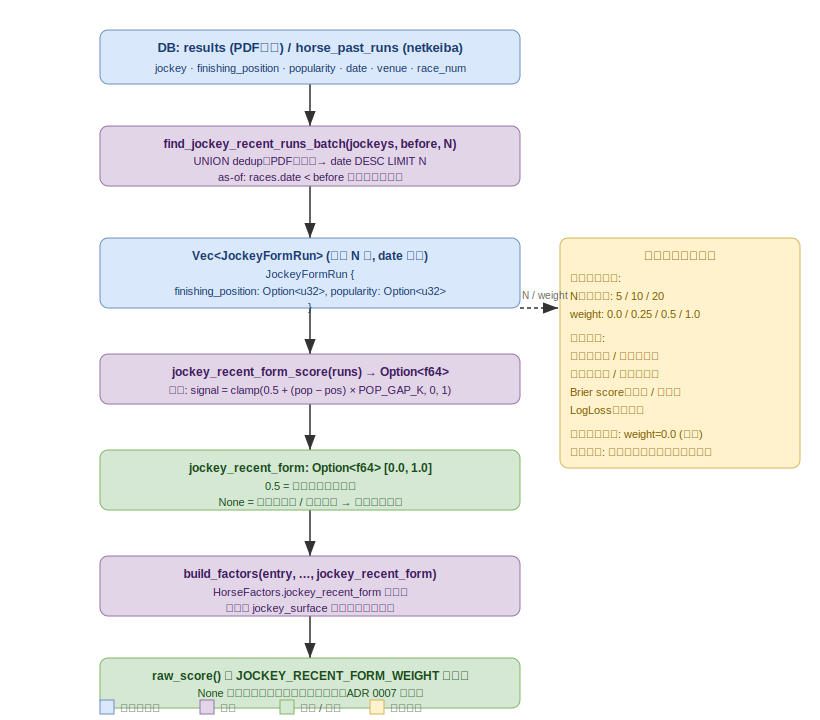

# 騎手直近フォーム特徴量仕様書

Issue #221 対応。現行の `jockey_surface`（騎手の通算芝ダ別勝率）は直近の好不調を捉えられないため、
騎手の直近 N 走フォームスコアを新特徴量として追加する。

## 概要



`results`（PDF確定成績）と `horse_past_runs`（netkeiba近走）から当該騎手の直近 N 走を取得し、
「着順 vs 人気乖離」シグナルの平均で [0, 1] のフォームスコアを算出する。
`HorseFactors.jockey_recent_form` として `raw_score` の重み付き平均に加える。
`jockey_surface`（通算率）とは独立した項で、乗り替わり直後の絶好調騎手や不振中の騎手の識別を目的とする。

---

## 背景と課題

| 現行特徴量 | 課題 |
|-----------|------|
| `jockey_surface` | 通算芝ダ別勝率。長期平均のため直近の好不調に反応しない |

馬の `recent_form`（前走フォーム）は直近 1 走の人気乖離・着差・タイム・間隔・体重変化を
複合して [0,1] に写像し、PR #31 で有効性が確認された（ADR 0009）。
騎手版として「直近 N 走の人気乖離平均」を導入する。

---

## 変更範囲

### 1. domain (`paddock_domain`)

#### 1.1 新型: `JockeyFormRun`

```rust
// domain/src/prediction/model.rs に追加
pub struct JockeyFormRun {
    pub finishing_position: Option<u32>,
    pub popularity: Option<u32>,
}
```

着順・人気のみを持つ軽量型。`HorseResult` を流用しないのは、
タイム・体重・着差等の不要フィールドをリポジトリが取得しなくてよいようにするため。

re-export パス: `domain/src/prediction/mod.rs` に `pub use model::JockeyFormRun;` を追加 →
`domain/src/lib.rs` の既存 `pub use prediction::*;` で `paddock_domain::JockeyFormRun` として公開される。

#### 1.2 新フィールド: `HorseFactors.jockey_recent_form`

```rust
// domain/src/prediction/model.rs
pub struct HorseFactors {
    // 既存フィールド略…
    /// 騎手直近フォームスコア [0,1]（0.5=中立）。
    /// 騎手未登録・直近 N 走の全走で着順/人気が欠損（有効 signal ゼロ）は `None`（母数除外）。
    /// N 件未満でも 1 件以上有効なら `Some` を返す（信頼性は低いが母数から落とさない）。
    pub jockey_recent_form: Option<f64>,
}
```

#### 1.3 新関数: `jockey_recent_form_score`

```rust
// domain/src/prediction/scoring.rs
pub fn jockey_recent_form_score(runs: &[JockeyFormRun]) -> Option<f64> {
    let signals: Vec<f64> = runs.iter().filter_map(|r| {
        if let (Some(pop), Some(pos)) = (r.popularity, r.finishing_position) {
            let gap = pop as f64 - pos as f64; // >0: 人気以上の好走
            Some((0.5 + gap * POP_GAP_K).clamp(0.0, 1.0))
        } else {
            None
        }
    }).collect();
    if signals.is_empty() { None } else { Some(signals.iter().sum::<f64>() / signals.len() as f64) }
}
```

**None を返す条件:** `runs` 内の全走で `finishing_position` または `popularity` が欠損している場合（`signals` が空）。
1 件でも有効な (pos, pop) ペアがあれば `Some` を返す。

**`POP_GAP_K` の参照:** `scoring.rs` から `super::weights::POP_GAP_K` で参照可能（`weights.rs` で `pub(crate)` 宣言済み。可視性変更不要）。

**signal 設計の根拠:**
- 着順 vs 人気乖離（`POP_GAP_K = 0.08`）は horse の `recent_form_score` でも使用済みの有効 sub-signal
- 馬体重変化・前走間隔・着差・タイムは騎手属性でなく馬・コース属性のため N 走平均に混ぜない
- シンプルなスカラーで jockey_surface との重複寄与を最小化する

**POP_GAP_K スケールと飽和挙動:**
- 人気乖離が大きい（例: 1 番人気が 7 着: gap = -6 → signal = 0.02 → clamp 0.02）と clamp が効くが、信頼性は低い極端値なので飽和による情報量損失は許容する
- 最低人気の激走（18 番人気 1 着: gap = 17 → signal = 1.86 → clamp 1.0）も同様に上限に張り付く。これは「異常値は最大/最小スコアで表現」という意図的な設計
- `POP_GAP_K = 0.08` は馬版と同値で初期化する。騎手の人気乖離レンジは馬と同スケール（同じレースの同じ人気・着順体系）のため流用を正当とする。感度が合わない場合はバックテスト sweep で `POP_GAP_K` を独立調整することも検討できる（現状の sweep 対象外）

**既知の制約（馬の地力バイアス）:** このシグナルは「騎手が乗った馬の人気 vs 着順」を見るため、弱馬ばかり乗る騎手の評価が低く出がちになる。
逆に強馬に乗る有名騎手は市場が既に `jockey_surface` に織り込んでいるため、このシグナルは「市場の過小評価」（乗り替わり直後の勢い等）を狙う補助的な位置づけ。
バックテストで有効性が確認できれば採用、なければ weight=0.0 で無効化する。

#### 1.4 新定数: `JOCKEY_RECENT_FORM_WEIGHT`

```rust
// domain/src/prediction/weights.rs
/// 騎手直近フォーム項の重み（暫定 0.25）。backtest sweep で決定する。
pub(crate) const JOCKEY_RECENT_FORM_WEIGHT: f64 = 0.25;
```

初期値は `FORM_WEIGHT`（馬の前走フォーム）と同値の保守値。
バックテスト結果によって 0.0 に設定し無効化することも有り得る。

---

### 2. use-case repository trait

`JockeyFormRun` は **domain 側（§1.1）のみに定義する**。use-case 側はクレートの re-export (`pub use paddock_domain::prediction::JockeyFormRun`) を経由して使う。
既存の `RecentRun`（domain 型を use-case がそのまま参照）と同パターン。use-case 側に同名の struct を再定義しない。

`find_recent_runs` + `recent_runs_batch` の 2 ステップ構造と同パターン: **必須（required）** `find_jockey_recent_runs` と、それをループする **既定実装（provided）** `jockey_recent_runs_batch` を 1 つの trait に追加する。

```rust
// use-case/src/repository.rs に追加（型定義不要。domain 型を参照）
use paddock_domain::JockeyFormRun;

trait StatsRepository {
    // ─── 既存メソッド省略 ───

    // ▶ required: rdb-gateway が SQL で実装する
    fn find_jockey_recent_runs(
        &self,
        jockey: &JockeyName,
        before: NaiveDate,
        limit: u32,
    ) -> impl Future<Output = Result<Vec<JockeyFormRun>>> + Send;

    // ▶ provided: デフォルト実装（per-jockey ループ）。recent_runs_batch L561–L574 と同パターン。
    // rdb-gateway は UNION ウィンドウ SQL で override して一括取得に置き換える。
    fn jockey_recent_runs_batch(
        &self,
        jockeys: &[JockeyName],
        before: NaiveDate,
        limit: u32,
    ) -> impl Future<Output = Result<HashMap<JockeyName, Vec<JockeyFormRun>>>> + Send {
        async move {
            let mut out = HashMap::new();
            for jockey_name in jockeys {
                if out.contains_key(jockey_name) { continue; }
                out.insert(jockey_name.clone(), self.find_jockey_recent_runs(jockey_name, before, limit).await?);
            }
            Ok(out)
        }
    }
}
```

rdb-gateway のみウィンドウ関数で `jockey_recent_runs_batch` を一括 override。

---

### 3. rdb-gateway

`find_recent_runs.rs` と同様の UNION dedup クエリを騎手名フィルタで実装する。

```sql
-- 単体版（find_jockey_recent_runs、既定実装から呼ばれる）
-- 騎手名は文字列一致（JockeyName 型で正規化済み）。既存 jockey_stats_batch と同じ表記依存。
WITH unioned AS (
    SELECT races.date, races.venue, races.race_num,
           results.finishing_position, results.popularity,
           0 AS src_rank, results.race_id
    FROM results
    INNER JOIN races ON races.race_id = results.race_id
    WHERE results.jockey = $1 AND races.date < $2 AND races.source = 'pdf'
    -- results.jockey が NULL の行は = 比較で自然に除外される
    UNION ALL
    -- horse_past_runs は定義上 netkeiba 専用テーブルなので source 絞り込みは不要
    -- horse_past_runs.jockey が NULL の行も = 比較で自然に除外される
    -- horse_past_runs.race_id は PRIMARY KEY の一部として存在（baseline マイグレーション参照）
    SELECT date, venue, race_num,
           finishing_position, popularity,
           1 AS src_rank, race_id
    FROM horse_past_runs
    WHERE jockey = $1 AND date < $2
)
SELECT u.finishing_position, u.popularity
FROM unioned u
WHERE NOT EXISTS (
    SELECT 1 FROM unioned u2
    -- 単体版では $1 で騎手が 1 名固定のため jockey 条件は不要（全行同一騎手）
    -- バッチ版との対称性ではなく単体版の unioned CTE にある列だけを参照する
    WHERE u2.date = u.date AND u2.venue = u.venue AND u2.race_num = u.race_num
      AND (u2.src_rank < u.src_rank
           -- src_rank 同値 tie-break: race_id 降順（同一ソース内の決定論的序列。方向は任意だが一貫性があれば十分）
           OR (u2.src_rank = u.src_rank AND u2.race_id > u.race_id))
)
ORDER BY u.date DESC, u.race_id DESC
LIMIT $3
```

**バッチ版骨格（rdb-gateway override）:**

```sql
-- 全騎手を一括取得 (jockey_recent_runs_batch の rdb-gateway 実装)
WITH unioned AS (
    -- （単体版と同じ構造、WHERE jockey = ANY($1) に変更）
    SELECT races.date, races.venue, races.race_num,
           results.finishing_position, results.popularity,
           0 AS src_rank, results.race_id, results.jockey AS jockey
    FROM results INNER JOIN races ON races.race_id = results.race_id
    WHERE results.jockey = ANY($1) AND races.date < $2 AND races.source = 'pdf'
    UNION ALL
    SELECT date, venue, race_num,
           finishing_position, popularity,
           1 AS src_rank, race_id, jockey
    FROM horse_past_runs
    WHERE jockey = ANY($1) AND date < $2
),
-- ステージ 1: 重複除去（find_recent_runs.rs の NOT EXISTS パターンと同一）
deduped AS (
    SELECT *
    FROM unioned u
    WHERE NOT EXISTS (
        SELECT 1 FROM unioned u2
        WHERE u2.jockey = u.jockey
          AND u2.date = u.date AND u2.venue = u.venue AND u2.race_num = u.race_num
          AND (u2.src_rank < u.src_rank OR (u2.src_rank = u.src_rank AND u2.race_id > u.race_id))
    )
),
-- ステージ 2: 騎手ごとの最新 N 件に絞る（重複除去後に ROW_NUMBER を適用）
ranked AS (
    SELECT *, ROW_NUMBER() OVER (
        PARTITION BY jockey ORDER BY date DESC, race_id DESC
    ) AS rn
    FROM deduped
)
SELECT finishing_position, popularity, jockey FROM ranked WHERE rn <= $3
ORDER BY jockey, date DESC, race_id DESC
```

パターンは `recent_runs_batch`（`find_recent_runs.rs` L110–L216）を参照のこと。

---

### 4. use-case predict / backtest

#### predict.rs

既存の `try_join!(horse_stats_batch, jockey_stats_batch, trainer_stats_batch, recent_runs_batch)` の
4 タプル構造を 5 タプルに変更する。

```rust
use super::JOCKEY_RECENT_FORM_LIMIT; // mod.rs に定義された定数を参照

// try_join! の 5 番目として追加（4 タプル destructure → 5 タプルに変更が必要）
let (horse_map, jockey_map, trainer_map, runs_map, jockey_form_map) = tokio::try_join!(
    self.repository.horse_stats_batch(&horse_names, None),
    self.repository.jockey_stats_batch(&jockey_names, None),
    self.repository.trainer_stats_batch(&trainer_names, None),
    self.repository.recent_runs_batch(&horse_names, card.date, 1),
    self.repository.jockey_recent_runs_batch(&jockey_names, card.date, JOCKEY_RECENT_FORM_LIMIT),
)?;

// build_factors に渡す（entry.jockey は Option<JockeyName>。既存の jockey_map.get パターンと同一）
let jockey_recent_form = entry.jockey.as_ref()
    .and_then(|j| jockey_form_map.get(j))
    .and_then(|runs| paddock_domain::jockey_recent_form_score(runs));
```

**実装時の注意:** `try_join!` の 4→5 引数変更により以下のファイルがコンパイルエラーになる:
- `src/use-case/tests/test_predict_race.rs`（mock struct に `find_jockey_recent_runs` と `jockey_recent_runs_batch` の実装追加）
- `src/use-case/tests/test_backtest.rs`（同様）
- mock struct に `find_jockey_recent_runs` は空 Vec、`jockey_recent_runs_batch` は空 HashMap を返す既定実装を追加すること

#### backtest.rs

backtest 経路では `as_of = Some(race.date)` として `before = race.date` を渡す（予測対象レース当日以降の騎手成績を含めないリーク防止）。

**try_join! 不使用:** `backtest.rs` は `predict.rs` と異なり `try_join!` を使わず、各バッチ呼び出しを個別に `await?` する（既存の `recent_runs_batch` 呼び出しも同様）。`jockey_recent_runs_batch` も同じく個別 `await?` で追加する。

**by_date バッチ構造:** backtest.rs は全レースを日付別 BTreeMap（`by_date`）でまとめ、同一日の馬・騎手・調教師名を一括取得してからレースごとに処理する。`jockey_recent_runs_batch` も `by_date` ループ内で他のバッチと並べて呼び出す（`recent_runs_batch` の呼び出し箇所を参照）。

スイープパラメータ:

| パラメータ | 値 |
|-----------|-----|
| N（走数上限） | 5 / 10 / 20 |
| JOCKEY_RECENT_FORM_WEIGHT | 0.0 / 0.25 / 0.5 / 1.0 |

`EstimationConfig` または 定数差し替えでスイープを回す（馬の `recent_form` sweep と同パターン）。

---

### 5. 定数: `JOCKEY_RECENT_FORM_LIMIT`

```rust
// 配置先: use-case/src/interactor/race/mod.rs（predict.rs・backtest.rs 両方から参照可能な共通箇所）
// 既存の RECENT_RUNS_LIMIT は backtest.rs（L20）にのみローカル定数として存在し
// predict.rs と共有されていないアンチパターンを踏襲しない
pub(crate) const JOCKEY_RECENT_FORM_LIMIT: u32 = 10; // backtest sweep で 5 / 10 / 20 を評価後に確定
```

---

## バックテスト評価方針

### 評価期間

現行と同一: `--from 2026-03-28 --to 2026-05-31`（約 140 レース）

### 評価指標

1. 単勝的中率 / 複勝的中率
2. 単勝回収率 / 複勝回収率（curated 推奨買いベース）
3. Brier score（単勝 / 複勝）
4. LogLoss（単勝）

### 採用基準

- **複数の指標でベースライン（weight=0.0）を上回る場合** → 本番化し ADR に記録
- **改善なし・悪化** → weight=0.0 のまま棄却記録を ADR に残す

`jockey_surface` との交互作用（多重共線性）は Brier / LogLoss の変化量で間接的に観察する。

> **アブレーション（`jockey_surface` 無効化との比較）** は初回スイープの対象外とする。
> 初回 sweep で有効性が確認できた場合に必要であれば追加評価する。

---

## 実装 PR でのタスク

- [ ] `domain/src/prediction/mod.rs` に `pub use model::JockeyFormRun;` および `pub use scoring::jockey_recent_form_score;` を追加し、`domain/src/lib.rs` の `prediction` re-export で `JockeyFormRun`・`jockey_recent_form_score` が `paddock_domain::*` として参照できることを確認する
- [ ] `use-case/src/interactor/race/mod.rs` に `JOCKEY_RECENT_FORM_LIMIT` 定数を追加し、`predict.rs` と `backtest.rs` から `use super::JOCKEY_RECENT_FORM_LIMIT;` で参照できること（コンパイルで確認）
- [ ] `docs/specifications/probability-estimation.md` の `raw_score` 式一覧に `jockey_recent_form` 項を追記する
- [ ] `use-case` mock（`test_predict_race.rs` / `test_backtest.rs`）に `find_jockey_recent_runs` と `jockey_recent_runs_batch` の実装を追加する
- [ ] テストが 5 タプル destructure でコンパイルが通ることを確認する
- [ ] rdb-gateway の `jockey_recent_runs_batch` バッチ SQL に対して `EXPLAIN ANALYZE` を実行し、`deduped` CTE の `NOT EXISTS` サブクエリが想定外の重複スキャンをしていないことを確認する
- [ ] `domain/src/prediction/scoring.rs` の `jockey_recent_form_score` に対するユニットテストを追加する（境界条件: 空スライス=None / 全欠損=None / pos=pop=clamp中央値 / 最低人気激走=clamp上限 / 大人気大敗=clamp下限）
- [ ] バックテスト sweep 後にメトリクスを記録し ADR 0035 として棄却または採用を記録する（次の ADR 番号は 0035）
- [ ] （任意）`JockeyFormRun.finishing_position` / `popularity` の型として `Option<NonZeroU32>` の採用を検討する（0 着順・0 人気を型レベルで弾けるが、DB の `BIGINT` からの変換コストを考慮する）
- [ ] バックテスト評価期間: 既存 sweep との比較可能性のため `2026-03-28〜2026-05-31` を基準期間とする。ただし実施時点でより多くの開催が蓄積されている場合は最新 as-of まで延ばして標本を増やしてよい（その場合は ADR に実際の評価期間を明記すること）

---

## 関連

- Issue #31（馬版前走フォーム）
- ADR 0009（FORM_WEIGHT 採用・recent_form 有効化）
- ADR 0016（recency 時間減衰棄却）
- ADR 0017（jockey_surface 専用縮約棄却。`jockey_surface` 導入の経緯・限界は ADR 0017 参照）
- ADR 0034（alpha 再調整・recency 棄却）
- ADR 0035（未作成・backtest sweep 後に騎手直近フォームの棄却または採用を記録予定）
