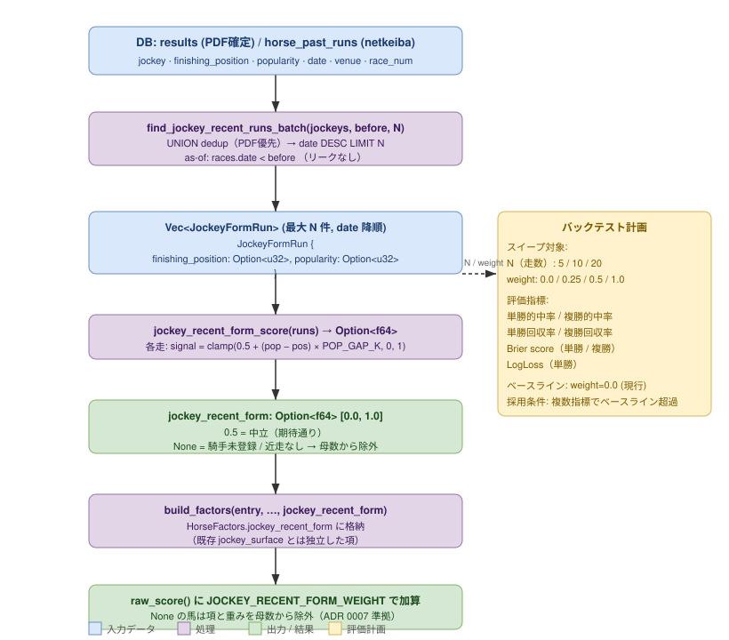

---
# knowledge 規約に基づくメタデータ（docs/knowledge/README.md）。specifications はその場で
# knowledge に昇格（ADR 履歴・相互リンクを壊さないため物理移動しない）。
status: Confirmed
kind: knowledge
doc_class: [D22, D24]
tags: [D22, D24]
updated: "2026-07-21"
---

# 騎手直近フォーム特徴量仕様書

> **結論（検証終了・Confirmed / 2026-07-21）**: 本特徴量は backtest weight スイープの結果
> **棄却された**（ADR 0038）。
> `JOCKEY_RECENT_FORM_WEIGHT = 0.0`（無効）で production は本 factor を有効化しない。
> 算出機構（`jockey_recent_form_score` / `find_jockey_recent_runs` / `jockey_recent_runs_batch`）・
> SQL・`--jockey-form-weight` CLI フラグ・`idx_horse_past_runs_jockey` インデックスは将来の再評価用に
> **残置**している。以下の設計・実装仕様は「棄却されたが weight 調整で残置」の記録として保持する。
> （旧 status: Tentative は「backtest sweep 後に ADR 0038 として棄却/採用を記録する」の未了を理由に
> していたが、その ADR は起票済みで検証は完了したため Confirmed に解消。）

Issue #221 対応。現行の `jockey_surface`（騎手の通算芝ダ別勝率）は直近の好不調を捉えられないため、
騎手の直近 N 走フォームスコアを新特徴量として追加する提案の設計仕様（**結論は上記の通り棄却・残置**）。

## 概要



`results`（PDF確定成績）と `horse_past_runs`（netkeiba近走）から当該騎手の直近 N 走を取得し、
「着順 vs 人気乖離」シグナルの平均で [0, 1] のフォームスコアを算出する。
`HorseFactors.jockey_recent_form` として `raw_score` の重み付き平均に加える。
`jockey_surface`（通算率）とは独立した項で、乗り替わり直後の絶好調騎手や不振中の騎手の識別を目的とする。

---

## 背景と課題

| 現行特徴量 | 課題 |
|-----------|------|
| `jockey_surface` | 通算芝ダ別勝率。長期平均のため直近の好不調に反応しない |

馬の `recent_form`（前走フォーム）は直近 1 走の人気乖離・着差・タイム・間隔・体重変化を
複合して [0,1] に写像し、PR #31 で有効性が確認された（ADR 0009）。
騎手版として「直近 N 走の人気乖離平均」を導入する。

---

## 変更範囲

### 1. domain (`paddock_domain`)

#### 1.1 新型: `JockeyFormRun`

```rust
// domain/src/prediction/model.rs に追加
pub struct JockeyFormRun {
    pub finishing_position: Option<u32>,
    pub popularity: Option<u32>,
}
```

着順・人気のみを持つ軽量型。`HorseResult` を流用しないのは、
タイム・体重・着差等の不要フィールドをリポジトリが取得しなくてよいようにするため。

re-export パス: `domain/src/prediction/mod.rs` に `pub use model::JockeyFormRun;` を追加 →
`domain/src/lib.rs` の既存 `pub use prediction::*;` で `paddock_domain::JockeyFormRun` として公開される。

#### 1.2 新フィールド: `HorseFactors.jockey_recent_form`

```rust
// domain/src/prediction/model.rs
pub struct HorseFactors {
    // 既存フィールド略…
    /// 騎手直近フォームスコア [0,1]（0.5=中立）。
    /// 騎手未登録・直近 N 走の全走で着順/人気が欠損（有効 signal ゼロ）は `None`（母数除外）。
    /// N 件未満でも 1 件以上有効なら `Some` を返す（信頼性は低いが母数から落とさない）。
    pub jockey_recent_form: Option<f64>,
}
```

#### 1.3 新関数: `jockey_recent_form_score`

```rust
// domain/src/prediction/scoring.rs
pub fn jockey_recent_form_score(runs: &[JockeyFormRun]) -> Option<f64> {
    let signals: Vec<f64> = runs.iter().filter_map(|r| {
        if let (Some(pop), Some(pos)) = (r.popularity, r.finishing_position) {
            let gap = pop as f64 - pos as f64; // >0: 人気以上の好走
            Some((0.5 + gap * POP_GAP_K).clamp(0.0, 1.0))
        } else {
            None
        }
    }).collect();
    if signals.is_empty() { None } else { Some(signals.iter().sum::<f64>() / signals.len() as f64) }
}
```

**None を返す条件:** `runs` 内の全走で `finishing_position` または `popularity` が欠損している場合（`signals` が空）。
1 件でも有効な (pos, pop) ペアがあれば `Some` を返す。

**`POP_GAP_K` の参照:** `scoring.rs` から `super::weights::POP_GAP_K` で参照可能（`weights.rs` で `pub(crate)` 宣言済み。可視性変更不要）。

**signal 設計の根拠:**
- 着順 vs 人気乖離（`POP_GAP_K = 0.08`）は horse の `recent_form_score` でも使用済みの有効 sub-signal
- 馬体重変化・前走間隔・着差・タイムは騎手属性でなく馬・コース属性のため N 走平均に混ぜない
- シンプルなスカラーで jockey_surface との重複寄与を最小化する

**POP_GAP_K スケールと飽和挙動:**
- 人気乖離が大きい（例: 1 番人気が 7 着: gap = -6 → signal = 0.02 → clamp 0.02）と clamp が効くが、信頼性は低い極端値なので飽和による情報量損失は許容する
- 最低人気の激走（18 番人気 1 着: gap = 17 → signal = 1.86 → clamp 1.0）も同様に上限に張り付く。これは「異常値は最大/最小スコアで表現」という意図的な設計
- `POP_GAP_K = 0.08` は馬版と同値で初期化する。騎手の人気乖離レンジは馬と同スケール（同じレースの同じ人気・着順体系）のため流用を正当とする。感度が合わない場合はバックテスト sweep で `POP_GAP_K` を独立調整することも検討できる（現状の sweep 対象外）

**既知の制約（馬の地力バイアス）:** このシグナルは「騎手が乗った馬の人気 vs 着順」を見るため、弱馬ばかり乗る騎手の評価が低く出がちになる。
逆に強馬に乗る有名騎手は市場が既に `jockey_surface` に織り込んでいるため、このシグナルは「市場の過小評価」（乗り替わり直後の勢い等）を狙う補助的な位置づけ。
バックテストで有効性が確認できれば採用、なければ weight=0.0 で無効化する。

#### 1.4 新定数: `JOCKEY_RECENT_FORM_WEIGHT`

```rust
// domain/src/prediction/weights.rs
/// 騎手直近フォーム項の重み（暫定 0.25）。backtest sweep で決定する。
pub(crate) const JOCKEY_RECENT_FORM_WEIGHT: f64 = 0.25;
```

初期値は `FORM_WEIGHT`（馬の前走フォーム）と同値の保守値。
バックテスト結果によって 0.0 に設定し無効化することも有り得る。

---

### 2. use-case repository trait

`JockeyFormRun` は **domain 側（§1.1）のみに定義する**。use-case 側はクレートの re-export (`pub use paddock_domain::prediction::JockeyFormRun`) を経由して使う。
既存の `RecentRun`（domain 型を use-case がそのまま参照）と同パターン。use-case 側に同名の struct を再定義しない。

`find_recent_runs` + `recent_runs_batch` の 2 ステップ構造と同パターン: **必須（required）** `find_jockey_recent_runs` と、それをループする **既定実装（provided）** `jockey_recent_runs_batch` を 1 つの trait に追加する。

```rust
// use-case/src/repository.rs に追加（型定義不要。domain 型を参照）
use paddock_domain::JockeyFormRun;

trait StatsRepository {
    // ─── 既存メソッド省略 ───

    // ▶ required: rdb-gateway が SQL で実装する
    fn find_jockey_recent_runs(
        &self,
        jockey: &JockeyName,
        before: NaiveDate,
        limit: u32,
    ) -> impl Future<Output = Result<Vec<JockeyFormRun>>> + Send;

    // ▶ provided: デフォルト実装（per-jockey ループ）。recent_runs_batch L561–L574 と同パターン。
    // rdb-gateway は UNION ウィンドウ SQL で override して一括取得に置き換える。
    fn jockey_recent_runs_batch(
        &self,
        jockeys: &[JockeyName],
        before: NaiveDate,
        limit: u32,
    ) -> impl Future<Output = Result<HashMap<JockeyName, Vec<JockeyFormRun>>>> + Send {
        async move {
            let mut out = HashMap::new();
            for jockey_name in jockeys {
                if out.contains_key(jockey_name) { continue; }
                out.insert(jockey_name.clone(), self.find_jockey_recent_runs(jockey_name, before, limit).await?);
            }
            Ok(out)
        }
    }
}
```

rdb-gateway のみウィンドウ関数で `jockey_recent_runs_batch` を一括 override。

---

### 3. rdb-gateway

`find_recent_runs.rs` と同様の UNION dedup クエリを騎手名フィルタで実装する。

```sql
-- 単体版（find_jockey_recent_runs、既定実装から呼ばれる）
-- 騎手名は文字列一致（JockeyName 型で正規化済み）。既存 jockey_stats_batch と同じ表記依存。
WITH unioned AS (
    SELECT races.date, races.venue, races.race_num,
           results.finishing_position, results.popularity,
           0 AS src_rank, results.race_id
    FROM results
    INNER JOIN races ON races.race_id = results.race_id
    WHERE results.jockey = $1 AND races.date < $2 AND races.source = 'pdf'
    -- results.jockey が NULL の行は = 比較で自然に除外される
    UNION ALL
    -- horse_past_runs は定義上 netkeiba 専用テーブルなので source 絞り込みは不要
    -- horse_past_runs.jockey が NULL の行も = 比較で自然に除外される
    -- horse_past_runs.race_id は PRIMARY KEY の一部として存在（baseline マイグレーション参照）
    SELECT date, venue, race_num,
           finishing_position, popularity,
           1 AS src_rank, race_id
    FROM horse_past_runs
    WHERE jockey = $1 AND date < $2
)
SELECT u.finishing_position, u.popularity
FROM unioned u
WHERE NOT EXISTS (
    SELECT 1 FROM unioned u2
    -- 単体版では $1 で騎手が 1 名固定のため jockey 条件は不要（全行同一騎手）
    -- バッチ版との対称性ではなく単体版の unioned CTE にある列だけを参照する
    WHERE u2.date = u.date AND u2.venue = u.venue AND u2.race_num = u.race_num
      AND (u2.src_rank < u.src_rank
           -- src_rank 同値 tie-break: race_id 降順（同一ソース内の決定論的序列。方向は任意だが一貫性があれば十分）
           OR (u2.src_rank = u.src_rank AND u2.race_id > u.race_id))
)
ORDER BY u.date DESC, u.race_id DESC
LIMIT $3
```

**バッチ版骨格（rdb-gateway override）:**

```sql
-- 全騎手を一括取得 (jockey_recent_runs_batch の rdb-gateway 実装)
WITH unioned AS (
    -- （単体版と同じ構造、WHERE jockey = ANY($1) に変更）
    SELECT races.date, races.venue, races.race_num,
           results.finishing_position, results.popularity,
           0 AS src_rank, results.race_id, results.jockey AS jockey
    FROM results INNER JOIN races ON races.race_id = results.race_id
    WHERE results.jockey = ANY($1) AND races.date < $2 AND races.source = 'pdf'
    UNION ALL
    SELECT date, venue, race_num,
           finishing_position, popularity,
           1 AS src_rank, race_id, jockey
    FROM horse_past_runs
    WHERE jockey = ANY($1) AND date < $2
),
-- ステージ 1: 重複除去（find_recent_runs.rs の NOT EXISTS パターンと同一）
deduped AS (
    SELECT *
    FROM unioned u
    WHERE NOT EXISTS (
        SELECT 1 FROM unioned u2
        WHERE u2.jockey = u.jockey
          AND u2.date = u.date AND u2.venue = u.venue AND u2.race_num = u.race_num
          AND (u2.src_rank < u.src_rank OR (u2.src_rank = u.src_rank AND u2.race_id > u.race_id))
    )
),
-- ステージ 2: 騎手ごとの最新 N 件に絞る（重複除去後に ROW_NUMBER を適用）
ranked AS (
    SELECT *, ROW_NUMBER() OVER (
        PARTITION BY jockey ORDER BY date DESC, race_id DESC
    ) AS rn
    FROM deduped
)
SELECT finishing_position, popularity, jockey FROM ranked WHERE rn <= $3
ORDER BY jockey, date DESC, race_id DESC
```

パターンは `recent_runs_batch`（`find_recent_runs.rs` L110–L216）を参照のこと。

---

### 4. use-case predict / backtest

#### predict.rs

既存の `try_join!(horse_stats_batch, jockey_stats_batch, trainer_stats_batch, recent_runs_batch)` の
4 タプル構造を 5 タプルに変更する。

```rust
use super::JOCKEY_RECENT_FORM_LIMIT; // mod.rs に定義された定数を参照

// try_join! の 5 番目として追加（4 タプル destructure → 5 タプルに変更が必要）
let (horse_map, jockey_map, trainer_map, runs_map, jockey_form_map) = tokio::try_join!(
    self.repository.horse_stats_batch(&horse_names, None),
    self.repository.jockey_stats_batch(&jockey_names, None),
    self.repository.trainer_stats_batch(&trainer_names, None),
    self.repository.recent_runs_batch(&horse_names, card.date, 1),
    self.repository.jockey_recent_runs_batch(&jockey_names, card.date, JOCKEY_RECENT_FORM_LIMIT),
)?;

// build_factors に渡す（entry.jockey は Option<JockeyName>。既存の jockey_map.get パターンと同一）
let jockey_recent_form = entry.jockey.as_ref()
    .and_then(|j| jockey_form_map.get(j))
    .and_then(|runs| paddock_domain::jockey_recent_form_score(runs));
```

**実装時の注意:** `try_join!` の 4→5 引数変更により以下のファイルがコンパイルエラーになる:
- `src/use-case/tests/test_predict_race.rs`（mock struct に `find_jockey_recent_runs` と `jockey_recent_runs_batch` の実装追加）
- `src/use-case/tests/test_backtest.rs`（同様）
- mock struct に `find_jockey_recent_runs` は空 Vec、`jockey_recent_runs_batch` は空 HashMap を返す既定実装を追加すること

#### backtest.rs

backtest 経路では `as_of = Some(race.date)` として `before = race.date` を渡す（予測対象レース当日以降の騎手成績を含めないリーク防止）。

**try_join! 不使用:** `backtest.rs` は `predict.rs` と異なり `try_join!` を使わず、各バッチ呼び出しを個別に `await?` する（既存の `recent_runs_batch` 呼び出しも同様）。`jockey_recent_runs_batch` も同じく個別 `await?` で追加する。

**by_date バッチ構造:** backtest.rs は全レースを日付別 BTreeMap（`by_date`）でまとめ、同一日の馬・騎手・調教師名を一括取得してからレースごとに処理する。`jockey_recent_runs_batch` も `by_date` ループ内で他のバッチと並べて呼び出す（`recent_runs_batch` の呼び出し箇所を参照）。

スイープパラメータ:

| パラメータ | 値 |
|-----------|-----|
| N（走数上限） | 5 / 10 / 20 |
| JOCKEY_RECENT_FORM_WEIGHT | 0.0 / 0.25 / 0.5 / 1.0 |

`EstimationConfig` または 定数差し替えでスイープを回す（馬の `recent_form` sweep と同パターン）。

---

### 5. 定数: `JOCKEY_RECENT_FORM_LIMIT`

```rust
// 配置先: use-case/src/interactor/race/mod.rs（predict.rs・backtest.rs 両方から参照可能な共通箇所）
// 既存の RECENT_RUNS_LIMIT は backtest.rs（L20）にのみローカル定数として存在し
// predict.rs と共有されていないアンチパターンを踏襲しない
pub(crate) const JOCKEY_RECENT_FORM_LIMIT: u32 = 10; // backtest sweep で 5 / 10 / 20 を評価後に確定
```

---

## バックテスト評価方針

### 評価期間

現行と同一: `--from 2026-03-28 --to 2026-05-31`（約 140 レース）

### 評価指標

1. 単勝的中率 / 複勝的中率
2. 単勝回収率 / 複勝回収率（curated 推奨買いベース）
3. Brier score（単勝 / 複勝）
4. LogLoss（単勝）

### 採用基準

- **複数の指標でベースライン（weight=0.0）を上回る場合** → 本番化し ADR に記録
- **改善なし・悪化** → weight=0.0 のまま棄却記録を ADR に残す

`jockey_surface` との交互作用（多重共線性）は Brier / LogLoss の変化量で間接的に観察する。

> **アブレーション（`jockey_surface` 無効化との比較）** は初回スイープの対象外とする。
> 初回 sweep で有効性が確認できた場合に必要であれば追加評価する。

---

## 実装 PR でのタスク

- [ ] `domain/src/prediction/mod.rs` に `pub use model::JockeyFormRun;` および `pub use scoring::jockey_recent_form_score;` を追加し、`domain/src/lib.rs` の `prediction` re-export で `JockeyFormRun`・`jockey_recent_form_score` が `paddock_domain::*` として参照できることを確認する
- [ ] `use-case/src/interactor/race/mod.rs` に `JOCKEY_RECENT_FORM_LIMIT` 定数を追加し、`predict.rs` と `backtest.rs` から `use super::JOCKEY_RECENT_FORM_LIMIT;` で参照できること（コンパイルで確認）
- [ ] `docs/specifications/probability-estimation.md` の `raw_score` 式一覧に `jockey_recent_form` 項を追記する
- [ ] `use-case` mock（`test_predict_race.rs` / `test_backtest.rs`）に `find_jockey_recent_runs` と `jockey_recent_runs_batch` の実装を追加する
- [ ] テストが 5 タプル destructure でコンパイルが通ることを確認する
- [ ] rdb-gateway の `jockey_recent_runs_batch` バッチ SQL に対して `EXPLAIN ANALYZE` を実行し、`deduped` CTE の `NOT EXISTS` サブクエリが想定外の重複スキャンをしていないことを確認する
- [ ] `domain/src/prediction/scoring.rs` の `jockey_recent_form_score` に対するユニットテストを追加する（境界条件: 空スライス=None / 全欠損=None / pos=pop=clamp中央値 / 最低人気激走=clamp上限 / 大人気大敗=clamp下限）
- [x] バックテスト sweep 後にメトリクスを記録し ADR 0038 として棄却または採用を記録する → **完了: ADR 0038 に棄却を記録（weight 全域で Brier/LogLoss が単調悪化・weight=0.0 が最良、1561R）**
- [ ] （任意）`JockeyFormRun.finishing_position` / `popularity` の型として `Option<NonZeroU32>` の採用を検討する（0 着順・0 人気を型レベルで弾けるが、DB の `BIGINT` からの変換コストを考慮する）
- [ ] バックテスト評価期間: 既存 sweep との比較可能性のため `2026-03-28〜2026-05-31` を基準期間とする。ただし実施時点でより多くの開催が蓄積されている場合は最新 as-of まで延ばして標本を増やしてよい（その場合は ADR に実際の評価期間を明記すること）

---

## 関連

- Issue #31（馬版前走フォーム）
- ADR 0009（FORM_WEIGHT 採用・recent_form 有効化）
- ADR 0016（recency 時間減衰棄却）
- ADR 0017（jockey_surface 専用縮約棄却。`jockey_surface` 導入の経緯・限界は ADR 0017 参照）
- ADR 0034（alpha 再調整・recency 棄却）
- ADR 0035（recent_form_weight 再調整棄却, #217）
- ADR 0036（直近 N 走トレンド加重平均棄却, #220）
- ADR 0037（place/show・exotic 市場オッズブレンド棄却）
- ADR 0038（**棄却済み**・backtest sweep で騎手直近フォームを棄却＝`JOCKEY_RECENT_FORM_WEIGHT = 0.0`）

---

## 決定ログ

<!-- この節は append-only です。既存エントリの変更・削除は CI が検出します。 -->

### ADR 0009: 確率推定に前走フォーム特徴量を追加 (Issue #31) (2026-06-08) — 承認済み

#### コンテキスト
確率推定 (`paddock_domain::prediction`, ADR 0002/0007) は course枠 / 馬芝ダ / 馬距離 / 騎手芝ダ の
4 要素の重み付き平均のみで、`results` に取り込み済みの **馬体重変化・前走人気・前走日付** が未活用
だった。これらを予想に取り込み精度向上を狙う（#31）。効果は #30 のバックテストで検証する。

設計上の論点:
- 既存モデルは win/place/show の**レート**（`RateTriple`）の加重平均。一方、馬体重変化・前走人気乖離・
  前走間隔は**スカラー特徴量**で、レート構造に直接は乗らない。
- 「前走」は集計統計（horse_stats）ではなく、**直近 1 走**のプロパティ。新しいデータ取得経路が要る。

#### 決定

1. **3 信号を 1 つの「前走フォーム」スコア `recent_form ∈ [0,1]`（0.5=中立）に統合**する
   （ユーザー承認）。信号ごとに別重みを持たせるより、マジックナンバーと過学習リスクを抑える。
   - 馬体重変化: `1 - min(1, |Δkg| / 20)`（安定＝良）。
   - 前走人気乖離: `clamp(0.5 + (人気順位 − 着順)·0.08, 0, 1)`（人気以上に好走で加点）。
   - 前走間隔: 中2週〜2ヶ月を最適(1.0)、連闘/長休を逓減する台形。
   - 前走着差（#76 で追加）: 馬身換算した着差を `MARGIN_CAP_LENGTHS`(=5.0) でクランプし、勝ち（1着）は
     `0.5 + 0.5·mag`（圧勝ほど高い）、負けは `0.5 − 0.5·mag`（大敗ほど低い）。着差文字列はキーワード
     （ハナ/アタマ/クビ/大差/同着）・分数（`1.1/4` 等）・小数（netkeiba 形式）を吸収。着順なし・解釈不能は
     sub-signal を落とす。負け馬の着差は直前馬との局所差を流用する割り切り（heuristic）で、寄与は backtest 判定。
   - 利用できる sub-signal の平均。全欠損なら `None`。`recent_form_score` を domain の純粋関数として実装。

2. **`HorseFactors` にスカラー項 `recent_form: Option<f64>` を追加**し、`raw_score` の重み付き平均に
   単一の重み `FORM_WEIGHT` で組み込む（win/place/show に同値で寄与）。前走なし馬は項と重みを母数から
   除外（ADR 0007 の騎手なしと同じ流儀＝減点しない）。

3. **直近 1 走の取得に `Repository::find_recent_runs(name, before, limit)` を新設**する。
   `races.date < before` でバックテスト時のリークを防ぐ（predict は出馬表日、backtest はレース日が cutoff）。
   pdf/netkeiba 双方の成績を対象とする（実際の前走を取りたい）。

4. **`FORM_WEIGHT = 0.25` をバックテストで決定**する（下記）。

##### バックテストによる重み検証（2026-03-28〜05-31, 144 レース）

| FORM_WEIGHT | 単勝 | 連対 | 複勝 | 回収率 | Brier | LogLoss |
|---|---|---|---|---|---|---|
| 0.0 (無効) | 12.5% | 18.8% | 27.1% | 47.8% | 0.0695 | 0.8251 |
| **0.25 (採用)** | 12.5% | **19.4%** | **28.5%** | **48.9%** | 0.0683 | 0.8506 |
| 0.5 | 12.5% | 19.4% | 27.8% | 48.9% | 0.0681 | 0.8506 |
| 1.0 | 11.1% | 17.4% | 25.7% | 45.4% | 0.0683 | 0.8522 |

小さい重み（0.25）で連対 +0.6・複勝 +1.4 ポイント、回収率 +1.1 ポイント、Brier が改善。大きい重み（1.0）は
逆に的中率を下げる。過学習回避のため最小限の効果的な重み 0.25 を採用する。

#### 理由
- 単一フォームスコアへの統合は、レート構造に馴染まないスカラー特徴量を 1 箇所に閉じ込め、重みを 1 つに
  絞れる。データ量が限られる現状で信号ごとの重みを学習させるのは過学習を招く。
- `Option` で前走なし馬を母数から除外する方式は ADR 0007 の前例（騎手なし）と一貫し、欠損で不当な減点を
  生まない。
- `find_recent_runs` に `before` カットオフを持たせることで、predict（出馬表日）と backtest（レース日）の
  両方で「その時点で得られる前走のみ」を使い、#30 の walk-forward リーク防止と整合する。

#### 影響
- バックテストの連対/複勝的中率・回収率・Brier が改善（LogLoss はわずかに悪化）。LogLoss 悪化は、フォームが
  一部のレースで確信度の高い誤予測を生むため。rank 系指標（的中率・Brier）は改善するため、買い目用途では
  正味プラスと判断する。
- 前走情報が DB に無い馬（取り込み済み成績が乏しい）は `recent_form = None` となり従来どおりの予想になる
  （副作用なし）。本データセットでは前走を持つ馬が限られるため効果は限定的。
- 単調性 (`win ≤ place ≤ show`, ADR 0007) は保持される（フォームは正規化前のスコアを底上げ/押し下げる
  だけで、累積 max 単調化には影響しない）。

#### 追補: 前走タイム（相対速度）sub-signal（#76, 2026-06-15）

`recent_form` に 5 つ目の sub-signal「前走タイムの相対速度」を追加した。前走タイム `time_seconds`
単体は距離に依存して比較できないため、**前走の (surface, distance) に対するコーパス標準タイム**を
分母に取り、`dev = (standard − prev) / standard` を `TIME_DEV_CAP`(=0.05, ±5%) で飽和させて
`[0,1]`（0.5=中立）に写像する（`time_form`）。標準より速い前走を加点・遅い前走を減点する。

設計上の決定:
- **基準タイムはコーパス由来**（`Repository::standard_times`）。`results`＋`horse_past_runs` を UNION し、
  完走（`time_seconds > 0`、NULL と 0 秒の異常値を除外）の平均を (surface, distance) 別に集計する。`date < before` の
  as-of カットオフで walk-forward のリークを防ぐ（horse_stats と同じ流儀）。標本数が閾値（5）未満の
  薄いバケツは除外し、該当前走の sub-signal は落とす（欠落フォールバック）。median は SQLite に無いため
  v1 は AVG を採用。
- **馬場差は v1 ではプールして無視**する（surface×distance のみで集計）。標本確保を優先する割り切りで、
  馬場ノイズは母集団平均で部分的に相殺される。backtest で馬場バイアスが疑われれば再検討する。
- 統合は既存方針どおり `recent_form` の sub-signal 平均に畳み込み、重みは単一 `FORM_WEIGHT` のまま
  （信号別重みを増やさず過学習を避ける）。前走 `find_recent_runs` は (surface, distance) を運ぶよう拡張した。

##### バックテストによる効果検証（2026-03-28〜05-31, 144R / main との before/after）

| 指標 | main（タイムなし） | 本実装（タイムあり） |
|---|---|---|
| 単勝的中 | 9.7% | 9.7% |
| 連対的中 | 17.4% | 17.4% |
| 複勝的中 | 29.2% | **29.9%** |
| 想定回収率 | 44.2% | 44.2% |
| 単勝 Brier | 0.0651 | **0.0650** |
| 単勝 LogLoss | 0.3147 | **0.3144** |
| 連対 LogLoss | 0.4650 | 0.4648 |
| 複勝 LogLoss | 0.5491 | 0.5490 |

複勝的中 +0.7pt、単勝/連対/複勝の Brier・LogLoss がいずれも微改善し、悪化した指標は無い。ADR 0009 の
採用基準（rank 系が改善すれば採用）を満たすため**採用**する。効果が小さいのは、当該データセットで過去走に
タイムを持つ馬（特に netkeiba 履歴）が限られ sub-signal が実効で立つ馬が少ないためで、`recent_form` の
margin と同じ制約。netkeiba 近走の取り込みが進めば寄与は拡大する見込み。`TIME_DEV_CAP` は暫定値で、
データ量が増えた段階で再スイープする。

#### 追補: 斤量（レース内相対）factor（#135, 2026-06-15）

未活用だった **斤量（`weight_carried`/負担重量）** を確率推定へ組み込む（#76 の続き）。斤量は「前走の
属性」ではなく「当該レースで各馬が背負う重量」なので、`recent_form` のサブシグナルではなく **レース内で
相対化した独立 factor**（`HorseFactors.weight_carried`、専用重み `WEIGHT_CARRIED_WEIGHT`）として追加した。

設計上の決定:
- **レース内相対**: field 平均斤量との kg 差を `WEIGHT_CARRIED_CAP_KG`(=3kg) で飽和させ `[0,1]`（0.5=中立）
  に写像（`weight_factor`）。field 平均は全馬共通なので `RaceContext.mean_weight` に持たせ、predict/backtest が
  ループ外で 1 回計算して渡す。当該馬の斤量・field 平均のどちらかが無ければ項なし（欠落フォールバック）。
- **データ経路**: 出馬表 `HorseEntry`/`horse_entries` に斤量が無かったため #74（trainer）と同型で netkeiba
  出馬表のみ斤量を抽出（`td.Barei + td`）。PDF 出馬表は `None`（項なし）。backtest は `results.weight_carried`
  を持つ出走馬から field 平均を取る（斤量欠落の馬は母数から除外）。
- **符号は backtest で決定**: 当初仮説「重い＝負担大で減点」と逆符号「重い＝加点」を両方試した。

##### バックテストによる符号・寄与の決定（2026-03-28〜05-31, 144R / main との before/after）

| 指標 | main | 重い→減点 | 重い→加点（採用） |
|---|---|---|---|
| 単勝的中 | 9.7% | 8.3% | **10.4%** |
| 連対的中 | 17.4% | 16.7% | **21.5%** |
| 複勝的中 | 29.9% | 28.5% | **34.0%** |
| 想定回収率 | 44.2% | 45.9% | **51.0%** |
| 単勝 Brier | 0.0650 | 0.0644 | **0.0639** |
| 単勝 LogLoss | 0.3144 | 0.2510 | **0.2486** |

「重い→減点」は的中率を下げた（不採用）。「重い→加点」は的中率・回収率・Brier・LogLoss を全面的に改善
（連対/複勝 +4.1pt、回収 +6.8pt、単勝 LogLoss 0.3144→0.2486）したため **重い→加点・重み 0.25 を採用**。
別定/ハンデで実績馬ほど重い斤量を課される選択効果が「負担で遅くなる」効果を上回るためと解釈する。斤量は
発走前に確定する情報でリークは無い（予想時に既知）。重みは保守的に 0.25（recent_form と同値）とし、データ
増で再スイープする。

#### 関連
- ADR 0002（着順確率推定モデル, #11）/ ADR 0007（単調性・騎手是正, #32）— 本 ADR が拡張
- ADR 0006（バックテスト評価基盤, #30）— 重み検証に使用
- 設計書 `docs/specifications/probability-estimation.md`

### ADR 0016: 少データ馬のベイズ縮約と直近成績のリーセンシー重み付け (Issue #75) (2026-06-13) — 承認済み

#### コンテキスト
確率推定（`src/domain/src/prediction/mod.rs`）は horse/jockey/trainer/course の各 factor を
**全期間一律集計のレート**で重み付け平均している。これが 2 つの弱点を生む:

1. **少データ馬の極端化**: 新馬・復帰馬は当該 factor の実績が乏しく、レートが極端になりやすい。
   実績ゼロの factor は母数除外（ADR 0014/#81）されるため、全 factor が薄い馬は `raw_score=0`→
   `win_prob=0` で実質除外される（ADR 0002 の既知制約）。
2. **直近の好不調の希薄化**: 古い成績と直近成績が同じ重みで平均され、最近の調子が反映されにくい。

ベイズ縮約（shrinkage）と直近重視（recency）でこれらを緩和できないかを検証する。パラメータ
（擬似カウント m・半減期）は backtest（ADR 0006 / #52 の Brier・LogLoss・的中率）で決め、
walk-forward の `as_of` リーク防止を厳守する。

#### 決定

##### 共通基盤: 切替可能な `EstimationConfig`
domain に `EstimationConfig { shrinkage: Option<..>, recency: Option<..> }` を導入し、
`estimate_probabilities_with_config` で挙動を切り替える。`estimate_probabilities`（既存）は
`Default`（両 None＝現行挙動）へ委譲し挙動不変。`analyze backtest` に `--shrinkage-m` /
`--recency-half-life` を追加し before/after を比較可能にした。

##### Phase A: ベイズ縮約（採用, m=10）
各 factor のレートを母集団 prior へ `smoothed = (k·rate + m·prior)/(k + m)`（k=出走数, m=擬似
カウント）で縮約する。prior は出走頭数 ~14 由来の解析的な基準率（win=1/14, place=2/14,
show=3/14）でクエリ不要・リークなし。`HorseFactors` の 6 group factor を `Option<RateTriple>`→
`Option<FactorStat>`（レート + 出走数）へ拡張し、`raw_score` が縮約を適用する。

backtest（2026-03-28〜05-31 / 144R, ADR 0014 後ロジック）で m∈{off,5,10,20,50} を比較:

| m | 単勝的中 | 単勝Brier | 単勝LogLoss | 連対LogLoss | 複勝Brier |
|---|---|---|---|---|---|
| off | 9.7% | 0.0665 | 0.2718 | 0.4351 | 0.1626 |
| 5 | 12.5% | 0.0650 | 0.2509 | 0.3963 | **0.1601** |
| **10** | 13.2% | **0.0649** | **0.2506** | **0.3963** | 0.1605 |
| 20 | 13.9% | 0.0649 | 0.2508 | 0.3975 | 0.1612 |
| 50 | 11.8% | 0.0651 | 0.2516 | 0.3995 | 0.1623 |

m=10 が単勝 Brier・LogLoss・連対で最良、複勝も近接で、単勝的中も 9.7→13.2% と改善。m=50 は
過縮約で劣化。m=20 は的中・回収率が僅かに高いが校正は m=10 が上で、小標本での過適合を避け
**m=10 を採用**し、predict 本番のデフォルト（`EstimationConfig::production()`）に反映した。

##### Phase B: リーセンシー重み付け（実装・評価のみ、デフォルト無効）
馬の芝ダ・距離帯・馬場状態 factor を、日付付き成績系列に時間減衰 `w = 0.5^(days_ago/half_life)`
を掛けた重み付きレートで評価できるようにした（domain `apply_recency_weight`、gateway の
`races.date` 別集計 `horse_recency`）。

backtest（m=10 固定 / 同 144R）で half-life∈{off,30,60,90,180} を比較:

| half-life | 単勝的中 | 単勝Brier | 単勝LogLoss | 複勝Brier |
|---|---|---|---|---|
| **off** | **13.2%** | 0.0649 | **0.2506** | **0.1605** |
| 30 | 12.5% | 0.0649 | 0.2507 | 0.1606 |
| 60/90 | 12.5% | 0.0649 | 0.2507 | 0.1606 |
| 180 | 13.2% | 0.0649 | 0.2506 | 0.1605 |

recency は校正・的中とも改善せず（4 桁目の変動）、短半減期はむしろ的中を下げた。

併用時の `apply_recency_weight` は縮約の信頼度 `k` に減衰前の素の出走数を使う非対称があるため、
この非対称が recency の効果を相殺していないかを確認すべく **shrinkage off の単独 recency** でも
スイープした（baseline=no-shrink/no-recency: 単勝 Brier 0.0665 / LogLoss 0.2718）:

| 設定 | 単勝Brier | 単勝LogLoss | 複勝Brier |
|---|---|---|---|
| 単独 baseline | 0.0665 | 0.2718 | 0.1626 |
| recency h=30 | 0.0666 | 0.2725 | 0.1631 |
| recency h=60 | 0.0665 | 0.2722 | 0.1630 |

単独でも改善せずむしろ僅かに悪化し、無改善は縮約の非対称の人工物ではないと確認できた。よって
**本番では recency を無効のまま**とし（`config.recency=None`、horse_recency も取得しないため
predict の追加コストはゼロ）、機構と CLI フラグのみ残す。

#### 理由
- **縮約**: 「実績なし＝母数除外」（ADR 0014）の次の課題＝「実績が薄い factor の過信」を、原理的
  （ベイズ平滑化）に補正する。少データ馬を prior 方向へ持ち上げ `win_prob=0`（ADR 0002）を緩和
  しつつ、十分なデータの馬は生レートを保つ。backtest が校正・的中の一貫改善を示し裏付けた。
- **recency 無効**: 前走フォーム（#31, ADR 0009）が既に直近の調子を捕捉しており、馬のカテゴリ別
  出走数が疎なため時間減衰がノイズ化して改善が出ない、と解釈できる。原理的に有望でも実測で
  効果が無いものはデフォルト化しない（[[measurement-ordering]]＝挙動変更を計測で決める方針）。
  より密な jockey/trainer 信号やデータ蓄積後の再評価に向けて機構は残す。
- prior は解析的基準率で十分（クエリ不要・リークなし）。将来 results 全体の実測ベースレートへ
  差し替え可能。

#### 影響
- `HorseFactors` の 6 group factor が `Option<RateTriple>`→`Option<FactorStat>`（レート+出走数）。
  predict・backtest は同じ `build_factors`/`estimate_probabilities_with_config` を共有し両経路に
  一律反映。単調性 `win ≤ place ≤ show`（ADR 0007）・市場ブレンド（#72）の挙動は不変。
- predict 本番は縮約 m=10 を既定で有効化（少データ馬の win_prob が 0→正値へ緩和）。
- Repository に `horse_recency`（既定実装は空でモック不変）と `RecencySeries`/`HorseRecencyStats`
  を追加。rdb-gateway に `races.date` 別集計クエリを実装。DB・マイグレーション変更なし。
- `analyze backtest` に `--shrinkage-m` / `--recency-half-life` を追加（パラメータスイープ用）。

#### 関連
- ADR 0002（スタッツ希薄→`win_prob=0`）/ ADR 0014（None 母数除外）/ ADR 0007（単調性・欠落項除外）
- ADR 0006（バックテスト評価基盤）/ #52（校正指標）/ #31・ADR 0009（前走フォーム）/ #72（市場ブレンド）
- 設計書 `docs/specifications/probability-estimation.md`

### ADR 0017: 騎手 factor 専用ベイズ縮約の評価と見送り (Issue #105) (2026-06-14) — 承認済み

#### ステータス

承認済み（採用見送り＝現行維持）

#### コンテキスト
予想モデル（`src/domain/src/prediction/mod.rs`）が騎手 factor の小サンプル勝率を過信し、ノイジーな
本命を作る懸念が報告された。具体例: 2026-04-19 中山7R で ◎に推した馬の根拠が、騎手の
**4勝/23騎乗（17%）という小サンプル勝率**だった（#103 検証時に観測）。現行のベイズ縮約（ADR 0016）は
**全 factor 共通の m=10**（`shrink_rate`）で、23騎乗だと実効 13〜14% が残り抑制しきれない。

そこで「騎手 factor だけより強い縮約（大きい m）を掛ければ過信が減るか」を、#105 の方針
「backtest で改善有無を評価してから採否を決める／効果が無ければ採用しない」に従って検証した。
前提として #103（馬個体の過去走データ経路）はマージ済みで、issue も「#103 後は馬個体データが
入り騎手依存自体が下がる」と予想していた。

#### 決定
**騎手専用の強い縮約は採用しない。** 全 factor 共通 m=10（ADR 0016）を維持する。
評価用に入れた騎手専用 m の機構（`ShrinkageConfig.jockey_pseudo_count`）と CLI フラグ
（`analyze backtest --shrinkage-m-jockey`）は**コードに残さず revert** した（dead config を増やさない。
再評価が必要なら本 ADR の手順で再実装する）。`raw_score` の騎手分岐に本 ADR を指すコメントを残す。

#### 評価（backtest, 2026-03-28〜05-31 / 144R, `--blend-alpha 0.3`, `--shrinkage-m 10` 固定）
騎手 factor だけ縮約 m を `jockey_pseudo_count ∈ {20,30,50}` に上げてスイープし、ベースライン
（全 factor m=10）と比較した:

| 騎手 m | 単勝Brier | 単勝LogLoss | 単勝的中 | 回収率 | 1番人気Brier | 1番人気LogLoss |
|---|---|---|---|---|---|---|
| **10 (baseline)** | **0.0546** | **0.1979** | 32.6% | 73.8% | **0.1439** | **0.4365** |
| 20 | 0.0546 | 0.1979 | 32.6% | 73.8% | 0.1440 | 0.4370 |
| 30 | 0.0547 | 0.1979 | 32.6% | 73.8% | 0.1441 | 0.4372 |
| 50 | 0.0547 | 0.1979 | 32.6% | 73.8% | 0.1442 | 0.4374 |

単勝 Brier/LogLoss は **4 桁目で単調に微悪化**、単勝的中率・回収率は完全に不変。人気帯別の校正でも
**1番人気は既に良好（予測 20.1% vs 実測 20.7%）** で、強い縮約はそこをわずかに悪化させるだけだった。

> 注: 本表の baseline 値（単勝 Brier 0.0546 等）は `--blend-alpha 0.3`（市場オッズ blend 有）での値。
> ADR 0016 の m=10 baseline（Brier 0.0649）は blend 無の素 score なので直接は一致しない（条件差）。

#### 理由
- **集約指標で改善が出ない**: 騎手 factor は重み付き平均（~7 項）の重み 1.0 にすぎず、強く縮約しても
  最終確率をほとんど動かさない。母集団 144R の集約指標（Brier/LogLoss・人気帯校正）で見ると本命
  （1番人気）の過信は系統的には検出されず、「ノイジーな本命」は単一レースの逸話であって population
  レベルのミス校正ではなかった（個別レースの過信が集約で均されている可能性は否定しないが、それを
  抑える専用縮約が集約指標を悪化させるなら本番採用の利得はない）。
- **#103 の効果**: 馬個体の過去走データが入ったことで騎手依存自体が下がり、issue の予想どおり
  騎手過信の余地が縮んでいた可能性が高い。
- **方針**: 原理的に妥当でも実測で効果が無いものはデフォルト化しない（[[measurement-ordering]]）。
  ADR 0016 の recency 見送りと同じ判断。#105 の「効果が無ければ採用しない」に従う。

#### 影響
- コード・挙動の変更なし（評価用の機構・フラグは revert 済み）。本番 predict は引き続き全 factor
  共通 m=10。
- 知見の保存: 「騎手過信は集約指標では問題化せず、専用縮約は無効」を本 ADR に記録。将来
  データ蓄積後に再評価する場合は、`ShrinkageConfig` に騎手専用 m（`jockey_pseudo_count`）を足し
  `analyze backtest --shrinkage-m-jockey` でスイープする（本 ADR の表を baseline とする）。

#### 関連
- ADR 0016（ベイズ縮約 m=10 / recency 見送り）/ ADR 0006（バックテスト評価基盤）/ #52（校正指標）
- #103（馬個体の過去走データ経路）/ #113（馬場別セグメント backtest）
- 設計書 `docs/specifications/probability-estimation.md`

### ADR 0035: recent_form_weight 再チューニング — 棄却 (2026-06-24) — 棄却

#### ステータス

棄却（現行 FORM_WEIGHT = 0.25 を維持）

#### コンテキスト

`raw_score` における `recent_form` 項の重みは `FORM_WEIGHT = 0.25`（`weights.rs`）として #76 以前から固定されていた。
#76 で着差・タイム偏差のサブシグナルが追加されたため仕様書に「重みは再評価待ち」と注記された。#217 でその評価を実施した。

#### 決定

`FORM_WEIGHT = 0.25` を変更しない。`--recent-form-weight` オプション（`EstimationConfig.recent_form_weight`）は sweep 用途として実装を維持し、本番デフォルトは `None`（= 0.25）のまま。

#### 実験条件

- 期間: 2025-01-05 〜 2026-06-14（4891R）
- 固定パラメータ: `--blend-alpha 0.2 --shrinkage-m 10`（ADR 0034 の本番設定）
- sweep: w ∈ {0.0, 0.1, 0.2, 0.25, 0.3, 0.4, 0.5}

#### 結果

本実験は #220（recent_form の N=1〜3 トレンド化）以前に実施したもので、`recent_form` は N=1（前走 1 走）スカラー。
単勝/連対/複勝の校正指標（Brier / LogLoss）と単勝シミュレーション（的中率 / 想定回収率）:

| w | 単勝的中率 | 想定回収率 | 単勝 Brier | 単勝 LogLoss | 連対 LogLoss | 複勝 LogLoss |
|---|---|---|---|---|---|---|
| 0.00 | 31.3% | 75.5% | 0.0544 | 0.1974 | 0.3707 | 0.4840 |
| 0.10 | 31.2% | 75.4% | 0.0544 | 0.1974 | **0.3675** | **0.4784** |
| 0.20 | 31.2% | 75.3% | 0.0544 | 0.1974 | 0.3676 | 0.4786 |
| **0.25**（現行） | 31.2% | 75.3% | 0.0544 | 0.1974 | 0.3676 | 0.4787 |
| 0.30 | 31.2% | 75.3% | 0.0544 | 0.1974 | 0.3677 | 0.4788 |
| 0.40 | 31.2% | 75.5% | 0.0544 | 0.1974 | 0.3678 | 0.4790 |
| 0.50 | 31.3% | 75.6% | 0.0544 | 0.1974 | 0.3680 | 0.4792 |

配線健全性の sanity check（極端値 w=20.0）: 単勝 Brier 0.0544→0.0545、連対 Brier 0.1080→0.1095、複勝 Brier 0.1516→0.1549 と悪化方向に動く。`--recent-form-weight` が backtest の scoring 経路に正しく反映されることを確認済み（単勝指標が現実的な範囲で 4 桁一致するのは無効化ではなく効果が解像度以下であることを示す）。

#### 理由

2 点が読み取れる:

1. **recent_form は寄与している（残すべき）**: w=0.0（recent_form 完全除去）は連対 LogLoss 0.3707・複勝 LogLoss 0.4840 と、いかなる正の重みより明確に悪い。前走フォーム項を落とすと連対・複勝の校正が劣化する。
2. **正の範囲では重みの最適は極めて浅い**: w=0.1 が連対/複勝 LogLoss で僅差最良（0.3675 / 0.4784）だが、現行 0.25 との差は 0.0001〜0.0003 にとどまる。単勝 Brier/LogLoss は全パターン 4 桁一致、的中率・回収率の差も 0〜0.1%。

w=0.1 への変更は理論上のごく僅かな改善にすぎず、4891R という単一サンプルへの過剰適合リスクを上回る根拠がない。市場ブレンド（α=0.2）と縮約（m=10）が最終確率を支配するため、`raw_score` 内の 1 項の重み変化は集計指標にほとんど現れない。したがって現行 `FORM_WEIGHT = 0.25` を維持する。

#### 影響

- `FORM_WEIGHT = 0.25` を継続。`weights.rs` の「再評価待ち」注記を削除。
- `EstimationConfig.recent_form_weight` フィールドと `--recent-form-weight` CLI オプションは将来の実験用に残す。
- 仕様書（`probability-estimation.md`）の pending 注記をクローズ済みに更新する。

### ADR 0036: 直近 N 走トレンド加重平均の棄却 (2026-06-25) — 棄却

#### コンテキスト

`recent_form` は直近 1 走のスカラースコア [0,1] のみを使用していた（#220）。
連続好走・連続凡走のトレンドシグナルを拾えるか検証するため、
直近 N 走の加重平均（重み [1.0, 0.5, 0.25]）へ拡張し、
N=1/2/3 でバックテストスイープを実施した。

#### 決定

trend_n を 1（前走のみ）のまま維持する。`EstimationConfig::production()` は変更しない。

#### バックテスト結果（2026-03-01〜2026-05-31, m=10, 893R）

| N | 単勝的中率 | 連対的中率 | 複勝的中率 | 想定回収率 | 単勝 Brier | 単勝 LogLoss |
|---|---|---|---|---|---|---|
| 1（baseline） | 13.5% | 26.4% | 37.2% | 68.4% | 0.0612 | 0.2375 |
| 2 | 13.2% | 25.9% | 36.2% | 67.9% | 0.0612 | 0.2376 |
| 3 | 13.0% | 25.5% | 35.8% | 66.5% | 0.0612 | 0.2376 |

#### 理由

N を増やすほど全指標が単調に悪化した。
Brier/LogLoss は N=1/2/3 でほぼ同値（4 桁目以降）のため
確率校正への影響は軽微だが、的中率・想定回収率は 0.3〜1.9 ポイント低下する。

過去走が増えると古い走が雑音として働き、直前フォームの鮮度が希釈されると考えられる。
N=1（最新 1 走のみ）が最もシグナル強度を保てる。

また `before` を N 走すべての cutoff として渡す設計上、古い走ほど「cutoff との日数差」が
大きくなるため間隔シグナルが低下する（設計上の二重減衰: TREND_WEIGHTS の指数的減衰に加えて
interval 信号も小さくなる）。この二重減衰が古い走のノイズ寄与をさらに増幅させた可能性がある。

#### 影響

- `EstimationConfig::production()` は trend_n = 1 のまま
- `--trend-n` CLI フラグは `paddock-analyze backtest` サブコマンド専用フラグとして実装済みのまま残す
  （`paddock-predict` は常に `production()` を使用するため `--trend-n` は不要）
- `production()` のコメント「#220 backtest 後に更新予定」を「棄却（ADR-0036）」に差し替える

### ADR 0037: place/show・exotic の市場オッズブレンドを本番化しない（バックテストで棄却） (2026-06-25) — 承認済み

#### コンテキスト
確率推定の市場ブレンド（#72）は **単勝（win）のみ**で、複勝系（place/show）と exotic（馬連/馬単/三連複）の
確率は市場で校正されていない（`blend_with_market_win`, `src/domain/src/prediction/estimate.rs`）。買い目予算の
大半が複勝系・exotic に乗るため、ここが精度ボトルネックではないかという仮説で #194 を起票した。

#196（backtest 高速化, PR #203）で backtest が高速化（同 issue のベンチ母数 450R で約46分→4分）し
スイープが現実的になったため、以下を**実装して計測した**（measurement ordering 準拠: 挙動変更 →
before/after 計測）。なお 450R は #196 のベンチ母数で、本 ADR の評価窓（後述の 165R / 71R）とは別物。

- **Phase 1（place/show ブレンド）**: `show`（複勝＝3着以内）を JRA 複勝オッズの implied 確率（pool の
  overround 除去後、場内合計 3.0 へ正規化）と α ブレンドし、`place`（2着以内）は対応する単独市場オッズが
  JRA に無いため `[win, show]` にクランプして単調性（win ≤ place ≤ show）を保つ設計。win ブレンドは不変。
- **Phase 2（exotic ブレンド）**: `select_bets` の Harville 合成確率（馬連/馬単/三連複/三連単）を、各券種
  オッズの market implied（pool overround 正規化）と独立した `exotic_alpha` でブレンド。

##### 計測条件
- 窓: **2026-05-30〜06-14**。評価 165R。**市場オッズ（複勝/馬連/三連複）が DB に揃うのは直近 71R のみ**
  （`race_odds` スナップショットの取得範囲）。よって place/show・exotic ブレンドが効くのはこの 71R 部分集合で、
  全165R対象の校正指標は希釈されて出る。
- DB: docker `paddock-postgres`（PG17, 2025-01〜2026-06, 4891R）。win/show 同一 α=0.3（本番設定）固定で
  exotic_alpha をスイープ。

#### 決定
1. **place/show の市場ブレンドを本番化しない。** 校正は微改善するが、複勝買い目の回収率が悪化し、純益方向の
   裏付けが取れない。
2. **exotic の市場ブレンドを本番化しない。** どの `exotic_alpha` でも exotic 的中率は 0% のまま改善せず、
   かつ本番経路（`build_portfolio`）に届かない（後述）。
3. 実装コードは本体に残さない（棄却）。本 ADR に計測結果を自己完結で記録する。#194 はクローズ。
   **#195（recency 採否・win 側 α/m 再チューニング）は別タスクとして残す**（対象が異なる）。

##### Phase 1（place/show）計測: 校正は微改善・複勝買い目は悪化
α=0.3 固定、165R 評価（うち市場オッズ 71R）。

| 指標 | baseline | Phase1 適用 | 差 |
|---|---|---|---|
| 単勝 Brier / LogLoss | 0.0534 / 0.1933 | 0.0534 / 0.1933 | ±0（win 不変） |
| 連対 Brier / LogLoss | 0.1053 / 0.3538 | 0.1049 / 0.3516 | 微改善 |
| 複勝 Brier / LogLoss | 0.1429 / 0.4497 | 0.1398 / 0.4406 | 改善（最大） |
| 複勝買い目 回収率（show 起点） | 79.9%（236点・的中10.2%） | **49.6%**（174点・的中8.0%） | **悪化** |

※ 「複勝買い目」は複勝券（的中＝3着以内）で、採用確率は show_prob。Phase 1 のブレンドは show_prob を直接動かすため、複勝買い目の EV 判定が変わる。
※ 校正（Brier/LogLoss）は全165R 評価。複勝買い目の点数（236/174点）は市場オッズのある 71R の curated 推奨が母集合（show ブレンドは複勝オッズのある 71R でしか効かない）。

- show を複勝オッズで下方修正した結果、校正（Brier/LogLoss）は改善（model の show 過大評価が縮む。複勝
  reliability: 予測19.7%→12.3% に対し実測10.2%→8.0%、ギャップ縮小）。
- 一方で curated 複勝買い目の回収率は 79.9%→49.6% に悪化。show_prob を下げたことで EV 通過する複勝点が
  減り、結果的に当たり筋も削れた疑い。**校正という狙いは達成するが、その先の買い目収益は悪化**。

##### Phase 2（exotic）計測: α 全域で改善ゼロ
win/show α=0.3 固定、exotic_alpha をスイープ（71R, curated exotic）。

| exotic_alpha | quinella | exacta | trio | 的中率/回収率 |
|---|---|---|---|---|
| なし（従来 Harville） | 66点 | 15点 | 30点 | **全 0% / 0%** |
| 0.5 | 4点 | — | 2点 | 全 0% / 0% |
| 0.7 | 20点 | 5点 | 11点 | 全 0% / 0% |
| 0.9 | 46点 | 11点 | 22点 | 全 0% / 0% |

※ 馬単（exacta）/三連単（trifecta）も blend 対象だが、本設定（win/show α=0.3, `BettingConfig::default()`）では三連単は EV 閾値（`trifecta_ev_threshold=2.0`）を全 α で 1 点も通らず 0 点のため列を割愛。馬単も α=0.5 では 0 点で「—」。
※ 回収率は全行 0%（的中ゼロ＝払戻なし。backtest バイナリの生出力は浮動小数の負ゼロで `-0.0%` と表示されるが値は 0%）。
※ 「なし」=従来 Harville（市場フィルタ無し）の素の点数で、点数列の最多（quinella 66 点）。スイープ域を「なし→0.5→0.7→0.9」で見ると点数は谷型（quinella: 66→4→20→46）で exotic_alpha に対し単調でない（α=0.5 が最少。0.5/0.7/0.9 の範囲内だけなら単調増）。市場重みが増えるほど long-shot 組が EV 閾値（ev>1.0）を割って落ちるが、curation（券種別上限・min_kelly）との相互作用で閾値割れの量は α に厳密単調でないため。いずれにせよ全 α で的中 0%。

- **どの α でも exotic 的中率 0.0%・回収率 0%**。市場ブレンドは推奨点数を変える（市場重みが増えるほど
  long-shot 組が EV 閾値を割って減る）だけで、Harville が外す組合せを当たりに変えることはできず、
  **フィルタとしてしか働かない**。市場 implied へ寄せても勝てる exotic を生まない。
- **本番未到達**: `select_bets` は backtest 専用。本番 predict / `recommend_bets` は `build_portfolio` →
  `simulate` を使い、exotic の的中確率は win_prob から `simulate` 内で導出される。市場 exotic オッズは
  払戻倍率としてしか参照されない。よって Phase 2 を `select_bets` に入れても本番の買い目は一切変わらない。

#### 理由
- **Phase 1**: #194 の主目的（複勝系の校正）は達成できるが、買い目予算が乗る複勝の回収率が悪化したため
  「校正は良くなったが負けは増える」という本末転倒になる。校正改善も 71R では小さく、薄サンプルの
  楽観アーティファクトを割り引くと本番化を正当化できない。アーティファクトの内容: 小頭数（7頭以下）では
  採用確率は show（3着以内）基準だが的中判定は複勝の払戻圏（2着以内）基準になり、この非対称で平均予測が
  実的中率を上回りやすい（`paddock-analyze backtest` の by_exotic 出力末尾に脚注として既出）。
- **Phase 2**: 市場ブレンドは確率を市場へ寄せるが、Harville がそもそも +EV と誤判定した穴目の的中を
  生み出すわけではない。α を下げる（市場重視）と点数が減るだけ、α を上げる（モデル重視）と従来 Harville
  に戻るだけで、**改善の出る α が存在しない**。加えて本番経路に届かないため、入れても益がない。
- 買い方の指針「高的中・低配当は無価値／期待値で取捨」（ローカルメモリ `feedback_betting_staking`）に
  照らしても、複勝の回収率悪化・exotic の 0% 回収はいずれも EV を改善しない方向。

#### 影響
- 本体コードに変更なし（`blend_with_market_win` は win のみのまま。`select_bets` / `build_portfolio` も不変）。
- 計測のための実装（`blend_show_with_market`, `BettingConfig::exotic_alpha`, `--exotic-alpha` フラグ等）は
  恒久コードとして残さず破棄。再評価が必要なら同様に実装して回す。
- #194 はクローズ。#195 は対象が異なる（recency 採否・win 側 α/m 再チューニング）ため独立して残す。

#### スコープと限界（過大結論を避けるための明記）
- **計測窓が 71R と薄い**（市場オッズの DB 保存が直近 2 週間分しか無い制約）。exotic の curated は元々
  稀な穴狙いでサンプルが特に薄く、0% 的中は窓の薄さも一因。ただし「複雑化（複勝/exotic ブレンド）を
  入れる」側に挙証責任がある中で、α 全域で改善が出ず、Phase 1 は買い目収益が悪化したため、見送りの
  根拠としては十分。
- 市場オッズ保存を広げて再計測すれば結論が変わる可能性は残るが、現状の保存範囲では本決定が妥当。
- 本 ADR は本体実装の変更を伴わない方針決定（棄却）。

#### 関連
- 起票: #194（place/show・exotic 市場ブレンド）
- 前提: #196 / PR #203（backtest 高速化）でスイープが現実的になった
- 不変の本番経路: `build_portfolio`（`src/domain/src/portfolio/mod.rs`）/ `simulate`（`src/domain/src/simulation/mod.rs`）。本番 predict（`src/apps/predict`）・`recommend_bets`（`src/use-case/src/interactor/race/recommend.rs`）の双方が `build_portfolio` 経由
- 既存の win ブレンド: ADR 0027（市場ブレンドが精度レバー）/ `blend_with_market_win`
- 別タスク（残す）: #195（recency 採否・α/m 再チューニング, win 側の純 measurement）
- ローカルメモリ（リポジトリ外）: `feedback_betting_staking`（買い方方針）/ `feedback_measurement_ordering`（測定順序）

### ADR 0038: 騎手直近フォーム特徴量の棄却 (2026-06-25) — 棄却

#### コンテキスト

現行の `jockey_surface`（騎手の通算芝ダ別勝率）は長期平均のため、乗り替わり直後の絶好調騎手や
不振中の騎手といった直近の好不調を捉えられない（#221）。そこで騎手の直近 N 走（N=10）における
「人気 vs 着順の乖離」の平均で [0,1] のフォームスコア `jockey_recent_form` を算出し、
`HorseFactors` の新 factor として `raw_score` の重み付き平均に加える機構を実装した。

各走の signal = `clamp(0.5 + (人気 − 着順) × POP_GAP_K, 0, 1)`（人気・着順とも順位。数値が小さいほど
上位）。人気 or 着順が欠落した走は母数から除外し、有効走 0 件なら `None`（母数除外）。

重みの最適値（または棄却）を決めるため、`--jockey-form-weight` フラグを `paddock-analyze backtest` に
実装し、本番条件（市場ブレンド α=0.2・縮約 m=10）で weight スイープを実施した。

#### 決定

`JOCKEY_RECENT_FORM_WEIGHT = 0.0`（無効）とする。`EstimationConfig::production()` は本 factor を
有効化しない（`jockey_recent_form_weight: None` → 定数 0.0）。算出機構・SQL・`--jockey-form-weight`
フラグは将来の再評価のため残す。

#### バックテスト結果（2026-01-01〜2026-06-14, α=0.2, m=10, 1561R, N=10）

| weight | 単勝的中率 | 連対的中率 | 複勝的中率 | 想定回収率 | 連対 Brier | 複勝 Brier | 連対 LogLoss | 複勝 LogLoss |
|---|---|---|---|---|---|---|---|---|
| **0.0（baseline）** | 31.1% | **50.8%** | **64.9%** | **76.3%** | **0.1062** | **0.1491** | **0.3602** | **0.4690** |
| 0.1 | 31.1% | 50.7% | 64.8% | 76.3% | 0.1064 | 0.1494 | 0.3608 | 0.4698 |
| 0.25 | 31.1% | 50.7% | 64.8% | 76.3% | 0.1066 | 0.1498 | 0.3616 | 0.4710 |
| 0.5 | 31.1% | 50.7% | 64.8% | 76.1% | 0.1069 | 0.1504 | 0.3628 | 0.4729 |
| 1.0 | 31.1% | 50.7% | 64.8% | 76.1% | 0.1073 | 0.1515 | 0.3646 | 0.4759 |

（単勝 Brier は全 weight で 0.0540 でほぼ不変。単勝 LogLoss も 0.1962→0.1966 と weight 増で微悪化。）

##### 評価期間の選定

過去の sweep ADR（0035: 2026-03-01〜05-31 / 0036: 同 893R）より広い 2026-01-01〜06-14（1561R）を
採用した。騎手の直近 N=10 走窓が 2025 年通年の蓄積（pdf 4891R / netkeiba 近走 21,109 行）で
十分に埋まり、かつ統計力を高めるため。期間が異なるため過去 ADR との数値の直接比較は不可だが、
weight 軸の単調性という定性的結論は期間に依存しない。

##### factor 発火率（データ不足ではないことの確認）

評価期間の (騎手 × レース日) 5,592 件のうち **5,409 件（96.7%）** で当該騎手に有効な近走
（着順・人気が揃う pdf または netkeiba の走）が `date < レース日` に存在し、`jockey_recent_form`
が `Some`（発火）となる。すなわち本棄却は「シグナルが発火しなかった（母数不足）」アーティファクト
ではなく、**ほぼ常に発火した上で予想を改善しなかった**ことを示す。

#### 理由

weight を増やすほど Brier・LogLoss が win/place/show すべてで**単調に悪化**し、weight=0.0 が
全メトリクスで最良だった。的中率はフラット〜−0.1pt、想定回収率は weight≥0.5 で −0.2pt。
有効な正の重みは存在せず、本 factor は予想を改善しない。

これは #217（recent_form weight 再調整）の棄却（ADR 0035）と同型である。既に
ベイズ縮約（m=10）と市場単勝ブレンド（α=0.2）が騎手の地力・人気を強く織り込んでいるため、
「人気 vs 着順乖離」という弱い追加シグナルは新規情報をほとんど持たず、わずかに過学習方向
（校正悪化）に働く。

また本シグナルには構造的な「馬の地力バイアス」がある（弱馬ばかり乗る騎手は人気 vs 着順乖離が
低く出る）。市場は騎手の質を既に単勝オッズへ織り込むため、ブレンド後にこのシグナル独自の
寄与が残らなかったと考えられる。

#### 影響

- `JOCKEY_RECENT_FORM_WEIGHT = 0.0`。`EstimationConfig::production()` は本 factor 無効
- `jockey_recent_form` の算出機構（`jockey_recent_form_score` / `find_jockey_recent_runs` /
  `jockey_recent_runs_batch`）と `idx_horse_past_runs_jockey` インデックスは残す
- `--jockey-form-weight` CLI フラグは `paddock-analyze backtest` 専用で残す（将来の再評価用、
  cf. recency 無効化でも機構を残した ADR 0016）
- N（取得走数）軸は未評価。N=10 で全 weight が単調有害なシグナルは取得窓を変えても加算価値が
  出にくいと判断し、本 ADR では weight 軸の棄却をもって決定とする。将来データが大きく増えた場合や
  シグナル定義を変える場合は N×weight の再スイープ余地を残す

#### 再現方法

`--jockey-form-weight` を振って本番条件（α=0.2・m=10）で実行する（weight 未指定時は定数 0.0）:

```sh
for w in 0.0 0.1 0.25 0.5 1.0; do
  paddock-analyze backtest --from 2026-01-01 --to 2026-06-14 \
    --blend-alpha 0.2 --shrinkage-m 10 --jockey-form-weight $w
done
```

N 軸を振るには現状 `JOCKEY_RECENT_FORM_LIMIT`（`use-case/src/interactor/race/mod.rs`）を変更して
再ビルドが必要（N の実行時フラグは未配線。再評価時に `--jockey-form-n` の追加を検討）。
