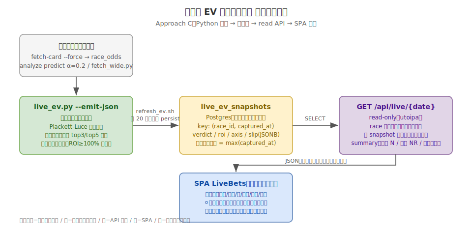

# ライブ EV 買い目ビュー（今これを買え）: 機能仕様

[Issue #260](https://github.com/taito-station/paddock/issues/260) / 依存: [#33 REST API（read 基盤）](https://github.com/taito-station/paddock/issues/33)・[#34 Web SPA](https://github.com/taito-station/paddock/issues/34) / 関連 ADR: [0064](../adr/0064-live-ev-buy-view.md)

## 概要

開催当日のライブ監視で「**結局いま何を買えばいいのか**」を一望できる Web ビューを SPA に追加し、手作業の買い目シート（`買い目_YYYYMMDD.md`）を不要にする。「張る/見送り」と「そのまま買える買い目伝票」を出すのは `scripts/predict-check/live_ev.py --slip`（`refresh_ev.sh` が 20 分周期で駆動）だが、出力が CLI/標準出力のみのため、ライブ中はターミナルを見て md を手写しする運用になっている。本仕様は、その伝票を **常時最新の「今これを買え」ビュー**として UI に出す。

正本仕様は CLAUDE.md「ライブ監視時のコミュニケーション規律」「表記規約」「買い方ルール」。本ビューはそれを画面契約として固定する。



## 設計方針（ADR 0064）

**Approach C: EV/伝票ロジックの正本は Python `live_ev.py` に一本化する。**

- `live_ev.py` が各監視サイクルの ROI・張る/見送り判定・買い目伝票を JSON 化し、Postgres に snapshot 永続化する。
- **API は最新サイクルを返すだけ**（read-only）、**SPA は描画のみ**。
- CLAUDE.md「買い方ルール」（混戦判定・Plackett-Luce 着順確率・相手 top3/top5 分別・最大剰余法配分・伝票整形）を正本とする。関連 ADR 0028/0030/0046 は**代替案を棄却して baseline（混戦条件・相手幅・配分 floor）を固定した記録**であり、ルールの一次定義は CLAUDE.md「買い方ルール」・実装は `live_ev.py`。EV 層分離・軸ロックは ADR 0055/0060。これらを Rust/TS に**再実装しない**（二重実装＝乖離リスクの排除。「シンプル第一」）。
- 既存 API `/api/races/{race_id}/recommendations`（use-case `recommend_bets()` → `build_portfolio()`＝Harville・一律 top5・混戦なし）は**別関心事**であり、本ビューはそれを使わない。

> 既定 SPA は「永続化済みデータを表示」する（[web-spa.md](web-spa.md) の鮮度方針）。本ビューも snapshot 済みデータの表示に徹し、「最新サイクルのみが正」を snapshot の時系列で自然に表現する。

---

## データモデル: `live_ev_snapshots`（Postgres 新規テーブル）

`race_odds_snapshots`（#232）と同思想で、監視サイクルごとの評価結果を時系列アーカイブする。フリップ判定（前サイクルとの差分）に直前 snapshot が必要なため、最新だけでなく時系列を残す。

| 列 | 型 | 説明 |
|---|---|---|
| `id` | bigserial PK | サロゲートキー |
| `date` | date | 開催日（`YYYY-MM-DD`） |
| `race_id` | text | paddock race_id |
| `venue` | text | 場名 |
| `race_no` | int | レース番号 |
| `post_time` | timestamptz | 発走時刻（netkeiba 由来を +09:00 で正規化。他列と型を揃える） |
| `captured_at` | timestamptz | **監視サイクル時刻**（この評価を出した時刻） |
| `verdict` | text | `'bet'`（ROI≥100%）/ `'skip'`（−EV） |
| `roi` | numeric | 全3券種 ROI[%]（`live_ev.py` の `race_roi`） |
| `konsen` | boolean | 混戦フラグ（◎勝率 0.70 倍以上が 4 頭以上） |
| `axis` | int | ◎馬番（model 勝率最上位） |
| `axis_prob` | numeric | ◎の model 勝率[%] |
| `axis_win_odds` | numeric | ◎の単勝オッズ |
| `odds_missing` | boolean | 一部買い目のオッズ欠落（ROI 過小評価の可能性） |
| `slip` | jsonb | 買い目伝票（下記スキーマ）。`verdict='skip'` でも参考として保存 |
| `raw` | jsonb | `live_ev.py --emit-json` の **`races[]` 要素 1 件ぶん**（トップレベルの `default_budget` は `slip.race_budget` フィールドに保持される）。**将来の再集計・スキーマ進化時の後方互換のために保持**。`slip`・各スカラー列と内容は重複するが、列は描画/検索用の正規化ビュー、`raw` は原本という位置づけ。時系列蓄積で肥大するため、保持期間の TTL は運用で別途定める（当面は無制限・`race_odds_snapshots` に倣う） |

- **一意キー**: `(race_id, captured_at)`。「最新サイクル」= `race_id` ごとの `max(captured_at)`。
- **インデックス**: 最新サイクル抽出（`WHERE date=$1` → race ごと `max(captured_at)`）とフリップ用の直前サイクル取得を賄うため `(date, race_id, captured_at DESC)` を張る（`race_odds_snapshots` #232 の索引方針を踏襲）。時系列で成長するテーブルのため索引を DDL に含める。
- **マルチユーザー化の布石**（web-spa.md 準拠）: 将来 `user_id` を非破壊で追加できるよう、一意制約は `(race_id, captured_at)` 単位に留め、DDL 整理時に `(user_id, race_id, captured_at)` へ拡張可能な形にする。

### `slip` JSONB スキーマ

`live_ev.py` の `build_bets()` / `print_slip()` の出力を機械可読化したもの。leg は **(方式レイヤー × 券種) 単位**で持つ（下記「方式の付与」参照）。

```jsonc
{
  "race_budget": 5000,             // このレースに配分した予算。live_ev.py は --budget で計算するため現状は常に default_budget と同値。増額（ADR 0060）は人間の執行判断でモデルに戻さないため、本フィールドは将来の per-race 予算差分の予約枠
  "legs": [
    {
      "bet_type": "wide",          // wide | quinella | trio（式別）
      "method": "nagashi",         // nagashi | box | formation（方式）
      "axis": 10,                   // ◎馬番（method=box では null）
      "combo": [10, 13],            // 組番（昇順ソート済み）
      "points": 1,                  // この leg の点数（1組）
      "amount": 300                 // 金額（100 円単位）
    }
    // ... wide top5 / quinella top5 / trio top5 nagashi (+ 混戦時 trio box)
  ]
}
```

- **方式（method）の付与とレイヤー分離**: `build_bets()` は混戦時、印馬 3連複ボックスと ◎軸ながし 3連複を**別レイヤーで生成し、`print_slip()` は券種ごとに同一組番の金額を合算**する（実測。マージ後は box 分/nagashi 分の内訳が失われる）。CLAUDE.md 表記規約（ながし/ボックス/フォーメーションを正しく区別）を満たすため、`--emit-json` は **マージ前の leg を (method, combo) 単位で出力**し method を明示付与する:
  - ワイド・馬連・3連複の◎軸ながし部分 → `nagashi`（`axis` に◎馬番）。
  - 混戦時の印馬 3連複ボックス部分 → `box`（`axis` は null）。
  - フォーメーションは本 PJ で基本不使用（列は予約のみ）。
  - **同一組番の金額合算は「同一 method レイヤー内のみ」**に適用する（box と nagashi で同じ組番が出ても別 leg として保持し、内訳を UI で区別できるようにする）。
- **点数・金額**: 100 円単位（`largest_remainder` により券種予算ちょうどに収束）。ビューは leg を券種＋方式ごとに束ね、`式別 / 方式 / 軸 / 相手 / 点数 / 金額` の「そのまま買える形」で描画する。

---

## `live_ev.py --emit-json PATH`（新規オプション）

- 既存 `--slip` と**同一の計算結果**を機械可読 JSON で `PATH` に出力する（計算ロジックは一切変えない・追加のみ）。
- **DB 非依存を維持**（現状どおり TSV 入力のみ）。永続化は呼び出し側（`refresh_ev.sh`）が担う。テスト容易性を保つ。
- **重要**: 現行 `live_ev.py` の入力（`--meta` は `pid/venue/rnum` のみ）は **netkeiba `pid` キーで完結し、paddock `race_id`・`date`・`post_time` を持たない**。よって `--emit-json` はこれらを出力せず、**pid ローカルの値のみ**を出す（＝「出力追加のみ・DB 非依存」を厳守）。`race_id`・`date`・`post_time` は **永続化側（`refresh_ev.sh`）が pid から DB 参照で補完**する（下記）。
- 出力ペイロード（1 レース 1 要素の配列）:

```jsonc
{
  "default_budget": 5000,          // --budget（レース増額前の既定値）
  "races": [
    {
      "pid": "202602...",           // netkeiba pid（meta 由来。race_id はここでは出さない）
      "venue": "函館", "race_no": 12,
      "verdict": "bet",             // roi>=100 → bet, else skip
      "roi": 125.3,
      "konsen": false,
      "axis": 4, "axis_prob": 35.2, "axis_win_odds": 1.7,
      "odds_missing": false,
      "slip": { /* 上記 slip スキーマ */ }
    }
  ]
}
```

- `--slip` は「+EV のみ伝票表示」だが、`--emit-json` は **全評価レースを出力**する（見送りレースの理由表示・フリップ判定に必要なため。verdict/roi で区別）。

## 永続化（`refresh_ev.sh` を拡張）

- `refresh_ev.sh`（既に Postgres アクセスを持つオーケストレータ）の最後に、`live_ev.py --emit-json` の JSON を `live_ev_snapshots` へ upsert する 1 ステップを追加する（小さな `persist_live_ev.py` か psql）。
- **`race_id`・`date`・`post_time` の補完**: persist ステップが各 `pid` から DB を引いて paddock `race_id`・`date`（開催日）・`post_time` を注入する（`live_ev.py` は pid ローカル値のみ出力するため）。`pid`→`race_id` の対応は `refresh_ev.sh` が既に保持している（TSV 生成時の race 列挙）。
- **`captured_at` の供給と冪等性（安定サイクルキー）**: `captured_at` は **その監視サイクルの論理境界時刻**（＝スイープの予定時刻／`prefetch_odds.sh`・cron のスケジュール時刻。プロセス起動時刻の `now()` ではない）を persist が全レース同一値で割り当てる。こうすると同一サイクルの再実行（cron 二重発火・手動再走）でも同じ `captured_at` に写像され、`(race_id, captured_at)` upsert で確実に冪等になる（プロセス起動時刻を使うと近似重複行が生え、「直前サイクル＝2 番目に新しい `captured_at`」を汚染してフリップ算出を誤らせるため、これを避ける）。実装は「サイクル間隔で丸めた時刻」または明示 `cycle_id` を persist に渡す。
- `live_ev.py` 本体は DB に触らない（責務分離。README「DB アクセスは refresh_ev.sh 側」と整合）。

---

## API: `GET /api/live/{date}`（read-only）

指定開催日の**最新サイクルの判定＋伝票**を返す。既存 read エンドポイント（`race.rs`）と同じ実装パターン。**OpenAPI を一級成果物とする**（下記「OpenAPI 契約」）。

- **最新サイクル抽出**: `race_id` ごとに `max(captured_at)` の行のみ返す（window 関数）。
- **フリップ算出**: 各 race について直前 snapshot（2 番目に新しい `captured_at`）と比較し、`axis_changed`（◎変化）・`ev_reversed`（+EV↔−EV 反転）を算出する。**前サイクルが無ければ `axis_changed`/`ev_reversed` は false、`prev_*`（`prev_axis`/`prev_verdict`/`prev_roi`）は null**（utoipa 上は nullable）。
- **見送り理由**: `verdict='skip'` の `reason` は `roi`・`flip.prev_roi`・`axis_win_odds` から構成する。API か SPA のどちらで文字列化するかは実装で決めるが、素材（roi・prev_roi・axis_changed・axis_win_odds）を必ず返す。例:
  - 断然人気で妙味なし（フリップ無し）: 「◎②断然人気 単勝1.4・ROI 80%（−EV）」。
  - 前サイクルから反転（フリップ有り）: 「朝+EV→直前−EVに反転 ROI 103%→78.9%」（`ev_reversed=true`）。

### レスポンス（DTO）

```jsonc
{
  "date": "2026-06-20",
  "summary": {
    "bet_race_count": 1,        // 🟢張る本数
    "watched_race_count": 21,   // 監視レース数
    "last_updated": "2026-06-20T15:20:00+09:00"  // 全 race 中の最新 captured_at
  },
  "races": [
    {
      "race_id": "2026...", "venue": "函館", "race_no": 12,
      "post_time": "2026-06-20T15:35:00+09:00",
      "captured_at": "2026-06-20T15:20:00+09:00",
      "verdict": "bet", "roi": 125.3, "konsen": false,
      "axis": 4, "axis_prob": 35.2, "axis_win_odds": 1.7,
      "odds_missing": false,
      "slip": { /* slip スキーマ（描画用） */ },
      "flip": {
        "axis_changed": false, "prev_axis": 4,
        "ev_reversed": false, "prev_verdict": "bet", "prev_roi": 122.0
      }
    }
  ]
}
```

### クリーンアーキ層の配置

| 層 | 追加物 | 参照する既存パターン |
|---|---|---|
| `interface/rest-controller` | `GET /api/live/{date}` handler・レスポンス DTO・utoipa schema | `src/interface/rest-controller/src/handler/race.rs`・`session.rs` |
| `use-case` | LiveEv query interactor（最新サイクル取得＋フリップ算出） | 既存 interactor |
| `infrastructure/rdb-gateway` | snapshot 取得 repository（race ごと **最新＋直前** の 2 サイクルを返す。フリップ算出に直前が要るため。window 関数 `row_number()` 等） | 既存 repo |
| `apps/api-server` | route 配線・OpenAPI 登録 | 既存 route 登録 |

### OpenAPI 契約（一級成果物）

本 API は **OpenAPI を一級成果物**として扱う（プロジェクト標準）。実装 PR#1 の受け入れ条件に含める。

- **utoipa コードファースト**: `GET /api/live/{date}` の path/クエリ・全レスポンス DTO（トップレベル・`summary`・`races[]`・`slip`・`flip`・nullable な `prev_*`）を utoipa の `#[derive(ToSchema)]` / `#[utoipa::path]` で宣言し、既存 `ApiDoc`（`src/interface/rest-controller/src/openapi.rs` の `utoipa::OpenApi`）の `paths(...)`・`components(schemas(...))` に新エンドポイント・新スキーマを登録する。schema は既存の `schema/` モジュール分離に倣う。
- **`openapi.json` スナップショット検証**: コミット済み `docs/api/openapi.json` を本エンドポイント追加ぶん更新（`UPDATE_OPENAPI=1 cargo test -p api-server --test openapi`）し、既存スナップショットテスト `src/apps/api-server/tests/openapi.rs::openapi_snapshot_is_up_to_date`（`ApiDoc::openapi()` 生成物と `docs/api/openapi.json` の一致を assert）を green にする（スキーマドリフトの検出）。この更新・検証を PR の DoD とする。なお本テストは `paths(...)` への**登録漏れ自体は検知しない**ため、エンドポイント登録は実装時にレビューで担保する。
- **SPA 型の単一ソース**: SPA（実装 PR#2）のクライアント型は、この OpenAPI/DTO を単一ソースとして生成/追従する（既存 `web/src/api/schema.d.ts`・`client.ts` の機構に追従）。API とビューの契約差異を防ぐ。

---

## SPA: `LiveBets`「今これを買え」ビュー

新ルート `web/src/routes/LiveBets.tsx`。`web/src/main.tsx` の `Routes` に `path="live/:date"` を追加する。`web/src/lib/format.ts` の整形・`web/src/api/` のクライアント型を再利用/追加する。

### 画面要件（CLAUDE.md 準拠）

1. **冒頭に一望サマリ（常時 1 行）**: `summary` から `🟢張る N レース（監視中 MR）`、張る 0 本なら `張り無し（監視中 MR）` を表示（監視数は張る有無に関わらず常時併記）。**最終更新時刻（`last_updated`）を明示**。
2. **最新サイクルのみが正**: 表示は常に最新サイクルの判定のみ。前サイクル・朝の +EV リストは出さない（CLAUDE.md「唯一の正＝最新サイクルの判定のみ」を UI 契約として固定）。
3. **🟢張るレース＝そのまま買える形**: 各 `verdict='bet'` レースに `式別 / 方式（ながし・ボックス・フォーメーションを正しく区別）/ 軸 / 相手 / 点数 / 金額` を表示（100 円単位）。`slip.legs` を券種ごとに束ねて描画し、`live_ev.py --slip` の伝票と同一内容にする。
4. **⚪見送りは理由付きで明示**: `verdict='skip'` レースを理由（roi・prev_roi・◎断然人気崩れ等）付きで表示。曖昧な据え置きをしない。
5. **🔶フリップ強調**: `flip.axis_changed` / `flip.ev_reversed` が真のレースを視覚強調（例:「小倉5R: 朝+EV→直前−EVに反転、◎⑥→⑨」）。
6. **オッズ欠落の注記**: `odds_missing=true` のレースに「一部買い目にオッズ欠落あり・ROI は過小評価の可能性」を注記する（張る/見送りいずれでも。ROI 判定の信頼度を明示）。
7. **鮮度**: web-spa.md「SPA は自動ポーリングしない」に従い、**手動更新ボタン**＋最終更新時刻を主表示にする（`GET /api/live/{date}` の再取得）。軽量な client-side polling は follow-up（スコープ外）。
8. 手作業の買い目シート md を書かなくても、この画面だけで「いま張るレースと買い目」が完結すること。

### 表示例（ワイヤー）

```
┌────────────────────────────────────────────────┐
│ 2026-06-20 ライブ  🟢張る 1レース（監視中 21R）  更新 15:20 [更新]│
├────────────────────────────────────────────────┤
│ 🟢 函館12R  ROI 125%  ◎④(model35% 単勝1.7)                       │
│   ワイド / ながし / 軸④ / 相手⑤⑦③(3点) / 計¥1,500               │
│   馬連   / ながし / 軸④ / 相手⑤⑦③①⑧(5点) / 計¥1,500             │
│   3連複  / ながし / 軸④ / 相手⑤⑦③①⑧(10点) / 計¥2,000            │
├────────────────────────────────────────────────┤
│ ⚪ 東京10R  見送り  ROI 80%（◎②断然人気 単勝1.4 model48%・−EV）  │
│ 🔶 小倉5R  見送り  朝+EV→直前−EVに反転（◎⑥→⑨ フリップ）         │
└────────────────────────────────────────────────┘
```

> ワイヤーの金額は説明用の概算。実配分は各点を組合せ確率で重み付けし最低¥100 を確保（CLAUDE.md 買い方ルール）、券種予算ちょうどに収める。東京10R は断然人気（単勝1.4）で model 勝率も高い（過剰人気）ため ROI が 100% を割り見送り、という verdict 差の読み取り例。

---

## スコープ外（本フェーズでやらない）

- 実購入連携（IPAT 等）。あくまで参考表示（decision-support・ADR 0055/0060）。張る/見送り/増額の最終判断は人間。
- リアルタイム自動更新（WebSocket / polling）。手動更新に留める。
- 認証・マルチユーザーのデータ分離（DDL の布石のみ）。
- `live_ev.py` の計算ロジック変更（`--emit-json` は出力追加のみ・買い方ルールは不変）。

## 実装フェーズ分割

1. **実装 PR#1（API でライブ EV 公開）**: `live_ev_snapshots` マイグレーション / `live_ev.py --emit-json`（+ `test_live_ev.py`）/ `refresh_ev.sh` 永続化ステップ / `GET /api/live/{date}`（4 層）+ **OpenAPI（utoipa コードファースト＋`openapi.json` スナップショット更新・検証）を一級成果物として DoD に含める**。
2. **実装 PR#2（SPA 買い目ビュー）**: `LiveBets.tsx` + ルート追加 + **OpenAPI/DTO を単一ソースとした API クライアント型** + vitest / ブラウザテスト（`tests/browser-test-cases/live-ev-buy-view.md`）。

## 関連

- ADR 0064（本仕様の決定）／ADR 0028・0030・0046（混戦判定・相手幅・配分）／ADR 0055・0060（EV 層分離・軸ロック＝decision-support）
- `scripts/predict-check/live_ev.py`・`refresh_ev.sh`・README（ライブ EV 監視節）
- `docs/specifications/web-spa.md`（SPA 鮮度方針・マルチユーザー布石）
- CLAUDE.md「買い方ルール／ライブ監視時のコミュニケーション規律／表記規約」
