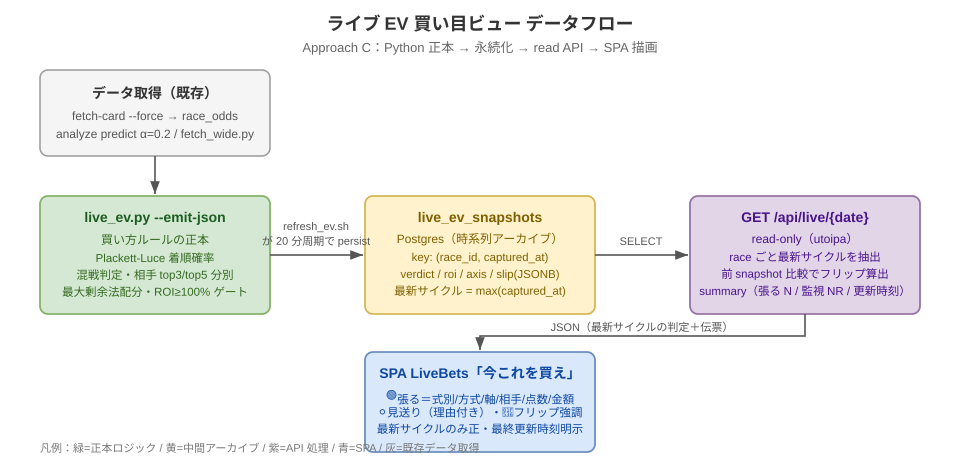

---
# knowledge 規約に基づくメタデータ（docs/knowledge/README.md）。specifications はその場で
# knowledge に昇格（ADR 履歴・相互リンクを壊さないため物理移動しない）。
status: Confirmed
kind: knowledge
doc_class: [D11, D23, D10]
tags: [D11, D23, D10]
updated: "2026-08-18"
---

# ライブ EV 買い目ビュー（今これを買え）: 機能仕様

[Issue #260](https://github.com/taito-station/paddock/issues/260) / 依存: [#33 REST API（read 基盤）](https://github.com/taito-station/paddock/issues/33)・[#34 Web SPA](https://github.com/taito-station/paddock/issues/34) / 関連 ADR: 0064

> **更新（#346・2026-07 / ライブ writer を Rust に一本化）**: 本仕様が当初採った
> 「EV/伝票の正本は Python `live_ev.py`・`refresh_ev.sh` が `live_ev_snapshots` へ永続化」という
> **書き込み側の設計は退役した**。ライブ writer は Rust の `predict-watch` に一本化され、
> `live_ev_snapshots` への upsert・複勝オッズ・`captured_at` 供給も Rust が担う（2 エンジン問題の解消）。
> **以下の本文（データフロー図・設計方針〈Approach C〉・emit-json・永続化・実装 PR 分割 など各節）は
> 当初 #260 設計の歴史的記録**であり、writer に関する記述は上記のとおり読み替えること（個別の節に
> 退役注記が無くても本バナーが優先する。理由と現行構成は
> ADR 0064 の「追補（#346）」 を参照）。read API `GET /api/live/{date}`・
> `live_ev_snapshots` スキーマ・SPA `LiveBets`・slip 契約は不変で、Rust writer が同一契約を満たす。
> `live_ev.py` 本体はオフライン用途で温存。

## 概要

開催当日のライブ監視で「**結局いま何を買えばいいのか**」を一望できる Web ビューを SPA に追加し、手作業の買い目シート（`買い目_YYYYMMDD.md`）を不要にする。「張る/見送り」と「そのまま買える買い目伝票」を出すのは `scripts/predict-check/live_ev.py --slip`（`refresh_ev.sh` が 20 分周期で駆動）だが、出力が CLI/標準出力のみのため、ライブ中はターミナルを見て md を手写しする運用になっている。本仕様は、その伝票を **常時最新の「今これを買え」ビュー**として UI に出す。

正本仕様は CLAUDE.md「ライブ監視時のコミュニケーション規律」「表記規約」「買い方ルール」。本ビューはそれを画面契約として固定する。



## 設計方針（ADR 0064）

**Approach C: EV/伝票ロジックの正本は Python `live_ev.py` に一本化する。**

- `live_ev.py` が各監視サイクルの ROI・張る/見送り判定・買い目伝票を JSON 化し、Postgres に snapshot 永続化する。
- **API は最新サイクルを返すだけ**（read-only）、**SPA は描画のみ**。
- CLAUDE.md「買い方ルール」（混戦判定・Plackett-Luce 着順確率・相手 top3/top5 分別・最大剰余法配分・伝票整形）を正本とする。関連 ADR 0028/0030/0046 は**代替案を棄却して baseline（混戦条件・相手幅・配分 floor）を固定した記録**であり、ルールの一次定義は CLAUDE.md「買い方ルール」・実装は `live_ev.py`。EV 層分離・軸ロックは ADR 0055/0060。これらを Rust/TS に**再実装しない**（二重実装＝乖離リスクの排除。「シンプル第一」）。
- 既存 API `/api/races/{race_id}/recommendations`（use-case `recommend_bets()` → `build_portfolio()`＝Harville・一律 top5・混戦なし）は**別関心事**であり、本ビューはそれを使わない。

> 既定 SPA は「永続化済みデータを表示」する（[web-spa.md](web-spa.md) の鮮度方針）。本ビューも snapshot 済みデータの表示に徹し、「最新サイクルのみが正」を snapshot の時系列で自然に表現する。

---

## データモデル: `live_ev_snapshots`（Postgres 新規テーブル）

`race_odds_snapshots`（#232）と同思想で、監視サイクルごとの評価結果を時系列アーカイブする。フリップ判定（前サイクルとの差分）に直前 snapshot が必要なため、最新だけでなく時系列を残す。

| 列 | 型 | 説明 |
|---|---|---|
| `id` | bigserial PK | サロゲートキー |
| `date` | date | 開催日（`YYYY-MM-DD`） |
| `race_id` | text | paddock race_id |
| `venue` | text | 場名 |
| `race_no` | int | レース番号 |
| `post_time` | timestamptz | 発走時刻（netkeiba 由来を +09:00 で正規化。他列と型を揃える） |
| `captured_at` | timestamptz | **監視サイクル時刻**（この評価を出した時刻） |
| `verdict` | text | `'bet'`（ROI≥100%）/ `'skip'`（−EV） |
| `roi` | numeric | 全3券種 ROI[%]（`live_ev.py` の `race_roi`） |
| `konsen` | boolean | 混戦フラグ（◎勝率 0.70 倍以上が 4 頭以上） |
| `axis` | int | ◎馬番（model 勝率最上位） |
| `axis_prob` | numeric | ◎の model 勝率[%] |
| `axis_win_odds` | numeric | ◎の単勝オッズ |
| `odds_missing` | boolean | 賭金が乗っているのにオッズ未取得の脚があるか（#631）。**ROI の過小評価ではない**——`roi` は priced 脚だけで分子・分母とも算出される（式は対称）。true は「`roi` と賭け計が別の母集団を指す」の意 |
| `slip` | jsonb | 買い目伝票（下記スキーマ）。`verdict='skip'` でも参考として保存 |
| `raw` | jsonb | `live_ev.py --emit-json` の **`races[]` 要素 1 件ぶん**（トップレベルの `default_budget` は `slip.race_budget` フィールドに保持される）。**将来の再集計・スキーマ進化時の後方互換のために保持**。`slip`・各スカラー列と内容は重複するが、列は描画/検索用の正規化ビュー、`raw` は原本という位置づけ。時系列蓄積で肥大するため、保持期間の TTL は運用で別途定める（当面は無制限・`race_odds_snapshots` に倣う） |

- **一意キー**: `(race_id, captured_at)`。「最新サイクル」= `race_id` ごとの `max(captured_at)`。
- **インデックス**: 最新サイクル抽出（`WHERE date=$1` → race ごと `max(captured_at)`）とフリップ用の直前サイクル取得を賄うため `(date, race_id, captured_at DESC)` を張る（`race_odds_snapshots` #232 の索引方針を踏襲）。時系列で成長するテーブルのため索引を DDL に含める。
- **マルチユーザー化の布石**（web-spa.md 準拠）: 将来 `user_id` を非破壊で追加できるよう、一意制約は `(race_id, captured_at)` 単位に留め、DDL 整理時に `(user_id, race_id, captured_at)` へ拡張可能な形にする。

### `slip` JSONB スキーマ

`live_ev.py` の `build_bets()` / `print_slip()` の出力を機械可読化したもの。leg は **(方式レイヤー × 券種) 単位**で持つ（下記「方式の付与」参照）。

```jsonc
{
  "race_budget": 5000,             // このレースに配分した予算。既定は predict-watch の --race-budget（全レース同値）。#342/ADR 0066 で per-race 増額に対応: --race-budget-override <race_id>=<円> を指定したレースはその予算で組成され本フィールドに per-race 値が入る（軸・点数・相手は不変で金額のみ）。増額は人間の CLI 入力＝執行判断であり、モデル確率/基準配分は不変（ADR 0060 と整合）。
  "legs": [
    {
      "bet_type": "wide",          // wide | quinella | trio（式別）
      "method": "nagashi",         // nagashi | box | formation（方式）
      "axis": 10,                   // ◎馬番（method=box では null）
      "combo": [10, 13],            // 組番（昇順ソート済み）
      "points": 1,                  // この leg の点数（1組）
      "amount": 300                 // 金額（100 円単位）
    }
    // ... wide top5 / quinella top5 / trio top5 nagashi (+ 混戦時 trio box)
  ]
}
```

- **方式（method）の付与とレイヤー分離**: `build_bets()` は混戦時、印馬 3連複ボックスと ◎軸ながし 3連複を**別レイヤーで生成し、`print_slip()` は券種ごとに同一組番の金額を合算**する（実測。マージ後は box 分/nagashi 分の内訳が失われる）。CLAUDE.md 表記規約（ながし/ボックス/フォーメーションを正しく区別）を満たすため、`--emit-json` は **マージ前の leg を (method, combo) 単位で出力**し method を明示付与する:
  - ワイド・馬連・3連複の◎軸ながし部分 → `nagashi`（`axis` に◎馬番）。
  - 混戦時の印馬 3連複ボックス部分 → `box`（`axis` は null）。
  - フォーメーションは本 PJ で基本不使用（列は予約のみ）。
  - **同一組番の金額合算は「同一 method レイヤー内のみ」**に適用する（box と nagashi で同じ組番が出ても別 leg として保持し、内訳を UI で区別できるようにする）。
- **点数・金額**: 100 円単位（`largest_remainder` により券種予算ちょうどに収束）。ビューは leg を券種＋方式ごとに束ね、`式別 / 方式 / 軸 / 相手 / 点数 / 金額` の「そのまま買える形」で描画する。

---

## `live_ev.py --emit-json PATH`（新規オプション）

- 既存 `--slip` と**同一の計算結果**を機械可読 JSON で `PATH` に出力する（計算ロジックは一切変えない・追加のみ）。
- **DB 非依存を維持**（現状どおり TSV 入力のみ）。永続化は呼び出し側（`refresh_ev.sh`）が担う。テスト容易性を保つ。
- **重要**: 現行 `live_ev.py` の入力（`--meta` は `pid/venue/rnum` のみ）は **netkeiba `pid` キーで完結し、paddock `race_id`・`date`・`post_time` を持たない**。よって `--emit-json` はこれらを出力せず、**pid ローカルの値のみ**を出す（＝「出力追加のみ・DB 非依存」を厳守）。`race_id`・`date`・`post_time` は **永続化側（`refresh_ev.sh`）が pid から DB 参照で補完**する（下記）。
- 出力ペイロード（1 レース 1 要素の配列）:

```jsonc
{
  "default_budget": 5000,          // --budget（レース増額前の既定値）
  "races": [
    {
      "pid": "202602...",           // netkeiba pid（meta 由来。race_id はここでは出さない）
      "venue": "函館", "race_no": 12,
      "verdict": "bet",             // roi>=100 → bet, else skip
      "roi": 125.3,
      "konsen": false,
      "axis": 4, "axis_prob": 35.2, "axis_win_odds": 1.7,
      "odds_missing": false,
      "slip": { /* 上記 slip スキーマ */ }
    }
  ]
}
```

- `--slip` は「+EV のみ伝票表示」だが、`--emit-json` は **全評価レースを出力**する（見送りレースの理由表示・フリップ判定に必要なため。verdict/roi で区別）。

## 永続化（`refresh_ev.sh` を拡張）

> **更新（#346・2026-07）**: 以下の Python 永続化経路（`live_ev.py --emit-json` → `refresh_ev.sh` → `persist_live_ev.py` → `live_ev_snapshots`）は退役した。ライブ writer は Rust の `predict-watch` に一本化され、`captured_at` 供給・冪等 upsert・複勝オッズ書き込みも Rust 側が担う。理由と現行構成は ADR 0064 の「追補（#346）」 を参照。以下は当初設計の歴史的記録として残す。

- `refresh_ev.sh`（既に Postgres アクセスを持つオーケストレータ）の最後に、`live_ev.py --emit-json` の JSON を `live_ev_snapshots` へ upsert する 1 ステップを追加する（小さな `persist_live_ev.py` か psql）。
- **`race_id`・`date`・`post_time` の補完**: persist ステップが各 `pid` から DB を引いて paddock `race_id`・`date`（開催日）・`post_time` を注入する（`live_ev.py` は pid ローカル値のみ出力するため）。`pid`→`race_id` の対応は `refresh_ev.sh` が既に保持している（TSV 生成時の race 列挙）。
- **`captured_at` の供給と冪等性（安定サイクルキー）**: `captured_at` は **その監視サイクルの論理境界時刻**（＝スイープの予定時刻／`prefetch_odds.sh`・cron のスケジュール時刻。プロセス起動時刻の `now()` ではない）を persist が全レース同一値で割り当てる。こうすると同一サイクルの再実行（cron 二重発火・手動再走）でも同じ `captured_at` に写像され、`(race_id, captured_at)` upsert で確実に冪等になる（プロセス起動時刻を使うと近似重複行が生え、「直前サイクル＝2 番目に新しい `captured_at`」を汚染してフリップ算出を誤らせるため、これを避ける）。実装は「サイクル間隔で丸めた時刻」または明示 `cycle_id` を persist に渡す。
- `live_ev.py` 本体は DB に触らない（責務分離。README「DB アクセスは refresh_ev.sh 側」と整合）。

---

## API: `GET /api/live/{date}`（read-only）

指定開催日の**最新サイクルの判定＋伝票**を返す。既存 read エンドポイント（`race.rs`）と同じ実装パターン。**OpenAPI を一級成果物とする**（下記「OpenAPI 契約」）。

- **最新サイクル抽出**: `race_id` ごとに `max(captured_at)` の行のみ返す（window 関数）。
- **フリップ算出**: 各 race について直前 snapshot（2 番目に新しい `captured_at`）と比較し、`axis_changed`（◎変化）・`ev_reversed`（+EV↔−EV 反転）を算出する。**前サイクルが無ければ `axis_changed`/`ev_reversed` は false、`prev_*`（`prev_axis`/`prev_verdict`/`prev_roi`）は null**（utoipa 上は nullable）。
- **見送り理由**: `verdict='skip'` の `reason` は `roi`・`flip.prev_roi`・`axis_win_odds` から構成する。API か SPA のどちらで文字列化するかは実装で決めるが、素材（roi・prev_roi・axis_changed・axis_win_odds）を必ず返す。例:
  - 断然人気で妙味なし（フリップ無し）: 「◎②断然人気 単勝1.4・ROI 80%（−EV）」。
  - 前サイクルから反転（フリップ有り）: 「朝+EV→直前−EVに反転 ROI 103%→78.9%」（`ev_reversed=true`）。

### レスポンス（DTO）

```jsonc
{
  "date": "2026-06-20",
  "summary": {
    "bet_race_count": 1,        // 🟢張る本数
    "watched_race_count": 21,   // 監視レース数
    "last_updated": "2026-06-20T15:20:00+09:00", // 全 race 中の最新 captured_at
    "server_now": "2026-06-20T15:23:00Z"         // レスポンス生成時のサーバ現在時刻（UTC rfc3339, #382）
  },
  "races": [
    {
      "race_id": "2026...", "venue": "函館", "race_no": 12,
      "post_time": "2026-06-20T15:35:00+09:00",
      "captured_at": "2026-06-20T15:20:00+09:00",
      "verdict": "bet", "roi": 125.3, "konsen": false,
      "axis": 4, "axis_prob": 35.2, "axis_win_odds": 1.7,
      "odds_missing": false,
      "slip": { /* slip スキーマ（描画用） */ },
      "flip": {
        "axis_changed": false, "prev_axis": 4,
        "ev_reversed": false, "prev_verdict": "bet", "prev_roi": 122.0
      }
    }
  ]
}
```

### クリーンアーキ層の配置

| 層 | 追加物 | 参照する既存パターン |
|---|---|---|
| `interface/rest-controller` | `GET /api/live/{date}` handler・レスポンス DTO・utoipa schema | `src/interface/rest-controller/src/handler/race.rs`・`session.rs` |
| `use-case` | LiveEv query interactor（最新サイクル取得＋フリップ算出） | 既存 interactor |
| `infrastructure/rdb-gateway` | snapshot 取得 repository（race ごと **最新＋直前** の 2 サイクルを返す。フリップ算出に直前が要るため。window 関数 `row_number()` 等） | 既存 repo |
| `apps/api-server` | route 配線・OpenAPI 登録 | 既存 route 登録 |

### OpenAPI 契約（一級成果物）

本 API は **OpenAPI を一級成果物**として扱う（プロジェクト標準）。実装 PR#1 の受け入れ条件に含める。

- **utoipa コードファースト**: `GET /api/live/{date}` の path/クエリ・全レスポンス DTO（トップレベル・`summary`・`races[]`・`slip`・`flip`・nullable な `prev_*`）を utoipa の `#[derive(ToSchema)]` / `#[utoipa::path]` で宣言し、既存 `ApiDoc`（`src/interface/rest-controller/src/openapi.rs` の `utoipa::OpenApi`）の `paths(...)`・`components(schemas(...))` に新エンドポイント・新スキーマを登録する。schema は既存の `schema/` モジュール分離に倣う。
- **`openapi.json` スナップショット検証**: コミット済み `docs/api/openapi.json` を本エンドポイント追加ぶん更新（`UPDATE_OPENAPI=1 cargo test -p api-server --test openapi`）し、既存スナップショットテスト `src/apps/api-server/tests/openapi.rs::openapi_snapshot_is_up_to_date`（`ApiDoc::openapi()` 生成物と `docs/api/openapi.json` の一致を assert）を green にする（スキーマドリフトの検出）。この更新・検証を PR の DoD とする。なお本テストは `paths(...)` への**登録漏れ自体は検知しない**ため、エンドポイント登録は実装時にレビューで担保する。
- **SPA 型の単一ソース**: SPA（実装 PR#2）のクライアント型は、この OpenAPI/DTO を単一ソースとして生成/追従する（既存 `web/src/api/schema.d.ts`・`client.ts` の機構に追従）。API とビューの契約差異を防ぐ。

---

## SPA: `LiveBets`「今これを買え」ビュー

新ルート `web/src/routes/LiveBets.tsx`。`web/src/main.tsx` の `Routes` に `path="live/:date"` を追加する。`web/src/lib/format.ts` の整形・`web/src/api/` のクライアント型を再利用/追加する。

### 画面要件（CLAUDE.md 準拠）

1. **冒頭に一望サマリ（常時 1 行）**: `summary` から `🟢張る N レース（監視中 MR）`、張る 0 本なら `張り無し（監視中 MR）` を表示（監視数は張る有無に関わらず常時併記）。**最終更新時刻（`last_updated`）を明示**。鮮度の相対表記は `summary.server_now − last_updated` で較正する（クライアント時計のズレを排す。#382・[live-freshness-calibration.md](../knowledge/live-freshness-calibration.md)）。
2. **最新サイクルのみが正**: 表示は常に最新サイクルの判定のみ。前サイクル・朝の +EV リストは出さない（CLAUDE.md「唯一の正＝最新サイクルの判定のみ」を UI 契約として固定）。
3. **🟢張るレース＝そのまま買える形**: 各 `verdict='bet'` レースに `式別 / 方式（ながし・ボックス・フォーメーションを正しく区別）/ 軸 / 相手 / 点数 / 金額` を表示（100 円単位）。`slip.legs` を券種ごとに束ねて描画し、`live_ev.py --slip` の伝票と同一内容にする。
4. **⚪見送りは理由付きで明示**: `verdict='skip'` レースを理由（roi・prev_roi・◎断然人気崩れ等）付きで表示。曖昧な据え置きをしない。
5. **🔶フリップ強調**: `flip.axis_changed` / `flip.ev_reversed` が真のレースを視覚強調（例:「小倉5R: 朝+EV→直前−EVに反転、◎⑥→⑨」）。
6. **オッズ欠落の注記**: `odds_missing=true` のレースに「オッズ欠落・ROI と賭け計は別基準」を注記する（張る/見送りいずれでも。ROI 判定の信頼度を明示）。**ROI が過小評価されるという意味ではない**——`roi` は priced 脚だけで分子・分母とも算出されるので式は対称で、ズレるのは「ROI の母集団（priced 脚）」と「賭け計の母集団（全脚）」の方（#631）。
7. **鮮度**: web-spa.md「SPA は自動ポーリングしない」に従い、**手動更新ボタン**＋最終更新時刻を主表示にする（`GET /api/live/{date}` の再取得）。軽量な client-side polling は follow-up（スコープ外）。
8. 手作業の買い目シート md を書かなくても、この画面だけで「いま張るレースと買い目」が完結すること。

### 表示例（ワイヤー）

```
┌────────────────────────────────────────────────┐
│ 2026-06-20 ライブ  🟢張る 1レース（監視中 21R）  更新 15:20 [更新]│
├────────────────────────────────────────────────┤
│ 🟢 函館12R  ROI 125%  ◎④(model35% 単勝1.7)                       │
│   ワイド / ながし / 軸④ / 相手⑤⑦③(3点) / 計¥1,500               │
│   馬連   / ながし / 軸④ / 相手⑤⑦③①⑧(5点) / 計¥1,500             │
│   3連複  / ながし / 軸④ / 相手⑤⑦③①⑧(10点) / 計¥2,000            │
├────────────────────────────────────────────────┤
│ ⚪ 東京10R  見送り  ROI 80%（◎②断然人気 単勝1.4 model48%・−EV）  │
│ 🔶 小倉5R  見送り  朝+EV→直前−EVに反転（◎⑥→⑨ フリップ）         │
└────────────────────────────────────────────────┘
```

> ワイヤーの金額は説明用の概算。実配分は各点を組合せ確率で重み付けし最低¥100 を確保（CLAUDE.md 買い方ルール）、券種予算ちょうどに収める。東京10R は断然人気（単勝1.4）で model 勝率も高い（過剰人気）ため ROI が 100% を割り見送り、という verdict 差の読み取り例。

---

## スコープ外（本フェーズでやらない）

- 実購入連携（IPAT 等）。あくまで参考表示（decision-support・ADR 0055/0060）。張る/見送り/増額の最終判断は人間。
- リアルタイム自動更新（WebSocket / polling）。手動更新に留める。
- 認証・マルチユーザーのデータ分離（DDL の布石のみ）。
- `live_ev.py` の計算ロジック変更（`--emit-json` は出力追加のみ・買い方ルールは不変）。

## 実装フェーズ分割

1. **実装 PR#1（API でライブ EV 公開）**: `live_ev_snapshots` マイグレーション / `live_ev.py --emit-json`（+ `test_live_ev.py`）/ `refresh_ev.sh` 永続化ステップ / `GET /api/live/{date}`（4 層）+ **OpenAPI（utoipa コードファースト＋`openapi.json` スナップショット更新・検証）を一級成果物として DoD に含める**。
2. **実装 PR#2（SPA 買い目ビュー）**: `LiveBets.tsx` + ルート追加 + **OpenAPI/DTO を単一ソースとした API クライアント型** + vitest / ブラウザテスト（`tests/browser-test-cases/live-ev-buy-view.md`）。

## 関連

- ADR 0064（本仕様の決定）／ADR 0028・0030・0046（混戦判定・相手幅・配分）／ADR 0055・0060（EV 層分離・軸ロック＝decision-support）
- `scripts/predict-check/live_ev.py`・`refresh_ev.sh`・README（ライブ EV 監視節）
- `docs/specifications/web-spa.md`（SPA 鮮度方針・マルチユーザー布石）
- CLAUDE.md「買い方ルール／ライブ監視時のコミュニケーション規律／表記規約」

---

## 決定ログ

<!-- この節は append-only です。既存エントリの変更・削除は CI が検出します。 -->

### ADR 0060: 買い方＝軸ロック＋直前オッズはズレ増額のみ（確率と買い方の分離を運用に確定・採用） (2026-07-02) — 採用

#### ステータス

採用（#272 arc・resolution 天井後の運用転換）。docs のみ（CLAUDE.md 買い方ルールの明文化）。本番コードは変更なし。ADR 0055（EV 層分離）が「運用文言の更新は follow-up」と保留した部分の確定。

#### コンテキスト

純モデルの resolution は現行＋取得可能データで天井。改善①②（素性重み再調整＝ADR 0056・欠落 factor 補完＝ADR 0057）を採用した後、within-race 相対化・recency（ADR 0034）・クラス昇降・血統（ADR 0058）・coverage 拡大の追加レバーはいずれも全滅＝factor 冗長性（天井の主因は ADR 0058 で確定）。市場の人気-穴バイアスを突く較正補正も sub-takeout で exploitable でない（ADR 0059）。「**市場より上手く勝者を当てる**」路線は closed（ADR 0027 と整合）。

エッジが "当てる精度" から出ないと確定した以上、残る改善余地は **買い方（執行）の規律** にある。ADR 0055 で確率（順位＝blended）と買い方（EV＝pure×市場odds）の**層分離は実装済み**・predict-watch も decision-support 化済み。しかし運用の言語化はされておらず、実際の予想セッションで **直前オッズを見て高確信の軸を乗り換える（フリップ）ドタバタ** が繰り返し失敗を生んでいた:

- **朝の +EV は発走直前に剥がれる**（市場が締まると妙味が消える）＝ morning-EV illusory の実例（2026-06-27 全候補剥がれ）。
- **直前の市場ブレンドで軸を乗り換えるのは誤り**（函館7R: ④の確信を⑧に乗り換え推奨は事後に誤りと確認）。

#### 決定

買い方を「軸ロック＋ズレ増額」に確定し、CLAUDE.md 買い方ルールに明文化する。

1. **軸ロック**: 軸（◎と基本の買い目構造）は事前に読める材料（近走フォーム・コース/枠バイアス・距離/騎手）で確定し、直前のオッズ変動でブラさない。
2. **直前オッズはズレ増額のみ**: 発走直前オッズの用途は、軸の馬が自モデル確率より美味しくズレた（過小人気）ときに **軸を含む既存買い目の金額を上げる（増額）** ことに限る。**点数（相手）は増やさない**——相手は各券種の既定幅（ワイド top3・馬連/3連複 top5・相手拡大は回収率悪化＝ADR 0030）のまま。不利側にズレても軸は動かさず、レース全体の見送り（そのレースを張らない）判断だけを許す。
3. **軸フリップ禁止**: "妙味" や直前ブレンドで高確信の軸を別馬へ乗り換えない。◎ の見直しは、事前根拠を崩す**新情報**（発表された取消・馬場激変・重大な馬体/パドック異常等）が出た時のみ、理由を明示して行う。
4. **ライブ監視規律を decision-support に整合**: predict-watch は自動 go/no-go でなく判断材料の提示（ADR 0055）。参考 ROI は張る/見送りと増額候補検出の両方の判断材料に使い、最終判断（張る/見送り/増額）は人間が決める（純モデル基準の ROI は通常 100% 未満になり得る点も込みで人間が解釈する＝ADR 0055）。監視中の 1 行明示は「軸（不変）＋増額候補/据え置き/レース見送り」を述べ、**軸そのものはここで動かさない**（旧「◎ が変わったらフリップ警告」＝軸が動く前提の規律を廃し、軸不変を前提にした規律へ差し替え）。

#### 理由

- **精度に天井がある以上、勝ちの正体は手動ハンデ軸精査＝非公開情報の補完**（ADR 0055 理由節）。その軸を直前オッズで崩すのは、唯一のエッジ源を自ら壊す行為。
- **pari-mutuel は必ず最終プールオッズで買う**＝価格 edge でなく馬選択 edge。ゆえに直前情報の正しい使い道は「同じ軸をより美味しく買う（増額）」であって「軸を変える」ではない。
- **ドタバタ（直前フリップ）は実測で負け筋**。朝の +EV 剥がれ・軸乗り換え誤りの実例があり、規律として固定する価値がある。
- ADR 0055 が層分離を**構造**で担保したのに対し、本 ADR は同じ分離を**運用文言**で担保する（車の両輪）。

#### スコープ外

- 確率モデル・EV 層のコード（ADR 0055 で実装済み）は不変。本 ADR は CLAUDE.md 文言のみ。
- 予算・配分（¥5,000・3券種・配分＝ADR 0046）・混戦判定（ADR 0028/0030）・相手の広さ（top5）は不変（バックテスト済み・本 arc の対象外）。
- 調教（追い切り）等の新データレバーは別途 issue（measure-first・天井/冗長性ゆえ効かない可能性が高い前提）。

#### 影響

- CLAUDE.md「買い方ルール」に「軸ロックとズレ増額（確率と買い方の分離）」節を追加、「ライブ監視時のコミュニケーション規律」を軸不変・decision-support 前提へ改訂。
- 予想セッション・ライブ監視の振る舞い規律が変わる（軸は監視中も不変・直前オッズは増額のみ）。本番コード・スキーマは非変更。
- 関連: 0055（EV 層分離・本 ADR はその運用面 follow-up）/0044（model-EV ゲート逆予測）/0056・0057（改善①②採用）/0034（recency 棄却）/0058・0059（resolution 天井・市場較正棄却）/0027（精度の主レバー＝市場ブレンド）/0046（配分）/0028・0030（混戦判定・相手幅）。

### ADR 0064: ライブ EV 買い目ビューを SPA に追加（Python 伝票を正本に永続化 → read API → SPA 描画） (2026-07-03) — 提案中

#### ステータス

提案中（設計書 PR レビュー中）。対象 Issue: [#260](https://github.com/taito-station/paddock/issues/260)。**本設計書 PR のマージ承認をもって「承認済み」に更新**する。本 ADR に伴う実装は承認後の別 PR（API → SPA の順）。

#### コンテキスト

開催当日のライブ監視で「**結局いま何を買えばいいのか**」を毎回見失う。現状は手作業の買い目シート（`買い目_YYYYMMDD.md`）を 20 分サイクルごとに人手更新しており、最新サイクルの「張る/見送り」と「そのまま買える買い目」を一望できる場所が無い。

- 「張る/見送り＋そのまま買える伝票」を出すのは `scripts/predict-check/live_ev.py --slip`（`refresh_ev.sh` が駆動）だが、**出力は CLI/標準出力のみ**で UI に出ていない。ライブ中はターミナル出力を見て md を手写しする運用になり、前サイクルの古い買い目と混ざる。
- SPA（`web/src/routes/`）と REST API は**事後のセッション＋outcome 記録**向けで、ライブ監視フローを想定していない。
- 既存 API `/api/races/{race_id}/recommendations` は use-case `recommend_bets()` → `build_portfolio()`（Harville・一律 top5・**混戦判定なし**）で、CLAUDE.md「買い方ルール」準拠の `live_ev.py` 伝票（Plackett-Luce・混戦ボックス・相手 top3/top5 分別・最大剰余法配分）**とは別物**。今の API では「そのまま買える伝票」を出せない。

CLAUDE.md「買い方ルール」（混戦判定・相手幅・配分）の一次定義は CLAUDE.md・実装は `live_ev.py`。関連 ADR 0028/0030/0046 は**代替案を棄却して baseline を固定した記録**（`*-rejected.md`）であり定義そのものではない。EV 層分離と軸ロック（decision-support）は ADR 0055/0060。ライブ監視の伝票を UI 化するにあたり、この確定ロジックをどこに正本として置くかが論点。

#### 決定

**Approach C: ライブ EV/伝票ロジックの正本は Python `live_ev.py` に一本化し、UI へは永続化 snapshot 経由で公開する。**

1. `live_ev.py` に `--emit-json` を追加（**出力追加のみ・計算は不変**）。各監視サイクルの ROI・張る/見送り判定・買い目伝票（式別/方式/軸/相手/点数/金額）を機械可読 JSON で出力する。
2. `refresh_ev.sh`（DB アクセスを持つオーケストレータ）が、その JSON を Postgres の新テーブル `live_ev_snapshots` へ upsert する（サイクルごとの時系列アーカイブ、`race_odds_snapshots` #232 と同思想）。**→ この Python 永続化経路は「追補（#346）」で退役し、writer は Rust `predict-watch` に一本化した。**
3. read-only API `GET /api/live/{date}` を追加。**race ごと最新サイクルのみ**を返し、直前 snapshot 比較でフリップ（◎変化・+EV↔−EV 反転）を算出、トップに一望サマリ（張る本数・監視数・最終更新時刻）を付ける。
4. SPA に `LiveBets`「今これを買え」ビューを追加。**描画のみ**（張る＝そのまま買える伝票 / 見送り＝理由付き / フリップ強調 / 最新サイクルのみ正）。

#### 理由

- **買い方ルールを二重実装しない**。混戦判定・Plackett-Luce・相手 top3/top5 分別・最大剰余法配分は ADR 0028/0030/0046/0055/0060 で確定済み。これを Rust domain（Approach A）や TS に再実装すると、確定ロジックの second source が生まれ乖離する。正本を `live_ev.py` 単一に保つのが「シンプル第一」「一時的な修正をしない」に適う。
- **「最新サイクルのみが正」を構造で表現できる**。サイクルごと snapshot を時系列で持てば、最新 = `max(captured_at)`、フリップ = 直前との差分で自然に導ける。前サイクル/朝の +EV を UI に混ぜない CLAUDE.md 規律をデータ構造が担保する。
- **SPA の鮮度方針と整合**。web-spa.md は「永続化済みデータを表示・自動ポーリングしない」。本ビューも snapshot 済みを描画するだけで philosophy を崩さない。
- **既存周期に相乗り**。`refresh_ev.sh` は既に 20 分周期で `live_ev.py` を駆動しており、永続化 1 ステップの追加で済む。実装最小。

##### 代替案と棄却理由

- **Approach A（Rust domain へ移植）**: `/races/{id}/live-slip` で API がオンデマンド算出。クリーンアーキ的に自己完結だが、確定済み買い方ルールの二重実装＝乖離リスクが最大。棄却。
- **Approach B（API が `live_ev.py` を都度 subprocess 実行）**: Rust サーバが Python + TSV パイプラインに実行時依存し脆い。運用障害点が増える。棄却。

#### 影響

- **新規**: Postgres テーブル `live_ev_snapshots`（マイグレーション）／`live_ev.py --emit-json`（＋テスト）／`refresh_ev.sh` に永続化ステップ（**→ 追補（#346）で退役。writer は Rust `predict-watch`**）／read API `GET /api/live/{date}`（rest-controller・use-case・rdb-gateway・api-server の 4 層）＋ **OpenAPI を一級成果物とする**（utoipa コードファースト＋`openapi.json` スナップショット更新・検証を DoD 化）／SPA `LiveBets` ビュー 1 画面。
- **不変**: `live_ev.py` の計算ロジック（買い方ルール・ROI・混戦判定）／既存 `/api/races/{race_id}/recommendations`（`recommend_bets()`→`build_portfolio()`）／確率モデル・EV 層（ADR 0055）／予算・配分（ADR 0046）。
- ライブ監視の運用が「ターミナル＋手写し md」から「UI 一望」へ移行し、最新サイクル散逸・前サイクル混入のヒューマンエラーが消える。あくまで decision-support（ADR 0055/0060）で、張る/見送り/増額の最終判断・軸ロックは人間側に残る。
- 関連: 0028・0030（混戦判定・相手幅）／0046（配分・floor）／0055（EV 層分離・decision-support）／0060（軸ロック＝ズレ増額のみ）。設計詳細は [docs/specifications/live-ev-buy-view.md](../specifications/live-ev-buy-view.md)。

#### 追補（#346・2026-07 / ライブ writer を Rust に一本化）

本 ADR は当初「決定」2 で、`live_ev.py --emit-json` の JSON を `refresh_ev.sh` が `persist_live_ev.py` 経由で `live_ev_snapshots` へ書く Python 永続化経路を採った。しかしライブで実際に回すのは Rust の `predict-watch`（`analyze predict` を内部呼び出し・Harville / 純モデル EV）であり、Python `live_ev.py`（Plackett-Luce / blended EV）とは EV/ROI・配分の実装が分裂していた（**2 エンジン問題**）。同一 `live_ev_snapshots` を 2 経路で書くと単位・表記の乖離や writer の二重化を招くため、**writer を `predict-watch` に一本化**した。

- **変更（#346 PR-2）**: `predict-watch` が 1 スイープ 1 レース評価するたびに `live_ev_snapshots` へ best-effort で upsert する（`LiveEvRepository::save_live_ev_snapshot` / gateway `save_live_ev.rs`）。◎の複勝オッズ列も併せて書く（PR-1）。
- **退役（#346 PR-3）**: `persist_live_ev.py` / `test_persist_live_ev.py` を削除し、`refresh_ev.sh` から永続化ステップ（`--emit-json` / persist 呼び出し / `LIVE_CAPTURED_AT`）を除去。`refresh_ev.sh` は EV/伝票を stdout に出す CLI に徹する。
- **不変**: read API `GET /api/live/{date}` の 4 層・`live_ev_snapshots` スキーマ・SPA `LiveBets`・slip 契約（`{race_budget, legs}`・「1 leg=1 組番=1 点」）は Python 経路と同一のまま Rust writer が満たす（roi[%]・venue slug も同単位・同表記）。`live_ev.py` 本体（`build_bets` / `race_roi`）は `snapshot_ev_report.py` / `gen_predictions.py` のオフライン用途で温存する。
- **MVP の範囲**: 混戦（`konsen`・box レイヤー）の Rust 移植は本一本化から分離し [#352](https://github.com/taito-station/paddock/issues/352) で行う。当面 `predict-watch` writer は `konsen=false` で書く。

### ADR 0066: ライブ EV 伝票の per-race 予算（増額）は predict-watch の CLI override で入力し slip に記録する (2026-07-09) — 承認済み

#### ステータス

承認済み（実装 PR に本 ADR を同梱）。対象 Issue: [#342](https://github.com/taito-station/paddock/issues/342)。関連: ADR 0055（EV 層分離）・0060（軸ロック＋ズレ増額）・0064（ライブ EV 買い目ビュー・writer を Rust `predict-watch` に一本化）。

#### コンテキスト

ライブ EV 買い目伝票（`predict-watch` → `live_ev_snapshots` → SPA `/live/:date`）は全レース予算が **¥5,000 固定**で、`slip.race_budget` は「将来の per-race 予算差分の予約枠」として未活用だった。

CLAUDE.md 買い方ルールには「**+EV レースは増額してよい（唯一エッジがある局面）**」があり、ADR 0060 は「**発走直前オッズの用途はズレ増額のみ**（軸・点数・相手は不変、金額だけ上げる）」と定める。しかし現状は増額の"きっかけ"（🔶ズレ）を表示するだけで、**増額後の金額を伝票に反映する経路が無い**。

per-race 予算を「どこに・どう持たせるか」は既存 ADR の思想と衝突しうる:

- **ADR 0060（軸ロック＝decision-support）**: 増額は人間の執行判断であり、モデル確率・基準配分に戻さない。→ per-race 予算をモデル側の出力として持たせると「モデルが増額を計算する」ことになり軸ロックの思想と競合する。
- **ADR 0064（SPA は描画のみ・計算は正本 `predict-watch`）**: SPA 側で金額を再配分するのは禁止（二重実装・乖離リスク）。→ 増額後の金額は必ず正本側で計算する必要がある。

#### 決定

**Approach C: per-race 予算は `predict-watch` の CLI override（`--race-budget-override <race_id>=<円>`）で人間が明示入力し、指定レースだけその予算で `build_portfolio` を回して `slip.race_budget` に記録する。**

- 入力: `predict-watch` に `--race-budget-override` を追加（`<race_id>=<円>` 形式・複数レースはフラグ繰り返し）。起動時に形式検証（`RaceId` 形式・予算 **≥100 円**・重複禁止）し、適用一覧を表示。当日レースに一致しない race_id は初回スイープの出馬表を基準に 1 度だけ警告する。予算 100 円未満は `build_portfolio` の券種予算 floor で空伝票になるため弾く。
- 計算: 指定レースは override 予算、未指定レースは既定 `--race-budget` を使って `build_portfolio` に渡す。**予算は配分額（各点の金額）にのみ効き、軸・点数・相手（3 券種とも top5）は不変**（`build_portfolio` の仕様どおり）。
- 記録: `SnapshotContext.race_budget` に per-race 値を詰め、既存経路で `slip.race_budget`（`live_ev_snapshots.slip` JSONB）に保存。**DB スキーマ変更なし**。
- 描画: SPA は `slip.race_budget` と各 leg の金額をそのまま描画（既存実装・再配分しない）。

#### 理由

- **軸ロック（ADR 0060）と整合**。増額は「人間が CLI で明示指定した執行入力」であって、モデルが計算した基準配分ではない。モデルの確率推定・順位付け（軸選定）は一切不変で、金額だけが人間の判断で上乗せされる。snapshot に残る `race_budget` は decision-support の観測記録（「このサイクルで人間はこの予算で執行意図した」）であり、モデル原本の書き換えではない。
- **EV 層分離（ADR 0055）と整合**。EV は純モデル×市場 odds で計算し、増額の可否は人間が EV/ROI を見て判断する。予算入力は計算の外側（CLI）にあり EV 計算を汚さない。
- **正本一本化（ADR 0064）と整合**。増額後の金額計算は正本 `predict-watch`（`build_portfolio`）だけで行い、SPA は描画に徹する。2 エンジン（Python 正本の復活）を招かない。
- **最小変更**。`build_portfolio(probs, budget)` は budget を配分額にのみ使う既存設計のため、per-race 値を差し込むだけで済む。スキーマ・API・SPA 契約は不変。

#### 棄却した代替案

- **A. 原本にモデル配分として保存**（DB に per-race 予算スカラー列を追加し、モデル側が per-race 予算を持つ）: ADR 0060 に違反。モデルが per-race 予算を持つと EV/配分の再計算圧力が生まれ、「増額は人間の執行判断」の分離が崩れる。
- **B. 原本は基準固定・増額は表示 overlay のみ**（snapshot は常に ¥5,000、SPA 側で増額表示）: 増額後の金額を算出する主体が必要だが、ADR 0064 が SPA 再配分を禁止するため結局正本側の per-race 計算が要る＝ C に収束する。overlay 単独では金額を出せない。
- **D. `live_ev.py`（Python）に per-race map 入力を戻す**: ADR 0064 の「writer を Rust `predict-watch` に一本化」を覆し 2 エンジン問題を再燃させる。アーキ劣化。

#### 影響・結果

- `predict-watch` の CLI に `--race-budget-override` が増える。既定挙動（override なし）は従来と完全に不変（全レース `--race-budget`）。
- `slip.race_budget` が per-race 値を取りうるようになる（従来は `default_budget` と同値固定）。SPA は既存描画で per-race 金額を表示できる。
- 運用フロー: 朝に軸決定 → ライブ監視で 🔶 増額候補を検出 → 人間が判断 → `--race-budget-override <pid>=<円>` を付けて再実行 → snapshot に増額伝票が記録され SPA に反映。
- スコープ外: 混戦判定・配分ロジック（最大剰余法・3 券種・top5）は不変（ADR 0046/0065）。予算の 100 円単位への切り捨ては `build_portfolio` の既存挙動に委ねる。
