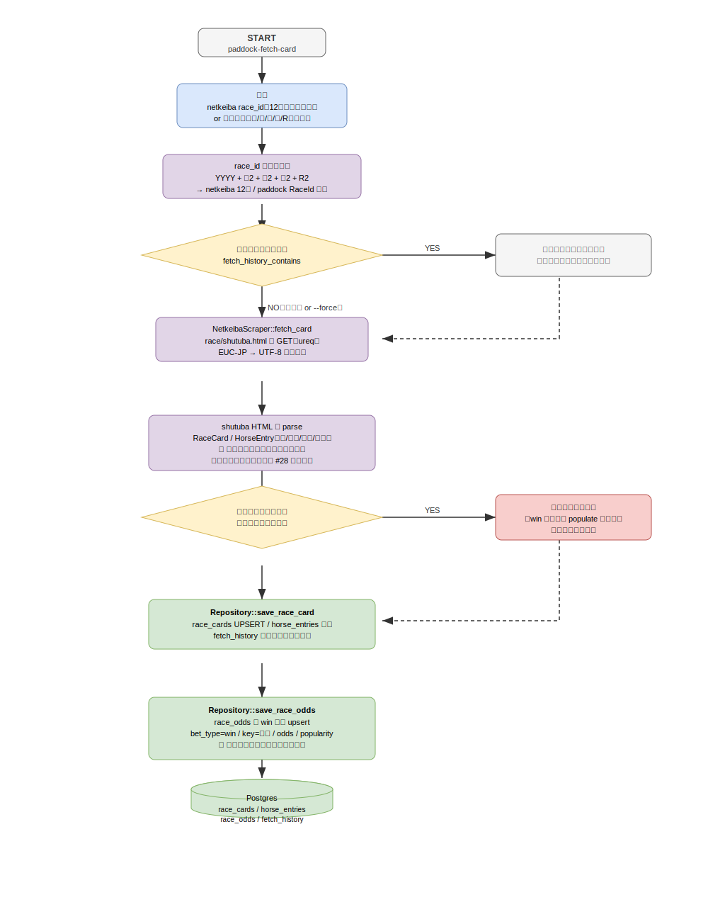

# netkeiba 当日データソース取り込み 仕様書

Issue #28 対応。当日（これから走る）レースの **出馬表と単勝オッズ・人気** を netkeiba から取得し、
`race_cards` / `horse_entries` / `race_odds` に取り込む。

## 概要



paddock のデータ取得は現状 JRA 公式 PDF が前提で、当日入力を自動で揃えられない。

- `parse-pdf fetch` は**結果(seiseki) PDF 専用**で、これから走るレースの出馬表は取得できない。
- 出馬表は `parse-entries` で扱えるが**自動取得の口が無く**、JRA は出馬表を予測可能な固定 URL で配信していない。
- **オッズの永続化(`race_odds`)が未実装**で、`predict` のライブセッションは買い目推奨(EV・Kelly)を出せずスキップになる(#25)。

netkeiba の出馬表ページ(`race/shutuba.html`、EUC-JP)は **出走馬・単勝オッズ・人気が 1 ページ**に揃っており、
`predict` が必要とする `race_cards` と `race_odds` を一括で満たせる。本仕様はこれを当日データソースとして取り込む
新規アプリ `paddock-fetch-card` と、`race_odds` 永続化基盤を定義する。

レイヤー方針: 取得は **新しい取得アダプタ(interface 層)** として追加し、**ドメイン(`RaceCard` / `RaceOdds`)は変更しない**。

---

## スコープ

### 本仕様で実装する

| 項目 | 内容 |
|------|------|
| 出馬表取得 | netkeiba race_id を指定し、枠番・馬番・馬名・騎手を取得して `race_cards` / `horse_entries` に取り込む |
| 単勝オッズ・人気取得 | netkeiba のオッズ API(`type=1`)から単勝オッズ・人気を取得し `race_odds`(単勝)へ保存 |
| race_id 構築 | 構成要素(年/場/回/日/R)からの race_id 構築を支援 |
| 文字コード | 出馬表は EUC-JP → UTF-8 変換を内部で吸収。オッズ API は UTF-8 JSON |
| 取得済み管理 | 出馬表は `fetch_history` 相当で二重取得を抑止 |
| race_odds 永続化 | 汎用スキーマ(`race_odds` テーブル + `save_race_odds`)を新設 |

### スコープ外（別 Issue）

| 項目 | Issue |
|------|-------|
| 組合せ券種オッズ(馬連・ワイド・3連複等)の取得と永続化 | #38 |
| 確定結果の自動取得・予想セッションの自動精算 | #40 |
| 斤量・性齢など未活用特徴量の予想活用（ドメイン拡張を伴う） | #31 |

> 斤量・性齢は shutuba ページに存在するが、現行ドメイン `HorseEntry`(枠番/馬番/馬名/騎手)には対応フィールドが無い。
> 本仕様では**ドメインを変更しない**方針に従い、取得しても破棄する（保存しない）。活用は #31 でドメイン拡張とあわせて行う。

---

## 取得対象ページと項目

### 出馬表ページ

```
https://race.netkeiba.com/race/shutuba.html?race_id=<netkeiba_race_id>
```

出馬表ページの**静的 HTML には単勝オッズ・人気が含まれない**（`---.-` / `**` のプレースホルダで、JS が別 API から描画する）。したがって出馬表(カード)とオッズは別経路で取得する **2-fetch 構成**とする。

| 取得項目 | 用途 | 保存先 | 取得元 |
|---------|------|-------|-------|
| 枠番 | `HorseEntry.gate_num` | horse_entries | 出馬表 HTML(`td.Waku`) |
| 馬番 | `HorseEntry.horse_num` | horse_entries | 出馬表 HTML(`td.Umaban`) |
| 馬名 | `HorseEntry.horse_name` | horse_entries | 出馬表 HTML(`td.HorseInfo a`) |
| 騎手 | `HorseEntry.jockey` | horse_entries | 出馬表 HTML(`td.Jockey a`) |
| 芝/ダ・距離 | `RaceCard.surface` / `distance` | race_cards | 出馬表 HTML(`div.RaceData01`) |
| 開催日 | `RaceCard.date` | race_cards | 出馬表 HTML(`YYYY年M月D日`) |
| (斤量・性齢) | — | 破棄(スコープ外) | — |

`RaceCard.venue` / `round` / `day` / `race_num` は race_id（12桁）から導出する。

### 単勝オッズ API

```
https://race.netkeiba.com/api/api_get_jra_odds.html?race_id=<netkeiba_race_id>&type=1&action=update
```

UTF-8 の JSON を返す。`data.odds["1"]` が単勝で、キー=馬番2桁ゼロ詰め、値=`[オッズ, "0.0", 人気]`。

| 取得項目 | 用途 | 保存先 |
|---------|------|-------|
| 単勝オッズ | `race_odds.odds`(bet_type=win) | race_odds |
| 人気 | `race_odds.popularity` | race_odds |

レース前で未確定(`---.-`)の馬は除外する。`type=4` 以降の組合せ券種は #38 で扱う。

---

## race_id 構築規則

netkeiba race_id は 12 桁: **`YYYY` + 競馬場2桁 + 開催回2桁 + 日次2桁 + レース番号2桁**。

例: `202605030211` = 2026年・東京(05)・3回・2日・11R(安田記念)

### 競馬場コード

| コード | 競馬場 | コード | 競馬場 |
|--------|--------|--------|--------|
| 01 | 札幌 | 06 | 中山 |
| 02 | 函館 | 07 | 中京 |
| 03 | 福島 | 08 | 京都 |
| 04 | 新潟 | 09 | 阪神 |
| 05 | 東京 | 10 | 小倉 |

### 入力方法

- **直接指定**: 12 桁 race_id をそのまま渡す。
- **構成要素指定**: 年・競馬場(日本語名 or slug)・回・日・R を渡し、ヘルパで 12 桁を組み立てる。

paddock 内部の `RaceId` も同じ 12 桁構成要素から導出する（既存の race_card / race_odds と突合できるキーにする）。

---

## race_odds 永続化スキーマ

券種を限定しない**汎用 1 テーブル**として設計する。#28 では単勝(win)のみ populate し、
#38 で組合せ券種(馬連・ワイド・3連複 等)を**マイグレーション再設計なし**で追加できるようにする。

### `race_odds` テーブル

| カラム | 型 | 説明 |
|--------|----|----|
| `race_id` | TEXT | レース識別子(paddock RaceId) |
| `bet_type` | TEXT | 券種(`win` / 将来 `place` / `quinella` / `wide` / `trio` …) |
| `combination_key` | TEXT | 組合せキー。単勝は馬番。組合せ券種は昇順連結(例 `03-07`) |
| `odds` | REAL | オッズ(ワイド/複勝は下限) |
| `odds_high` | REAL NULL | オッズ上限(ワイド/複勝のバンド用、単勝は NULL) |
| `popularity` | INTEGER NULL | 人気(取得できた場合) |
| `fetched_at` | TEXT | 取得時刻(ISO8601) |

- 主キー: `(race_id, bet_type, combination_key)`
- オッズは時々刻々変動するため、**取得のたびに最新値で upsert(上書き)** する。履歴保持はスコープ外。
- ドメイン `RaceOdds.win`(`HashMap<HorseNum, OddsValue>`)は人気を持たないため、人気は本テーブルのカラムとして
  scrape 結果から直接保存する（ドメイン型は変更しない）。

---

## 取得済み管理（dedup）

- **出馬表(静的)**: `fetch_history` 相当に「この race_id の出馬表を取得済み」を記録し、再実行時はスキップする。
  `--force` で再取得を強制できる。
- **オッズ(変動)**: dedup しない。実行のたびに取得し、`race_odds` を最新値で upsert する。

> 出馬表をスキップした場合でも、オッズ取得・更新は継続する（フロー図の右側分岐）。

---

## エラー・欠損ハンドリング

| ケース | 挙動 |
|--------|------|
| 単勝オッズ未確定(レース前で空欄) | win を populate せず空のまま。出馬表の保存は継続 |
| 不正な race_id(桁数・競馬場コード不正) | バリデーションエラーを stderr に出力し exit code 1。パニックしない |
| ページ取得失敗(ネットワーク/404) | エラーとして報告。パニックしない |
| EUC-JP 不正バイト | `encoding_rs` の置換に委ね、可能な範囲で parse を継続 |

---

## CLI

```
paddock-fetch-card <netkeiba_race_id>
paddock-fetch-card --year 2026 --venue 東京 --round 3 --day 2 --race 11
```

オプション(予定):

| オプション | 説明 |
|-----------|------|
| `--year / --venue / --round / --day / --race` | 構成要素から race_id を組み立てる |
| `--force` | 出馬表が取得済みでも再取得する |
| `--interval` | netkeiba への連続リクエスト間隔(秒、既定値あり) |

スクレイピング対象は公開ページ。既定ウェイトを入れ netkeiba 側へ配慮する。

---

## 留意（既知の前提）

- **騎手名は netkeiba の略称表記**（例「戸崎圭」）で保存する。JRA PDF 由来の正式名（「戸崎圭太」）とは
  表記が異なるため、クロスソースで騎手成績(`jockey_stats`)を突き合わせる際は取りこぼし得る。
  netkeiba 内では整合する。正規化が必要になれば別 Issue で扱う。
- `RaceCard.venue`/`round`/`day`/`race_num` は race_id 由来、`surface`/`distance`/`date` は HTML 由来で、
  両者の整合チェックは行わない（誤った race_id を渡した場合の検出は本仕様のスコープ外）。

---

## 関連

- ADR: [0008 netkeiba を当日データソースに採用](../adr/0008-netkeiba-same-day-datasource.md)
- 関連 Issue: #25(オッズ→predict 結線)、#38(組合せ券種オッズ)、#40(結果自動精算)、#31(未活用特徴量)
- CLI テストケース: `tests/cli-test-cases/fetch-card-command.md`
