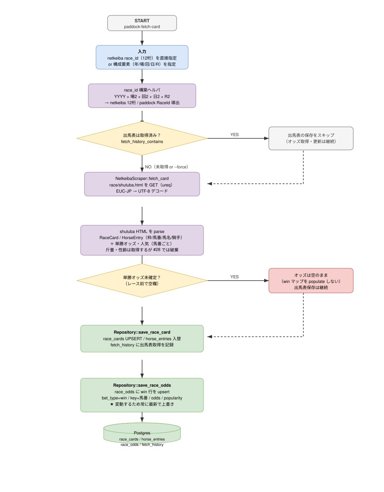

---
# knowledge 規約に基づくメタデータ（docs/knowledge/README.md）。specifications はその場で
# knowledge に昇格（ADR 履歴・相互リンクを壊さないため物理移動しない）。
status: Confirmed
kind: knowledge
doc_class: [D10, D08, D09]
tags: [D10, D08, D09]
sources:
  - docs/original-docs/0001-jra-odds-scraper.md
  - docs/original-docs/0008-netkeiba-same-day-datasource.md
  - docs/original-docs/0010-persist-and-reference-odds.md
  - docs/original-docs/0048-retire-jra-odds-scraper-for-netkeiba.md
  - docs/original-docs/0049-netkeiba-odds-transient-retry-and-degraded-exit.md
  - docs/original-docs/0075-unsupported-race-skip-exit-zero.md
  - docs/original-docs/0086-netkeiba-unpriced-sentinel-is-not-odds.md
  - docs/original-docs/0088-bet-type-scoped-unpriced-sentinels.md
  - docs/original-docs/0089-unpriced-bet-type-observation.md
distilled_from_sha: "de42b8c"
updated: "2026-08-19"
---

# netkeiba 当日データソース取り込み 仕様書

Issue #28 対応。当日（これから走る）レースの **出馬表と単勝オッズ・人気** を netkeiba から取得し、
`race_cards` / `horse_entries` / `race_odds` に取り込む。

## 概要



paddock のデータ取得は現状 JRA 公式 PDF が前提で、当日入力を自動で揃えられない。

- `parse-pdf fetch` は**結果(seiseki) PDF 専用**で、これから走るレースの出馬表は取得できない。
- 出馬表は `parse-entries` で扱えるが**自動取得の口が無く**、JRA は出馬表を予測可能な固定 URL で配信していない。
- **オッズの永続化(`race_odds`)が未実装**で、`predict` のライブセッションは買い目推奨(EV・Kelly)を出せずスキップになる(#25)。

netkeiba の出馬表ページ(`race/shutuba.html`、EUC-JP)は **出走馬・単勝オッズ・人気が 1 ページ**に揃っており、
`predict` が必要とする `race_cards` と `race_odds` を一括で満たせる。本仕様はこれを当日データソースとして取り込む
新規アプリ `paddock-fetch-card` と、`race_odds` 永続化基盤を定義する。

レイヤー方針: 取得は **新しい取得アダプタ(interface 層)** として追加し、**ドメイン(`RaceCard` / `RaceOdds`)は変更しない**。

---

## スコープ

### 本仕様で実装する

| 項目 | 内容 |
|------|------|
| 出馬表取得 | netkeiba race_id を指定し、枠番・馬番・馬名・騎手を取得して `race_cards` / `horse_entries` に取り込む |
| 単勝オッズ・人気取得 | netkeiba のオッズ API(`type=1`)から単勝オッズ・人気を取得し `race_odds`(単勝)へ保存 |
| race_id 構築 | 構成要素(年/場/回/日/R)からの race_id 構築を支援 |
| 文字コード | 出馬表は EUC-JP → UTF-8 変換を内部で吸収。オッズ API は UTF-8 JSON |
| 取得済み管理 | 出馬表は `fetch_history` 相当で二重取得を抑止 |
| race_odds 永続化 | 汎用スキーマ(`race_odds` テーブル + `save_race_odds`)を新設 |

### スコープ外（別 Issue）

| 項目 | Issue |
|------|-------|
| 組合せ券種オッズ(馬連・ワイド・3連複等)の取得と永続化 | #38 |
| 確定結果の自動取得・予想セッションの自動精算 | #40 |
| 斤量・性齢など未活用特徴量の予想活用（ドメイン拡張を伴う） | #31 |

> 斤量・性齢は shutuba ページに存在するが、現行ドメイン `HorseEntry`(枠番/馬番/馬名/騎手)には対応フィールドが無い。
> 本仕様では**ドメインを変更しない**方針に従い、取得しても破棄する（保存しない）。活用は #31 でドメイン拡張とあわせて行う。

---

## 取得対象ページと項目

### 出馬表ページ

```
https://race.netkeiba.com/race/shutuba.html?race_id=<netkeiba_race_id>
```

出馬表ページの**静的 HTML には単勝オッズ・人気が含まれない**（`---.-` / `**` のプレースホルダで、JS が別 API から描画する）。したがって出馬表(カード)とオッズは別経路で取得する **2-fetch 構成**とする。

| 取得項目 | 用途 | 保存先 | 取得元 |
|---------|------|-------|-------|
| 枠番 | `HorseEntry.gate_num` | horse_entries | 出馬表 HTML(`td.Waku`) |
| 馬番 | `HorseEntry.horse_num` | horse_entries | 出馬表 HTML(`td.Umaban`) |
| 馬名 | `HorseEntry.horse_name` | horse_entries | 出馬表 HTML(`td.HorseInfo a`) |
| 騎手 | `HorseEntry.jockey` | horse_entries | 出馬表 HTML(`td.Jockey a`) |
| 芝/ダ・距離 | `RaceCard.surface` / `distance` | race_cards | 出馬表 HTML(`div.RaceData01`) |
| 開催日 | `RaceCard.date` | race_cards | 出馬表 HTML(`YYYY年M月D日`) |
| レース名 | `RaceCard.race_name`（#389・best-effort） | race_cards | 出馬表 HTML(`h1.RaceName`。グレードは含まない) |
| 格付け | `RaceCard.race_class`（#345・best-effort） | race_cards | 出馬表 HTML(`<title>`グレード＋`div.RaceData02`条件) |
| (斤量・性齢) | — | 破棄(スコープ外) | — |

`RaceCard.venue` / `round` / `day` / `race_num` は race_id（12桁）から導出する。

### 単勝オッズ API

```
https://race.netkeiba.com/api/api_get_jra_odds.html?race_id=<netkeiba_race_id>&type=1&action=update
```

UTF-8 の JSON を返す。`data.odds["1"]` が単勝で、キー=馬番2桁ゼロ詰め、値=`[オッズ, "0.0", 人気]`。

| 取得項目 | 用途 | 保存先 |
|---------|------|-------|
| 単勝オッズ | `race_odds.odds`(bet_type=win) | race_odds |
| 人気 | `race_odds.popularity` | race_odds |

レース前で未確定(`---.-`)の馬は除外する。単勝・複勝は `type=1`、組合せ券種（馬連・ワイド・馬単・
三連複・三連単）は `type=4/5/6/7/8` で取得する（#102 / #187）。fetch-card の保存も、predict /
predict-watch / api-server の live scrape（`OddsInteractor` への `UreqNetkeibaScraper` 注入）も
すべてこの netkeiba オッズ API（UTF-8 JSON）に統一されている（#287 / ADR 0048。旧 JRA odds-scraper は撤去）。

---

## race_id 構築規則

netkeiba race_id は 12 桁: **`YYYY` + 競馬場2桁 + 開催回2桁 + 日次2桁 + レース番号2桁**。

例: `202605030211` = 2026年・東京(05)・3回・2日・11R(安田記念)

### 競馬場コード

| コード | 競馬場 | コード | 競馬場 |
|--------|--------|--------|--------|
| 01 | 札幌 | 06 | 中山 |
| 02 | 函館 | 07 | 中京 |
| 03 | 福島 | 08 | 京都 |
| 04 | 新潟 | 09 | 阪神 |
| 05 | 東京 | 10 | 小倉 |

### 入力方法

- **直接指定**: 12 桁 race_id をそのまま渡す。
- **構成要素指定**: 年・競馬場(日本語名 or slug)・回・日・R を渡し、ヘルパで 12 桁を組み立てる。

paddock 内部の `RaceId` も同じ 12 桁構成要素から導出する（既存の race_card / race_odds と突合できるキーにする）。

---

## race_odds 永続化スキーマ

券種を限定しない**汎用 1 テーブル**として設計する。#28 では単勝(win)のみ populate していたが、
#38 で組合せ券種(馬連・ワイド・馬単・3連複・3連単)を**マイグレーション再設計なし**で追加した
（`bet_type`/`combination_key` 汎用列にそのまま載る）。

### `race_odds` テーブル

| カラム | 型 | 説明 |
|--------|----|----|
| `race_id` | TEXT | レース識別子(paddock RaceId) |
| `bet_type` | TEXT | 券種(`win` / `place` / `quinella` / `wide` / `exacta` / `trio` / `trifecta`) |
| `combination_key` | TEXT | 組合せキー。単勝は馬番。組合せ券種は昇順連結(例 `03-07`) |
| `odds` | REAL | オッズ(ワイド/複勝は下限) |
| `odds_high` | REAL NULL | オッズ上限(ワイド/複勝のバンド用、単勝は NULL) |
| `popularity` | INTEGER NULL | 人気(取得できた場合) |
| `fetched_at` | TEXT | 取得時刻(ISO8601) |

- 主キー: `(race_id, bet_type, combination_key)`
- オッズは時々刻々変動するため、**取得のたびに最新値で upsert(上書き)** する。履歴保持はスコープ外。
- ドメイン `RaceOdds.win`(`HashMap<HorseNum, OddsValue>`)は人気を持たないため、人気は本テーブルのカラムとして
  scrape 結果から直接保存する（ドメイン型は変更しない）。

### 未発売の番兵値（#621・[ADR 0086](../original-docs/0086-netkeiba-unpriced-sentinel-is-not-odds.md)、券種スコープ化 #630/#634・[ADR 0088](../original-docs/0088-bet-type-scoped-unpriced-sentinels.md)）

netkeiba は**未発売・該当なしの組み合わせ**に固定の番兵値を入れる。**払戻倍率ではない**ので
オッズとして採用しない。**判定は券種スコープ**（ADR 0088。番兵は「その券種に netkeiba が入れる
固定値」であり、同じ値でも券種が違えば正当な配当——ワイドの `9999.9` は番兵、三連複の `9999.9` は
正当。9000〜11000 帯に trio 6,244 行・trifecta 56,230 行の正当配当が実在=2026-08-18 実測）。

| 券種 | 番兵値 | 備考（DB 実測） |
|---|---|---|
| 単勝 / 複勝 | **（番兵なし）** | 番兵値の行は 0 行（#634・2026-08-18）。未発売の馬は行ごと欠ける形で観測される |
| ワイド | `9999.9` | 相方が `odds_high=0.0` になるため、従来は**下限違反として偶然弾かれていた**（DB には 0 行） |
| 馬連 / 馬単 / 三連複 | `99999.9` | **ここが素通りして EV を壊していた**（#621 の実害。`race_odds` に trio 1,599 行 / exacta 859 行 / quinella 156 行） |
| 三連単 | `999999.9` | 33,176 行（2026-08-18）。**DB に残っていた番兵値 2 種のうち、issue が挙げていなかった方** |

- **判定は券種ごとの特定値の除外**（epsilon `1e-6` 比較）。**上限方式は採らない**——三連単には
  `111971.9` / `200886.6` のような正当な高配当が実在し、上限は大穴を殺す。ADR 0086 が許容していた
  誤爆（他券種の番兵値と同値の正当配当を落とす）は ADR 0088 で撤回した。
- 判定は `OddsValue::try_from((BetType, f64))`（`src/domain/src/odds/odds_value.rs`）の 1 か所。
  **券種は必須入力**で、`TryFrom<f64>` は存在しない——券種を渡し忘れた新しい呼び出し口は
  コンパイルエラーになる（ADR 0088）。`save_race_odds` と `find_race_odds` が委譲しているので
  **保存・読み出しの双方に効き、既に DB にある番兵行も読み出し時に券種別に無害化**される
  （既存行の DELETE は不要）。保存側は未知 `bet_type` ラベルの行を warn+skip する
  （券種を解決できない行は番兵ガードを通せないため書かない）。
- 番兵は `Error::UnpricedSentinel` として値域違反（`OutOfRange`）と区別し、**ログは `debug`**。
  「まだ売れていない」という正常な状態で 1 レースに数百件出るため、warn にすると本来の値域違反が
  埋もれる。
- **例外: ワイドの未発売行は保存時 `warn` のまま**。上表のとおり相方が `odds_high=0.0` になり、
  `save_race_odds::classify_row` は 1 行に値域違反が混ざれば warn 側を優先する（番兵に引っ張られて
  debug に落とすと本来見るべき残骸が埋もれるため）。ある値が番兵か否かは券種別（ADR 0088）だが、
  **warn / debug の分岐そのものは券種ではなく成分の内訳**で決まる。弾かれた成分が全部番兵なら band でも `debug` になる
  （`[9999.9, 9999.9]` の形。現行 netkeiba は返さないが契約として単体テストで固定）。読み出し側は
  成分ごとに判定するのでワイドの番兵も `debug`。「番兵起因の WARN は 0 行」という #621 の実測は
  `--overview`＝**読み出し経路**での計測であり、保存経路のワイドを含意しない。

#### 番兵リストの正本ファイル

正本は **`src/domain/src/odds/netkeiba_sentinels.txt`**（TAB 区切り `券種<TAB>値` の 2 列。
券種ラベルは Rust `BetType` の snake_case。**番兵を持たない券種＝win / place は行そのものを
置かない**。コメント行は書けない——両言語のパーサ規則を「空行スキップ + split」に保つ・ADR 0088）。
Rust と Python が**同じファイルを読む**。同じ値を両言語が別々に持つと片方だけ更新して静かに
ズレるため（#587 の見出し契約と同型の事故）、言語をまたぐ golden で結ぶ（ADR 0085 の前例）。

| 読む側 | 読み方 | ファイルが壊れると |
|---|---|---|
| Rust `src/domain/src/odds/odds_value.rs` | `const NETKEIBA_SENTINELS` を持ち、テスト `sentinel_list_matches_the_shared_golden` が `include_str!` で突き合わせる（`#[cfg(test)]` 内） | **テストビルド**が落ちる（本番ビルドは通る） |
| Python `scripts/predict-check/odds_guard.py` | **import 時**に読んで集合を作る | import した解析スクリプトが**起動時に**落ちる（**必ずパスを示し**、行に起因するものは行番号と該当行も出して停止する。空リストへのフォールバックはしない——番兵が素通りするため） |

Python 側は**欠落 / 列数不正（2 列でない行）/ 未知の券種ラベル / 非数値の値 / 非 UTF-8 保存 /
非有限値（`nan`・`inf`）/ 同一（券種, 値）の重複行 / 空**をすべて拒否する。重複判定は実行時の
番兵一致と同じ epsilon 比較（近接値のコピペ事故も同一扱い）。非有限を受理しないのは、番兵として登録しても
`abs(o - nan) < ε` が常に偽になり**その値だけが黙って無効化**されるため（空を拒否するのと同じ理由）。
Rust 側は golden を const と完全一致（券種・値・順序）で突き合わせるので、同じ壊れ方は
`sentinel_list_matches_the_shared_golden` が落とす。

**`testdata/` に置かない。** Python が import 時に読む**本番依存**であり、テスト専用資産ではない。

**番兵値を足すときは 3 か所を同じ PR で更新する**: この正本ファイル / Rust の `NETKEIBA_SENTINELS` /
`scripts/predict-check/test_odds_guard.py` の期待 dict。どれか 1 つを忘れれば Rust か Python の
テストが落ちる。win / place に番兵を足す（＝行を置く）ときは、Rust の
`win_and_place_have_no_sentinels` が落ちるので #634 の実測を覆す根拠を PR に示す。

`scripts/` が Rust のガードを通らないのは、psql / TSV で DB を直読みするため（値オブジェクトを
一切経由しない）。Python の公開 API も券種必須（`is_sentinel(bet_type, odds)` /
`is_payout_odds(bet_type, odds)`・未知ラベルは `ValueError`）で、既定値による更新漏れの素通りを
塞ぐ（ADR 0088）。

### 保存したオッズの読み出しと read-through（ADR 0010）

書き込み（fetch-card → `race_odds`）だけがあって読み出しが無い状態を解消した決定。

- **`Repository::find_race_odds(race_id, as_of)`**: `race_odds` をドメイン `RaceOdds` に再構成する。
  `as_of = Some(d)` は `date(fetched_at) <= d` のスナップショットに限定し（**backtest のリーク防止**）、
  `None` は時刻制約なし（predict）。
- **predict は read-through**: 保存済みがあればそれを返し、無ければライブスクレイプして保存してから返す。
- **backtest は当時オッズ優先・PDF フォールバック**: `find_race_odds(race_id, Some(race.date))` の win が
  あればそれ、無ければ PDF 確定成績の単勝を使う。保存オッズが無い過去レースでも既存の長期バックテストが
  壊れない（移行コストゼロ）。
- **cache-hit 判定の基礎は `RaceOdds::is_complete()`**（win + 組合せ 5 券種がそろう）。当初の「保存済みが
  空でない」判定では、組合せ券種の一部が欠けた**部分スナップショット**が cache-hit してしまい、欠落券種が
  当日ずっと取り直されなかった（#294 で強化）。`race_odds` は単一行 UPSERT なので、再スクレイプは欠けていた
  行を足すだけで既存行を消さない＝保存済み券種は単調に埋まり complete に収束する（自己修復）。
- **`place` は cache-hit 条件に含めない**。netkeiba は win と同梱で複勝を返すため通常そろうが、発走前の
  複勝未公開で再スクレイプが無限化するのを避ける。
- **欠落のうち「未発売と確認できた券種」は差し引く（ADR 0089・#632）**。`is_complete()` だけを見ると、
  券種がまるごと未発売の時間帯（前日プリフェッチ）は当該券種が永久に 0 行になり
  （番兵は `race_odds` に入らない・ADR 0086）、read-through を呼ぶたびに 6 GET のフルスクレイプが走る。
  netkeiba 経路には RateGate が無く（ADR 0049）IP ブロックが最重要運用リスク（ADR 0068）なので、
  構造で止める。
  - **cache-hit の式**: 保存済みの欠落券種（`RaceOdds::missing_bet_types()`）が、**TTL 15 分以内の
    未発売観測にすべて収まる**なら再スクレイプしない。
  - **未発売の判定は「取得に成功したのに priced が 0 件か」**。「全行が番兵か」では判定しない
    ——実地のワイド未発売行は `["9999.9", "0.0", "--"]` で相方 `0.0` が値域違反として弾かれるため、
    番兵の有無だけを見ると取りこぼす。JRA がそもそも売らない極小頭数レースの券種（0 行）も同じ経路で拾う。
  - **観測できた券種だけが対象**。スクレイパは取得に成功した券種を `FetchedExoticOdds::observed` で
    伝え、そこに無い券種（取得失敗・そもそも取りに行っていない）はマークしない＝次回そのまま
    取り直す＝**#294 の自己修復は鈍らない**。「失敗集合」でなく「観測集合」を持つのは、
    `Default`（空）が最も安全な解釈「何も観測していない」になるようにするため。
  - **安全側の絞り込みが 2 つ**: 単勝・複勝の観測は cache-hit 判定で無視する（win 空のまま
    cache-hit するのを防ぐ）／`observed_at` が未来の観測は stale 扱いにする（時計ズレで再取得が
    止まらないように）。
  - **効くのは「単勝は取れるが組合せ券種が未発売」の状態**。全券種が空のレース（単勝すら未公開）と
    `fetch-card` 自身は観測を残さないので、そこは従来どおり取り直す（ADR 0089「影響」）。
  - 観測は専用表 `race_odds_unpriced_observations(race_id, bet_type, observed_at)` に置く
    （番兵はオッズではないので `race_odds` に入れない・ADR 0086 決定 1/3）。priced が取れた券種の
    マークは同一トランザクションで削除する。
  - **TTL 15 分＝発売開始に気づくまでの最大遅れ**。発走直前の鮮度は `predict-watch`
    （read-through を通らず毎回再取得・#257）が担保するので判断には影響しない。
  - **`is_complete()` の意味は変えていない**（priced が全券種そろっているか）。したがって
    `find_race_odds_morning` の「朝時点」定義は挙動不変（ADR 0088 / `rest-api-read.md`）。
  - 単複のみの取得（odds-collect）は組合せ券種を観測しないので未発売マークを作らない。
- 当初は win+place 限定だったが、**#38 で全券種**（馬連・ワイド・馬単・3連複・3連単）に拡張済み。
  `combination_key` の規約はドメイン型の `to_key`/`from_key` が単一情報源（昇順 `-` 連結、順序付きは `>` 連結）。
  `BetType` で解釈できない未知ラベルの行は読み飛ばす（新版が書いた券種を旧版で読む過渡期でも止めない）。
- **時刻比較の粗さ**: 当時オッズ参照は `date(fetched_at)`(UTC) と `race.date`(JST 開催日) の日付比較。
  TZ 境界は厳密でないが、fetch-card / predict をレース前に走らせる運用前提で実害は小さい。

### transient リトライと degraded（ADR 0049）

「取れなかった」を**未発売**と**一過性障害**に機械的に分ける。混同すると、本来取れるはずのオッズの
欠落がサイレントに握り潰される。

- **共有 GET ヘルパ `call_with_retry`** が transient 失敗時に最大 3 回（初回 + 2 回）・指数バックオフ
  （1s / 2s）で再試行する。transient は `Timeout` / `Io` / `ConnectionFailed` / `HostNotFound` /
  `Protocol` / 5xx。リトライは I/O 層の性質として `fetch_utf8` / `fetch_decoded` の双方に効かせる
  （オッズ以外の出馬表・近走・払戻も同時に resilience が上がる）。
- **netkeiba に 403/404=absent の概念は無い**。未発売は 200 + JSON status で返るため、4xx は単純に
  非 transient として扱う。
- **degraded になるのは単複オッズ取得の失敗だけ**。それ以外はハード失敗か best-effort に分かれる:
  - **card 取得段の出馬表**（`fetch_card`）の失敗 → ハード失敗（exit 1）
  - **組合せ券種（exotic）オッズ**の失敗 → **警告のみ・単複だけ保存して exit 0**。部分スナップショットは
    cache-hit 判定 `is_complete()` が false のままなので、次回 read-through で欠けた券種が埋まる（自己修復）。
    **失敗した券種に未発売マークは付かない**ので、ADR 0089 の TTL でこの自己修復が遅れることはない
  - **近走取り込み段**（`horse_history`）で引く出馬表・馬ページの失敗 → **警告のみ・exit 0**
    （`shutuba_failed` / `horses_failed` に計上）。card / オッズ保存まで成功した実行を近走の失敗で
    巻き添えにしない。**card 取得済みで再実行すると必ずこの経路を通る**ので、近走が 1 件も
    取れなくても終了コードは 0 になる——件数はログで見る
- **未発売は best-effort**（出馬表・近走を巻き添えにせず継続）、**transient は degraded**。degraded では
  **オッズ保存をまるごとスキップする**——win 欠落の部分スナップショットを永続化すると predict が
  「オッズ有り・win 無し」で誤判定するため。保存しない方が「オッズ未取得」として扱われ、再取得で正される。
- **degraded は専用 exit code = 3**。`fetch-card` は主目的（近走取り込み）まで終えてから 3 を返すので、
  呼び出し側はハード失敗（=1）と「単複だけ未取得・要再取得」を区別でき、win 欠落レースだけ再取得できる。

### 取り込み対象外レース（障害）のスキップ（ADR 0075）

「対応外だからスキップした」と「netkeiba 側で失敗した」を、**終了コードと stdout で区別できる**形にする。
混同すると、開催日の全レースをループ取得したとき 1 件の欠落が無視してよいものか取り込み失敗かを
件数 diff でしか判別できない。

- **障害レースは取り込み対象外**。判定は `RaceData01` の**距離付き馬場マーカー**で行い、`障3000m`・
  `障芝3000m`・`障ダ2900m` のいずれの表記でも拾う（単文字クラスだと `障芝3000m` で `芝3000m` に
  マッチし、障害レースが芝レースとして黙って取り込まれる）。`parse_card` は `Error::Unsupported` を返し、
  実障害（`Error::Parse` → `Internal` → exit 1）とは別 variant で ingest / CLI まで伝わる。
- **ingest はカード・オッズ・近走のすべてを打ち切る**（DB は一切変更しない）。カード無しでオッズだけ
  保存すると `race_cards` に対応行の無い孤児オッズが残り、近走取り込みは障害レースでも成功して
  しまうため。
- **CLI は理由を stdout に明示して exit 0**。専用 exit code は作らない——障害レースが実際に到達する
  消費側は「netkeiba の開催一覧からレースを列挙して回すループ」（`scripts/predict-check/README.md` の
  手順）で、exit code だけでレース単位の成否を判断するため、専用コードでは対応外レースが取り込み失敗に
  計上されてしまう。
- 馬場・距離表記が読めない場合や `RaceData01` 欠落は従来どおり実障害（exit 1）。**「対応外」は広げない**。
- **スキップの識別には stdout の読み取りが要る**（exit code だけでは正常取り込みと区別できない）。
  当該**行の行頭**が `スキップ: ` 固定（tracing のログ行が同じ stdout に混ざるため行単位で照合する）。
  **stdout を捨てる消費側（`refresh_ev.sh` は `> /dev/null`）からは追えない**——
  stderr には出さない（同スクリプトが「stderr あり」を異常として警告するため、正常な結果を警告に
  化けさせない）。tracing も既定 writer が stdout なので代替にならない。
- 却下案（ADR 0075 に詳細）: 専用 exit code の新設 / `IngestCardResponse` にフラグを足す（degraded と同型）/
  エラー文言の照合 / 障害レースを `Surface::Jump` として取り込む——いずれも採らない。

### スクレイパー実装の型（ADR 0001 由来）

JRA 版スクレイパーは ADR 0048 で退役したが、そこで確立した設計は netkeiba 版にも引き継いでいる。

- **HTTP クライアントは同期 `ureq` に統一**する（async ランタイムと 2 系統の HTTP スタックを混在させない）。
- **レイヤー配置は依存方向 Apps → Interface → Use-Case → Domain を厳守**する。ドメイン型
  （`BetType` / `OddsValue` / `PlaceOdds` / `Pair` / `OrderedPair` / `Triple` / `OrderedTriple` / `RaceOdds`）は
  domain、port トレイトは use-case、HTML/JSON パースと遷移層は interface の専用クレート。
- **検証は保存 fixture に対する純粋関数で行う**。ライブの遷移はサイト改変で壊れやすく開催日にしか
  実地検証できないため、価値の中心であるパース／ドメイン変換を純粋関数として切り出して決定論的に検証する。

---

## 取得済み管理（dedup）

- **出馬表(静的)**: `fetch_history` 相当に「この race_id の出馬表を取得済み」を記録し、再実行時はスキップする。
  `--force` で再取得を強制できる。
- **オッズ(変動)**: dedup しない。実行のたびに取得し、`race_odds` を最新値で upsert する。

> 出馬表をスキップした場合でも、オッズ取得・更新は継続する（フロー図の右側分岐）。

---

## エラー・欠損ハンドリング

| ケース | 挙動 |
|--------|------|
| 単勝オッズ未確定(レース前で空欄) | win を populate せず空のまま。出馬表の保存は継続 |
| 不正な race_id(桁数・競馬場コード不正) | バリデーションエラーを stderr に出力し exit code 1。パニックしない |
| 障害レース(取り込み対象外) | 取り込みを行わず理由を **stdout** に出して **exit 0**。DB は無変更。ハード失敗(1)・degraded(3) と区別する。ADR 0075 |
| **単複オッズ**の取得失敗（transient・リトライ後も残る） | **degraded**。オッズ保存をまるごとスキップし exit 3（出馬表・近走は保存済み）。ADR 0049 |
| **単複オッズ**の取得失敗（4xx 等の非 transient） | 同じく degraded 分岐（オッズ未保存・exit 3）。netkeiba に 403/404=absent の概念が無いため 4xx も「取れなかった」として扱う |
| **組合せ券種オッズ**の取得失敗 | warn して単複のみ保存・**exit 0**。`is_complete()` が false なので次回再取得で埋まる（失敗券種に未発売マークは付かないので TTL で遅れない・ADR 0089） |
| **組合せ券種オッズ**が未発売（番兵のみ / 0 行） | 当該券種を「未発売と確認」として `race_odds_unpriced_observations` に記録。read-through は TTL 15 分のあいだ取り直さない。ADR 0089 |
| **出馬表**ページの取得失敗（card 取得段） | `call_with_retry` のリトライ後も残ればハード失敗（exit 1）。degraded にはしない |
| **近走取り込み段**の取得失敗（出馬表・馬ページとも） | warn + skip して `shutuba_failed` / `horses_failed` に計上。**exit 0 のまま**（best-effort）。前走フォーム特徴量が欠けるので、ログの失敗件数を見る |
| EUC-JP 不正バイト | `encoding_rs` の置換に委ね、可能な範囲で parse を継続 |

---

## CLI

```
paddock-fetch-card <netkeiba_race_id>
paddock-fetch-card --year 2026 --venue 東京 --round 3 --day 2 --race 11
```

オプション(予定):

| オプション | 説明 |
|-----------|------|
| `--year / --venue / --round / --day / --race` | 構成要素から race_id を組み立てる |
| `--force` | 出馬表が取得済みでも再取得する |
| `--interval` | netkeiba への連続リクエスト間隔(秒、既定値あり) |

スクレイピング対象は公開ページ。既定ウェイトを入れ netkeiba 側へ配慮する。

### 終了コード

呼び出し側——netkeiba の開催一覧からレースを列挙して回すループ（`scripts/predict-check/README.md`
の手順）——が「本物の失敗」だけを FAIL として扱えるようにするための一次情報。

| コード | 意味 |
|--------|------|
| 0 | 正常終了（**取り込み対象外レース（障害）のスキップを含む**。ADR 0075） |
| 1 | ハード失敗（不正な race_id・ページ取得失敗・パース失敗・DB エラー） |
| 2 | 引数の形式不正（`clap` が stderr にエラーを出力。アプリのコードは関与しない） |
| 3 | degraded（単複オッズ未取得。card は保存済みで要再取得。ADR 0049） |

- **exit 0 は正常終了（対象外スキップを含む）**。対応外レースは異常ではないため exit 0 とし、理由は
  **stdout** に出力する（`predict` の「開催なし日付」と同じ規約。[predict-session.md](predict-session.md) 参照）。
  **取り込み失敗として数えてよいのは 1 だけ**——3 は card 保存済みでオッズのみ要再取得なので、
  FAIL に丸めると「win だけ再取得すればよい」判断を落とす。
- ただし **exit 0 だけでは「取り込んだ」と「対象外でスキップした」を区別できない**。区別が要る消費側は
  stdout を**行単位**で見て `スキップ: ` で始まる行を探す（stdout には tracing のログ行が先行しうるため、
  出力全体の先頭で照合しない）。

---

## 留意（既知の前提）

- **騎手名は netkeiba の略称表記**（例「戸崎圭」）で保存する。JRA PDF 由来の正式名（「戸崎圭太」）とは
  表記が異なるため、クロスソースで騎手成績(`jockey_stats`)を突き合わせる際は取りこぼし得る。
  netkeiba 内では整合する。正規化が必要になれば別 Issue で扱う。
- `RaceCard.venue`/`round`/`day`/`race_num` は race_id 由来、`surface`/`distance`/`date` は HTML 由来で、
  両者の整合チェックは行わない（誤った race_id を渡した場合の検出は本仕様のスコープ外）。

---

## 関連

- ADR: [0008 netkeiba を当日データソースに採用](../original-docs/0008-netkeiba-same-day-datasource.md) /
  [0001 JRA オッズスクレイパー](../original-docs/0001-jra-odds-scraper.md)（設計の型・0048 で退役）/
  [0010 オッズの永続化と参照](../original-docs/0010-persist-and-reference-odds.md) /
  [0048 JRA スクレイパー退役](../original-docs/0048-retire-jra-odds-scraper-for-netkeiba.md) /
  [0049 transient リトライと degraded exit](../original-docs/0049-netkeiba-odds-transient-retry-and-degraded-exit.md) /
  [0075 対応外レースは exit 0 + stdout 明示でスキップ](../original-docs/0075-unsupported-race-skip-exit-zero.md)
- 関連 Issue: #25(オッズ→predict 結線)、#38(組合せ券種オッズ)、#40(結果自動精算)、#31(未活用特徴量)、#586(対応外レースのスキップ)
- CLI テストケース: `tests/cli-test-cases/fetch-card-command.md`
