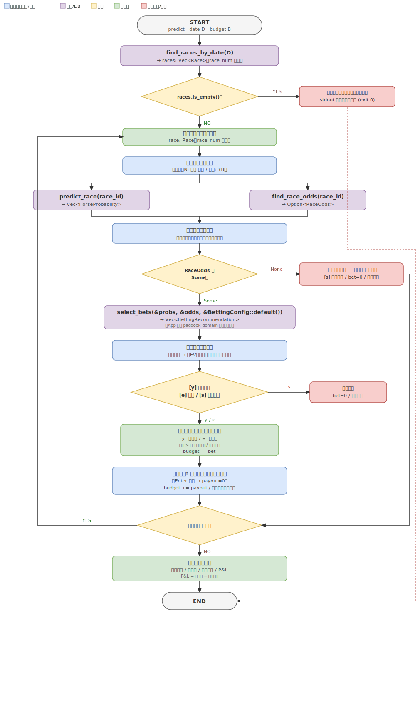

# predict バイナリ: 対話型レーシングセッション

[Issue #13](https://github.com/taito-station/paddock/issues/13)

## 概要

1 日分のレースを順番に処理する対話型 CLI バイナリ `paddock-predict` を実装する。  
ユーザーは買い目推奨を確認しながら賭け金と払い戻しを記録し、1 日を通した残高管理を行う。



---

## CLI インターフェース

```
paddock-predict --date <YYYY-MM-DD> --budget <金額>
```

| オプション | 型 | 必須 | 説明 |
|-----------|-----|------|------|
| `--date`  | `NaiveDate` | ○ | 対象開催日（例: `2026-06-01`） |
| `--budget` | `u64` | ○ | 初期予算（円単位、例: `10000`） |

### 終了コード

| コード | 意味 |
|--------|------|
| 0 | 正常終了（開催なし日付を含む） |
| 1 | DB 接続エラー / 実行中の DB I/O・クエリエラー |
| 2 | 引数パースエラー（`--date` / `--budget` の形式不正等） |

- 「開催なし日付」は異常ではないため exit code 0 とし、案内メッセージは **stdout** に出力する。
- 引数の形式不正（不正な日付・非数値の budget 等）は clap が自動で stderr にエラーを出力し **exit code 2** で終了する（既存 `analyze` バイナリと同じ `clap::Parser` 構成のため）。exit 1 はアプリ内部の DB エラーに限定する。

---

## UX フロー

### 起動

```
$ paddock-predict --date 2026-06-01 --budget 10000

=== 2026-06-01 開催 — 6 レース ===
初期予算: ¥10,000
```

### レース単位の対話ループ

```
--- レース 1: 東京 芝 1600m ---
残高: ¥10,000

馬番  馬名              勝率    連対率  複勝率
   1  アイネスフウジン   18.2%   35.1%   52.3%
   2  ダイナコスモス     12.4%   24.8%   38.7%
   ...

【買い目推奨】
  馬連  1-3   EV=1.42  Kelly=15%  推奨額=¥1,500
  馬単  1→3   EV=1.28  Kelly=8%   推奨額=¥800
  単勝  1     EV=1.15  Kelly=5%   推奨額=¥500

購入方法を選んでください [y=推奨通り / e=編集 / s=スキップ] > y

>>> レース後 <<<
実際の払い戻し額を入力 (なし: Enter のみ) > 4200

  賭け金: ¥2,800  払戻: ¥4,200  (+¥1,400)
残高: ¥11,400
```

選択肢の意味:

| キー | 意味 | 動作 |
|------|------|------|
| `y` | 推奨通り購入 | Kelly 配分で算出した推奨額をそのまま確定する |
| `e` | 金額を編集 | 各買い目の金額を対話入力する（`0` 入力でその買い目をスキップ） |
| `s` | スキップ | このレースは購入せず賭け金 ¥0 で次へ進む |

### e（編集）モード

```
購入方法を選んでください [y=推奨通り / e=編集 / s=スキップ] > e

  馬連 1-3  推奨¥1,500  入力額 > 1000
  馬単 1→3  推奨¥800    入力額 > 0
  単勝 1    推奨¥500    入力額 > 500

>>> レース後 <<<
実際の払い戻し額を入力 > ...
```

金額に `0` を入力するとその買い目をスキップ。

### 残高ガード

賭け金（`y` の推奨額合計、または `e` の入力額合計）が **現在残高を超える場合は確定できない**。

- `y`: 推奨額合計 > 残高 のとき、その旨を表示して `e`（編集）または `s`（スキップ）に誘導する
- `e`: 各買い目の入力時点で「残り賭け可能額」を表示し、累計が残高を超える入力は再入力を促す

これにより残高は常に 0 以上に保たれる（後述の `SessionState` を `u64` で表現できる根拠）。

### 一日集計

```
=== 2026-06-01 終了 ===
総賭け金:  ¥12,300
総払戻:    ¥15,600
最終残高:  ¥13,300
P&L:       +¥3,300
```

`P&L = 総払戻 − 総賭け金`（= 最終残高 − 初期予算 と常に一致する）。  
ここで「総賭け金」は **実際に budget から減算した確定額の累計**であり、推奨額そのものではない（残高ガードや端数切り捨て後の額）。確定額を積算する限り上記の恒等式は常に成立する。

---

## アーキテクチャ

### 新規バイナリ

```
src/apps/predict/
├── Cargo.toml
└── src/
    ├── bin.rs       # エントリポイント、tokio::main
    ├── cli.rs       # clap 引数定義
    ├── session.rs   # 対話セッションループ
    └── setup.rs     # DI 構築（analyze と同パターン）
```

`Cargo.toml` の `[[bin]]` 名は `paddock-predict`。  
ワークスペース `Cargo.toml` の `members` に `"src/apps/predict"` を追加する。

### セッション状態（App 層）

```rust
struct SessionState {
    budget: u64,        // 現在残高（円）— 残高ガードにより常に 0 以上
    total_bet: u64,     // 累計賭け金（実際に budget から減算した確定額の累計）
    total_payout: u64,  // 累計払い戻し
}
```

- CLI の `--budget`（`u64`）をそのまま初期 `budget` に代入するため型変換は不要
- 賭け金は残高ガードにより `budget` を超えないため、`budget -= bet` で桁あふれ（underflow）は発生しない
- `total_bet` は推奨額ではなく **実際に確定して budget から引いた額**を加算する（端数・ガード適用後の額）
- セッション状態はアプリ層でのみ管理し、Domain / Use-Case 層には持ち込まない

### 依存関係と呼び出し責務

> **更新（Issue #25 / ADR 0005）**: オッズ取得はメイン `Interactor` ではなく専用
> `OddsInteractor<O: OddsScraper>` 経由のオンデマンド・ライブスクレイプに変更した。
> スタブだった `Interactor::race_odds` / `Repository::find_race_odds` は撤去した。
> 以降の本節の記述はこの新方式を反映している。

```
src/apps/predict
    → paddock-use-case  (Interactor 経由: predict_race / races_by_date)
    → paddock-use-case  (OddsInteractor 経由: race_odds — 都度ライブスクレイプ)
    → paddock-domain    (App 層が直接呼ぶ純粋関数: select_bets)
    → odds-scraper      (OddsScraper 実装 UreqOddsScraper を OddsInteractor に注入)
    → rdb-gateway       (Repository 実装を Interactor に注入)
    → paddock-config    (環境変数)
```

呼び出し責務を明確化する:

- **確率推定・レース一覧**（IO を伴う）は **Use-Case の Interactor 経由**で呼ぶ
- **オッズ取得**（IO を伴う）は **Use-Case の `OddsInteractor` 経由**で呼ぶ（都度スクレイプ・キャッシュなし）
- **`select_bets`**（IO なしの純粋関数）は **App 層（`session.rs`）が `paddock-domain` から直接呼ぶ**。Use-Case にラッパーを置かない（薄い委譲を増やさないため）
  - 実シグネチャは全引数が参照: `select_bets(probabilities: &[HorseProbability], race_odds: &RaceOdds, config: &BettingConfig) -> Vec<BettingRecommendation>`。呼び出しは `select_bets(&probs, &odds, &BettingConfig::default())`

### DI 構築（setup.rs）

既存の `Interactor` は `Interactor<R: Repository, P: PdfParser, F: PdfFetcher>` の 3 ジェネリクスを持つ。  
`paddock-predict` は PDF 解析・取得を使わないため、`analyze` バイナリと同様に **`UnusedParser` / `UnusedFetcher`（no-op 実装）を注入**して `Interactor` を構築する。  
加えて **`OddsInteractor<UreqOddsScraper>` を構築**して `App` に保持する（Issue #25 / ADR 0005）。
`App { interactor, odds }` の 2 本立てとし、`session.rs` はオッズ取得を `app.odds.race_odds(...)` で呼ぶ。

---

## 新規 Repository メソッド

`src/use-case/src/repository.rs` の `Repository` トレイトに以下を追加する。

```rust
/// 指定日に開催されるレース一覧を race_num 昇順で返す。
fn find_races_by_date(
    &self,
    date: NaiveDate,
) -> impl Future<Output = Result<Vec<Race>>> + Send;
```

> **更新（Issue #25 / ADR 0005）**: 当初追加した `find_race_odds`（常に `None` のスタブ）は
> 撤去した。オッズは DB を経由せず `OddsInteractor` が `OddsScraper` で都度取得する。

### `Option<RaceOdds>` を返すことについて（オッズ取得は `OddsInteractor::race_odds`）

Domain には既に `RaceOdds::empty(race_id)` / `RaceOdds::is_empty()` があり、`select_bets` は空の `RaceOdds` に対して空 Vec を返す。  
`OddsInteractor::race_odds` の戻り値を `Option` にするのは、**「オッズ未取得（`None`）」と「取得済みだが対象馬券が空（`empty`）」を区別するため**。前者はスキップ推奨を表示し、後者は推奨なしとして通常フローを進める。  
本方式では **スクレイプ失敗・未公開（空）をいずれも `None` に畳む**（取得できたオッズのみ `Some`）。

### `Race` を返すことについて

`Race` は `results: Vec<HorseResult>` を持つが、予想フェーズ（レース確定前）では `results` は空である。  
レースヘッダ表示に必要なのは `venue` / `surface` / `distance` / `race_num` のみで、これらは `Race` に含まれる。  
`find_races_by_date` の SQL は **`results` を JOIN せず常に空 Vec で返す**（予想用途では結果は不要）。over-fetching は発生しないため専用 DTO は定義せず `Race` をそのまま返す。

### RDB 実装

| テーブル | SQL の概要 |
|---------|-----------|
| `races` | `WHERE date = $1 ORDER BY race_num ASC`（`results` は読み込まない） |

> **オッズ取得の方式（Issue #25 / ADR 0005 更新）**: オッズは DB に永続化せず、`OddsInteractor` が
> `OddsScraper`（`UreqOddsScraper`）で **都度ライブスクレイプ**する。当初検討した `race_odds` テーブル
> および `find_race_odds` は導入せず撤去した（DB 永続化＝案B は将来 Issue のスコープ）。  
> ライブ遷移層は開催日のみ存在し実地未検証（ADR 0001）。off-race-day では全レースが「オッズ未取得 —
> スキップ」になる。オッズ・推奨を前提とするテスト（TC-10 / TC-12 / TC-15 / TC-16）は
> **ライブ開催日でのみ実地確認**となる（[テストケース](../../tests/cli-test-cases/predict-command.md)の共通前提を参照）。

---

## 新規 Use-Case インタラクターメソッド

`races_by_date` は既存 `Interactor<R, P, F>` のメソッドとして追加する（ジェネリクス束縛は既存と同一）。

```rust
// interactor/race/races_by_date.rs
impl<R: Repository, P: PdfParser, F: PdfFetcher> Interactor<R, P, F> {
    pub async fn races_by_date(&self, date: NaiveDate) -> Result<Vec<Race>> { ... }
}
```

オッズ取得は **専用 `OddsInteractor<O: OddsScraper>`**（`src/use-case/src/interactor/odds/`）に置く
（Issue #25 / ADR 0005）。メイン `Interactor` に `OddsScraper` ジェネリクスを波及させないため、
`HorseHistoryInteractor` と同じ専用 interactor 方式を採る。

```rust
// interactor/odds/race_odds.rs
impl<O: OddsScraper> OddsInteractor<O> {
    pub async fn race_odds(&self, race_id: &RaceId) -> Result<Option<RaceOdds>> {
        // scrape を都度呼び、Err・空オッズは None に畳む
        ...
    }
}
```

`predict_race`（確率推定）は既存メソッドをそのまま再利用する。

---

## オッズ未取得時の動作

`find_race_odds` が `None` を返した場合、EV を計算できず買い目推奨を生成できない。  
このため `select_bets` は呼ばず、以下のフローとする:

1. 「オッズ未取得 — このレースはスキップします」を表示する
2. **`[s]`（スキップ）のみ**を受け付ける（`y` / `e` は提示しない）
3. 賭け金 ¥0 で次のレースへ進む

> 推奨が空の状態で `y` / `e` を提示すると「買えるのに買えない」混乱を招くため、オッズ未取得レースは選択肢をスキップのみに限定する。

---

## 馬場状態の永続化（Issue #80 / ADR 0013）

各レース冒頭で対話入力した馬場状態（良/稍重/重/不良）を**レース単位で永続化**し、「どの馬場前提で
確率・買い目を出したか」を事後に再現・監査できるようにする。未確定レースの `races.track_condition`
は構造的に NULL のため、セッション入力を別テーブルに残す。

### テーブル `predict_race_conditions`

| カラム | 型 | 意味 |
|--------|-----|------|
| `session_date` | TEXT | `predict_sessions(date)` への FK（`ON DELETE CASCADE`） |
| `race_id` | TEXT | レース ID（`session_date` と複合 PK） |
| `track_condition` | TEXT (NULL 可) | 良/稍重/重/不良。**NULL = 不明として入力済み** |
| `created_at` / `updated_at` | TEXT | RFC3339。upsert で `created_at` は初回値を保持 |

**行の存在 = そのレースで入力済み**。未入力（行なし）と「不明として入力済み（`track_condition`
が NULL）」を区別する。

### 保存タイミング

`read_track_condition` の**直後**（確率推定・オッズ取得より前）に `save_predict_race_condition` で
upsert する。これにより出馬表未登録（NotFound）・オッズ未取得・スキップのレースでも入力値が残る。
セッションヘッダの更新（`save_race_outcome`）とは独立に書き込む。

### `--resume` 時のデフォルト提示

レース冒頭のデフォルト値は純関数 `resolve_track_condition_default` が優先順に決める:

1. **このセッションで記録済みの値**（resume）— `None`（不明として記録）も維持しフォールバックしない
2. **同一セッション内の直前レースの入力値** — 未記録のレースのみ。自動適用せずデフォルト提示に留める
   （芝/ダ・日中の馬場変化があるため）
3. **`races.track_condition`** の確定値（通常 None）

入力 UX は #73 のまま（空入力でデフォルト採用、`-`/`－`/`ー` で不明を明示、稍/不 の略記可）。

### Repository / Interactor メソッド

```rust
// Repository トレイト
fn find_predict_race_conditions(&self, date: NaiveDate)
    -> impl Future<Output = Result<Vec<PredictRaceConditionRecord>>> + Send;
fn save_predict_race_condition(
    &self, date: NaiveDate, record: &PredictRaceConditionRecord, recorded_at: DateTime<Utc>,
) -> impl Future<Output = Result<()>> + Send;
```

記録時刻 `recorded_at` は use-case 層で注入し、gateway を時計から独立に保つ（`FetchRecord` と同流儀）。

---

## Kelly 値の表示と推奨額の算出

`BettingRecommendation.kelly_fraction` は 0.0〜1.0 の小数。表示時は `kelly_fraction * 100` で百分率に変換し `Kelly=15%` のように表示する。

推奨額は以下の手順で算出する（**比例縮小方式**）。**丸め前の実数合計を分母**に使うことで `Σ 推奨額 ≤ budget` を厳密に保証する:

1. 各買い目の素の推奨額（実数、丸めない）を `raw_i = budget * kelly_fraction_i` で求める
2. `Σ raw_i ≤ budget` なら `推奨額_i = floor(raw_i)` とする
3. `Σ raw_i > budget` の場合、`推奨額_i = floor(raw_i * budget / Σ raw_i)`（= `floor(budget * kelly_fraction_i / Σ kelly_fraction)`）とする

手順 3 では各項を `floor` で切り捨てるため `Σ 推奨額 ≤ Σ(raw_i * budget / Σ raw_i) = budget` が常に成立する。  
> ⚠️ 分母には必ず **丸め前の実数** `Σ raw_i` を使うこと。`floor` 済みの値（`Σ floor(raw_i)`）を分母にすると丸め残差でスケール後も合計が `budget` を超えうる。

`kelly_cap = 0.25` のため、買い目が増えて `Σ kelly_fraction` が 1.0 を超える（概ね 5 本以上）と素の推奨額合計が残高を超える。比例縮小により Kelly の相対比率を保ったまま推奨額合計を残高以内に収め、`y` 選択が残高ガードで弾かれ続ける事態を防ぐ。

---

## ADR

- [ADR-0004](../adr/0004-predict-session-binary.md) — 予想セッションバイナリ
- [ADR-0013](../adr/0013-persist-track-condition.md) — 馬場入力の永続化（Issue #80）
