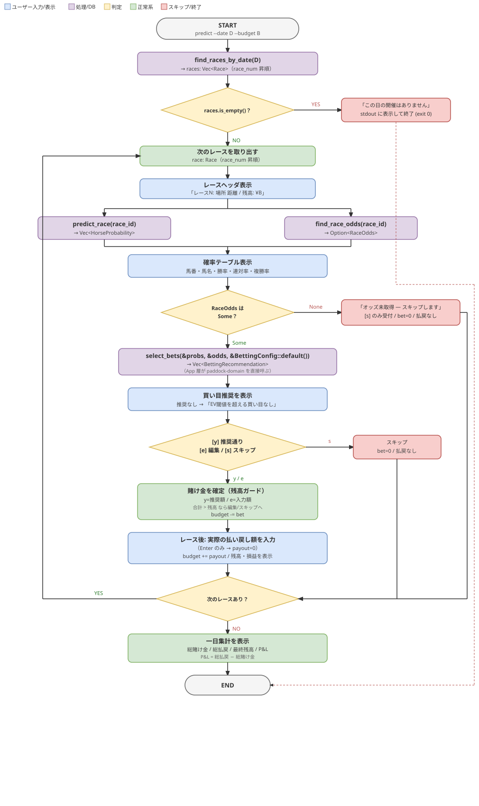

---
# knowledge 規約に基づくメタデータ（docs/knowledge/README.md）。specifications はその場で
# knowledge に昇格（ADR 履歴・相互リンクを壊さないため物理移動しない）。
status: Confirmed
kind: knowledge
doc_class: [D11, D19, D08]
tags: [D11, D19, D08]
updated: "2026-08-16"
---

# predict バイナリ: 対話型レーシングセッション

[Issue #13](https://github.com/taito-station/paddock/issues/13)

> **更新（#407・2026-07 / 本番買い目は build_portfolio に置換）**: 本仕様が当初 #13 設計で採った
> **「Kelly 配分で推奨額を算出し `Kelly=…%` 列を表示する」買い目まわりの記述は退役した**。本番 `predict` の
> 買い目配分は `build_portfolio`（ワイド・馬連・三連複の◎軸ながし、券種予算を 100 円単位で均等配分。
> `src/domain/src/portfolio/mod.rs`）に置き換わっており（ADR 0019。券種内の均等配分は
> ADR 0046 で確率重み化を棄却し維持）、
> Kelly 配分は 71R walk-forward で回収率が現行ヒューリスティックに劣後し **棄却済み**（ADR 0054。
> `select_bets`/Kelly は backtest 評価専用）。**以下本文のうち買い目推奨の表示例（`Kelly=…%` 列）・`y` の
> 「Kelly 配分で算出」動作・「Kelly 値の表示と推奨額の算出」節は #13 当時の歴史的記録**であり、上記のとおり
> 読み替えること（個別の節に注記が無くても本バナーが優先）。CLI インターフェース・終了コード・セッションの
> 永続化（`predict_sessions`/`predict_bets`）・記録フローは不変。現行の買い目配分は上記 ADR と
> [live-ev-buy-view.md](live-ev-buy-view.md) を参照。

## 概要

1 日分のレースを順番に処理する対話型 CLI バイナリ `paddock-predict` を実装する。  
ユーザーは買い目推奨を確認しながら賭け金と払い戻しを記録し、1 日を通した残高管理を行う。



---

## CLI インターフェース

```
paddock-predict --date <YYYY-MM-DD> --budget <金額>
```

| オプション | 型 | 必須 | 説明 |
|-----------|-----|------|------|
| `--date`  | `NaiveDate` | ○ | 対象開催日（例: `2026-06-01`） |
| `--budget` | `u64` | ○ | 初期予算（円単位、例: `10000`） |

### 終了コード

| コード | 意味 |
|--------|------|
| 0 | 正常終了（開催なし日付を含む） |
| 1 | DB 接続エラー / 実行中の DB I/O・クエリエラー |
| 2 | 引数パースエラー（`--date` / `--budget` の形式不正等） |

- 「開催なし日付」は異常ではないため exit code 0 とし、案内メッセージは **stdout** に出力する。
- 引数の形式不正（不正な日付・非数値の budget 等）は clap が自動で stderr にエラーを出力し **exit code 2** で終了する（既存 `analyze` バイナリと同じ `clap::Parser` 構成のため）。exit 1 はアプリ内部の DB エラーに限定する。

---

## UX フロー

### 起動

```
$ paddock-predict --date 2026-06-01 --budget 10000

=== 2026-06-01 開催 — 6 レース ===
初期予算: ¥10,000
```

### レース単位の対話ループ

```
--- レース 1: 東京 芝 1600m（発走 10:10）---
残高: ¥10,000

馬番  馬名              勝率    連対率  複勝率
   1  アイネスフウジン   18.2%   35.1%   52.3%
   2  ダイナコスモス     12.4%   24.8%   38.7%
   ...

【買い目推奨】
  馬連  1-3   EV=1.42  Kelly=15%  推奨額=¥1,500
  馬単  1→3   EV=1.28  Kelly=8%   推奨額=¥800
  単勝  1     EV=1.15  Kelly=5%   推奨額=¥500

購入方法を選んでください [y=推奨通り / e=編集 / s=スキップ] > y

>>> レース後 <<<
実際の払い戻し額を入力 (なし: Enter のみ) > 4200

  賭け金: ¥2,800  払戻: ¥4,200  (+¥1,400)
残高: ¥11,400
```

選択肢の意味:

| キー | 意味 | 動作 |
|------|------|------|
| `y` | 推奨通り購入 | Kelly 配分で算出した推奨額をそのまま確定する |
| `e` | 金額を編集 | 各買い目の金額を対話入力する（`0` 入力でその買い目をスキップ） |
| `s` | スキップ | このレースは購入せず賭け金 ¥0 で次へ進む |

> 上のフロー例は**未発走レース**のもの。**発走済みレースで `y`/`e` を選ぶと、払戻入力の手前に
> 確認が 1 段挟まる**（後述「発走済みレースへの記録確認」）。

### レース見出し（発走時刻・発走済み表示）

> **追加（#587・ADR 0085）**。
> 見出しは対話 / `--skip-all` / `--overview` の 3 経路で共通（`race_heading_for_day` が発走時刻の
> 引き当てと発走判定を含み、文字列組み立ては `race_heading`）。

```
--- レース 1: 新潟 芝 2000m（発走 09:40）[発走済] ---
--- レース 5: 新潟 芝 1400m（発走 12:25）---
--- レース 8: 新潟 ダート 1200m（発走 --:--）---
```

- **発走時刻の一次ソースは `race_cards.post_time`**（#391 と同じ）。不明は `（発走 --:--）`。
  `Race`（domain）には持たせず、日単位一括の `Interactor::post_times_by_date` で引き当てる。
- **実行時刻に発走済みのレースだけ `[発走済]` を付ける**（未発走側にマークは付けない）。
  `post_time` 不明は **当日に限り** 発走済みと断定しない。**開催日が過ぎていれば発走時刻が
  不明でも `[発走済]`**（日付が過ぎた事実で言い切れる）。
- **判定は `post_time` 経過であって結果確定ではない。** SPA の ⚫終（`result_confirmed` 判定・#381・
  [web-spa.md](web-spa.md)）とは基準が違う——走行中〜結果待ちも CLI では「発走済」。
- **発走済みレースを除外しない**（`--overview` は完了済みセッションの見返しを含むため・#551）。
- 判定の時刻軸は `monitor_loop::classify` に委譲し、日付軸だけ `is_started_at` が畳む
  （過去日 → 発走済 / 未来日 → 未発走 / 当日 → 結果取込済みなら発走済み、でなければ classify）。
  当日に結果取込（`monitor_loop::has_result`）を classify より先に見るのは、classify が
  `post_time` が `None` の時点で `has_result` を見ずに `Unknown` を返すため。
- **判定ホストは JST 前提。** 起動時に `monitor_loop::warn_if_not_jst_now` で TZ だけを点検する
  （`warn_if_not_today_jst` は「当日か」も見るので、過去日の `--overview` では毎回鳴ってしまう）。
- **`has_result` の不変条件の崩れを警告する。** 崩れると発走前レースに `[発走済]` が付き、
  張れるレースを見送る誤読になる。`monitor_loop::count_started_before_post` で件数を数え、
  1 件以上なら警告する（時刻比較が意味を持つ**当日のみ**点検）。

`--overview` は一覧の一貫性のため実行時刻を 1 回だけ取り、ヘッダに注記を出す。

```
=== 2026-08-15 EV 一覧（再表示・読み取り専用） — 35 レース ===
※ 一覧作成開始 2026-08-15 10:05 時点の判定。[発走済] はその時刻に発走済み（結果確定の有無とは別）
```

**注記は開催日で出し分ける**（`overview_note` / `session_note`。日付軸は `MeetingPhase` として
発走判定と共有）。当日以外は `[発走済]` が日付だけで決まるので時刻を書くと誤読になる——過去日は
「10:02 実行なのに 12:25 発走が発走済」と読め、未来日（前日プリフェッチ）は 1 件もマークが付かない。

| 開催日 | `--overview` | 対話 / `--skip-all` |
|---|---|---|
| 過去 | `※ この開催は終了しています（全レース発走済）` | 同左 |
| 当日 | `※ 一覧作成開始 <日時> 時点の判定。…` | `※ [発走済] は表示時点で発走済み（結果確定の有無とは別）` |
| 未来 | `※ この開催はまだ実施されていません（全レース未発走）` | 同左 |

対話 / `--skip-all` は 1 日を跨いで動き続けるため、判定時刻はレースごとに取り直す（当日の注記に
基準時刻を書かないのはこのため）。`--overview` の「一覧作成開始」は一覧全体を貫く基準時刻であって
実行完了時刻ではない（オッズ再取得を伴うと数分かかり、その間に発走した分は反映されない）。

**却下した案**（詳細は ADR 0085）:
発走済みレースの一覧からの除外（#551 の見返しが壊れる）/ `[発走済]`・`[未発走]` の両側マーク
（賑やかになる割に情報が増えない）/ 発走時刻のみでマーク無し（#587 の要件を満たさない）/
`result_confirmed` を判定に使い SPA と揃える（走行中〜結果待ちが未発走に見える）/
`Race`（domain）への `post_time` 追加（構築箇所すべてに波及する）。

**影響**: `predict` → `monitor-loop` の依存が増える（apps → interface で正方向）。発走時刻の
引き当ては日単位 1 クエリでレースごとの追加クエリは出ない。**見出し末尾の変化は CLI 標準出力を
機械パースする下流に効く**——`scripts/predict-check/` のヘッダ正規表現は `(\d+)m ---` 決め打ちで、
壊れても例外を出さず 0 件になる（無言死）。末尾を緩く受ける形へ直したうえで、**同じ regex の
6 コピーが再発経路そのもの**なので解析契約を `scripts/predict-check/pred_header.py` に 1 本化した
（`test_pred_header.py` が旧形式 / 発走時刻付き / `--:--`＋`[発走済]` の 3 形式を張る）。さらに
**確率テーブルらしい入力なのに見出しが 0 件なら非 0 終了**させ（判定は馬行の有無。開催の無い日の
「この日の開催はありません」は正当な 0 件なので落とさない）、**言語をまたぐ契約は golden
`src/apps/predict/testdata/pred_header_samples.txt` で結ぶ**——生成側（Rust が `include_str!` で
読む）と解析側が同じファイルを見るので、片方だけ変えれば必ずどちらかのテストが落ちる。
診断メッセージは stdout（パーサのデータチャネル）を汚さないよう stderr へ出す。

### 発走済みレースへの記録確認

> **追加（#623・ADR 0087）**。
> **対話セッションのみ**（`--skip-all` / `--overview` は買い目を記録しないので対象外）。

上の `[発走済]` は**見出しに出るだけ**で、購入方法プロンプトにも記録にも効かない（ADR 0085 決定 2
「除外ではなく区別」）。見落とすと「実際には買えなかったレースの買い目」が `predict_bets` に残り、
`--summary` や回収率の集計を汚す。そこで**記録の手前にゲートを 1 枚置く**。

```
購入方法を選んでください [y=推奨通り / e=編集 / s=スキップ] > y

⚠ このレースは発走済みです（発走 08-16 10:40 / 判定時刻 08-16 14:22）。
買い目を記録しますか？ [y=記録する / それ以外=記録しない] >
```

- **既定は記録しない側**。`y` 以外（空入力・`n`・EOF を含む）はすべて「記録しない」に畳み、
  `記録せず次のレースへ` で当該レースを抜ける。**不正入力の再プロンプトは置かない**
  （既定が安全側なので入力待ちループが要らない。EOF → 記録しない は `read_choice` の `s` /
  `read_u64` の 0 と同じ #179 の規律）。
- **記録自体は禁止しない**。発走後に「実際に買った分」を遡って入力する運用（`--resume`・
  夕方のまとめ入力）は正当なので、確認を経れば通す。
- **確認の位置は `y`/`e` 選択後・賭け金合計 > 0 の確認後・払戻入力の直前**。`s` と賭けなしは
  記録に至らないので確認しない（`s` で流す運用に余計な入力を足さない）。`--skip-all` は
  `read_choice` の手前で早期 return するため、**構造的に**この分岐へ到達しない（フラグでの
  出し分けは書かない）。`--overview` は `run_race` を通らない。
- **発走判定の時刻は確認の直前に取り直す**（見出し表示時の判定を再利用しない）。見出し →
  オッズ read-through → 馬場条件入力 → 金額編集の間に発走を跨いだレースこそ、防ぎたい対象。
  そのため**見出しに `[発走済]` が無いのに確認が出ることがある**。**取り直すのは実行時刻だけ**で、
  `post_times`（日単位に 1 回）と `races`（`has_result` の入力・セッション開始時のスナップショット）は
  そのまま。
- **プロンプトは発走時刻と判定時刻を併記する**。上記のとおり見出しと食い違いうるうえ、
  `has_result` の不変条件が崩れたレース（同節の警告参照）は**発走時刻が未来でも発走済みと
  判定される**。「なぜ聞かれたか」の手掛かりは文面しか無いので両方出す。**両方に日付を付ける**のは、
  過去日の遡り入力では判定時刻（今日）と発走時刻（開催日）が別の日になるため。発走時刻不明は
  見出しと同じ `--:--`。文面は純関数 `started_race_record_notice`（未発走なら `None`）が組み立てる。
- **「未発走と断定できない」は確認の対象にしない**。当日 × `post_time` 不明 × 結果未取込は
  `is_started_at` が未発走に畳むので**確認が出ないまま記録が通る**。ここで「断定できないなら聞く」を
  足すと `is_started_at` とは別の述語がゲート側に生まれる（＝second source）。`post_time` は
  fetch-card 済みの全レースに入るため該当は例外的。
- **判定の second source は作らない**。post_time の引き当てと `is_started_at` の呼び出しは
  `started_state_for_day`（`(発走時刻, 発走済みか)` を返す）に集約し、見出し
  （`race_heading_for_day`）と確認（`started_race_record_notice`）の両方がそこを通る。
  一致は unit テストが張る（一致だけでなく**各ケースの期待値そのもの**も張る——一致だけを見ると
  判定関数を壊しても見出しが道連れで壊れてテストが素通りする）。
- **`e` で入力した金額は「記録しない」を選ぶと破棄される**。同じセッションを `--resume` すれば
  レース先頭（馬場入力・オッズ表示）からやり直せるが、**最終レースまで流し切るとセッションが
  completed になり `--resume` が拒否される**ので、取りこぼしに気づくのは完走前でなければならない。
  安全側に倒した結果で、意図的な挙動。
- **過去日の遡り入力では全レースで確認が出る**（開催日が過ぎていれば時刻を見ずに発走済み）。
  同日夕方のまとめ入力でも、その時点で発走済みのレースには等しく乗る。記録するレースの数だけ
  打鍵が乗るが、`s` で流すレースには乗らない。
- **対話 stdin のプロトコルが 1 行増える**。stdin をパイプ / heredoc で流す半自動運用は入力位置が
  ずれる。ずれた場合は記録しない側に落ちるので誤記録にはならないが、**静かに 0 件記録**になる。

**却下した案**（詳細は ADR 0087）:
記録の全面禁止（遡り入力を潰す）/ `read_choice` の直前に挟む（`s` 運用で毎レース 2 回入力）/
払戻入力の後に挟む（脚数分の作業を捨てさせる）/ 見出し表示時の判定を再利用（発走を跨いだ分を取り逃す）/
不正入力での再プロンプト（既定が決まっている確認では不要・EOF 挙動を壊しやすい）。

### e（編集）モード

```
購入方法を選んでください [y=推奨通り / e=編集 / s=スキップ] > e

  馬連 1-3  推奨¥1,500  入力額 > 1000
  馬単 1→3  推奨¥800    入力額 > 0
  単勝 1    推奨¥500    入力額 > 500

>>> レース後 <<<
実際の払い戻し額を入力 > ...
```

金額に `0` を入力するとその買い目をスキップ。

### 残高ガード

賭け金（`y` の推奨額合計、または `e` の入力額合計）が **現在残高を超える場合は確定できない**。

- `y`: 推奨額合計 > 残高 のとき、その旨を表示して `e`（編集）または `s`（スキップ）に誘導する
- `e`: 各買い目の入力時点で「残り賭け可能額」を表示し、累計が残高を超える入力は再入力を促す

これにより残高は常に 0 以上に保たれる（後述の `SessionState` を `u64` で表現できる根拠）。

### 一日集計

```
=== 2026-06-01 終了 ===
総賭け金:  ¥12,300
総払戻:    ¥15,600
最終残高:  ¥13,300
P&L:       +¥3,300
```

`P&L = 総払戻 − 総賭け金`（= 最終残高 − 初期予算 と常に一致する）。  
ここで「総賭け金」は **実際に budget から減算した確定額の累計**であり、推奨額そのものではない（残高ガードや端数切り捨て後の額）。確定額を積算する限り上記の恒等式は常に成立する。

---

## アーキテクチャ

### 新規バイナリ

```
src/apps/predict/
├── Cargo.toml
├── src/
│   ├── lib.rs       # モジュール公開（bin と統合テストの共通実体）
│   ├── bin.rs       # エントリポイント、tokio::main
│   ├── cli.rs       # clap 引数定義
│   ├── session.rs   # 対話セッションループ
│   └── setup.rs     # DI 構築（analyze と同パターン）
├── testdata/
│   └── pred_header_samples.txt  # 見出しの golden（Rust ↔ Python の契約・#587）
└── tests/
    └── overview.rs  # --overview の予想セッション非干渉（#555）
```

`Cargo.toml` の `[[bin]]` 名は `paddock-predict`、`[lib]` 名は `predict`。  
ワークスペース `Cargo.toml` の `members` に `"src/apps/predict"` を追加する。

lib+bin 構成にしているのは、統合テスト（`tests/` は別クレートとしてコンパイルされる）から
`session::run_overview` 等を呼ぶため（#555）。`src/apps/api-server` と同型。
lib の公開 item は bin と自クレートの統合テストのための内部公開で、外部クレート向けの
サポート対象 API ではない。

### セッション状態（App 層）

```rust
struct SessionState {
    budget: u64,        // 現在残高（円）— 残高ガードにより常に 0 以上
    total_bet: u64,     // 累計賭け金（実際に budget から減算した確定額の累計）
    total_payout: u64,  // 累計払い戻し
}
```

- CLI の `--budget`（`u64`）をそのまま初期 `budget` に代入するため型変換は不要
- 賭け金は残高ガードにより `budget` を超えないため、`budget -= bet` で桁あふれ（underflow）は発生しない
- `total_bet` は推奨額ではなく **実際に確定して budget から引いた額**を加算する（端数・ガード適用後の額）
- セッション状態はアプリ層でのみ管理し、Domain / Use-Case 層には持ち込まない

### 依存関係と呼び出し責務

> **更新（Issue #25 / ADR 0005）**: オッズ取得はメイン `Interactor` ではなく専用
> `OddsInteractor<O: OddsScraper>` 経由のオンデマンド・ライブスクレイプに変更した。
> スタブだった `Interactor::race_odds` / `Repository::find_race_odds` は撤去した。
> 以降の本節の記述はこの新方式を反映している。

```
src/apps/predict
    → paddock-use-case  (Interactor 経由: predict_race / races_by_date)
    → paddock-use-case  (OddsInteractor 経由: race_odds — 都度ライブスクレイプ)
    → paddock-domain    (App 層が直接呼ぶ純粋関数: select_bets)
    → netkeiba-scraper  (OddsScraper 実装 UreqNetkeibaScraper を OddsInteractor に注入, ADR 0048)
    → rdb-gateway       (Repository 実装を Interactor に注入)
    → paddock-config    (環境変数)
```

呼び出し責務を明確化する:

- **確率推定・レース一覧**（IO を伴う）は **Use-Case の Interactor 経由**で呼ぶ
- **オッズ取得**（IO を伴う）は **Use-Case の `OddsInteractor` 経由**で呼ぶ（都度スクレイプ・キャッシュなし）
- **`select_bets`**（IO なしの純粋関数）は **App 層（`session.rs`）が `paddock-domain` から直接呼ぶ**。Use-Case にラッパーを置かない（薄い委譲を増やさないため）
  - 実シグネチャは全引数が参照: `select_bets(probabilities: &[HorseProbability], race_odds: &RaceOdds, config: &BettingConfig) -> Vec<BettingRecommendation>`。呼び出しは `select_bets(&probs, &odds, &BettingConfig::default())`

### DI 構築（setup.rs）

既存の `Interactor` は `Interactor<R: Repository, P: PdfParser, F: PdfFetcher>` の 3 ジェネリクスを持つ。  
`paddock-predict` は PDF 解析・取得を使わないため、`analyze` バイナリと同様に **`UnusedParser` / `UnusedFetcher`（no-op 実装）を注入**して `Interactor` を構築する。  
加えて **`OddsInteractor<UreqNetkeibaScraper>` を構築**して `App` に保持する（Issue #25 / ADR 0005、
live odds の netkeiba 統一は #287 / ADR 0048）。
`App { interactor, odds }` の 2 本立てとし、`session.rs` はオッズ取得を `app.odds.race_odds(...)` で呼ぶ。

---

## 新規 Repository メソッド

`src/use-case/src/repository.rs` の `Repository` トレイトに以下を追加する。

```rust
/// 指定日に開催されるレース一覧を race_num 昇順で返す。
fn find_races_by_date(
    &self,
    date: NaiveDate,
) -> impl Future<Output = Result<Vec<Race>>> + Send;
```

> **更新（Issue #25 / ADR 0005）**: 当初追加した `find_race_odds`（常に `None` のスタブ）は
> 撤去した。オッズは DB を経由せず `OddsInteractor` が `OddsScraper` で都度取得する。

### `Option<RaceOdds>` を返すことについて（オッズ取得は `OddsInteractor::race_odds`）

Domain には既に `RaceOdds::empty(race_id)` / `RaceOdds::is_empty()` があり、`select_bets` は空の `RaceOdds` に対して空 Vec を返す。  
`OddsInteractor::race_odds` の戻り値を `Option` にするのは、**「オッズ未取得（`None`）」と「取得済みだが対象馬券が空（`empty`）」を区別するため**。前者はスキップ推奨を表示し、後者は推奨なしとして通常フローを進める。  
本方式では **スクレイプ失敗・未公開（空）をいずれも `None` に畳む**（取得できたオッズのみ `Some`）。

### `Race` を返すことについて

`Race` は `results: Vec<HorseResult>` を持つが、予想フェーズ（レース確定前）では `results` は空である。  
レースヘッダ表示に必要なのは `venue` / `surface` / `distance` / `race_num` のみで、これらは `Race` に含まれる。  
`find_races_by_date` の SQL は **`results` を JOIN せず常に空 Vec で返す**（予想用途では結果は不要）。over-fetching は発生しないため専用 DTO は定義せず `Race` をそのまま返す。

### RDB 実装

| テーブル | SQL の概要 |
|---------|-----------|
| `races` | `WHERE date = $1 ORDER BY race_num ASC`（`results` は読み込まない） |

> **オッズ取得の方式（Issue #25 / ADR 0005、live 統一は #287 / ADR 0048）**: オッズは
> `OddsInteractor` が `OddsScraper`（`UreqNetkeibaScraper`）で取得する（read-through キャッシュ:
> 保存済みがあれば再スクレイプしない, ADR 0010。predict-watch のみ `refresh_race_odds` で毎回再取得, #257）。  
> 取得元は netkeiba オッズ API（UTF-8 JSON, `type=1/4/5/6/7/8`）で、race_id ベースの GET のため確定後も
> 最終オッズを返す。当初の JRA `accessO.html` cname 遷移（ADR 0001、開催日のみ存在・実地未検証で
> EUC-JP 誤デコード全滅）は #287 で撤去した。オッズ・推奨を前提とするテスト（TC-10 / TC-12 / TC-15 /
> TC-16）は実オッズが公開されているレースで確認する。

---

## 新規 Use-Case インタラクターメソッド

`races_by_date` は既存 `Interactor<R, P, F>` のメソッドとして追加する（ジェネリクス束縛は既存と同一）。

```rust
// interactor/race/races_by_date.rs
impl<R: Repository, P: PdfParser, F: PdfFetcher> Interactor<R, P, F> {
    pub async fn races_by_date(&self, date: NaiveDate) -> Result<Vec<Race>> { ... }
}
```

オッズ取得は **専用 `OddsInteractor<O: OddsScraper>`**（`src/use-case/src/interactor/odds/`）に置く
（Issue #25 / ADR 0005）。メイン `Interactor` に `OddsScraper` ジェネリクスを波及させないため、
`HorseHistoryInteractor` と同じ専用 interactor 方式を採る。

```rust
// interactor/odds/race_odds.rs
impl<O: OddsScraper> OddsInteractor<O> {
    pub async fn race_odds(&self, race_id: &RaceId) -> Result<Option<RaceOdds>> {
        // scrape を都度呼び、Err・空オッズは None に畳む
        ...
    }
}
```

`predict_race`（確率推定）は既存メソッドをそのまま再利用する。

---

## オッズ未取得時の動作

`find_race_odds` が `None` を返した場合、EV を計算できず買い目推奨を生成できない。  
このため `select_bets` は呼ばず、以下のフローとする:

1. 「オッズ未取得 — このレースはスキップします」を表示する
2. **`[s]`（スキップ）のみ**を受け付ける（`y` / `e` は提示しない）
3. 賭け金 ¥0 で次のレースへ進む

> 推奨が空の状態で `y` / `e` を提示すると「買えるのに買えない」混乱を招くため、オッズ未取得レースは選択肢をスキップのみに限定する。

---

## 馬場状態の永続化（Issue #80 / ADR 0013）

各レース冒頭で対話入力した馬場状態（良/稍重/重/不良）を**レース単位で永続化**し、「どの馬場前提で
確率・買い目を出したか」を事後に再現・監査できるようにする。未確定レースの `races.track_condition`
は構造的に NULL のため、セッション入力を別テーブルに残す。

### テーブル `predict_race_conditions`

| カラム | 型 | 意味 |
|--------|-----|------|
| `session_date` | TEXT | `predict_sessions(date)` への FK（`ON DELETE CASCADE`） |
| `race_id` | TEXT | レース ID（`session_date` と複合 PK） |
| `track_condition` | TEXT (NULL 可) | 良/稍重/重/不良。**NULL = 不明として入力済み** |
| `created_at` / `updated_at` | TEXT | RFC3339。upsert で `created_at` は初回値を保持 |

**行の存在 = そのレースで入力済み**。未入力（行なし）と「不明として入力済み（`track_condition`
が NULL）」を区別する。

### 保存タイミング

`read_track_condition` の**直後**（確率推定・オッズ取得より前）に `save_predict_race_condition` で
upsert する。これにより出馬表未登録（NotFound）・オッズ未取得・スキップのレースでも入力値が残る。
セッションヘッダの更新（`save_race_outcome`）とは独立に書き込む。

### `--resume` 時のデフォルト提示

レース冒頭のデフォルト値は純関数 `resolve_track_condition_default` が優先順に決める:

1. **このセッションで記録済みの値**（resume）— `None`（不明として記録）も維持しフォールバックしない
2. **同一セッション内の直前レースの入力値** — 未記録のレースのみ。自動適用せずデフォルト提示に留める
   （芝/ダ・日中の馬場変化があるため）
3. **`races.track_condition`** の確定値（通常 None）

入力 UX は #73 のまま（空入力でデフォルト採用、`-`/`－`/`ー` で不明を明示、稍/不 の略記可）。

### Repository / Interactor メソッド

```rust
// Repository トレイト
fn find_predict_race_conditions(&self, date: NaiveDate)
    -> impl Future<Output = Result<Vec<PredictRaceConditionRecord>>> + Send;
fn save_predict_race_condition(
    &self, date: NaiveDate, record: &PredictRaceConditionRecord, recorded_at: DateTime<Utc>,
) -> impl Future<Output = Result<()>> + Send;
```

記録時刻 `recorded_at` は use-case 層で注入し、gateway を時計から独立に保つ（`FetchRecord` と同流儀）。

---

## Kelly 値の表示と推奨額の算出

> ⚠️ **退役（#407）**: 本節の Kelly 配分による推奨額算出は本番 `predict` では使われていない（冒頭バナー参照）。
> 本番配分は `build_portfolio`（ADR 0019 / ADR 0054）。以下は #13 当時の歴史的記録。

`BettingRecommendation.kelly_fraction` は 0.0〜1.0 の小数。表示時は `kelly_fraction * 100` で百分率に変換し `Kelly=15%` のように表示する。

推奨額は以下の手順で算出する（**比例縮小方式**）。**丸め前の実数合計を分母**に使うことで `Σ 推奨額 ≤ budget` を厳密に保証する:

1. 各買い目の素の推奨額（実数、丸めない）を `raw_i = budget * kelly_fraction_i` で求める
2. `Σ raw_i ≤ budget` なら `推奨額_i = floor(raw_i)` とする
3. `Σ raw_i > budget` の場合、`推奨額_i = floor(raw_i * budget / Σ raw_i)`（= `floor(budget * kelly_fraction_i / Σ kelly_fraction)`）とする

手順 3 では各項を `floor` で切り捨てるため `Σ 推奨額 ≤ Σ(raw_i * budget / Σ raw_i) = budget` が常に成立する。  
> ⚠️ 分母には必ず **丸め前の実数** `Σ raw_i` を使うこと。`floor` 済みの値（`Σ floor(raw_i)`）を分母にすると丸め残差でスケール後も合計が `budget` を超えうる。

`kelly_cap = 0.25` のため、買い目が増えて `Σ kelly_fraction` が 1.0 を超える（概ね 5 本以上）と素の推奨額合計が残高を超える。比例縮小により Kelly の相対比率を保ったまま推奨額合計を残高以内に収め、`y` 選択が残高ガードで弾かれ続ける事態を防ぐ。

---

## ADR

- ADR-0004 — 予想セッションバイナリ
- ADR-0013 — 馬場入力の永続化（Issue #80）
- ADR-0085 — 見出しの発走時刻・`[発走済]`（Issue #587）
- ADR-0087 — 発走済みレースへの記録確認（Issue #623）

> この索引は読み手向けの抜粋。**正本は frontmatter の `sources`**（機械検査の対象）。

---

## 決定ログ

<!-- この節は append-only です。既存エントリの変更・削除は CI が検出します。 -->

### ADR 0004: predict バイナリの対話セッション設計 (2026-06-05) — 提案中

#### コンテキスト

Issue #12 の実装（PR #19、main にマージ済み）で Domain 層の EV 計算・Kelly 配分ロジックが完成した。
次のステップとして、1 日の開催を順番に処理し、ユーザーが買い目を確認・購入記録する対話型 CLI が必要。

#### 決定

- 新規バイナリ `paddock-predict`（`src/apps/predict`）を追加する
- 起動引数: `--date YYYY-MM-DD --budget 金額`
- レースごとに確率推定 → オッズ取得 → 買い目推奨 → ユーザー選択（y/e/s）→ 賭け金確定（残高減算）→ 払い戻し入力（残高加算）のループを繰り返す
- セッション状態（残高・累計）は App 層のみで `u64` として管理し、残高ガードで 0 以上を保証する
- 推奨額は Kelly 配分を比例縮小方式で算出する（丸め前の実数合計を分母にスケールし、`floor` の単調性で `Σ 推奨額 ≤ budget` を厳密保証する）
- 確率推定・レース一覧・オッズ取得は Use-Case の Interactor 経由、`select_bets`（純粋関数）は App 層が `paddock-domain` から直接呼ぶ
- `Repository` トレイトに `find_races_by_date` と `find_race_odds` を追加する
- オッズ未取得（`find_race_odds` が `None`）のレースは買い目推奨を生成せず、スキップのみを受け付ける

#### 理由

- 既存の `paddock-analyze predict <race_id>` は単レースの確率表示に特化しており、1 日セッション管理の責務を持たせるのは不適切
- App 層が対話 IO とセッション状態を持つことで Domain/Use-Case の純粋性を維持できる
- `select_bets` は IO を伴わない純粋関数のため、薄い委譲を避けて App 層から直接呼ぶ
- Kelly 推奨額を比例縮小方式にしたのは、`kelly_cap=0.25` で買い目が複数本あると単純な `budget × kelly` 合算が残高を超え、`y` 選択が残高ガードで常時弾かれる UX を避けるため
- `find_races_by_date` は `races` テーブルの日付による単純なクエリで追加コストが小さい

#### 影響

- `Repository` トレイトに 2 メソッド追加 → `rdb-gateway` と（将来の）モックに実装が必要
- **`race_odds` テーブルは現状未存在**。オッズの永続化（テーブル追加 + スクレイパー保存）は別 Issue のスコープとし、本 Issue では `find_race_odds` が `None` を返すケースを正しくハンドリングする（買い目推奨なし → スキップ）
- ワークスペース `Cargo.toml` に `src/apps/predict` メンバーを追加
- 既存の `paddock-analyze` への変更はない

### ADR 0005: predict にオッズを結線し買い目算出を可能にする (Issue #25) (2026-06-08) — 承認済み

#### ステータス

承認済み（結線方針は有効。ただし注入する `OddsScraper` 実装は #287 / ADR 0048 で
`UreqOddsScraper`(JRA) → `UreqNetkeibaScraper`(netkeiba) へ置換済み）

#### コンテキスト
`predict` は各馬の確率表を表示できるが、全レースで「オッズ未取得 — スキップ」となり
買い目（EV・Kelly 配分）が一切算出されなかった。原因は、オッズ取得経路が
`Interactor::race_odds` → `Repository::find_race_odds` のみで、その実装がスタブ
（常に `None`）だったため（`race_odds` テーブル・migration は未存在）。

`#10`（ADR 0001）で `interface/odds-scraper` クレートと `OddsScraper` トレイト
（`scrape(&RaceId) -> Result<RaceOdds>`、都度スクレイプ・キャッシュなし）は実装済み
だが、predict のフローに結線されていなかった。ADR 0001 はアプリ配線・DB 永続化を
**別 Issue のスコープ**として明示的に先送りしており、本 issue がその配線にあたる。

選択肢は以下だった:

- **案A（オンデマンド）**: predict に `OddsScraper` を DI し、レース処理時に live スクレイプする。
  ADR 0001 の「都度スクレイプ・キャッシュなし」設計と整合し、事前予想にそのまま使える。
- **案B（DB 永続化）**: `race_odds` テーブルを追加 → スクレイプ結果を保存 →
  `find_race_odds` を SELECT 実装に差し替える。過去レースの再現・履歴に向く。

#### 決定
**案A（オンデマンド）を採用する。**

1. **専用 interactor `OddsInteractor<O: OddsScraper>` を新設**する（`src/use-case/src/interactor/odds/`）。
   `race_odds(&RaceId) -> Result<Option<RaceOdds>>` を提供し、`OddsScraper::scrape` を都度呼ぶ。
   - スクレイプ失敗（サイト改変・開催日外・ネットワーク等）→ warn ログを出して `None`
   - 取得成功だが全馬券種が空（未公開）→ `None`
   - いずれも predict 側でスキップ扱いになり、1 レースの失敗でセッション全体を止めない。
2. **メイン `Interactor<R, P, F>` には `OddsScraper` を足さない**（ADR 0001 決定 #4 を踏襲）。
   `HorseHistoryInteractor<R, S>`（`#37`）と同じく、スクレイパー依存の関心事は専用 interactor に
   切り出し、全 app への DI 強制を避ける。
3. **predict に `UreqOddsScraper` を DI** する。`App` が `OddsInteractor<UreqOddsScraper>` を保持し、
   `session.rs` は `app.odds.race_odds(&race_id)` を呼ぶ。
4. **dead code を撤去**する。スタブ化していた `Interactor::race_odds` /
   `Repository::find_race_odds`（トレイト・rdb-gateway 実装・スタブファイル）を削除する。
   DB 永続化（案B）は将来必要になった時点で別 Issue として再導入する。
5. `odds-scraper` は predict（バイナリ）から path 依存で参照されるようになったため、
   workspace `members` への明示登録（ADR 0001 で追加した例外）を解消する
   （`netkeiba-scraper` と同じ扱い）。

#### 理由
- ADR 0001 が確立した「都度スクレイプ・キャッシュなし」設計と一直線でつながり、追加の
  スキーマ・保存タイミング・鮮度管理を持ち込まない（シンプル第一）。事前予想にそのまま使える。
- 案B はオッズの保存タイミング・無効化ポリシー・スキーマ設計を要し、本 issue の主目的
  （結線して買い目を出す）に対して過剰。履歴再現が必要になった時点で独立に導入できる。
- 専用 interactor 方式は `#37` で確立済みの前例に倣い、メイン Interactor のジェネリクスを
  全 impl ブロック・全 app に波及させずに済む。

#### 影響
- `predict` はオッズが取得できるレースで `select_bets` が走り、EV 閾値超の買い目が
  推奨額付きで表示される。スクレイプ失敗・未公開オッズは従来どおり安全に skip 扱い。
- ライブ遷移層（cname トークン抽出・POST）は ADR 0001 のとおり実地未検証であり、
  開催日以外はオッズページ自体が存在しない。このため off-race-day の予想や CI では
  オッズは取得されず全レース skip になる（パニックせず継続する設計）。
- `race_odds` の永続化を撤去したことで、過去レースのオッズ再現は現時点でできない
  （案B 相当を将来 Issue で扱う）。
- オッズ依存の CLI テストケース（TC-10 / TC-12 / TC-15 / TC-16）は、決定論的な手動
  INSERT が使えなくなり、ライブ開催日でのみ実地確認となる（テストケース文書を更新）。

#### 関連
- ADR 0001（JRA オッズスクレイパー実装, #10）
- 設計書 `docs/specifications/predict-session.md`

### ADR 0013: 予想セッションの馬場入力を永続化し再現可能にする (Issue #80) (2026-06-12) — 承認済み

#### コンテキスト
#73（ADR 0011）で予想セッションは各レース冒頭に馬場状態（良/稍重/重/不良）を対話入力する
ようになったが、入力値はその場で `predict_race` に渡されるのみで**どこにも永続化されない**。
未確定レースの `races.track_condition` は構造的に NULL（値が入るのは成績取り込み後）のままなので、
事後に「どの馬場前提でこの確率・買い目を出したか」を**再現・監査できない**。PR #79 のセルフレビュー
（2 巡目）で検出し、別 Issue 化していた。

設計上の論点:
- 記録の単位（`predict_bets` への列追加 / `predict_sessions` への列追加 / レース単位の記録テーブル）。
- 「不明として入力した」状態と「未入力」をどう区別するか。
- `--resume` 再実行時にどの値をデフォルト提示するか（記録値・直前入力・確定値の優先順）。

#### 決定

1. **レース単位の記録テーブル `predict_race_conditions` を新設**する。
   ```sql
   CREATE TABLE predict_race_conditions (
       session_date    TEXT NOT NULL REFERENCES predict_sessions(date) ON DELETE CASCADE,
       race_id         TEXT NOT NULL,
       track_condition TEXT,                       -- 良/稍重/重/不良。NULL=不明として記録
       created_at      TEXT NOT NULL,
       updated_at      TEXT NOT NULL,
       PRIMARY KEY (session_date, race_id)
   );
   ```
   - **行の存在 = そのレースで入力済み**、`track_condition IS NULL` = 「不明として入力済み」。
     未入力（行なし）と明確に区別する。
   - `predict_bets` への列追加にしない理由: 買い目は組み合わせ単位で複数行に重複し、かつ
     **買い目が無い／スキップしたレースでは馬場入力が一切残らない**。`predict_sessions`（1 日 1 行）
     にも入らない。レース単位テーブルなら買い目の有無に依存せず 1 レース 1 行で監査が明瞭。

2. **入力直後に必ず保存する**。`read_track_condition` の直後（確率推定・オッズ取得より前）に
   upsert するため、出馬表未登録（NotFound）・オッズ未取得・スキップでも入力値が残る。
   セッションヘッダ（`predict_sessions`）は `save_race_outcome` と独立に更新されるので、
   馬場入力も独立した `save_predict_race_condition` で書き込む。

3. **`--resume` 時のデフォルト提示は優先順「記録済みの値 → 同一セッション内の直前レース入力 →
   `races` の確定値」**で決める（純関数 `resolve_track_condition_default`）。
   - 記録済み（resume）の値は最優先。`None`（不明として記録）も維持し、フォールバックしない。
   - 未記録のレースのみ、同一セッション内の直前レース入力をデフォルト提示する。芝/ダ・日中の
     馬場変化があるため**自動適用はせずデフォルト提示に留める**（空入力で採用、`-` で不明を明示）。
   - 直前入力も無ければ `races.track_condition`（通常 None）にフォールバック。

4. **記録時刻は use-case 層で注入**し、gateway を時計から独立に保つ（`FetchRecord` と同じ流儀）。
   upsert は `ON CONFLICT(session_date, race_id) DO UPDATE` で `created_at` を初回値のまま保持する。

#### 理由
- 「どの馬場前提で予想したか」を後から再現・監査できるようにすることが本 Issue の目的で、
  買い目の有無に依存しないレース単位テーブルが最も素直に要件を満たす。
- `None` を「不明として入力済み」とし行の存在で「入力済み」を表すことで、`read_track_condition` の
  既定挙動（空入力＝デフォルト維持、デフォルト None なら不明）とそのまま往復する。
- upsert（`ON CONFLICT DO UPDATE`）方式は `predict_sessions`/`race_odds` の既存流儀と一貫する。

#### 影響
- 新テーブル `predict_race_conditions` とマイグレーション 1 本を追加。
- `Repository` トレイトに `find_predict_race_conditions` / `save_predict_race_condition` を追加
  （全モック実装の追従が必要）。
- `apps/predict` のセッションは、レース冒頭で馬場入力を保存し、`--resume` で記録値・直前入力を
  デフォルト提示するようになる。`races` / `predict_bets` / 既存の確率推定ロジックには影響しない。
- `predict_race` のシグネチャは変更しない（本 ADR は永続化のみで、確率推定への配線は ADR 0011 のまま）。
- **非原子性**: 馬場記録（`save_predict_race_condition`）は買い目保存（`save_race_outcome` の
  トランザクション）とは**別の独立した書き込み**で、`run_race` 内で馬場保存が先行する。これは
  「入力直後に必ず残す」設計意図に沿うもので、馬場保存後に後続（推定・オッズ・買い目保存）が
  失敗しても馬場記録は残る（＝予想を試みた事実の証跡として正しい）。
- **`ON DELETE CASCADE` は予防的指定**。現状コードにセッション削除経路は無いため到達しないが、
  将来セッション削除を追加した際に孤児行が残らないよう FK に付けておく。
- resume で記録済みと**同値**の再入力は `updated_at` の無駄な更新を避けるため保存を省く
  （`apps/predict` 側でガード）。値が変わったときのみ upsert する。

#### 関連
- ADR 0011（馬場状態を確率推定に接続 / 対話入力の導入）— 本 ADR が永続化を補完
- #73 / PR #79（レビュー対応履歴の 2 巡目・5 巡目）
- 設計書 `docs/specifications/predict-session.md`

### ADR 0085: predict CLI の発走済み表示は `post_time` 経過で判定し、除外せず区別する (2026-08-15) — 承認済み

#### ステータス

承認済み（[#587](https://github.com/taito-station/paddock/issues/587)）。

#### コンテキスト

`paddock-predict --date <D> --overview`（#551）のレース見出しには**発走時刻も発走済み表示も無かった**。

```
--- レース 1: 新潟 芝 2000m ---
馬場状態: 不明
```

`--overview` は「完了済みセッションでも当日オッズで EV 一覧を再計算して表示する」仕様なので、
発走済みレースが含まれること自体は意図どおり。しかし当日朝に候補を探す用途では、
**上位に並んだレースが既に終わっているかどうかが出力から読めない**。

2026-08-09 の朝、全 35 鞍を `--overview` で回して ROI 順に並べたところ、唯一 ROI ≥ 100% を満たしたのが
新潟1R（165.8%）だった。実際にはその発走は 09:40、実行は 10:05 で**既に終了していた**。
出力からそれが読めず、「その日の唯一の +EV 候補が実は取りに行けないレースだった」という誤読を一度挟んだ
（気づいたのは `upcoming_races.py` で発走時刻を別途突き合わせた後）。

`/api/races` は `post_time` を持ち SPA も状態判定している（#391）。**CLI 出力だけがこの情報を持っていない。**

#### 決定

1. **見出しに発走時刻を出し、発走済みのレースだけ `[発走済]` を付ける。**
   `post_time` 不明は `（発走 --:--）` と表示する。**当日**はこれを発走済みと断定しない
   （`web-spa.md` と同方針）が、**開催日が過ぎていれば発走時刻が不明でも `[発走済]`**——
   日付が過ぎた事実だけで言い切れるため（決定 4 の日付軸）。

   ```
   === 2026-08-15 EV 一覧（再表示・読み取り専用） — 35 レース ===
   ※ 一覧作成開始 2026-08-15 10:05 時点の判定。[発走済] はその時刻に発走済み（結果確定の有無とは別）

   --- レース 1: 新潟 芝 2000m（発走 09:40）[発走済] ---
   --- レース 5: 新潟 芝 1400m（発走 12:25）---
   ```

2. **発走済みレースを除外せず区別する。** 除外は #551 が意図した「完了済みセッションの見返し」を壊す。

3. **判定は `race_cards.post_time` 経過。SPA の ⚫終（`result_confirmed` 判定・#381）とは意味を分ける。**
   結果が未確定でも張れないことに変わりはないので、CLI は結果の取り込みを待たない。
   同じ語で別基準になるため、一覧のヘッダに注記を 1 行出す（決定 1 の `※` 行）。

   **注記は開催日で出し分ける**（`MeetingPhase` = 過去 / 当日 / 未来。日付軸の判定は発走判定と
   共有する）。当日以外は `[発走済]` が日付だけで決まるので、時刻を書くと誤読になる——過去日は
   「10:02 実行なのに 12:25 発走が発走済」と読め、未来日は 1 件もマークが付かないので時刻の説明が
   空振りする。過去日 `※ この開催は終了しています（全レース発走済）` / 未来日
   `※ この開催はまだ実施されていません（全レース未発走）` / 当日のみ判定時刻を**日付込み**で出す。

4. **時刻軸の判定は `monitor_loop::classify` に委譲し、日付軸だけを predict 側の
   `is_started_at`（`src/apps/predict/src/session.rs`）で畳む。** classify は `NaiveTime` のみで
   日付を持たない（日付跨ぎは監視側の `should_stop_by_date` が別担当・ADR 0072）ため、
   過去日の `--overview` では classify 単体だと「未発走」に見える。
   過去日 → 発走済 / 未来日 → 未発走 / 当日 → 結果取込済みなら発走済み、でなければ
   `classify(now, post_time, false, None)`（結果は手前で見終わっているので、classify には
   時刻軸だけを判定させる）。**境界は classify に従い `now > post` で発走済み**——発走時刻
   ちょうどはまだ未発走として扱う（監視側と同じ境界に揃える）。

   **当日に `has_result` を classify より先に見る**のは、classify が `post_time` が `None` の
   時点で `has_result` を見ずに `Unknown` を返すため（監視側は「発走時刻不明＝収集対象外」で
   足りる）。CLI は「結果が入っている＝確実に発走済み」を落としたくないので、その 1 段だけ
   手前に置く。時刻軸の判定自体は classify のまま＝second source にはならない。

5. **表示は `--overview` だけでなく `run_race`（対話 / `--skip-all`）にも出す。**
   見出しは純関数 `race_heading` / `race_heading_for_day`（発走時刻の引き当てを含む）に抽出して
   両経路で共有する（同一フォーマットの重複を解消）。**注記も両経路に出す**——マークだけ配って
   基準の但し書きを配らない非対称にしない。対話側は判定時刻がレースごとなので、一覧全体の
   基準時刻は書かず `※ [発走済] は表示時点で発走済み（結果確定の有無とは別）` の 1 行に留める。

#### 理由

- **`post_time` を一次ソースにするのは #391 の踏襲**。`race_cards` は fetch-card 済みの全レースに
  post_time を持ち、監視記録（`predict-watch` の判定）の有無に依存しない。
- **除外でなく区別**にすると、#551 の見返し用途と #587 の当日用途が同じ出力で両立する。
  読み手が「終わっている」ことを 1 行で判別できれば、誤読は起きない。
- **判定を classify に委譲する**ことで、発走状態の解釈が CLI と監視で分岐しない（ADR 0064 が警告する
  second source を作らない）。predict 側に残るのは「日付が違えば時刻を見ない」という薄い分岐だけで、
  これは classify が構造的に持たない軸なので重複ではない。
- **SPA と基準を分ける**のは用途が違うため。SPA は結果の反映を待つ画面（走行中を「終了」にすると
  着順待ちが消える）、CLI は「今から張れるか」を見る出力（走行中も張れない）。

#### 却下した案

- **発走済みレースを一覧から除外する。** #551 の見返しが壊れる（過去日の overview が空になる）。
- **`[発走済]` / `[未発走]` の両側マーク。** 全行が常時賑やかになる割に、増える情報は
  「マークが無い＝未発走」で既に読める分だけ。
- **発走時刻のみ出してマークを付けない。** 読み手が実行時刻と突き合わせる手間が残り、#587 の
  「発走済みを明示」を満たさない。
- **`result_confirmed` を判定に使う（SPA と揃える）。** 走行中〜結果待ちのレースが「未発走」に見え、
  当日朝の用途では最も誤読しやすい区間が抜ける。
- **`Race`（domain）に `post_time` を足す。** `Race` の構築箇所すべてに波及する。既存の
  日付一括取得 `Interactor::post_times_by_date`（`api-server` の `RaceSummary` 合成と同じ引き当て方）で足りる。

#### 影響

- `src/apps/predict/Cargo.toml` に `monitor-loop` 依存が 1 行増える（apps → interface で正方向）。
- `run_session` が `post_times_by_date` を日単位で 1 回引き、`run_race` へ `DayLookups`
  （記録済み馬場入力 + 発走時刻）として渡す。レースごとの追加クエリは発生しない。
- 対話 / `--skip-all` は 1 日を跨いで動き続けるため、判定時刻はレースごとに取り直す。
  `--overview` は一覧の一貫性のため実行時刻を 1 回だけ取り、ヘッダの注記と同じ時刻で全行を判定する。
- 判定は実行ホストが JST であることを前提にする（`post_time` は JST 起算・monitor-loop と同じ前提）。
  **TZ の点検は入れる。** ただし monitor-loop の `warn_if_not_today_jst` は「当日・JST」をまとめて
  見るため、過去日を見返す `--overview` では日付警告が毎回鳴って無意味になる。そこで TZ 部分だけを
  `warn_if_not_jst` として同 crate に切り出し（`warn_if_not_today_jst` はそれを呼ぶ形にして
  判定の重複を作らない）、predict の 3 経路はこちらを起動時に 1 度呼ぶ。
- **`has_result` の不変条件が崩れたら警告する。** `monitor_loop::has_result` は「発走前のレースは
  race_cards 由来で track_condition=NULL」という `races_by_date` の不変条件に乗った早期シグナルで、
  崩れると**発走前のレースに `[発走済]` が付く**——#587 が消したい誤読の逆向き（張れるレースを
  見送る）になる。監視側と同じ `count_started_before_post` で件数を数え、1 件以上なら警告する。
  時刻比較は同日でしか意味を持たないので**当日のみ**点検する（過去日の見返しでは大半のレースが
  該当してしまい警告が総鳴りする）。**`post_time` 不明のレースは monitor-loop 側の防御が数えない**
  （classify は Unknown として監視対象外にするため）が、CLI は post_time 不明でも結果があれば
  `[発走済]` を出すので、その CLI 固有の経路は predict 側で別途数える。
- `--overview` の判定時刻は実行開始時に 1 回だけ取る。オッズ read-through を含む一覧実行が
  数分かかると、その間に発走したレースは未発走のまま表示される。注記が「一覧作成開始 …時点」と
  明示するので誤読には至らない（一覧全体を同一時刻で判定する一貫性を優先した）。
- 見出し末尾の変化は CLI 標準出力を機械パースする下流に効く。`scripts/predict-check/` の
  ヘッダ正規表現（`extract_preds.py` / `live_ev.py` / `win_backtest.py` / `umaren_backtest.py` /
  `konsen_backtest.py` / `formation_backtest.py`）は `(\d+)m ---` 決め打ちで、**例外を出さず
  0 件になる**（無言死）。同じ PR で直したが、**6 か所に同じ regex を貼り直すのは同じ事故の
  再発経路**（ADR 0064 が警告する second source と同型）なので、解析契約を
  `scripts/predict-check/pred_header.py` に 1 本化して 6 本が import する形にした。
  回帰は `test_pred_header.py` が旧形式 / 発走時刻付き / `--:--`＋`[発走済]` の 3 形式で張る
  （`--:--` はハイフンを含むため、末尾を素朴に切る regex だとこれだけ落ちる）。
- **無言死そのものを塞ぐ**。regex の 1 本化は Python 内の複製を消すだけで、「壊れたら 0 件で
  正常終了する」挙動は変わらない。**確率テーブルらしい入力なのに見出しが 1 件も取れなければ
  非 0 終了**する（`pred_header.split_by_header` は例外を投げ、終了コードへの変換は各スクリプトの
  入口が行う）。「らしさ」は馬行（`  3 ウマ 12.3% …`）の有無で見る——**開催の無い日の
  `この日の開催はありません: <date>` は正当な 0 レース**なので、ここを異常にすると
  「見出し形式が変わった」と誤誘導することになる。
- **言語をまたぐ契約は golden で結ぶ**。regex を 1 本化しても、Rust の出力と Python の期待値が
  リテラル一致頼みである限り、見出しを変えたとき**両方のテストが緑のままパイプラインだけ壊れる**。
  `src/apps/predict/testdata/pred_header_samples.txt` を生成側（`include_str!` で読む Rust の
  `heading_samples_match_the_shared_golden`）と解析側（`test_pred_header.py`。マッチだけでなく
  どの値がどのフィールドに入るかまで見る）の双方が参照し、片方だけ変えれば必ずどちらかが落ちる
  ようにした。golden には**最も落としやすい組み合わせ**（発走時刻不明 `--:--` × `[発走済]`）を
  必ず入れる。なお `refresh_ev.sh` / `gen_win_backtest_data.sh` は見出しを自前 `echo` する
  **生成側のコピー**で、golden には拘束されない（旧形式なので現行 regex は受ける）。**置き場所を predict crate 内にした**のは、`include_str!` が crate の外を指すと
  sparse checkout / パッケージングでテストがコンパイルできなくなるため（Python 側はリポジトリ内の
  相対参照で読めばよく、制約が緩い）。
- 診断メッセージ（不変条件の警告・TZ 警告）は **stderr** に出す。stdout は上記パーサが読む
  データチャネル。`warn_if_not_today_jst` の日付警告だけは predict-watch / odds-collect の既存の
  ログ運用を変えないため stdout に据え置く。
- **ヘッダ出力と警告は 1 関数（`print_overview_header` / `print_session_header`）に閉じる。**
  出力順を直したときに元の呼び出しを消し忘れ、同じ警告が 2 度出る事故を実際に踏んだ。
  呼び出し箇所を 1 つにして構造的に防ぐ。

#### 関連

- [#551](https://github.com/taito-station/paddock/issues/551)（`--overview` 追加）/
  [#391](https://github.com/taito-station/paddock/issues/391)（`post_time` を一次ソースにする方針）/
  [#381](https://github.com/taito-station/paddock/issues/381)（SPA の ⚫終＝結果確定判定）
- ADR 0072（`classify` が日付を持たない件の出所）
- [docs/qa/QA-overview-post-time-587.md](../qa/QA-overview-post-time-587.md)

### ADR 0087: 発走済みレースへの買い目記録は確認を挟む（禁止はしない） (2026-08-16) — 承認済み

#### ステータス

承認済み（[#623](https://github.com/taito-station/paddock/issues/623)）。
ADR 0085 の決定 2「除外ではなく区別」を**維持したまま**、
記録の手前にゲートを 1 枚足す（supersede ではない）。

#### コンテキスト

#587（ADR 0085）で `paddock-predict` の見出しに発走時刻と `[発走済]` が出るようになった。方針は
「除外ではなく**区別**」なので、発走済みレースも従来どおり処理が通る。

その結果、**`[発走済]` は見出しに出るだけ**で、購入方法プロンプト（`y`/`e`/`s`）にも
`record_race_outcome`（`predict_bets` 保存＋残高減算）にも効いていない。

```
--- レース 3: 新潟 芝 1200m（発走 10:40）[発走済] ---
残高: ¥50,000
...
購入方法を選んでください [y=推奨通り / e=編集 / s=スキップ] > y   ← 通ってしまう
```

見出しを見落とせば「実際には買えなかったレースの買い目」が `predict_bets` に残る。記録された買い目は
`--summary` や回収率の集計に入るため、**実績そのものが汚れる**。セッションを跨いだ `--resume` や、
当日夕方に前半レースを遡って入力する場面で踏みやすい。

#### 決定

1. **対話セッションで発走済みレースに買い目を記録しようとしたら確認を挟む。既定は記録しない側。**

   ```
   購入方法を選んでください [y=推奨通り / e=編集 / s=スキップ] > y

   ⚠ このレースは発走済みです（発走 08-16 10:40 / 判定時刻 08-16 14:22）。
   買い目を記録しますか？ [y=記録する / それ以外=記録しない] >
   ```

   **発走時刻と判定時刻を併記する。** 決定 4 のとおり判定は見出しより後の時刻で行うので、
   見出しに `[発走済]` が無いのに確認が出ることがある。さらに `has_result` の不変条件が崩れた
   レース（`result_before_post_count` が別途 stderr で警告する既知の崩れ）は**発走時刻が未来でも
   発走済みと判定される**。どちらも「なぜ聞かれたか」の手掛かりは文面しか無いため、両方の時刻を
   出す。**両方に日付を付ける**のは、過去日の遡り入力では判定時刻（今日）と発走時刻（開催日）が
   別の日になるため。発走時刻不明は見出しと同じ `--:--` で表す。文面は純関数
   `started_race_record_notice`（未発走なら `None`）に切り出してテストで固定する
   （`result_before_post_warning` と同じ規律——`println!` を抱えると文面を assert できない）。
   **発走判定・post_time の引き当てから文面までを 1 本にする**のは、返り値を取りこぼしても
   bool しか見ないテストでは気づけないため（発走時刻が常に `--:--` と出る回帰が素通りする）。

   `y` 以外（空入力・`n`・EOF を含む）はすべて「記録しない」に畳み、`記録せず次のレースへ` で
   当該レースを抜ける。**不正入力の再プロンプトは置かない**——既定が安全側に決まっているため、
   `read_choice` のような入力待ちループを作る必要がない。EOF → 記録しない は #179 の
   「安全側に畳む」規律（`read_choice` の `s` / `read_u64` の 0）と同じ向き。

2. **記録自体は禁止しない。** 発走後に「実際に買った分」を遡って入力する運用は正当なので、確認を
   経れば通す。ADR 0085 決定 2「除外ではなく区別」はそのまま維持する。

3. **確認を挟む位置は `y`/`e` 選択後・賭け金合計 > 0 の確認後・払戻入力の直前。**
   `s`（スキップ）と賭けなしは記録に至らないので確認しない＝`s` で流す運用に余計な入力を足さない。
   払戻入力は買い目の脚数だけ繰り返す長い作業なので、その手前で止める。

4. **発走判定の時刻は確認の直前に取り直す**（見出し表示時の判定を再利用しない）。
   見出し → オッズ read-through → 馬場条件入力 → 金額編集の間に数十秒〜数分かかり、
   **その間に発走を跨いだレースこそ「買えなかったのに記録される」対象**である。
   見出しに `[発走済]` が無いのに確認が出る場合があるが、プロンプトが発走時刻と判定時刻を
   併記するので理由は読める。**取り直すのは実行時刻だけ**——`post_times` は日単位に 1 回、
   `races`（`has_result` の入力）はセッション開始時のスナップショットのままにする。
   対話中に結果が取り込まれても判定は変わらないが、その差が効くのは post_time 不明のレースに
   限られる（post_time があれば時刻軸だけで判定が付く）ので、日単位クエリを増やす価値はない。

5. **判定の second source を作らない。** post_time の引き当てと `is_started_at` の呼び出しを
   `started_state_for_day`（`src/apps/predict/src/session.rs`。`(発走時刻, 発走済みか)` を返す）に
   切り出し、見出し（`race_heading_for_day`）と確認（`started_race_record_notice`）の両方がそこを通る。
   **引き当ての結果も返す**のは、確認プロンプトが表示用に `post_times.get` をもう一度書けば
   「発走時刻の持ち方を変えたとき片方だけ直る」形が残るため。判定と見出しが同じ答えを返すことは
   unit テストで機械的に張る（一致だけでなく**各ケースの期待値そのもの**も張る——一致だけを見ると
   判定関数を丸ごと壊しても見出しが道連れで壊れてテストが素通りする）。

6. **`--skip-all` / `--overview` は対象外。** 確認を `read_choice` より後ろに置くことで、両経路は
   構造的にこの分岐へ到達しない（フラグでの出し分けを書かない）。

7. **「未発走と断定できない」は確認の対象にしない。** 当日 × `post_time` 不明 × 結果未取込の
   組み合わせは `is_started_at` が `Unknown`＝未発走に畳むので、**確認が出ないまま記録が通る**。
   ここで「断定できないなら聞く」を足すと、`is_started_at` とは別の述語がゲート側に生まれる
   ＝決定 5 で避けた second source そのものになる。`post_time` は fetch-card 済みの全レースに
   入るので該当は例外的で、その例外のために判定を二重化する価値はない。

#### 理由

- **見出しの表示は誤読を減らすが、記録は止めない。** #587 が消したかったのは「終わったレースを候補と
  誤読する」ことで、表示でそこは満たされた。しかし**誤読の帰結（汚れた `predict_bets`）は表示では
  防げない**。実績集計に効く副作用の手前には、表示とは別にゲートが要る。
- **既定を「記録しない」にするのは非対称なコストによる。** 誤って記録すれば実績が汚れ、後から
  手で消す作業が要る（どのレースが偽物かは記録からは読めない）。逆に誤って記録しなければ、
  もう一度そのレースを入力すればよい——**ただしセッションが未完了の間に限る**。`run_session` は
  レースループを完走した時点でセッションを completed にし、`--resume` は完了済みを拒否するため、
  最終レースまで流し切ってから取りこぼしに気づくと通常操作では入れ直せない（DB を手で触ることになる）。
  それでも既定は「記録しない」側に置く——汚れた記録は**どれが偽物かが記録から読めない**のに対し、
  取りこぼしは気づいた時点でセッションを流し直せば済むため。
- **禁止でなく確認にするのは、遡り入力が実在する運用だから。** 禁止すると `--resume` や夕方の
  まとめ入力という正当な使い方を潰す。ADR 0085 決定 2 と同じ「除外せず区別する」思想の適用。
- **判定時刻を取り直すのは ADR 0085 影響節の延長**（「対話 / `--skip-all` は 1 日を跨いで動き
  続けるため判定時刻はレースごとに取り直す」）。同じ理屈がレース内の長い対話にも効く。
- **`started_state_for_day` に集約するのは ADR 0064 の second source 回避。** 判定が分岐すると
  「見出しは未発走なのに毎レース確認が出る」類の齟齬が静かに生まれ、確認プロンプトが
  ノイズ化して読み飛ばされる（＝ゲートが実質無効になる）。

#### 却下した案

- **発走済みレースへの記録を全面禁止する。** 遡り入力（`--resume` / 夕方のまとめ入力）が
  正当な運用として実在するため潰せない。issue の要件にも明記されている。
- **`read_choice` の直前に確認を挟む。** 発走済みレースは `s` で流す運用が多数派で、
  毎レース 2 回入力させることになる。プロンプトが増えれば読み飛ばされ、ゲートが機能しなくなる。
- **払戻入力の後（`record_race_outcome` の直前）に挟む。** 脚数分の払戻入力を済ませてから
  「記録しますか」と聞くのは遅い。作業を捨てさせる形になる。
- **見出し表示時の判定を再利用する（表示と確認を必ず一致させる）。** 表示から確認までに発走を
  跨いだ分を取り逃す。一致は「読みやすさ」の都合で、防ぎたい事象そのものより優先しない。
- **不正入力で再プロンプトする（`read_choice` と揃える）。** 既定が決まっている確認では、
  入力が無いと進めない `read_choice` と事情が違う。ループを増やすほど EOF 時の挙動が壊れやすい（#179）。
- **`--skip-all` にもフラグで確認を出す。** `--skip-all` は買い目を記録しない（#479）ので
  確認する対象が無い。非対話モードで stdin を読むこと自体が #479 の要件に反する。

#### 影響

- `src/apps/predict/src/session.rs` に `started_state_for_day` / `started_race_record_notice` /
  `prompt_record_started_race` / `may_record_race` を追加し、`run_race` の `bet == 0`
  早期 return の直後に配線する。`race_heading_for_day` は `started_state_for_day` 経由に
  書き換わるが、シグネチャも出力も不変。
- **判定 → 文面 → 確認 → 記録可否の連結を `may_record_race` に閉じる。** `run_race` 自体は
  `App`（スクレイパが具象型）をモックできず単体テストが書けないので、`run_race` に `if` を直書き
  すると **#623 の本体そのものが自動検査の外**に落ちる。ゲートだけを関数に切り出せば
  「未発走なら stdin を 1 バイトも読まない」「発走済み × `y` 以外なら記録に進まない」を
  `Cursor` で張れる。
- **過去日の遡り入力では全レースで確認が出る**（`MeetingPhase::Over` は時刻を見ずに発走済み）。
  同日夕方のまとめ入力でも、その時点で発走済みのレースには等しく乗る。
  ADR が「正当な運用」と位置づけた `--resume` / 夕方のまとめ入力に、記録するレースの数だけ
  打鍵が乗る。却下案「`read_choice` の直前に挟む」を退けた理由（毎レース 2 回入力）と同種の
  コストが、記録する側の運用には残っている。**本 ADR ではこれを許容する**——記録に到達する
  レースは 1 日数鞍で、`s` で流すレースには乗らないため。セッション単位の 1 度きり確認
  （sticky）や `--record-started` 相当の opt-in は follow-up の候補とする。
- **対話 stdin のプロトコルが 1 行増える。** 発走済みレースで `y`/`e` を選ぶと確認が 1 段挟まるので、
  stdin をパイプ / heredoc で流す半自動運用は入力位置がずれる。ずれた場合は `y` 以外が確認に
  食われて**記録しない側に落ちる**ので誤記録にはならないが、静かに 0 件記録になる。
- **見出しのフォーマットは変えない。** golden `src/apps/predict/testdata/pred_header_samples.txt` と
  `scripts/predict-check/pred_header.py`（ADR 0085 影響節の言語をまたぐ契約）は無変更。
- 確認プロンプトの出力先は **stdout**（診断ではなく対話の一部）。この経路は対話セッション専用で、
  `scripts/predict-check` が読む `--skip-all` / `--overview` の stdout には現れない。
- `run_race` は `App` がモック不可・stdin 依存で integration テストが無い（`tests/overview.rs` は
  read-only 経路のみ）ため、回帰は純関数 + `Cursor` の unit テストで張る。
  `started_state_for_day` と見出しの `[発走済]` の一致テストは、判定が分岐したときに落ちる。
- **決定 6（`--skip-all` の構造的到達不能）はテストで張られていない。** `run_session` / `run_race` を
  呼ぶテストが存在せず（`tests/overview.rs` は `run_overview` のみ）、根拠は
  「早期 return が `read_choice` より手前にある」というコード配置だけ。分岐順を動かすときは
  非対話モードが stdin を読まないことを手で確かめる。

#### 関連

- [#587](https://github.com/taito-station/paddock/issues/587) / ADR 0085（発走済み表示・「除外ではなく区別」）
- [#551](https://github.com/taito-station/paddock/issues/551)（`--overview`）/ [#479](https://github.com/taito-station/paddock/issues/479)（`--skip-all`）/
  [#179](https://github.com/taito-station/paddock/issues/179)（EOF を安全側へ畳む）
- ADR 0064（判定ロジックの second source を作らない）
- [docs/qa/QA-started-race-record-confirm-623.md](../qa/QA-started-race-record-confirm-623.md)
