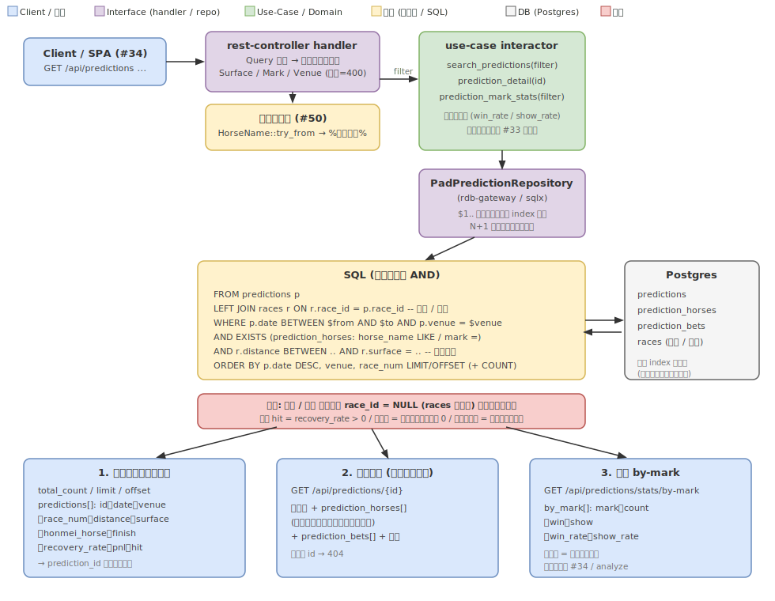

---
# knowledge 規約に基づくメタデータ（docs/knowledge/README.md）。specifications はその場で
# knowledge に昇格（ADR 履歴・相互リンクを壊さないため物理移動しない）。
status: Confirmed
kind: knowledge
sources:
  - docs/adr/0025-prediction-search-api.md
  - docs/api/openapi.json
distilled_from_sha: "f765be7"
updated: "2026-07-17"
---

# 予想の横断検索 API: 設計仕様

[Issue #145](https://github.com/taito-station/paddock/issues/145) / 関連: [#144 予想の DB 永続化](https://github.com/taito-station/paddock/issues/144)・[#33 REST API(read)](https://github.com/taito-station/paddock/issues/33)・[#34 Web SPA](https://github.com/taito-station/paddock/issues/34)・[#50 名前あいまい検索](https://github.com/taito-station/paddock/issues/50)・[rest-api-read.md](rest-api-read.md)

## 概要

予想を DB に永続化（#144 / `predictions` ほか）した後、蓄積された予想を**横断的に探索できる**ようにする。現状の予想ビューア（PR #143）は日付 > 開催場 > レースのツリーで「1 件ずつ開く」ことしかできず、「あの馬の予想だけ見たい」「印が◎だったレースの的中率」といった軸での探索ができない。

提供形態は **REST API（`apps/api-server`）の拡張**とする。read API（#33）は既に完成しており、Web SPA（#34）の read データ源になる予定であるため、検索・絞り込み・集計を API として足すのが最も再利用性が高く、#33・#34 と素直に合流する。既存の正規化（#50）・部分一致検索・utoipa コードファースト・use-case / repository 層構成をそのまま流用する。



> 図は手書き SVG（macOS で drawio エクスポートが不可のため、`.svg` を正本として手で保守する）。

## スコープ

### 本 Issue（#145）でやること

- read エンドポイント 3 本を `apps/api-server` / `interface/rest-controller` に追加する:
  - `GET /api/predictions` … 横断検索・絞り込み（一覧）
  - `GET /api/predictions/{prediction_id}` … 個別予想（ビューア相当の全項目）
  - `GET /api/predictions/stats/by-mark` … 印別の的中率（集計の入口 1 本）
- 検索軸: 日付・期間 / 開催場 / 距離 / 芝ダ / 馬名（部分一致・カタカナ正規化, #50 流用）/ 印（◎○▲△☆注）/ 的中・不的中。
- use-case interactor・`PadPredictionRepository` への read メソッド追加（検索・個別取得・集計）。
- OpenAPI（utoipa）への反映と `docs/api/openapi.json` スナップショット更新。
- 統合テスト（`#[sqlx::test]` で一時 Postgres を seed して各エンドポイントを叩く）。

### やらないこと（別 Issue）

- フロントエンド（一覧 → 個別の画面遷移 UI）→ #34 SPA。本 Issue は API のみ提供し、画面遷移は SPA が一覧レスポンスの `prediction_id` を使って個別取得する形で実現する。
- 詳細な分析ビュー（多軸クロス集計・回収率推移など）→ #34 分析ビュー / `analyze`。本 Issue の集計は「入口 1 本（印別的中率）」に限定する。
- 予想の write / 編集（取り込みは `ingest-predictions` のまま）。
- `prediction_horses.horse_name` の取り込み時正規化・バックフィル（後述「馬名の正規化」参照。現状は検索クエリ側の正規化で実用上充足するため見送る）。

## レイヤー構成と依存方向

`~/.claude/rules/rust/architecture.md` に従い、依存方向 **Apps → Interface → Use-Case → Domain** を厳守する。

| レイヤー | crate | 本 Issue での扱い |
|---|---|---|
| Apps | `apps/api-server` | 既存。route を 3 本追加・OpenAPI 再生成 |
| Interface | `interface/rest-controller` | 既存。handler / schema / router を追加 |
| Interface | `interface/rdb-gateway` | 既存。`PadPredictionRepository` に read メソッド実装を追加 |
| Use-Case | `use-case` | 既存。検索・個別取得・集計の interactor を追加。`PadPredictionRepository` トレイトにメソッド追加 |
| Domain | `domain` | 既存。`Mark` / `Venue` / `Surface` / `HorseName` を再利用。検索結果サマリ・集計の値型を追加 |

## データモデル前提（#144 で確定済み）

検索対象は `deployments/db/migrations/20260618000001_baseline.up.sql` の以下のテーブル。

- `predictions(prediction_id PK, date, venue, race_num, race_id?, title, budget, strategy_note, commentary, finish_1/2/3, recovery_rate, pnl, result_note, created_at, updated_at)`、`UNIQUE(date, venue, race_num)`
- `prediction_horses(prediction_id, horse_num, horse_name, jockey, mark, win_odds, popularity, win_prob, place_prob, show_prob, comment)`、index: `idx_prediction_horses_name(horse_name)`・`idx_prediction_horses_mark(mark)`
- `prediction_bets(prediction_id, ordinal, bet_type, combination, amount)`
- `races(race_id PK, date, venue, race_num, surface, distance, ...)`、index: `idx_races_course(venue, distance, surface)`

`predictions.race_id` は `races` 照合で解決できた時のみ入る（**NULL あり**）。距離・芝ダは `predictions` に持たないため `races` 結合で得る。

### マイグレーション

**不要**。検索・ソート・結合に必要なインデックスは既存で揃っている:

- 期間の絞り込み → `UNIQUE(date, venue, race_num)` の先頭列 `date` が効く。最終ソート `date DESC, venue ASC, race_num ASC` は ASC/DESC 混在のため複合インデックスの順序スキャンにはならず別ソート段が入りうるが、件数小で許容する。
- 印の絞り込み → `idx_prediction_horses_mark`（等価比較なので有効）。
- 馬名の絞り込み → 中間一致（`LIKE '%query%'`）のため **btree インデックス（`idx_prediction_horses_name`）は効かずフルスキャン**になる（流用元 `find_matching_names.rs` でも同様）。予想件数が小さいため許容する（将来件数増で遅ければ pg_trgm 等を別途検討）。
- 距離・芝ダの結合 → `races` の主キー（`race_id`）で引く。`idx_races_course` は先頭列が `venue` で、本クエリは `race_id` 結合・distance/surface は結合後の述語のため**寄与しない**。件数小で問題なく、いずれも新規インデックスは不要。

予想は 1 レース 1 行の手動入力ベースで件数が小さい（数千オーダー）ため、本フェーズは性能リスクが低い。`EXPLAIN ANALYZE` で想定インデックス使用を確認し、必要が出た時点で索引追加を別途検討する。

## エンドポイント仕様

全エンドポイントは prefix `/api` の下。エラー封筒・OpenAPI 方針・エラーマッピングは [rest-api-read.md](rest-api-read.md) と共通。

### 1. 予想の横断検索（一覧）

```
GET /api/predictions
  ?date_from=YYYY-MM-DD&date_to=YYYY-MM-DD
  &venue=<場>
  &distance_min=<m>&distance_max=<m>
  &surface=turf|dirt
  &horse_name=<部分一致>
  &mark=honmei|taikou|tanana|renge|hoshi|chui
  &hit=true|false
  &limit=50&offset=0
```

- use-case: `search_predictions(filter)`（新規）。実体は `repository.search_predictions`。
- 全パラメータ**任意**。指定された軸のみ **AND** で絞り込む。未指定は全件対象。
- ソート: `date DESC, venue ASC, race_num ASC`（新しい予想が先頭）。
- ページング: `limit`（既定 50・上限 200）/ `offset`（既定 0）。レスポンスに `total_count`（フィルタ適用後の総件数）を含め、SPA がページャを組めるようにする。
- レスポンスは**一覧用サマリ**（馬・買い目の全量は返さず、個別取得 #2 に委ねる）。

各パラメータの意味と SQL マッピング:

| パラメータ | 意味 | SQL（`predictions` を `p`、`prediction_horses` を `h` とする） |
|---|---|---|
| `date_from` / `date_to` | 期間（両端含む。片側のみも可） | `p.date >= $from` / `p.date <= $to`（`p.date` は TEXT。後述「日付の扱い」参照） |
| `venue` | 開催場（`predictions.venue` と同形式の日本語場名） | `p.venue = $venue` |
| `distance_min` / `distance_max` | 距離帯（m。片側のみも可） | `r.distance >= $min` / `r.distance <= $max`（指定された側のみ。`races` は表示用に常時 `LEFT JOIN races r ON r.race_id = p.race_id`。後述「距離・芝ダの結合」） |
| `surface` | 芝 / ダート | `r.surface = $surface` |
| `horse_name` | 馬名の部分一致（カナ正規化） | `EXISTS (SELECT 1 FROM prediction_horses h WHERE h.prediction_id = p.prediction_id AND h.horse_name LIKE '%' \|\| $n \|\| '%' ESCAPE '\')`（`$n` には `escape_like(正規化値)` をバインド。後述「馬名の正規化」） |
| `mark` | 印（その印を付けた馬を含む予想） | `EXISTS (... AND h.mark = $mark)` |
| `hit` | 的中 / 不的中 | 後述「的中の定義」 |

- **馬名 × 印を併用**した場合は「**同一馬**が馬名条件と印条件の両方を満たす」を意味する（単一の `EXISTS` 内で `horse_name LIKE ... AND mark = ...`）。「印◎の馬で馬名が X」という直感的意図に合わせる。
- **印（`mark`）は単一値のみ**受け付ける（最小形）。複数印の OR 検索（◎と○の両方など）は本 Issue では非対応とし、必要になれば #34 で扱う。
- `surface` は `Surface`、`mark` は `Mark`、`venue` は `Venue` のドメイン値へ変換し、不正値は `400`。`venue` は分析 API（`GET /api/analyze/course`）と同じく `Venue::try_from` で検証する（JRA 10 場は `Venue` 列挙に含まれる）。`mark` は OpenAPI enum を **slug（`honmei`..`chui`）に固定**する（`Mark::from_slug` は記号 `◎` 等も受理する寛容な実装だが、API 入力は slug に正規化して契約を一意にする）。

#### 距離・芝ダの結合

`races` は**表示用に常時 `LEFT JOIN`** する（一覧レスポンスの `distance` / `surface` を埋めるため。未照合なら `null`）。一方で**距離・芝ダのフィルタは、指定されたときだけ `WHERE r.distance BETWEEN ...` / `WHERE r.surface = $surface` を足す**。フィルタを足すと `race_id` が NULL（`races` 未照合）の予想は `r.distance` / `r.surface` が NULL で述語に一致せず脱落する（＝距離・芝ダ指定時はその行が実質 INNER 相当で落ちる）。これは**仕様**とし、OpenAPI 説明文で明示する（`race_id` 補完は #51/#40 系の充足に依存するため本 Issue では扱わない）。`r.surface = $surface OR $surface IS NULL` のような OR 化で未照合行を残さないこと（未照合予想が誤って通過するため）。

#### 日付の扱い

`predictions.date` はスキーマ上 **TEXT（`YYYY-MM-DD`）**。`date_from` / `date_to` は `NaiveDate` でパースして妥当性検証（不正フォーマットは `400`）し、`date_key`（private fn。`pad_prediction.rs:15` と `predict_session.rs:15` に同一実装が重複。検索クエリは pad_prediction リポに実装するため同ファイルの `date_key` を使う。重複は共通化が望ましい）と**同一ロジック**（ゼロ詰め `YYYY-MM-DD`）で文字列化してからバインドする。固定長 `YYYY-MM-DD` のため TEXT の辞書順比較が日付順と一致し、`BETWEEN` / `date DESC` が正しく機能する。`date_from > date_to`（逆転期間）は距離範囲（`distance_min > distance_max`）と揃えて `400` とする。

#### ページングの境界

`limit` は既定 50・上限 200（超過時は 200 に clamp）。`limit` / `offset` の負値・非数は `400`。`offset` は 0 以上（既定 0）。

#### 動的 WHERE の組み立て（安全性）

指定された軸のみ AND する都合上、WHERE 句は動的生成になる。既存 `find_pad_prediction` / `list_pad_predictions` は `sqlx::query_as(sqlx::AssertSqlSafe(format!(...)))` で SQL 文字列を組むが、**`format!` に混ぜてよいのは静的な句フラグメント（カラム名・固定の述語）のみ**とし、**ユーザー入力値は一切文字列連結せず必ず `.bind()` 経由**にする（プレースホルダ `$1, $2 ..` を動的に採番）。`~/.claude/rules/sql/queries.md` のプレースホルダ必須に従い、SQL インジェクションを排除する。

レスポンス例:

```json
{
  "total_count": 128,
  "limit": 50,
  "offset": 0,
  "predictions": [
    {
      "prediction_id": 42,
      "date": "2026-03-28",
      "venue": "中山",
      "race_num": 11,
      "race_id": "2026...",
      "title": "日経賞",
      "distance": 2500,
      "surface": "turf",
      "honmei_horse": "ハナミチ",
      "finish": [7, 4, 13],
      "recovery_rate": 152.0,
      "pnl": 5200,
      "hit": true
    }
  ]
}
```

- `honmei_horse` は印 ◎（`honmei`）の馬名（無ければ `null`）。一覧で「軸に何を選んだか」を一目で分かるようにする補助。◎が複数馬に付く場合は `horse_num` 昇順の先頭 1 件を採る。
- `distance` / `surface` は `races` 結合で得られた値（未照合なら `null`）。
- `finish` は `[finish_1, finish_2, finish_3]` を表す**固定長 3 の配列**で、各要素は `BIGINT`（馬番）または `null`（3 着決着しない・記録欠落時）。結果未記録なら `finish` 自体を `null` とする。
- `recovery_rate` / `pnl` / `hit` は結果未記録なら `null`（`hit` は後述）。

### 2. 個別予想（ビューア相当）

```
GET /api/predictions/{prediction_id}
```

- use-case: `prediction_detail(prediction_id)`（新規）。実体は `repository.find_pad_prediction_by_id`（既存 `find_pad_prediction` は `(date, venue, race_num)` キーのため、PK 取得版を追加）。
- 未存在 `prediction_id` は `404`。
- レスポンス: `predictions` ヘッダ + `prediction_horses[]`（印・確率・オッズ・人気・短評）+ `prediction_bets[]`（券種・組合せ・金額）+ 結果（着順・回収率・収支・コメント）。`PadPrediction` ドメイン型を schema 化して返す。
- 一覧（#1）の `prediction_id` からこの個別取得へ遷移する（画面遷移は #34 SPA、API としては一覧 → 個別の導線をこの 2 本で提供する）。

### 3. 集計の入口（印別の的中率）

```
GET /api/predictions/stats/by-mark
  ?date_from=YYYY-MM-DD&date_to=YYYY-MM-DD&venue=<場>
```

- use-case: `prediction_mark_stats(filter)`（新規）。
- **母集団**は「**結果が記録済み（`predictions.finish_1 IS NOT NULL`）の予想に属し、かつ `mark IS NOT NULL` の `prediction_horses` 行**」の延べ数。`date_from`/`date_to`/`venue` で母集団を絞れる（任意）。`mark` が NULL（無印）の馬は集計に含めない。
- 印ごとに、その印を付けた馬が **1 着 / 3 着内（複勝圏）** に入った割合を返す。「印別の信頼度」を素早く把握するための入口で、詳細クロス集計は #34 / `analyze` に委ねる。
- 1 着判定: `prediction_horses.horse_num = predictions.finish_1`。複勝圏判定: `horse_num IN (finish_1, finish_2, finish_3)`。`finish_2` / `finish_3` が NULL（3 着決着しない・少頭数等）の場合、その NULL は `IN` に一致しない（複勝圏=不一致）扱いとする。
- アクセスパスは `predictions`（`finish_1 IS NOT NULL` + 期間/場の絞り込み）を起点に `prediction_id` で `prediction_horses` を結合し `mark` で集計する。`idx_prediction_horses_mark` は必須ではない（件数が小さく、結合起点は `predictions` 側）。

レスポンス例:

```json
{
  "by_mark": [
    { "mark": "honmei", "count": 96, "win": 31, "show": 58,
      "win_rate": 0.323, "show_rate": 0.604 },
    { "mark": "taikou", "count": 96, "win": 18, "show": 49,
      "win_rate": 0.188, "show_rate": 0.510 }
  ]
}
```

- `count` = その印が付いた（かつ結果記録済みの）馬の**延べ数**。`win`/`show` = 1 着 / 複勝圏に入った数。レートは use-case 側で算出。
- ここでの `show` / `show_rate` は**実績の複勝圏（top3）到達率**であり、`prediction_horses.show_prob`（予想入力の複勝率）とは別概念。OpenAPI 説明文で混同しないよう明記する。
- 同一予想内に同じ印を複数馬へ付けうる（PK は `(prediction_id, horse_num)`。◎は通常 1 頭だが ☆ 等は複数あり得る）。レートは「延べ馬数」基準であり、複数印運用時はその前提で読む。

### 的中の定義

`hit`（的中 / 不的中）は保存済みデータのみで判定できるよう、**回収率ベース**で定義する:

| 状態 | 条件 | `hit` |
|---|---|---|
| 的中（払戻あり） | `recovery_rate > 0` | `true` |
| 不的中（結果あり・払戻なし） | `finish_1 IS NOT NULL AND COALESCE(recovery_rate, 0) = 0` | `false` |
| 結果未記録 | `finish_1 IS NULL` | `null`（`hit` フィルタの対象外） |

- 買い目（`prediction_bets`）と着順の突き合わせで「どの買い目が当たったか」まで出すのは過剰。`recovery_rate`（取り込み時に算出済み）を正とすることで、最小実装かつ取り込み済みデータと矛盾しない。
- `hit=true` で絞ると `recovery_rate > 0`、`hit=false` で絞ると「結果記録済み かつ 払戻 0」。`hit` 未指定なら結果有無を問わず全件。

## 馬名の正規化（#50 流用）

本 Issue の馬名検索は、#50 の資産のうち **(a) カナ正規化** と **(b) `LIKE` + `escape_like` による中間一致** を組み合わせる。両者は別経路にある点に注意する:

- **(a) 正規化**: 分析 API（`GET /api/analyze/horse`）と同じく `HorseName::try_from(query)` でカナ正規化する。`HorseName` は domain の値オブジェクト（`TryFrom<&str>`）で、内部で `src/domain/src/normalize.rs` の正規化（全角/半角カナ・濁点合成・全角英数→半角等）を適用する。ただし **analyze/horse は完全一致**（`horse_stats(&name)`）であり、部分一致 `LIKE` は使っていない。本 Issue で流用するのは「正規化」までで、部分一致は (b) を組み合わせる。
- **(b) 中間一致**: 既存 `find_matching_horse_names`（`NameMatchRepository` / `rdb-gateway` の `find_matching_names.rs`）が持つ `LIKE '%' || $1 || '%' ESCAPE '\'` + `escape_like()`（`%` / `_` / `\` をリテラル化）と**同一のイディオム**を `prediction_horses.horse_name` に適用する。`find_matching_horse_names` は `results` テーブル対象なので、予想テーブル向けの新規クエリとして実装する。ヘルパー `escape_like` は現状 `find_matching_names.rs` のモジュール private `fn` のため、**`pub(crate)` 化または共通ヘルパーへ昇格して再利用**する（実装 PR で軽微な可視性変更を伴う）。
- 組み合わせ: クエリを正規化（a）→ `escape_like` でエスケープ（b）→ `LIKE '%' || $n || '%' ESCAPE '\'` にバインド。
- `prediction_horses.horse_name` は取り込み時に値オブジェクトを通さず生 String で保存しているが、予想の馬名は predict パイプライン（`race_cards` / `results` 由来＝取り込み時に `HorseName` で正規化済み）から生成されるため、実用上は正規化済みの表記で格納されている。よって**検索クエリ側の正規化のみで部分一致が成立する**。
- 取り込み時正規化＋既存行バックフィルまで行えば完全な整合になるが、`prediction_horses.horse_name` の上書きはロスあり（down で原文を復元できない）でスコープも広がるため、本 Issue では見送る。表記ゆれによる取りこぼしが観測された場合に別 Issue で対応する。

## OpenAPI / エラーマッピング

- [rest-api-read.md](rest-api-read.md) と同方針。新規 request（`PredictionSearchQuery` 等）に `#[derive(Deserialize, IntoParams)]`、response 型に `#[derive(Serialize, ToSchema)]`、handler に `#[utoipa::path(...)]` を付与し、`ApiDoc` に paths/components を追加する。
- `docs/api/openapi.json` を再生成してコミットし、既存のスナップショット同期テストで CI 検証する（`UPDATE_OPENAPI=1` 再生成パスは既存どおり）。
- エラー: 不正な日付/距離/`surface`/`mark`/`venue`・範囲（`distance_min > distance_max` 等）→ `400`、未存在 `prediction_id` → `404`、DB エラー → `500`。封筒は `{ "error": { "code", "message" } }`。
- 馬名は `HorseName`（`max = 30` 文字）で検証するため、31 文字以上の `horse_name` は `400`（部分一致クエリでも上限を超える入力は受けない）。

## テスト方針

API なのでブラウザ UI は無い。`tests/browser-test-cases/` は追加せず、**統合テスト**（`src/apps/api-server/tests/`、`#[sqlx::test]` の一時 Postgres）で各エンドポイントを検証する。`helper/mod.rs` に予想 seed（結果あり/なし・複数開催場・距離芝ダ違い・各印）を用意する。

| ケース | 観点 | 期待 |
|---|---|---|
| TC-1 期間絞り込み | `date_from`/`date_to` | 範囲内の予想のみ・`date DESC` 順 |
| TC-2 開催場絞り込み | `venue` | 当該場のみ |
| TC-3 距離/芝ダ絞り込み | `distance_min/max` + `surface` | `races` 結合で一致するもののみ。`race_id` NULL の予想が除外される |
| TC-4 馬名部分一致 | `horse_name`（カナ正規化・部分一致） | その馬を含む予想のみ |
| TC-5 印絞り込み | `mark` | その印を付けた予想のみ |
| TC-6 馬名×印併用 | 同一馬が両条件 | 同一馬が馬名かつ印を満たす予想のみ |
| TC-7 的中フィルタ | `hit=true` / `hit=false` | `recovery_rate>0` / 結果あり且つ払戻 0 |
| TC-8 ページング | `limit`/`offset`/`total_count` | 件数・順序・総件数が整合 |
| TC-9 個別取得 | `GET /predictions/{id}` | 馬・買い目・結果が全項目返る |
| TC-10 個別取得 404 | 未存在 id | `404` 封筒 |
| TC-11 集計 by-mark | 印別 win/show 率 | 母集団・分子・レートが正しい |
| TC-12 不正パラメータ | 不正 `surface`/`mark`/日付/距離範囲 | `400` 封筒 |
| TC-13 OpenAPI 同期 | `/api-docs/openapi.json` | コミット済み `docs/api/openapi.json` と一致 |

## 関連 Issue / 参考

- #145 本 Issue（横断検索） / 依存: #144（予想 DB 永続化, 完了）
- #34 Web SPA（一覧 → 個別の画面遷移・分析ビュー） / #33 REST API(read, 完了) / #50 名前あいまい検索（完了, 正規化流用）
- `~/.claude/rules/rust/architecture.md`・`conventions.md` / `~/.claude/rules/sql/{queries,schema,migrations}.md`
- ADR: `docs/adr/0025-prediction-search-api.md`
