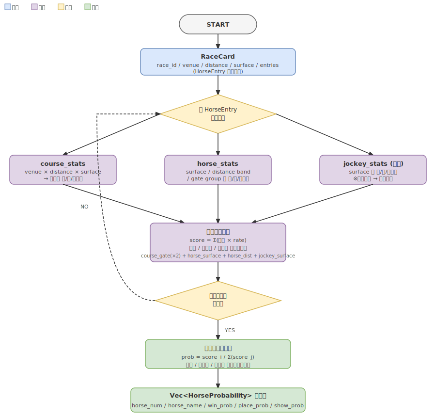

# 着順確率推定モデル仕様書

Issue #11 対応。DB に蓄積された過去成績をもとに、出走馬ごとの 1 着・2 着・3 着確率を推定する。

## 概要



出馬表（`RaceCard`）を受け取り、各馬の勝率（win）・連対率（place）・複勝率（show）の推定確率を返す。
精密な機械学習モデルではなく、「データがあれば動く」ルールベーススコアリングを採用する。

---

## 用語定義

本文書での英語命名は日本語競馬用語に対応させている（国際標準と異なる場合がある）。

| フィールド名 | 日本語 | 定義 |
|------------|-------|-----|
| `win_prob` | 勝率 | 1 着以内確率 |
| `place_prob` | 連対率 | 2 着以内確率（日本競馬の「連対」＝top-2） |
| `show_prob` | 複勝率 | 3 着以内確率（日本競馬の「複勝」＝top-3） |

---

## 入力

| 項目 | 型 | 説明 |
|------|----|----|
| `RaceCard` | ドメイン型 | race_id / venue / distance / surface / entries |
| `HorseEntry` (entries 内) | ドメイン型 | gate_num（枠番）/ horse_num / horse_name / jockey (Option) |

> `gate_num` はスコアリング時に `course_stats` の枠順グループ（Inner/Middle/Outer）に変換して `course_gate_rate` を引くために使用する。

## 出力

| 項目 | 型 | 説明 |
|------|----|----|
| `horse_num` | `HorseNum` | 馬番 |
| `horse_name` | `HorseName` | 馬名 |
| `win_prob` | `f64` | 勝率・1 着確率（0.0〜1.0） |
| `place_prob` | `f64` | 連対率・2 着以内確率（0.0〜1.0） |
| `show_prob` | `f64` | 複勝率・3 着以内確率（0.0〜1.0） |

勝率・連対率・複勝率それぞれ独立にレース内正規化し、各合計が 1.0 になるようにする。

---

## スコアリングアルゴリズム

### ステップ 1: 統計データの取得

各 `HorseEntry` に対して以下 3 種のスタッツをDBから並列取得する。

| スタッツ | キー | スコアリングに使用するデータ |
|---------|-----|----------|
| `course_stats` | venue × distance × surface | **枠順グループ別** 勝率・連対率・複勝率（`course_gate: RateTriple`） |
| `horse_stats` | horse_name | **芝ダ別** 勝率・連対率・複勝率（`horse_surface: RateTriple`）・**距離帯別** 勝率・連対率・複勝率（`horse_distance: RateTriple`） |
| `jockey_stats` | jockey_name (任意) | **芝ダ別** 勝率・連対率・複勝率（`jockey_surface: Option<RateTriple>`） |

### ステップ 2: 生スコア計算

馬ごとに以下の加重和を計算する（勝率・連対率・複勝率それぞれ）。

```
raw_score =
    2.0 × course_gate_rate          // コース×枠順（最も信頼度高）
  + 1.0 × horse_surface_rate        // 馬の芝ダ実績
  + 1.0 × horse_distance_rate       // 馬の距離帯実績
  + 1.0 × jockey_surface_rate       // 騎手の芝ダ実績（騎手なし時は 0.0 として加算）
```

> 注1: 正規化の除数は「合計重み（5 or 4）」ではなくレース内の全馬スコア合計（ステップ 3）。
> 注2: 騎手なし（`jockey_surface = None`）は `RateTriple { win: 0.0, place: 0.0, show: 0.0 }` を代入（係数 1.0 ごと加算）するため、騎手なし馬のスコアは他馬より低くなる。
> 注3: スタッツ未蓄積の馬は全 rate = 0.0 → score = 0.0 になる。

### ステップ 3: レース内正規化

全出走馬の生スコアの合計で各馬スコアを割る。

```
win_prob_i = raw_win_score_i / Σ(raw_win_score_j)
```

**フォールバック条件:**
- 個別馬のスコアが 0（スタッツ未蓄積等）の場合: その馬のスコアは 0.0 のまま正規化に含める（分母は全馬合計なので変わらず、その馬の win_prob は 0.0 になる）
- **全出走馬のスコア合計が 0**（出走馬全員のスタッツが未蓄積、score = 0.0 × n）の場合のみ均等確率（1/頭数）にフォールバックする

---

## 統計データ拡張: GroupStat への `shows` 追加

現行の `GroupStat`（`src/use-case/src/repository.rs` で定義）は連対（1〜2 着）までしか保持しない。複勝率（1〜3 着）を扱うため `shows` フィールドを追加する。

```rust
// src/use-case/src/repository.rs
pub struct GroupStat {
    pub label: String,
    pub starts: u32,
    pub wins: u32,
    pub places: u32,  // 連対 (top-2)
    pub shows: u32,   // 複勝 (top-3) ← 追加
}
```

DBクエリは以下を追加:
```sql
SUM(CASE WHEN finishing_position IN (1,2,3) THEN 1 ELSE 0 END) AS shows
```

**影響範囲（全件変更が必要）:**
- `src/interface/rdb-gateway/src/repositories/horse_stats.rs`: 6 クエリパターン（overall / by_surface / by_distance_band / by_track_condition / by_popularity_band / by_gate）
- `src/interface/rdb-gateway/src/repositories/course_stats.rs`: 1 クエリパターン（by_gate_group）
- `src/interface/rdb-gateway/src/repositories/jockey_stats.rs`: 3 クエリパターン（overall / by_surface / by_gate）

---

## レイヤー別実装方針

### Domain (`paddock_domain::prediction`)

```rust
pub struct HorseProbability {
    pub horse_num: HorseNum,
    pub horse_name: HorseName,
    pub win_prob: f64,
    pub place_prob: f64,
    pub show_prob: f64,
}

pub fn estimate_probabilities(
    entries: &[(HorseEntry, HorseFactors)],
) -> Vec<HorseProbability>
```

`HorseFactors` は horse_stats / course_stats / jockey_stats から抽出した率を束ねる中間型。
win / place / show 各率を `RateTriple` で保持する。

```rust
pub struct RateTriple {
    pub win: f64,
    pub place: f64,
    pub show: f64,
}

pub struct HorseFactors {
    pub course_gate: RateTriple,         // course_stats の枠順グループ率
    pub horse_surface: RateTriple,       // horse_stats の芝ダ率
    pub horse_distance: RateTriple,      // horse_stats の距離帯率
    pub jockey_surface: Option<RateTriple>, // jockey_stats の芝ダ率（騎手なし時 None）
}
```

スコアリングと正規化の純粋関数として実装（IO なし・テスト容易）。

### Use-Case (`use_case::interactor::race::predict`)

```rust
pub async fn predict_race(&self, race_id: &RaceId) -> Result<Vec<HorseProbability>>
```

1. `find_race_card(race_id)` → RaceCard 取得
2. 各 HorseEntry に対してスタッツを **逐次取得**（デフォルト）。性能要件が出た場合に `join_all` 等で並列化可
3. `domain::prediction::estimate_probabilities` を呼ぶ

Repository に `find_race_card` メソッドを追加する。

### Interface (rdb-gateway)

- `find_race_card` SQL: race_cards / race_card_entries テーブルから取得
- 既存の horse_stats / course_stats / jockey_stats クエリに `shows` カラムを追加

### Apps (analyze)

```
paddock-analyze predict <race_id>
```

出力例：
```
# レース予測 2026060412R02
馬番  馬名            勝率     連対率   複勝率
  1  ガリレオトライ  18.3%   36.7%   55.1%
  2  テスラブルー    12.1%   24.2%   36.3%
  ...
```

---

## 既知の制約

- スタッツ件数が少ない馬（デビュー直後等）は win_rate = 0 になるが、他の馬にスタッツがあれば正規化の結果、その馬の確率は限りなく低くなる（均等フォールバックにはならない）
- コースデータが存在しない組み合わせ（venue × distance × surface）の場合、`course_gate_rate = 0` として計算する
- モデルは過去成績のみを使用。馬場状態・前走間隔・調教等は考慮しない
- `win_prob ≤ place_prob ≤ show_prob` の単調性は保証されない（各確率を独立に正規化するため、馬ごとに win/place/show のスコア比率が異なる場合に逆転が起きうる）
- 確率の絶対値より**レース内の相対的な傾向**を見るための参考値として使うこと
