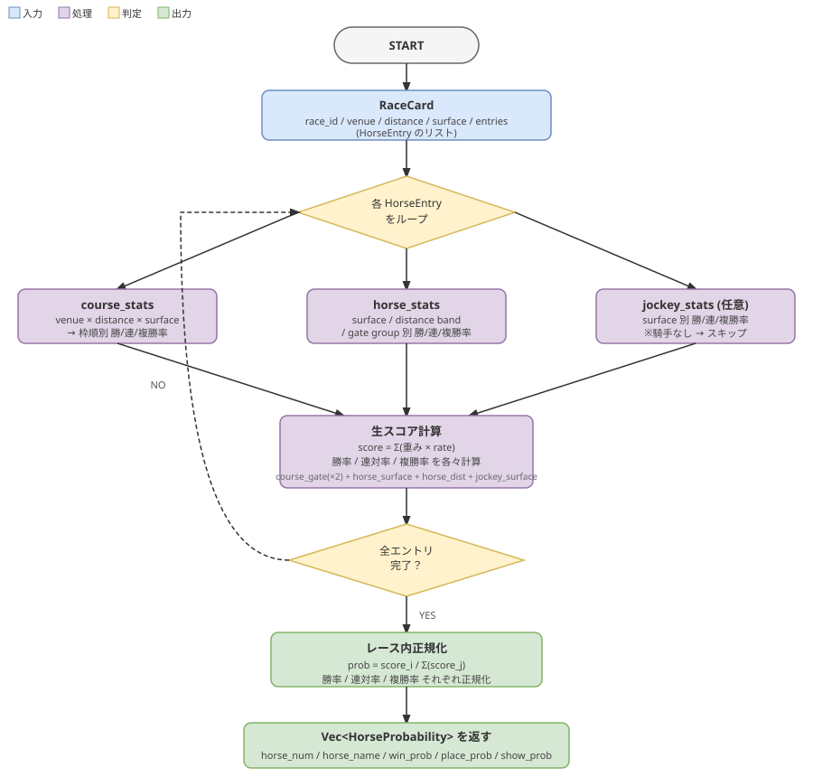

---
# knowledge 規約に基づくメタデータ（docs/knowledge/README.md）。specifications はその場で
# knowledge に昇格（ADR 履歴・相互リンクを壊さないため物理移動しない）。
status: Confirmed
kind: knowledge
doc_class: [D22, D19]
tags: [D22, D19]
updated: "2026-08-12"
---

# 着順確率推定モデル仕様書

> このドキュメントは knowledge（確定済みドメイン知）です。決定の経緯は frontmatter `sources` の
> ADR を参照。変更時は末尾「変更履歴」に追記し `updated`/`distilled_from_sha` を更新すること。

Issue #11 対応。DB に蓄積された過去成績をもとに、出走馬ごとの 1 着・2 着・3 着確率を推定する。

## 概要



出馬表（`RaceCard`）を受け取り、各馬の勝率（win）・連対率（place）・複勝率（show）の推定確率を返す。
精密な機械学習モデルではなく、「データがあれば動く」ルールベーススコアリングを採用する。

---

## 用語定義

本文書での英語命名は日本語競馬用語に対応させている（国際標準と異なる場合がある）。

| フィールド名 | 日本語 | 定義 |
|------------|-------|-----|
| `win_prob` | 勝率 | 1 着以内確率 |
| `place_prob` | 連対率 | 2 着以内確率（日本競馬の「連対」＝top-2） |
| `show_prob` | 複勝率 | 3 着以内確率（日本競馬の「複勝」＝top-3） |

> 横断の用語索引は [用語集](../knowledge/glossary.md)（D07）。定義の正本は本書で、用語集はここを指す。

---

## 入力

| 項目 | 型 | 説明 |
|------|----|----|
| `RaceCard` | ドメイン型 | race_id / venue / distance / surface / entries |
| `HorseEntry` (entries 内) | ドメイン型 | gate_num（枠番）/ horse_num / horse_name / jockey (Option) |

> `gate_num` はスコアリング時に `course_stats` の枠順グループ（Inner/Middle/Outer）に変換して `course_gate_rate` を引くために使用する。

## 出力

| 項目 | 型 | 説明 |
|------|----|----|
| `horse_num` | `HorseNum` | 馬番 |
| `horse_name` | `HorseName` | 馬名 |
| `win_prob` | `f64` | 勝率・1 着確率（0.0〜1.0） |
| `place_prob` | `f64` | 連対率・2 着以内確率（0.0〜1.0） |
| `show_prob` | `f64` | 複勝率・3 着以内確率（0.0〜1.0） |

勝率は 1 着＝1 ポジションなのでレース内合計 1.0、連対率は 2 着以内＝2 ポジションなので合計 2.0、
複勝率は 3 着以内＝3 ポジションなので合計 3.0 へ正規化する（各馬は確率として 1.0 で上限クランプ）。
さらに馬ごとに累積 max で単調化し `win_prob ≤ place_prob ≤ show_prob` を保証する（ADR 0007）。

---

## スコアリングアルゴリズム

### ステップ 1: 統計データの取得

各 `HorseEntry` に対して以下 3 種のスタッツをDBから並列取得する。

| スタッツ | キー | スコアリングに使用するデータ |
|---------|-----|----------|
| `course_stats` | venue × distance × surface | **枠順グループ別** 勝率・連対率・複勝率（`course_gate: Option<RateTriple>`, 実績なしは None=母数除外, #81） |
| `horse_stats` | horse_name | **芝ダ別** 勝率・連対率・複勝率（`horse_surface: Option<RateTriple>`, #81）・**距離帯別** 勝率・連対率・複勝率（`horse_distance: Option<RateTriple>`, #81）・**馬場状態別** 勝率・連対率・複勝率（`horse_track_condition: Option<RateTriple>`, #73） |
| `jockey_stats` | jockey_name (任意) | **芝ダ別** 勝率・連対率・複勝率（`jockey_surface: Option<RateTriple>`, 騎手なし／実績なしは None, #81） |
| `trainer_stats` | trainer_name (任意) | **芝ダ別** 勝率・連対率・複勝率（`trainer_surface: Option<RateTriple>`, #74）。母数は `results.trainer` |
| `find_recent_runs` | horse_name × cutoff 日 | **直近 N 走（N=1〜3）** から算出する前走フォームトレンド（`recent_form: Option<f64>`, #31/#220）。重みは [1.0, 0.5, 0.25] 固定の加重平均。本番 predict は N=1 固定、`--trend-n` は `paddock-analyze backtest` スイープ専用（#220, ADR-0036）。cutoff より前のみ（リーク防止） |
| `standard_times` | cutoff 日（レース共通, 1回） | (surface,distance) 別のコーパス標準タイム[秒]（前走タイム相対速度の分母, #76）。`date < cutoff` で as-of 集計、薄いバケツは除外 |

### ステップ 2: 生スコア計算（重み付き平均）

馬ごとに、**存在する factor のみ**の重み付き平均を計算する（勝率・連対率・複勝率それぞれ）。

```
raw_score =
    ( [ 1.0  × course_gate_rate ]    // コース×枠順（#272改善①で2.0→1.0, ADR 0056・識別力低く希釈源）
    [ + 1.0  × horse_surface_rate ]  // 馬の芝ダ実績（実績ありのときのみ, #81）
    [ + 1.0  × horse_distance_rate ] // 馬の距離帯実績（実績ありのときのみ, #81）
    [ + 2.0  × jockey_surface_rate ] // 騎手の芝ダ実績（#272改善①で1.0→2.0, ADR 0056・純モデル主シグナル）
    [ + 1.0  × trainer_surface_rate ] // 調教師の芝ダ実績（調教師あり×実績ありのときのみ, #74）
    [ + 1.0  × horse_track_condition_rate ] // 馬の馬場状態別実績（馬場状態あり×実績ありのときのみ, #73）
    [ + 0.25 × recent_form ]         // 前走フォームトレンド[0,1]（前走ありのときのみ, #31/#220）
    [ + 0.25 × weight_carried ]      // 斤量のレース内相対[0,1]（斤量あり×field平均ありのときのみ, #135）
    [ + 0.0  × jockey_recent_form ]  // 騎手直近 N 走フォーム[0,1]（#221, sweep で棄却→重み 0.0 無効, 注6）
    ) / Σ(present weights)           // 例: 全項あり=7.5（jockey_recent_form は重み 0 で実質不参加）、全項なし: Σ重み=0（下記 注2）
```

> 注1: **「実績なし」の項はその項と重みを母数から除外する（0 埋め＝全敗扱いにしない）**（ADR 0007/0014）。
> 当該グループの出走実績が無い（グループ不在・出走 0 件）factor は全て `None`: コース枠順
> （`course_gate`）・馬の芝ダ／距離帯（`horse_surface`/`horse_distance`）・騎手（`jockey_surface`、騎手
> 未登録も含む）・調教師（`trainer_surface`）・馬場状態（`horse_track_condition`）・前走（`recent_form`）・
> 斤量（`weight_carried`、斤量未取得 or field 平均なし）・騎手直近フォーム（`jockey_recent_form`、騎手未登録 or 近走なし）。
> #81 で 0 埋めだった course_gate/horse_surface/horse_distance/jockey_surface を None 除外へ統一した。
> これらの項は「平均からの差分」としてのみ効き、欠落で不当に減点されない。全馬が同条件のときは定数除算
> となり相対順位は不変。
> 注1b（#272改善② / ADR 0057）: 上の「欠落＝母数から落とす（drop）」は `Default`（`impute_missing_factors=false`）の
> 挙動。**predict 本番（`production()`）は欠落 stat factor をレース内 field mean で補完する**（present 馬の
> 縮約後レート平均、present<2 は prior）。欠落を drop すると同レースで当該 factor を持つ馬だけがシグナルを得て
> 欠く馬とのレース内相対比較が失われ、識別力の高い高欠落 factor（`horse_surface`/`horse_distance`/
> `horse_track_condition`, 欠落 0.28〜0.39）の resolution が希釈されるため。field mean はレース内中立なので
> 「実績なし ≠ 減点」の方針（ADR 0007/0014）を保つ。**scalar 項（`recent_form`/`weight_carried`/
> `jockey_recent_form`）は補完対象外で従来どおり drop**。純 AUC 0.671→0.678・top1 0.182→0.197（全6四半期改善）、
> blended α=0.2 は非回帰。backtest は `--impute-missing-factors` で on/off できる。
> 注2: 全 factor が `None`（どの統計も実績なし）の馬は `weight == 0` → ゼロ除算を避けて score = 0.0。
> score 0 の馬は次ステップの均等フォールバックに畳まれる（ADR 0014）。**ただし補完有効時（注1b・本番）は
> 全 stat factor が field mean（present 0 頭なら prior）で補完されて `weight > 0` になるため、stat のみ
> 欠落する馬（全 stat 欠落・scalar も無い新馬等）ではこの `weight==0` 均等フォールバックは非到達になり、
> prior 相当のスコアでレースに参加する**（drop 時の score 0.0＝低評価から中立寄りへ変わる。ADR 0007/0014 の
> 「実績なし≠全敗」に整合する方向・ADR 0057）。
> 注3: `recent_form` は直近 N 走（N=1〜3、backtest #220 評価の結果 N=1 を維持）の各走スコアを
> 重み [1.0, 0.5, 0.25] で加重平均したトレンドスカラー値（0.5=中立）。各走スコアは馬体重変化・
> 前走人気乖離・前走間隔・前走着差（#76）・前走タイム相対速度（#76）を [0,1] に統合した値。
> スコアが取れない走（中止・情報欠落等）は分母から除外する（欠落フォールバック）。
> N=1 のとき前走 1 走のみ（#31 の現行挙動）と完全一致する。
> 全ての前走でスコアが取れない場合は `None`（`recent_form` 項を除外）。
> win/place/show に同値で寄与し、factor 重み 0.25 は ADR 0009 で決定。
> 前走着差は圧勝ほど高く・大敗ほど低い競争力シグナルで、着差文字列が解釈不能・着順なしの前走では sub-signal を落とす。
> 前走タイムは (surface,distance) 別のコーパス標準タイム（as-of 集計, `standard_times`）に対する相対速度で、
> 標準より速い前走を加点・遅い前走を減点する。前走タイム無し・標準タイム未整備の前走では sub-signal を落とす。
> 重み 0.25 は #76 の着差・タイム追加前の値。#217 で 4891R スイープ（w ∈ {0.0〜0.5}）を実施。w=0.0（除去）は連対/複勝 LogLoss が明確に悪化し前走フォームの寄与を確認、正の範囲では最適が極めて浅く（w=0.1 が僅差最良だが 0.25 との差は LogLoss 0.0001〜0.0003）変更根拠なし。現行 0.25 を維持（ADR 0035）。
> 注4: `horse_track_condition` は評価対象レースの馬場状態（良/稍重/重/不良）に対応する馬の成績。
> レースの馬場状態が未確定（backtest: DB に無い / predict: `--track-condition` 未指定）のとき、または
> その馬場での出走実績が無い（グループ不在・出走 0 件）馬は `None`。重み 1.0 はバックテストで決定
> （ADR 0011）。出馬表 PDF に馬場状態は無いため、predict 経路では呼び出し側が当日の値を渡す
> （予想セッションはレース毎の対話入力＝DB 値があれば空入力でデフォルト採用、analyze CLI は
> `--track-condition`）。
> 注5: `trainer_surface` は調教師の芝ダ別成績（#74）。調教師名は出馬表 `HorseEntry` に無いため、
> predict は **netkeiba 出馬表**から取った `entry.trainer`、backtest は `results.trainer`（当該レース
> 確定値）を使う。調教師なし／該当 surface 実績なしの馬は `None`。重み 1.0（ADR 0012。旧くは jockey と同値だったが #272 改善①/ADR 0056 で jockey のみ 2.0 へ）。
> **現状の制約**: 統計母数 `results.trainer`（および netkeiba 過去走）が未充足のため、本項は実データ上
> まだ発火しない。母数充足（結果 PDF / netkeiba 過去走の trainer 抽出）は別 Issue。出馬表 PDF パーサの
> trainer 抽出も別 Issue（PDF 経路は当面 `trainer=None`）。
> 注6: `jockey_recent_form` は騎手の直近 N 走（N=10, `JOCKEY_RECENT_FORM_LIMIT`）における
> 人気 vs 着順の乖離から算出するフォームスカラー（#221）。
> 各走の signal = clamp(0.5 + (人気 − 着順) × POP_GAP_K, 0, 1) の算術平均。
> 人気 or 着順が欠落している走は母数から除外。有効走数 0 → `None`（骨格は `recent_form` と同じ）。
> （人気・着順はいずれも「順位」＝数値が小さいほど上位。10 番人気 1 着なら gap = 10 − 1 = 9 で好フォーム）
> **重み 0.0（無効・棄却, ADR 0038）**: 1561R（2026-01〜06）の weight sweep（0.0/0.1/0.25/0.5/1.0,
> α=0.2・m=10）で全 weight が Brier/LogLoss を単調悪化させ weight=0.0 が最良だった。#217（recent_form
> weight）と同型で、シグナルが縮約 m=10 + 市場ブレンド α=0.2 に吸収される。算出機構と backtest の
> `--jockey-form-weight` スイープフラグは将来の再評価のため残す（cf. recency 無効化 ADR 0016）。

### ステップ 2.5: ベイズ縮約（#75, ADR 0016）

各 factor のレートを母集団 prior（出走頭数 ~14 由来の基準率: win=1/14, place=2/14, show=3/14）へ
出走数 `k` に応じて縮約する:

```
smoothed = (k · rate + m · prior) / (k + m)        // m = 擬似カウント
```

`k≫m` で生レート、`k=0` で prior、その間を単調に補間する。少データ馬（新馬・復帰馬）の極端な
レート＝過信（`win_prob=0` を含む, ADR 0002）を緩和する。`m` は `EstimationConfig.shrinkage` で
切り替え可能で、backtest（2026-03-28〜05-31 / 144R）で m=10 が単勝 Brier/LogLoss・連対で最良
（単勝的中 9.7→13.2%）だったため**本番 predict は m=10 を既定**とする（ADR 0016）。

> **リーセンシー重み付け（recency, #75 Phase B）** も `EstimationConfig.recency` /
> `--recency-half-life` で切り替え可能（馬の芝ダ・距離帯・馬場状態を `0.5^(days_ago/half_life)` で
> 時間減衰集計）。ただし backtest で改善が確認できず（前走フォーム #31 が直近を既に捕捉・カテゴリ別
> 出走数が疎）、**デフォルトは無効**。機構は将来評価のため残す（ADR 0016）。

### ステップ 2.7: place/show 冪変換（脱圧縮, #283, ADR 0047, 任意）

place/show のスコアに、次ステップの正規化前に冪変換 `score'_i = score_i^γ` を掛ける
（`apply_score_power`）。合計固定の正規化（2.0 / 3.0）＋単調化は分布を中央へ圧縮し、本命の複勝を
過小評価・人気薄を過大評価する。`γ > 1.0` でスコアをシャープ化すると、`normalize_to_sum(score^γ, T)`
は `normalize(prob^γ, T)` と一致するため**場内合計 2.0 / 3.0 を保ったまま**本命を持ち上げ人気薄を下げる
（脱圧縮）。win 列には適用しない（win の冪変換はステップ 5 がブレンド後に担当）。

```
raw_place_score_i ← raw_place_score_i ^ γ
raw_show_score_i  ← raw_show_score_i  ^ γ
```

- `γ` は `EstimationConfig.place_show_power: Option<f64>`。`None` / 非有限 / `≤0` / ちょうど `1.0`
  （厳密一致近傍）は no-op。`production()` は `RECOMMENDED_PLACE_SHOW_POWER = 2.0`（ADR 0047）。
- backtest の `--place-show-power <γ>` で sweep する。

---

### ステップ 3: レース内正規化（top-k）+ 単調化

各列を「着以内ポジション数」に対応する合計へ正規化し、各馬を確率として 1.0 で上限クランプする。

```
win_prob_i   = min(1, raw_win_score_i   / Σ(raw_win_score_j)   × 1.0)   // 1 着 = 1 ポジション
place_prob_i = min(1, raw_place_score_i / Σ(raw_place_score_j) × 2.0)   // 2 着以内 = 2 ポジション
show_prob_i  = min(1, raw_show_score_i  / Σ(raw_show_score_j)  × 3.0)   // 3 着以内 = 3 ポジション
```

その後、馬ごとに累積 max で単調化して `win_prob ≤ place_prob ≤ show_prob` を保証する。

```
place_prob_i = min(1, max(win_prob_i,   place_prob_i))
show_prob_i  = min(1, max(place_prob_i, show_prob_i))
```

> win 列は各馬のシェア ≤ 1 のため上限クランプは発生せず合計は厳密に 1.0。place/show は小頭数
> （n < 3）で上限クランプにより合計が 2.0 / 3.0 を下回りうる（確率の上限を優先）。
> 例: 3 頭立ては全馬が複勝圏なので show_prob = 1.0。

**フォールバック条件:**
- 個別馬のスコアが 0（スタッツ未蓄積等）の場合: その馬のスコアは 0.0 のまま正規化に含める（その馬の win_prob は 0.0。単調化により place/show も 0.0 のまま）
- **全出走馬のスコア合計が 0**（出走馬全員のスタッツが未蓄積）の場合のみ均等フォールバック:
  `win_prob = 1/n`、`place_prob = min(1, 2/n)`、`show_prob = min(1, 3/n)`（自然に単調）

---

### ステップ 4: 市場オッズ（単勝）ブレンド（#72, 任意）

モデルは過去成績ベースで、スタッツ希薄馬（新馬・復帰馬）に弱い。市場の単勝オッズは多くの予想家の
集合知が集約された強力かつ高校正な信号なので、モデルの win 確率と線形ブレンドして補正する
（`blend_with_market_win`）。**ブレンド係数 α = モデル重み**（`1-α` が市場重み, 範囲 [0,1]）。

```
implied_i      = 1 / odds_i                          // 単勝オッズ → implied 確率
market_prob_i  = implied_i / Σ implied_j             // 控除率(オーバーラウンド)を除去し合計 1.0
blended_win_i  = α · win_prob_i + (1-α) · market_prob_i   // オッズの無い馬はモデル値のまま
win_prob_i     = blended_win_i / Σ blended_win_j     // 合計 1.0 へ再正規化
place/show_i   = 累積 max で win ≤ place ≤ show を再是正（v1 は win のみブレンド）
```

- `α = 1.0`（既定の CLI 未指定）または市場オッズ空のときはモデルのみ（no-op）。
- 市場オッズの取得元:
  - **predict（本番・未来レース）**: 当日の `race_odds` 最新スナップショット（`as_of = None`）。
  - **backtest**: 当時の `race_odds`（`as_of = レース日`, リーク防止）を優先し、無ければ PDF 確定成績の
    単勝 `results.odds`（クローズ前後の確定オッズ。結果はリークしない）で代替する。過去レースは
    `race_odds` スナップショットが無いことが多いため、この代替で評価可能になる。
- **採用 α（本番既定）= 0.2**（ADR 0034 で 4891R 計測後に確定）。
  初期 backtest（2026-03-01〜05-31, 144R, 市場 = `results.odds`）では α=0.3 が最良だったが、
  拡張バックテスト（2025-01-05〜2026-06-14, 4891R）で α が Brier/LogLoss に単調に効くことを
  確認し 0.2 に更新。詳細は ADR 0034。初期スイープ参考値:

  | α (モデル重み) | 単勝的中 | 複勝的中 | 想定回収率 | Brier(win) | LogLoss(win) |
  |---|---|---|---|---|---|
  | 1.0（モデルのみ） | 12.5% | 31.9% | 67.7% | 0.0672 | 0.6212 |
  | 0.7 | 22.9% | 49.3% | 74.2% | 0.0590 | 0.2187 |
  | 0.5 | 28.5% | 58.3% | 85.1% | 0.0553 | 0.2029 |
  | 0.3 | 34.7% | 66.0% | 91.5% | 0.0529 | 0.1925 |
  | 0.0（市場のみ） | 32.6% | 66.0% | 78.7% | 0.0518 | 0.1841 |

  初期スイープ（144R）では α=0.3 が最良。ただし確定オッズ使用の楽観値。
  α=0.2 はこの初期スイープの対象外（範囲 0.0〜1.0 の粗い刻みで探索）であり、
  拡張バックテスト（ADR 0034）で独立に計測して採用を確定した。
  拡張バックテスト（4891R / ADR 0034）で α が Brier/LogLoss に単調に効くことを確認し **現行採用値 α=0.2 に更新**（α=0.2 は 144R 初期スイープ対象外）。

  > 注 1: このスイープは市場に**確定（クローズ）オッズ**を使うため、live 予想（事前スナップショット
  > `race_odds` を使用）より楽観的な上限値。拡張バックテストでは live オッズで α を再評価し α=0.2 に
  > 確定した（ADR 0034）。
  > 注 2: backtest でブレンド有効時、確率の事前分布に使う市場オッズと回収率評価に使う払戻オッズが
  > 同一ソース（`race_odds`→`results.odds`）のため、回収率は構造的に楽観側へ寄る。回収率は相対比較の
  > 参考値として読む（指標の本命は的中率・Brier/LogLoss）。
  > 注 3: 市場オッズが無いレースは自動でモデルのみにフォールバックするため、ブレンド有効化の副作用は無い。

CLI: `analyze backtest --blend-alpha <α>` / `analyze predict --blend-alpha <α>`（未指定でモデルのみ）。

### ステップ 5: win_prob 冪変換（#246, ADR 0042, 任意）

ブレンド後の最終 win に冪変換 `win'_i ∝ win_i^γ` を掛け、合計 1.0 へ再正規化する
（`apply_win_power`）。Harville は IIA 的性質から人気薄馬の「1着」確率を過大評価しがちで、
人気帯別校正でも穴帯の「平均予測 > 実測勝率」（過大）・人気帯の過小が観測される。`γ>1` は
人気馬の win を相対強調し穴の 1 着を縮約してこの偏りを是正する。

```text
win'_i      = win_i^γ
win_prob_i  = win'_i / Σ win'_j           // 合計 1.0 へ再正規化
place/show_i = 累積 max で win ≤ place ≤ show を再是正
```

- `γ` は `EstimationConfig.win_power: Option<f64>`。`None` / 非有限 / `≤0` / ちょうど `1.0`（厳密一致近傍）は no-op。
- 連系・着順 EV（Harville/simulate）は win_prob から導くため、ここでの校正が馬連・馬単・三連複の
  EV までそのまま伝播する（#246(B) の馬単選択と連動）。
- 採用値は backtest 検証で決める（ADR 0042）。CLI: `analyze backtest --win-power <γ>`
  （未指定で no-op）。`analyze predict` は `production()` 固定。

---

## 統計データ拡張: GroupStat への `shows` 追加

現行の `GroupStat`（`src/use-case/src/repository.rs` で定義）は連対（1〜2 着）までしか保持しない。複勝率（1〜3 着）を扱うため `shows` フィールドを追加する。

```rust
// src/use-case/src/repository.rs
pub struct GroupStat {
    pub label: String,
    pub starts: u32,
    pub wins: u32,
    pub places: u32,  // 連対 (top-2)
    pub shows: u32,   // 複勝 (top-3) ← 追加
}
```

DBクエリは以下を追加:
```sql
SUM(CASE WHEN finishing_position IN (1,2,3) THEN 1 ELSE 0 END) AS shows
```

**影響範囲（全件変更が必要）:**
- `src/interface/rdb-gateway/src/repositories/horse_stats.rs`: 6 クエリパターン（overall / by_surface / by_distance_band / by_track_condition / by_popularity_band / by_gate）
- `src/interface/rdb-gateway/src/repositories/course_stats.rs`: 1 クエリパターン（by_gate_group）
- `src/interface/rdb-gateway/src/repositories/jockey_stats.rs`: 3 クエリパターン（overall / by_surface / by_gate）

---

## レイヤー別実装方針

### Domain (`paddock_domain::prediction`)

```rust
pub struct HorseProbability {
    pub horse_num: HorseNum,
    pub horse_name: HorseName,
    pub win_prob: f64,
    pub place_prob: f64,
    pub show_prob: f64,
}

pub fn estimate_probabilities(
    entries: &[(HorseEntry, HorseFactors)],
) -> Vec<HorseProbability>
```

`HorseFactors` は horse_stats / course_stats / jockey_stats から抽出した率を束ねる中間型。
win / place / show 各率を `RateTriple` で保持する。

```rust
pub struct RateTriple {
    pub win: f64,
    pub place: f64,
    pub show: f64,
}

pub struct HorseFactors {
    pub course_gate: Option<RateTriple>,    // course_stats の枠順グループ率（実績なし時 None, #81）
    pub horse_surface: Option<RateTriple>,  // horse_stats の芝ダ率（実績なし時 None, #81）
    pub horse_distance: Option<RateTriple>, // horse_stats の距離帯率（実績なし時 None, #81）
    pub jockey_surface: Option<RateTriple>, // jockey_stats の芝ダ率（騎手なし/実績なし時 None, #81）
    pub trainer_surface: Option<RateTriple>, // trainer_stats の芝ダ率（調教師なし/実績なし時 None, #74）
    pub horse_track_condition: Option<RateTriple>, // horse_stats の馬場状態別率（#73）
    pub recent_form: Option<f64>,        // 前走フォーム [0,1]（前走なし時 None, #31）
}
```

スコアリングと正規化の純粋関数として実装（IO なし・テスト容易）。

### Use-Case (`use_case::interactor::race::predict`)

確率推定の入口は `predict_race`（確率のみ）と `predict_race_views`（確率＋根拠・純/ブレンド 2 系統, #272）。
両者は内部ヘルパ `collect_race_factors` を共有し、出馬表取得と各馬の factor / 予想根拠の構築を一元化する。

1. `find_race_card(race_id)` → RaceCard 取得
2. コース統計・標準タイム表・全馬/騎手/調教師の stats・近走を **バッチ取得**（per-horse N+1 を解消, #205）
3. 各 HorseEntry に対し `resolve_shared_factors` で条件別成績（ラベル解決＋集計レート 10 スロット）を **1 回だけ** 解決し、
   `build_factors`（score 用 `HorseFactors`）と `build_explanation`（根拠 `HorseExplanation`）が **同一の共有入力を読む**（#409）。
   従来は両者がラベル選択・`stat_to_triple_opt` を二重実装して手動同期していた（factor 追加時に両方更新）欠陥を単一化した。
   recency（時間減衰）有効時に horse 3 因子（芝ダ/距離/馬場）を集計レートから上書きする「score と根拠の乖離」は
   `build_factors` 1 箇所に閉じ込める（本番は `recency: None` で両者一致）。
4. `domain::prediction::estimate_probabilities_with_config` で確率へ合成（市場ブレンド・冪変換は後段）

`with_explanation=false`（通常の `predict_race`）は根拠を組まず無駄な String 割当てを避ける。backtest
（`use_case::interactor::race::backtest`）も同じ `resolve_shared_factors` / `build_factors` を共有する
（as-of 統計・recency 有効の walk-forward、ADR 0014）。Repository には `find_race_card` を持つ。

### Interface (rdb-gateway)

- `find_race_card` SQL: race_cards / race_card_entries テーブルから取得
- 既存の horse_stats / course_stats / jockey_stats クエリに `shows` カラムを追加

### Apps (analyze)

```
paddock-analyze predict <race_id>
```

出力例：
```
# レース予測 2026060412R02
馬番  馬名            勝率     連対率   複勝率
  1  ガリレオトライ  18.3%   36.7%   55.1%
  2  テスラブルー    12.1%   24.2%   36.3%
  ...
```

---

## 本番構成の要件（REQ・D22）

`EstimationConfig::production()` が採る値と、それを決めた ADR の対応。**ADR は RO なので REQ-ID は
knowledge 側に置く**（規約は [docs/knowledge/README.md](../knowledge/README.md) の「REQ-ID の規約」）。
定数を変えるときは、まず対応する REQ の**検証手段を再実行**して閾値ごと更新する。

検証手段の共通前提: `paddock-analyze backtest` の既定は `EstimationConfig::default()` 相当で、
**m・冪較正・欠落補完・市場ブレンドのいずれも production とは違う**。production を再現するには
**5 フラグ**を明示する（`--blend-alpha 0.2 --shrinkage-m 10 --win-power 1.25 --place-show-power 2.0
--impute-missing-factors`）。フラグの付け忘れと zsh の単語分割で計測を誤り ADR を 1 本破棄した経緯は
[learned-model-harness.md](learned-model-harness.md) の「最重要原則：忠実性をサニティで担保」を参照。

**下表は各行に完全なコマンドを書く**（共通 base を変数やシェル関数に括り出さない。clap は同じフラグの
重複指定を拒否するので「base から 1 軸だけ外す」が書けず、変数展開は zsh で単語分割されない）。

**測定条件が出典 ADR と違う行がある**（ADR は当時の構成で測っている）。その場合は絶対値の一致では
なく順序関係で見る旨を各行に書く。

<!-- REQ:begin D22 -->
| REQ-ID | 要件 | 検証手段 | 出典 | status |
|---|---|---|---|---|
| REQ-D22-001 | 市場オッズ（単勝）ブレンドのモデル重みは α=0.2（`RECOMMENDED_MARKET_BLEND_ALPHA`）。市場オッズが無いレースはモデルのみへ自動フォールバックする | `for a in 0.2 0.3 0.4; do paddock-analyze backtest --from 2025-01-05 --to 2026-06-14 --shrinkage-m 10 --win-power 1.25 --place-show-power 2.0 --impute-missing-factors --blend-alpha "$a"; done`（4891R）で**単勝 Brier / LogLoss が α 方向に単調で 0.2 が最良**であること。ADR 0034 は冪較正・impute 以前の測定なので**絶対値は一致せず順序関係で見る**。α=0.0（純市場）は掃引対象外——純市場との比較は ADR 0052 が扱う | ADR 0034 | Confirmed |
| REQ-D22-002 | ベイズ縮約の擬似カウントは m=10（`RECOMMENDED_SHRINKAGE_M`）。backtest の既定は縮約 off なので production 再現には `--shrinkage-m 10` を明示する | ADR 0016 の m 掃引は **α を指定しない純モデル測定**（backtest の既定がブレンド無し。本番は当時すでに α=0.3）なので、α・冪較正・impute をすべて外して回す。off は `paddock-analyze backtest --from 2026-03-28 --to 2026-05-31`（**`--shrinkage-m off` とは書けない・フラグ自体を省く**）、残りは `for m in 5 10 20 50; do paddock-analyze backtest --from 2026-03-28 --to 2026-05-31 --shrinkage-m "$m"; done`（計 5 通り・144R）。**off 比で単勝 Brier / LogLoss が改善し m=10 が最良・m=50 は過縮約で劣化**すること（0016 実測: LogLoss 0.2718 → 0.2506・単勝的中 9.7 → 13.2%）。**α=0.2 を掛けると m 方向の差は消える**（ADR 0034 の 4891R で m=5/10/20 が Brier 0.0544・LogLoss 0.1974 と同値）ので、production 構成では「m を変えても悪化しない」ことの追認にしかならない | ADR 0016 / 0034 | Confirmed |
| REQ-D22-003 | win_prob の冪変換は γ=1.25（`RECOMMENDED_WIN_POWER`）。γ≥1.5 は LogLoss / Brier 悪化と人気馬の過剰補正で採らない | `for g in 1.0 1.25 1.5 2.0; do paddock-analyze backtest --from 2025-01-01 --to 2026-06-30 --blend-alpha 0.2 --shrinkage-m 10 --place-show-power 2.0 --impute-missing-factors --win-power "$g"; done`（4891R）で単勝 LogLoss が 1.25 で最良であること（ADR 0042 実測 0.1974 → 0.1954。当時は impute 無しなので**絶対値は一致せず順序関係で見る**） | ADR 0042 | Confirmed |
| REQ-D22-004 | place/show の冪変換は γ=2.0（`RECOMMENDED_PLACE_SHOW_POWER`）。純校正の knee は γ=3.0 だが複勝買い目 ROI が net 改善しないため 2.0 を維持する | knee の観測は ADR 0051 の窓・グリッドで行う: `for g in 1.5 2.0 2.5 3.0 3.5; do paddock-analyze backtest --from 2025-01-05 --to 2026-06-14 --blend-alpha 0.2 --shrinkage-m 10 --win-power 1.25 --impute-missing-factors --place-show-power "$g"; done`。**γ=3.0 で純校正（place/show Brier・LogLoss）は最良になるが複勝買い目 ROI が γ=2.0 を上回らないこと**。ADR 0047 / 0051 とも impute 以前の測定なので順序関係で見る | ADR 0047（採用）/ 0051（knee 確認・2.0 維持） | Confirmed |
| REQ-D22-005 | 近走トレンドは前走のみ（`trend_n = 1`）。N=2/3 は全指標が悪化する | ADR 0036 も**純モデル測定**（単勝的中 13.5% 水準・α 指定なし）なので `for n in 1 2 3; do paddock-analyze backtest --from 2026-03-01 --to 2026-05-31 --shrinkage-m 10 --trend-n "$n"; done`（893R）で N=2/3 が N=1 を上回らないこと。α=0.2 を掛けるとモデル側の差が希釈されて判定が出ない | ADR 0036 | Confirmed |
| REQ-D22-006 | 時間減衰（recency）は無効（`recency: None`）。Brier / LogLoss が変わらず ROI も誤差範囲で、複雑性だけが増える | `for h in 30 60 90; do paddock-analyze backtest --from 2025-01-05 --to 2026-06-14 --blend-alpha 0.2 --shrinkage-m 10 --win-power 1.25 --place-show-power 2.0 --impute-missing-factors --recency-half-life "$h"; done` を無効時と比較し、**差が出ないこと**。**ADR 0034 の recency 表は α=0.3 固定・冪較正 impute 以前**なので数値は一致しない | ADR 0034 | Confirmed |
| REQ-D22-007 | 騎手直近フォームの重みは 0（`jockey_recent_form_weight: None`）。算出機構と `--jockey-form-weight` は再評価用に残す | `for w in 0.0 0.1 0.25 0.5 1.0; do paddock-analyze backtest --from 2026-01-01 --to 2026-06-14 --blend-alpha 0.2 --shrinkage-m 10 --win-power 1.25 --place-show-power 2.0 --impute-missing-factors --jockey-form-weight "$w"; done`（1561R）で **w>0 が全指標で w=0 を上回らないこと**。ADR 0038 は α=0.2 / m=10 だが冪較正・impute 以前なので順序関係で見る | ADR 0038 | Confirmed |
| REQ-D22-008 | 相性 factor（騎手×場 / 騎手×距離 / 騎手×馬 / 馬×場）は production 非組込（重み 0）。measure-first で lift を測ってから採否を決める | **lift は純モデルで測る**（`analyze backtest` は AUC / top1 を出力しないので `--dump-features` のダンプを Python で評価する。同型案件の ADR 0057 / 0061 も α=1.0 で測っている）: `for w in 0.0 0.5 1.0; do paddock-analyze backtest --from 2025-01-05 --to 2026-06-14 --blend-alpha 1.0 --shrinkage-m 10 --win-power 1.25 --place-show-power 2.0 --impute-missing-factors --jockey-venue-weight "$w" --jockey-distance-weight "$w" --jockey-horse-combo-weight "$w" --horse-venue-weight "$w" --dump-features "/tmp/affinity-$w.tsv"; done`。**純 top1 が baseline を lift 閾値ぶん上回ること**が採用条件（ADR 0061 は同型案件で純 top1 +0.010〜0.015 のゲートを置いた。閾値と最終的な掃引値は #350 で確定）。**α=0.2 での実行は別基準**——ブレンドを掛けるとモデル側の差は消えるので（REQ-D22-002 / 005 と同じ理屈）、そちらは「blended が非回帰であること」の確認に使う | [#350](https://github.com/taito-station/paddock/issues/350)（measure-first で保留中。採否の ADR は未起票） | Tentative |
| REQ-D22-009 | 脚質（先行度）factor は production 非組込（`running_style_weight: None`）。純モデルの AUC / 校正は微改善するが本命 top1 が全 weight で劣化する | **CLI 未露出**（`--running-style-weight` は無い）ので、ダンプまでを `paddock-analyze backtest --from 2025-01-01 --to 2026-06-30 --blend-alpha 1.0 --shrinkage-m 10 --win-power 1.25 --place-show-power 2.0 --dump-features /tmp/rs.tsv` で作り、weight を振る部分は Python 側で鏡映する（**掃引スクリプトは ADR 0061 が「本番外の使い捨て scratch でリポに残さない」と宣言しており現存しない**——`scripts/predict-check/feature_resolution_diag.py` を土台に再実装するか、CLI にフラグを足す）。合否は **全 weight で純 top1 が baseline（0.1683）を上回らないこと**（0061 のゲート＝純 top1 +0.010〜0.015 に届かないこと）。**母数は `running_style` 非空の covered subset**（全体の 17.3%・11,809 馬 / 3,827 レース。全馬母数で回すと 0061 と比較できない）。0061 の再現に合わせて `--impute-missing-factors` は付けない。**決定自体は ADR 0061 で確定済み**で、`Tentative` にしていないのはそのため——暫定なのは要件ではなく**再測定の手段**（ハーネスが現存しない） | ADR 0061 | Confirmed |
| REQ-D22-010 | 欠落 stat factor はレース内 field mean で補完する（`impute_missing_factors: true`）。scalar 項（`recent_form` / `weight_carried` / `jockey_recent_form`）は補完せず従来どおり drop する | 純モデルのダンプを 1 本作り（`paddock-analyze backtest --from 2025-01-05 --to 2026-06-14 --blend-alpha 1.0 --shrinkage-m 10 --win-power 1.25 --place-show-power 2.0 --dump-features /tmp/impute.tsv`）、**drop と補完の比較は `scripts/predict-check/impute_prototype.py --tsv /tmp/impute.tsv` で行う**（素性レート列から両方を再計算するのでダンプは 1 本でよい。`analyze backtest` は AUC / top1 を出力しない）。blended 非回帰は `paddock-analyze backtest --from 2025-01-05 --to 2026-06-14 --blend-alpha 0.2 --shrinkage-m 10 --win-power 1.25 --place-show-power 2.0 --impute-missing-factors` を有無で比較。合否は **純 AUC / top1 が改善し、blended（α=0.2）が非回帰であること**（ADR 0057 実測: 純 AUC 0.671→0.678・top1 0.182→0.197・全 6 四半期で改善／blended 単勝的中 31.3%→31.2% で実質フラット） | ADR 0057 | Confirmed |
| REQ-D22-011 | `win ≤ place ≤ show` の単調性を出力で保証する（累積 max で単調化。冪変換を入れた後も再是正する） | `cargo test -p paddock-domain` の単調性テスト | ADR 0007（単調化の決定）/ 0047（冪変換後の再是正） | Confirmed |
<!-- REQ:end D22 -->

## 既知の制約

- スタッツの**ある**馬で当該グループのみ出走 0 件の factor は `None`（母数除外）になり、0 埋め減点しない
  （#81/ADR 0014）。全 factor が `None`（どの統計も実績なし）の馬は score = 0。レース内の他馬に正スコアが
  あれば正規化で確率はほぼ 0（限りなく低い）になり、**均等フォールバックはレース全馬が score 0 のときのみ**
  発動する。
- コースデータが存在しない組み合わせ（venue × distance × surface）の場合、`course_gate = None`（母数除外）
  として計算する（#81 以前は 0 埋め）
- モデルは過去成績・前走フォーム（馬体重変化・前走人気乖離・前走間隔, #31／前走着差・前走タイム相対速度, #76）・
  馬場状態別成績（#73）・斤量のレース内相対（#135）を使用。
- 斤量項（`weight_carried`）は当該レースの field 平均斤量との kg 差を [0,1]（0.5=中立）に写像する独立 factor。
  向きは「平均より重い→加点」で、backtest（両符号比較）で減点符号より的中率・回収率・校正がすべて良かった
  ため採用（実績馬ほど重い斤量を課される選択効果, ADR 0009 追補）。斤量は netkeiba 出馬表のみ取得（PDF 出馬表・
  斤量欠落・field 平均なしは項なし）。backtest は results の確定斤量で field 平均を取る。
- 馬場状態項は評価対象レースの馬場状態が分かるときのみ効く。出馬表 PDF に馬場状態は無いため、
  analyze CLI の predict では `--track-condition` の手入力が必要（未指定なら項なし＝従来どおり）。
  重み 1.0 はバックテストで「単勝/連対/複勝/回収率 改善・単勝 Brier/LogLoss 微悪化」を確認した
  ピーク値（ADR 0011）
- 前走フォームは前走（直近 1 走）が DB に無い馬では `None`（寄与なし）。取り込み済み成績が乏しいデータ
  セットでは効果が限定的。重み 0.25 はバックテストで「連対/複勝/回収率/Brier 改善・LogLoss 微悪化」を
  確認した保守値（ADR 0009）
- `win_prob ≤ place_prob ≤ show_prob` の単調性は **保証される**（top-k 正規化 + 累積 max 単調化, ADR 0007）。
  place/show は 2/3 着以内の実確率として扱える（複勝 EV もこの値を使用）
- 小頭数では上限クランプにより place/show の合計が 2.0 / 3.0 を下回る（確率の上限を優先）
- 全馬スタッツ皆無の均等フォールバック時は place/show が高め（小頭数では show=1.0）に出るため、
  複勝 EV（`show_prob` 使用）がオッズ次第で買い目を誘発しうる。情報ゼロ時の買い目抑制は将来課題
- 確率の絶対値より**レース内の相対的な傾向**を見るための参考値として使うこと

---

## 変更履歴

- 2026-07-14: knowledge 規約（status/sources/参照SHA）に基づき frontmatter を付与し knowledge へ昇格（内容変更なし・pilot 移行）。物理移動はせず ADR 履歴/相互リンクを維持。詳細は [docs/knowledge/README.md](../knowledge/README.md)。

---

## 決定ログ

<!-- この節は append-only です。既存エントリの変更・削除は CI が検出します。 -->

### ADR 0007: 確率推定の単調性担保と騎手なしペナルティ是正 (Issue #32) (2026-06-08) — 承認済み

#### コンテキスト
ADR 0002 で実装した着順確率推定 (`paddock_domain::prediction`) に 2 つの品質課題があった
（設計書 `probability-estimation.md` の「既知の制約」に明記されていた）。

1. **単調性の非保証**: win / place / show を各レート（勝率・連対率・複勝率）から**独立に**レース内
   合計 1.0 へ正規化していたため、馬によっては `win_prob ≤ place_prob ≤ show_prob` が破れた。さらに
   place/show が「2 着以内・3 着以内の実確率」を表さず（合計 1.0 のため平均 1/n に縮む）、複勝の期待値
   計算（`select_bets` が `show_prob` を使用, ADR 0003）が系統的に過小評価されていた。
2. **騎手なし馬の過剰ペナルティ**: 騎手未登録馬は jockey 項を `+0.0` として加算していたため
   （ADR 0002 決定 #3 の重み付き和）、保有 factor が同等でも騎手ありの馬より相対スコアが不当に低く出た。

#30 のバックテスト基盤が整い、変更の精度影響を before/after で定量比較できるようになった。

検討した単調化の選択肢:
- **案A（適正な top-k 正規化 + 後処理単調化）**: win→合計 1.0、place→合計 2.0、show→合計 3.0 に正規化
  （各馬 1.0 上限）し、馬ごとに累積 max で単調化する。place/show が実確率になり複勝 EV も是正される。
- **案B（最小の後処理クランプ）**: 各列の合計 1.0 正規化は維持し、`place=max(win,place)` /
  `show=max(place,show)` だけ適用。単調性のみ担保するが、place/show は実確率にならず複勝 EV も過小のまま。

#### 決定
**案A（適正な top-k 正規化 + 後処理単調化）を採用する。** あわせて騎手なしペナルティを是正する。

1. **スコアリングを重み付き和から重み付き平均へ変更**（`raw_score`）。存在する factor のみで
   `(2·course_gate + 1·horse_surface + 1·horse_distance [+ 1·jockey_surface]) / Σ(present weights)`
   を計算する。騎手なし馬は jockey 項と重み 1 を母数から除外するため、欠落項で減点されない。全馬が
   騎手あり（または全馬なし）のときは定数除算となり、レース内正規化後の相対順位は不変。騎手項は
   「平均からの差分」としてのみ効き、強い騎手は加点・弱い騎手は減点に正しく働く。

2. **win / place / show を合計 1.0 / 2.0 / 3.0 に正規化**（`normalize_to_sum`）。それぞれ 1 着＝1
   ポジション、2 着以内＝2 ポジション、3 着以内＝3 ポジションに対応する。各馬は確率として 1.0 で上限
   クランプする（小頭数では合計が目標を下回りうるが、確率の上限を優先する）。全馬スコア 0 の
   フォールバックも各列の目標和でスケール（`win=1/n`, `place=min(1,2/n)`, `show=min(1,3/n)`）。

3. **馬ごとに累積 max で単調化**: `place_i = min(1, max(win_i, place_i))`、
   `show_i = min(1, max(place_i, show_i))`。これで `win_prob ≤ place_prob ≤ show_prob` を保証する。

4. ADR 0002 決定 #3 のスコアリング（重み付き和）と、設計書「既知の制約」の単調性非保証・騎手ペナルティ
   の記述を本 ADR で **supersede** する。重み比（course_gate ×2、他 ×1）自体は据え置く。

#### 理由
- 案A は place/show を「2/3 着以内の実確率」という本来の意味に一致させ、複勝 EV（`show_prob` 使用）の
  過小評価を同時に是正する。案B は単調性しか直さず、place/show の意味のズレと複勝 EV の過小評価が残る
  （一時的な対症療法になる）。
- 重み付き平均化は「代替値の採用」より素直で、騎手の有無による母数の違いを 1 箇所（除算の重み和）に
  閉じ込められる。全馬同条件では相対順位を変えないため、既存の予想結果への副作用が最小。
- 後処理の累積 max は IO を持たない純粋関数内で完結し、ユニットテストで単調性を直接担保できる。

#### 影響
- `prediction::estimate_probabilities` の出力分布が変わる。`predict` の place/show 表示は実確率
  （強い馬で win 18% / place 37% / show 55% 等）になり、複勝の買い目（`select_bets`）が EV 閾値を
  超えやすくなる（従来は過小評価でほぼ出なかった）。
- 騎手なし馬を含むレースで win 予測順位が変わりうるため、バックテスト（#30）の指標が変動する。本 PR で
  before/after を測定して記録する。
- `betting::select_bets` のロジック自体は不変（`show_prob` を読む箇所が補正された確率を受けるのみ）。
  `place_prob` は引き続き買い目計算では未使用（表示のみ）。
- 確率値が参考値である点（ADR 0002 影響）は変わらない。スタッツ希薄な馬のゼロスコア・均等
  フォールバックの扱いも維持する。

#### 関連
- ADR 0002（着順確率推定モデル, #11）— 本 ADR が決定 #3 と既知制約を supersede
- ADR 0003（EV/Kelly 買い目選択, #12）/ ADR 0005（オッズ結線, #25）— 複勝 EV の改善対象
- ADR 0006（バックテスト評価基盤, #30）— 効果測定に使用
- 設計書 `docs/specifications/probability-estimation.md`

### ADR 0011: 確率推定に馬場状態(track_condition)別の馬成績を接続 (Issue #73) (2026-06-10) — 承認済み

#### コンテキスト
馬ごとの馬場状態（良/稍重/重/不良）別成績は `horse_stats.by_track_condition` として repository 層で
**すでに集計されている**が、確率推定（`estimate_probabilities` / `build_factors`）では読まれておらず、
馬場適性（良馬場巧者・道悪巧者の個体差）が確率に反映されていなかった（#73）。集計が既存のため、
確率推定への配線が主作業。

設計上の論点:
- 馬場状態は `RateTriple`（win/place/show レート）として既存のレート加重平均にそのまま乗る
  （ADR 0009 のスカラー特徴量とは異なり、構造変換は不要）。
- 評価対象レースの馬場状態の入手経路が経路ごとに異なる: backtest は `Race.track_condition`（DB 確定値）、
  予想セッションと analyze CLI の `predict` は出馬表 PDF に馬場状態が無く、未確定レースの
  `races.track_condition` も構造的に NULL（値が入るのは成績取り込み後）のため**手入力**が要る。
- 欠落の 2 系統（レースの馬場状態が未確定 / その馬場での出走実績が無い馬）をどう扱うか。

#### 決定

1. **`HorseFactors` に `horse_track_condition: Option<RateTriple>` を追加**し、`raw_score` の
   重み付き平均に重み `TRACK_CONDITION_WEIGHT` で組み込む。既存の `horse_surface` は**置換せず補完**
   （バックテストで悪化しないことを確認済み）。

2. **欠落は項と重みを母数から除外**する（ADR 0007 の騎手なしと同じ流儀＝減点しない）。
   - レースの馬場状態が `None`（未確定・未入力）→ 全馬で項なし。
   - 該当馬場での出走実績が無い馬（label 不在 または `starts == 0`）→ その馬のみ項なし。
     0 埋め（`stat_to_triple`）にすると「実績なし」が「全敗」と同じ減点になるため、
     `stat_to_triple_opt`（一致なし・出走 0 件で `None`）を新設して区別する。

3. **馬場状態の受け渡し**: `predict_race(race_id, blend_alpha, track_condition)` に引数を追加。
   - backtest: `race.track_condition`（DB 確定値）を渡す。予想時点（発走直前）には公表済みの情報
     なのでリークではない。ただし本番セッションは発走前の手入力見込み値になりうるため、馬場が
     日中に変化するケースでは backtest（確定値）の改善幅が本番よりやや楽観的になりうる。
   - 予想セッション（`apps/predict`）: **レース毎に対話入力**で受け取る。未確定レースの
     `race.track_condition` は構造的に None（`races` へ値が入るのは成績取り込み後）のため、
     DB 値は使えない。DB に値がある場合（再実行等）は空入力でデフォルト採用、`-` で不明を明示。
   - analyze CLI: `predict --track-condition 良|稍重|重|不良`（任意、稍/不 の略記可）で手入力。
     未指定は項なし（DB に確定値があってもフォールバックしない。CLI は明示入力のみとし、
     暗黙のデータ参照で結果が変わらないようにする）。

4. **`TRACK_CONDITION_WEIGHT = 1.0` をバックテストで決定**する（下記）。他の RateTriple 項
   （SURFACE/DISTANCE/JOCKEY = 1.0）と同重みで、概念的にも一貫する。

##### バックテストによる重み検証（2026-03-28〜05-31, 144 レース、うち馬場状態あり 138）

モデルのみ（blend なし）:

| TRACK_CONDITION_WEIGHT | 単勝 | 連対 | 複勝 | 回収率 | Brier(単勝) | LogLoss(単勝) |
|---|---|---|---|---|---|---|
| 0.0 (無効) | 12.5% | 18.8% | 31.9% | 67.7% | 0.0672 | 0.6212 |
| 0.25 | 12.5% | 18.8% | 31.9% | 67.7% | 0.0673 | 0.6213 |
| 0.5 | 12.5% | 18.8% | 31.9% | 67.7% | 0.0674 | 0.6215 |
| **1.0 (採用)** | **13.2%** | **19.4%** | **33.3%** | **69.1%** | 0.0676 | 0.6217 |
| 1.5 | 13.2% | 18.8% | 33.3% | 69.1% | 0.0677 | 0.6221 |
| 2.0 | 13.2% | 18.1% | 32.6% | 69.1% | 0.0679 | 0.6224 |

本番条件（市場オッズブレンド α=0.3, #72）:

| TRACK_CONDITION_WEIGHT | 単勝 | 連対 | 複勝 | 回収率 | Brier(単勝) | LogLoss(単勝) |
|---|---|---|---|---|---|---|
| 0.0 (無効) | 34.7% | 49.3% | 66.0% | 91.5% | 0.0529 | 0.1925 |
| **1.0 (採用)** | **35.4%** | 49.3% | 65.3% | **93.4%** | 0.0529 | **0.1924** |

重み 1.0 で単勝 +0.7・連対 +0.6・複勝 +1.4 ポイント、回収率 +1.4 ポイント（モデルのみ）。
1.5 以上は連対/複勝が逆に劣化するため、ピークの 1.0 を採用する。本番条件でも単勝 +0.7・
回収率 +1.9 ポイントで、単勝の校正（Brier/LogLoss）は同等。

注意: 重みの選定と効果測定は同一の 144 レース窓で行っており（in-sample チューニング）、
単勝 +0.7 ポイントは 144 レース中 1 レース分に相当するためサンプリングノイズと区別が
つかない規模。過適合のリスクを踏まえ、データ蓄積後に別期間の窓で再検証すること
（ADR 0009 の FORM_WEIGHT も同様の制約を持つ）。

#### 理由
- 集計済みデータの配線のみで予測力の高い「馬場適性」を取り込める（低コスト・高効果）。
- `Option` で欠落を母数から除外する方式は ADR 0007/0009 の前例と一貫し、「実績なし」と「全敗」を
  混同した不当な減点を生まない。
- 重み 1.0 は backtest のピークであると同時に他のレート項と同重みで、特別扱いのマジックナンバーを
  増やさない。

#### 影響
- バックテストの的中率（単勝/連対/複勝）・回収率が改善。単勝の校正（Brier/LogLoss）は +0.0004/+0.0005
  と僅かに悪化するが、的中率・回収率の改善幅が上回るため買い目用途では正味プラスと判断する。
- analyze CLI の `predict` に `--track-condition` オプションが増える（任意・後方互換）。
  `predict_race` のシグネチャ変更により呼び出し側（CLI / 予想セッション / テスト）は引数追加が必要。
- 馬場状態が DB に無いレース（9 レース/566）・該当馬場の実績が無い馬は従来どおりの予想になる（副作用なし）。
- 単調性 (`win ≤ place ≤ show`, ADR 0007) は保持される。
- `by_popularity_band` は predict 時点で当日人気が未確定のため本 ADR の対象外（別 Issue）。

#### 関連
- ADR 0002（着順確率推定モデル）/ ADR 0007（単調性・欠落項の扱い）— 本 ADR が拡張
- ADR 0009（前走フォーム特徴量）— Optional 項追加・backtest 重み決定の前例
- ADR 0006（バックテスト評価基盤）— 重み検証に使用 / ADR 0010・#72（市場オッズブレンド）
- 設計書 `docs/specifications/probability-estimation.md`

### ADR 0061: 脚質（先行度）factor は winner-picking に効かず（棄却） (2026-07-02) — 棄却

#### ステータス

棄却（#329 脚質/ペース素性の marginal-lift 測定 arc・measure-first）。Phase 1（PR #332・merged）で入れた導出ロジック・dump 列・`horse_past_runs.field_size` 取込は **production 重み 0（`RUNNING_STYLE_WEIGHT=0.0`）で挙動不変のまま dormant 保持**する（jockey_recent_form の ADR 0038 と同型。将来の符号見直し時に再利用可能）。Phase 2 以降の本番統合（Phase 4）には進まない。血統 0058・市場較正 0059・jockey_recent_form 0038 に続く「現行データ天井」の再確認。

#### コンテキスト

純モデル resolution の残る唯一の未測定レバーとして「脚質/ペース」＝近走のコーナー通過順位（`horse_past_runs.corner_positions`・#331 Phase0 で取込）から導く先行度シグナルを測った。物差しは AUC/top1/Brier（ROI でない・ADR 0055）。

**最小形（measure-first）**: 先頭コーナー通過順位を出走頭数で相対化した絶対的な先行度スカラー `[0,1]`（1=逃げ・0=追込、`rel=(pos-1)/(field_size-1)`, 先行度=`1-rel`）。近走平均を単一符号「先行度高＝有利」で score に乗せ、この符号が効くかを測定対象にした。within-race 相対化・ペース適性の高度化は「最小形が効いた場合のみ次段」と先送り（プラン eager-spinning-clarke.md）。

血統・クラス arc と同じく **効かない公算が高い前提**（既存 factor に冗長・α=0.2 市場ブレンドに吸収され消える公算大）。よってサンプル 2 段ゲートで scrape コストを抑える measure-first で進めた。

#### 決定

脚質（先行度）factor を**本番採用しない**。純モデルで AUC/校正は微改善するが、**本 PJ の本命指標 top1（勝ち馬を当てる精度）が全 weight で劣化**し、単一符号仮説が winner-picking に効かないことが確定した。~3h の全量 scrape をかけて全量確認する価値はない（cheap screen が目的指標の劣化を示したため撤退＝measure-first の狙いどおり）。

#### 検証（measure-first・cheap screen で撤退）

**データ経路の整備（Phase 1〜2a）**:
- Phase 1（#332 merged）: `parse_corner_positions`/`leading_position`/`running_style_of_run`（domain）、`HorseFactors.running_style`＋`RUNNING_STYLE_WEIGHT=0.0`＋sweep override（`EstimationConfig.running_style_weight`）、`horse_past_runs.field_size`(BIGINT) の migration/parser/upsert、`RecentRun` 拡張、dump 37 列化＋Python 鏡映。すべて重み 0 で挙動不変。
- Phase 2a: field_size migration を共有 DB に適用。既存行の field_size を `results` の 1 レース頭数 COUNT から backfill（案B・50.4%＝2025-26 の pdf 掲載分）。
- **配管の落とし穴を発見**: `find_recent_runs` は同一実レースを **pdf 優先で dedup** し、pdf 枝は netkeiba 専用列（corner/field_size）を NULL で返す。予測が使う近走は大半が直近＝pdf 掲載レースなので、**corner（#331・表では 99.6%）も field_size もパイプラインに届かず running_style が事実上機能しない**。`(race_id, horse_name)` で twin から carry する修正を試作（未 merge・running_style 棄却により abandon）。ただし carry しても netkeiba 履歴が取得済みの馬（＝過去に予測対象にした馬）に限られ、backtest 窓の馬の **18.0% しか履歴を持たない**ため coverage は ~17% で頭打ち（残り 82% は履歴未取得＝要 scrape）。

**cheap screen（無 scrape）**: 18ヶ月 dump（2025-01-01〜2026-06-30・68,148 行・4,891 レース）の covered subset（running_style 非空 17.3%＝11,809 馬・3,827 レース）で weight sweep（純 α=1.0・忠実性アンカー max|Δ|=8.3e-17）。covered 馬を含むレースを母数に、covered 馬（＝特徴量が効く母数）で per-horse 指標を測定。

| weight | top1 | Δtop1 | AUC | ΔAUC | Brier | ΔBrier | LogLoss | ΔLL |
|---|---|---|---|---|---|---|---|---|
| 0.00 (baseline) | 0.1683 | — | 0.6517 | — | 0.07339 | — | 0.27299 | — |
| 0.10 | 0.1664 | **−0.0018** | 0.6594 | +0.0078 | 0.07323 | −0.00016 | 0.27207 | −0.00092 |
| 0.25 | 0.1651 | **−0.0031** | 0.6662 | +0.0146 | 0.07308 | −0.00030 | 0.27136 | −0.00162 |
| 0.50 | 0.1578 | **−0.0105** | 0.6690 | +0.0173 | 0.07304 | −0.00035 | 0.27136 | −0.00163 |
| 1.00 | 0.1346 | **−0.0337** | 0.6630 | +0.0113 | 0.07343 | +0.00005 | 0.27352 | +0.00053 |

- **top1 は全 weight で単調劣化**（−0.0018〜−0.0337）。AUC・Brier・LogLoss は w=0.1〜0.5 で微改善（AUC 最大 +0.017）。
- 「中位の並びは改善するが勝ち馬の特定はむしろ悪化」＝プランが警告した**単一符号仮説（先行度高＝有利）が winner-picking に効かない**の裏付け。ペースバイアスがコース/距離で反転して絶対スカラーで打ち消す。

#### 理由

- **本命指標は top1**（本 PJ は勝ち馬を当てて EV を出す）。中位 AUC 改善は買い目 EV に効かず、しかも純で top1 が劣化する以上 α=0.2 ブレンドで吸収され production 価値に残らない公算大（改善② ADR 0057 が top1 も +0.015 で採用されたのと対照的）。プラン Phase 3 の本ゲート（純 top1 +0.010〜0.015 以上）に**明確に不合格**。
- **単一符号仮説の限界**。先行度は情報を持つ（AUC ↑）が、勝ち馬の特定には効かず crude すぎる。within-race 相対化やペース適性（field 構成×自馬）に高度化する余地はあるが、最小形が top1 を悪化させた以上、次段に進む前提（プラン「最小形が効いた場合のみ」）を満たさない。
- **coverage 天井と scrape コスト**。全量クリーン測定には backtest 窓の未取得馬（1ヶ月で ~3,068 頭・~2.8h／2ヶ月で ~4,532 頭・~4.1h の JRA scrape）が必要。cheap screen が目的指標の劣化を示した以上、この scrape は arc が回避しようとしていたコストそのもの。
- ADR 0027（データ量は resolution の主レバーでない）・0058（factor 冗長性）と整合。純 resolution の残り gap（純 AUC 0.671 vs 市場 0.833）は新 factor でも詰まらない。

#### 留保

- cheap screen は **covered subset（18%・過去に予測対象にした馬に偏り）**なので top1 の絶対水準にバイアスがありうる。ただし top1 の**単調劣化**という向きは頑健で、全量 scrape で反転する可能性は低いと判断（AUC 改善が top1 に結び付かない構造は subset 非依存）。確証が要る場合は Phase 2c 全量 backfill→Phase 3 本ゲートだが、コスト対効果で見送り。

#### 影響

- **本番挙動は不変**（`RUNNING_STYLE_WEIGHT=0.0` のまま dormant）。Phase 1（#332）の導出・dump 列・field_size 取込は保持（ADR 0038 と同方針・将来の符号見直し用）。
- **carry 修正（find_recent_runs で corner/field_size を twin から carry）は未 merge で abandon**。corner/field_size は running_style 以外に consumer が無く、dormant 中は配管する価値がない（YAGNI）。#329 を再開する場合はこの carry 修正＋窓内馬の履歴 scrape が前提になる。
- 共有 DB に適用済みの field_size migration（#332）と案B backfill（field_size 部分埋め）は無害な dormant データとして残置。
- 測定スクリプト（`/tmp/pa/rs_sweep.py` 等）は本番外の使い捨て scratch でリポに残さない。再提案防止の記録として本 ADR に集約。
- 関連: 0038（jockey_recent_form 棄却・dormant 保持の先例）/0057（改善②補完・採用）/0058（血統棄却・factor 冗長性）/0059（市場較正棄却）/0027（データ量は主レバーでない）/0055（EV 層分離）。

#### 再現

```sh
# 1. 純 dump（18ヶ月・改善②込み production 相当）
./target/release/paddock-analyze backtest --from 2025-01-01 --to 2026-06-30 \
  --blend-alpha 1.0 --shrinkage-m 10 --win-power 1.25 --place-show-power 2.0 \
  --dump-features /tmp/pa/pure_long.tsv
# 2. running_style weight sweep（feature_resolution_diag.py の再構成を流用・covered subset）
#    忠実性アンカー max|Δ|=8.3e-17・上表を出力
python3 /tmp/pa/rs_sweep.py /tmp/pa/pure_long.tsv
```
