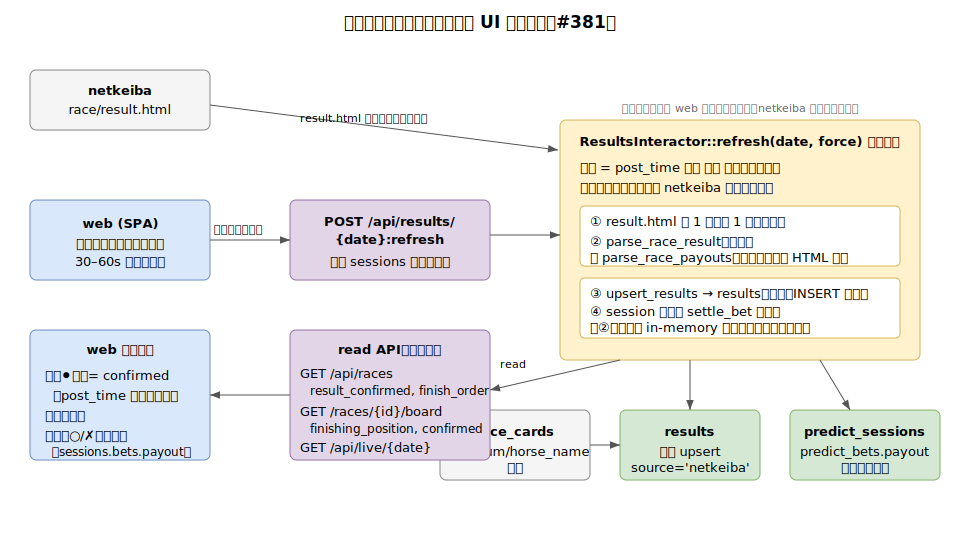

# レース結果の同日取り込みと UI 自動反映: 設計仕様

[Issue #381](https://github.com/taito-station/paddock/issues/381) / 依存: [#40 確定結果の自動精算](https://github.com/taito-station/paddock/issues/40)・[#33 REST API read 基盤](https://github.com/taito-station/paddock/issues/33)・[#34 Web SPA](https://github.com/taito-station/paddock/issues/34) / 関連 ADR: [0068](../adr/0068-race-result-ingestion-ui-reflection.md)・[0015](../adr/0015-netkeiba-result-source.md)・[0064](../adr/0064-live-ev-buy-view.md)

## 概要

開催当日のレース結果（着順・的中/不的中・払戻）を DB に取り込み、ライブ UI へ自動反映する。**自動精算エンジン自体は #40 で実装済み**（`settle_bet` / `parse_race_payouts` / `SettleInteractor::settle_session` / `POST /api/sessions/{date}/results:refresh`）。本仕様が足すのは (1) **着順の同日取り込み**（当日は `results` に着順行が無い）、(2) **結果確定フラグの API 公開**（「⚫終」を `post_time` 推定から確定へ）、(3) **web ポーリングによる自動精算・自動反映**の 3 点。

正本の判断規律は CLAUDE.md「予想ワークフロー §4 結果取得」「ライブ監視時のコミュニケーション規律」。本ビューはあくまで **結果照合の自動化**であり、張る/見送り/増額の判断・軸ロック（ADR 0055/0060）には踏み込まない。



> 図は手書き SVG（macOS で drawio エクスポートが不可のため `.svg` を正本として手で保守する）。

## 設計方針（ADR 0068）

**結果確定処理（着順・払戻の同日取り込み）を 1 つの冪等ユースケース `ResultsInteractor::refresh(date, force)` に集約し、UI は既存 read クエリに結果フィールドを相乗りさせ、web ポーリングで自動反映する。**

- **結果確定フラグ `result_confirmed` は派生値**。専用カラム/専用テーブルを増やさず、「当該レースが着順を持つ `results` 行を持つか」で表す。これで**賭けていない・スキップしたレースも**確定でき、着順表示もできる。
- **netkeiba は 1 レース 1 パス 1 取得**。着順と払戻は同一結果ページに載るため、`fetch` 1 回で両方をパースする。`post_time` 前・確定済みは取得しない gating と、取得の pacing・リトライ規律（ADR 0021 タイムアウト＋リトライ・0029 fetcher 集約、運用 pacing は CLAUDE.md）を守る。
- **自動精算エンジンは再実装しない**。`settle_bet`（#40）を再利用し、取得済み払戻を in-memory で渡す（`settle_session` のような netkeiba 再取得をこのパスでは行わない）。

## サーバ設計

### `ResultsInteractor::refresh(date, force)`（新規 use-case）

`PayoutFetcher` に加えて着順取得（`fetch_race_result`）と `results` upsert・`race_cards` 参照が要るため、`SettleInteractor` 同様にメイン `Interactor` へは載せない専用 interactor として切り出す。

処理:

1. 開催日 `date` のレースのうち **`post_time` を過ぎ、かつ未確定**のものを対象に選ぶ（`force=false` の既定）。
   - 発走前（`post_time` 未到達）・確定済み（`result_confirmed=true`）は **netkeiba を叩かずスキップ**。
   - `post_time` が未取得（`race_cards` に無い）のレースは「終了と断定しない」（#391 の縮退方針を踏襲）→ 既定では対象外。
   - **`force=true`（手動フォールバック）** のときは post_time gating を無効化し、post_time 未到達/欠損の未確定レースも取得対象にする（確定済みは `force` でもスキップ）。
2. 各対象レースにつき `race/result.html` を **1 回**取得し、同一 HTML から着順（`parse_race_result` → `Vec<ResultRow>`）と払戻（`parse_race_payouts` → `RacePayouts`）を **両方**パースする。既存の `fetch_race_result` / `fetch_race_payouts` は各々が独立に GET する 2 メソッドのため、**HTML を 1 回取得して両パーサへ渡す新 scraper メソッド**（例 `fetch_race_result_page`）を追加する。
   - 取得失敗（ネット断・BAN 等）・未生成（結果ページ未生成）は当該レースを **pending 据え置き**にして継続（1 レースの失敗で他レースを巻き添えにしない）。既存 `settle_session` の失敗ハンドリングと同方針。
3. **`races` 行を担保**してから着順を `results` へ **upsert**（後述 `upsert_results`）。`races`・`results` とも `source` は **既定の `'pdf'`**（＝実レースのバケット。実装で確定。理由は下記 FK 節）。
4. **セッションがあれば**、②で取得済みの `RacePayouts` を使い `settle_bet` で各 bet を精算し、payout・収支・回収率を再計算する（冪等・返還優先・全額返還 #131 を踏襲）。セッションが無い日は着順取り込みのみ行う。
5. `RefreshReport`（`SettleReport` を拡張し、新規確定レース数・確定 `race_id` 一覧を加えた型）を返す。

**冪等性**: 対象選定が「未確定のみ」＋精算がゼロ再計算のため、繰り返し呼んでも二重加算せず、確定済みレースは netkeiba を再取得しない。ポーリングが叩く write API のため、サーバ側に in-flight ロック or 直近取得の debounce（同一レースを N 秒以内は再取得しない）を設け、複数クライアント同時ポーリング時の取得多重化（IP ブロック要因）を防ぐ。

**中止レースの確定縮退**: 開催中止で netkeiba 結果ページに成績表が生成されない場合、`parse_race_result` は空を返し着順行が入らない（既存 `settle_session` も pending 据え置きとする既知制約）。この場合は「`post_time` から一定時間（既定 N 分）経過しても成績表が無い」タイムアウトで確定扱いにするか手動フォールバックへ委ね、自動では延々 pending にしない。

### `results` への同日 upsert（`upsert_results`）

現状の `update_results`（ADR 0015）は **既存行の UPDATE 専用**で、当日（着順行が存在しない）には効かない。新メソッド `upsert_results` を追加する。**INSERT 列・DO UPDATE 列は既存 `update_results` の更新列集合（`finishing_position`/`status`/`jockey`/`trainer`/`time_seconds`/`odds`/`horse_weight`/`weight_change`/`weight_carried`/`popularity`）と揃える**（`weight_carried` を落とさない）。

```sql
INSERT INTO results
  (race_id, finishing_position, status, gate_num, horse_num, horse_name,
   jockey, trainer, time_seconds, odds, horse_weight, weight_change,
   weight_carried, popularity)                 -- source/horse_id/margin は書かない（DEFAULT/NULL）
VALUES (...)
ON CONFLICT (race_id, horse_num) DO UPDATE SET
  finishing_position = COALESCE(EXCLUDED.finishing_position, results.finishing_position),
  status             = EXCLUDED.status,        -- netkeiba は常に値を持つため無条件上書き
  jockey             = COALESCE(EXCLUDED.jockey, results.jockey),
  ...  -- 列集合は update_results と同一。パース失敗(NULL)は既存値を温存（COALESCE）
```

- **FK `races` の担保 と `source` 値**: `results.race_id` は `races(race_id)` への FK。当日フロー（`card/ingest.rs`）は `race_cards`/`horse_entries`/`race_odds` のみ保存し **`races` 行を作らない**（`races` の INSERT は PDF ingest 経路の `save_race` のみ）。よって `upsert_results` の前に `race_cards` メタから `races` 行を upsert し FK を満たす。この `races`／`results` 行は **`source` を書かず既定の `'pdf'`（実レースのバケット）** とする。`'netkeiba'`（近走由来の合成レース用）を採ると `find_races_by_date` の UNION（`races WHERE source='pdf'` ∪ `races` に無い `race_cards`）から当該レースが漏れて `/api/races` から消えるため。`races` メタ（track_condition/weather）は破壊的上書きせず既存 PDF 値を温存する（過去日を手動 refresh してもデータを消さない・`delete_absent_horse_nums` も呼ばない。`save_race` との差分）。
- **NOT NULL 補完（常時）**: `results.gate_num` / `results.horse_name` は NOT NULL だが **`ResultRow` に含まれない**（結果ページからは取得しない・フィールド自体が無い）。よって `(race_id, horse_num)` で `race_cards`（出馬表・当日取得済み）から **常に**補完する。`race_cards` が無いレース（出馬表未取得）は補完不能のため当該レースを pending 据え置きにし、着順を書かない。
- **`horse_id` は NULL 許容**: `results.horse_id`（`TEXT`・netkeiba 馬 ID）は nullable で、`ResultRow` にも含まれないため当日 upsert では **NULL のまま INSERT**（近走リンク用の任意列・PDF 経路でも None）。NOT NULL 補完の対象は `gate_num`/`horse_name` の 2 列のみ。
- **スキーマ変更なし**: `results` に列は足さない。`result_confirmed` は下記の派生クエリで判定。

### 結果確定フラグ（派生）

```sql
-- ある race_id が「結果確定」か（着順が 1 つでも入っていれば確定）
SELECT EXISTS (
  SELECT 1 FROM results
  WHERE race_id = $1
    AND finishing_position IS NOT NULL
) AS result_confirmed;
```

- **着順の存在のみで判定**する。`ResultStatus` は `finished`/`scratched`/`cancelled`/`did_not_finish` の 4 値で、`status <> 'finished'` を条件に混ぜると、非完走行（取消・中止馬）が 1 行だけ landed した**取り込み途中の中間状態**を確定と誤判定しうるため使わない（通常は完走馬の着順が同時に入る）。
- **全馬取消/中止（着順 NULL）** は「中止レースの確定縮退」（`post_time` からの経過タイムアウト or 手動フォールバック）で確定扱いにする。派生クエリ単独では拾わない。
- 日次一覧向けには `date` の全 `race_id` について一括で確定フラグ・上位着順を引く read クエリを用意する。

### read API（既存 DTO へ相乗り）

| エンドポイント | DTO | 追加フィールド |
|---|---|---|
| `GET /api/races` | `RaceSummary` | `result_confirmed: bool`、`finish_order: Vec<FinishEntry>`（上位 3・`{position, horse_num, horse_name}`。3 着同着で 4 頭以上返る場合も **position ≤ 3 を全件**返す＝件数可変） |
| `GET /api/races/{race_id}/board` | `RaceBoardResponse` / `BoardHorseSchema` | 盤に `result_confirmed: bool`、各馬に `finishing_position: Option<u32>` |
| `GET /api/live/{date}` | `LiveRaceViewSchema` | `result_confirmed: bool`（「⚫終」を推定から確定へ） |

- **的中/払戻の出所**: 別ソースを増やさず、既存 `GET /api/sessions/{date}` の `bets[].payout`（精算済み）から web が per-race に集計する（`payout>0` = 的中、合計 = 払戻額）。
- **OpenAPI**: 全 DTO 追加フィールドに `ToSchema`・`openapi.json` スナップショット更新を DoD 化。

### 書き込み口

- **新設** `POST /api/results/{date}:refresh` → `ResultsInteractor::refresh(date, force)` を起動し `RefreshReport` を返す。`force`（クエリ `?force=true`・既定 false）は **手動フォールバック専用の gating 緩和フラグ**。既定（自動ポーリング）は「`post_time` 経過 かつ 未確定」を対象とするが、`force=true` では **post_time gating を無効化**し、`post_time` 未取得（#391 で対象外にした欠損レース）を含む未確定レースも取得対象にする（確定済みは `force` でもスキップ）。
- **エイリアス** `POST /api/sessions/{date}/results:refresh` は本フローへ委譲する（既存 web「精算」ボタン・CLI 経路のレスポンス互換は保つ）。ただし委譲後は着順 `results` upsert という**副作用が新たに加わる**点で純粋な後方互換ではない（旧経路は精算のみ・着順保存なしだった）。手動ボタンはこのエイリアス経由で `force=true` を渡す。

エラー写像（use-case Error → HTTP）は既存規約どおり（`NotFound`→404 等）。セッション不在の日でも着順取り込みは走るため、`results:refresh`（新）はセッション不在を 404 にせず「精算 0・確定 N」を返す。

## web 設計

### 自動精算トリガー（ポーリング）

- **対象画面**: ライブ一覧（`RaceList.tsx`）／収支サマリ（`SessionSummary.tsx`）。
- **条件**: 表示日が当日で、**`post_time` を過ぎ、かつ未確定（`result_confirmed=false`）のレースが 1 件以上残る間だけ** `POST /api/results/{date}:refresh` を 30–60 秒間隔でポーリング。当日でも全レースが発走前（対象 0）なら**ポーリングしない**（空振りさせない）。
- **停止**: 対象日の全レースが確定したらポーリングを止める（netkeiba への無駄打ち・pacing 逸脱を防ぐ）。前日・過去日は静的表示（ポーリングしない）。
- **フォールバック**: 手動「精算」ボタンは残す（ポーリング失敗・手動再精算の入口）。`post_time` 欠損レース（#391 で対象外にした未確定レース）は自動ポーリングでは確定されないため、手動ボタンは **`force=true`**（前述の書き込み口）を渡して post_time gating を緩め、当該レースの結果取得を試みる（自動ポーリングは常に `force=false`）。
- **鮮度方針の改訂**: `web-spa.md` は現状「SPA は自動ポーリングしない・再現性重視・自動更新なし」と規定しポーリングを非対象に挙げている。本設計はこれを**「当日・未確定レースに限り自動ポーリングを許可」と明示的に上書き**する（ADR 0068・過去日/確定済みは従来どおり自動更新しない）。`web-spa.md` の該当記述も本 PR 承認後の実装 PR で改訂する。

### 表示

- **「⚫終」判定**: `result_confirmed` を一次ソースにする。`post_time` 推定（`web/src/lib/live.ts` の `raceStarted`）は**発走前の予定表示**に用途を限定し、終了確定の根拠から外す。
- **発走済み行**: 着順（`finish_order` 上位）と、賭けたレースは **的中○/✗・払戻額**（session `bets[].payout` 由来）を表示。
- **収支サマリ**: `result_confirmed` を検知して自動精算・自動反映（残高・総払戻・回収率）。手動ボタンはフォールバック。
- **1 レース盤**（`RaceBoard.tsx`）: 各馬に着順、盤に結果確定を反映。

## 不変条件・非対象

- **不変**: `settle_bet` / `parse_race_payouts` / `SettleInteractor` の精算ロジック（冪等・返還優先・全額返還 #131）／`paddock-fetch-results`（過去レース UPDATE 専用・ADR 0015）／`results` スキーマ（列追加なし）／確率モデル・EV 層（ADR 0055）・軸ロック（ADR 0060）／`post_time` 一次ソース（#391）。
- **非対象（YAGNI）**: official 配当そのものの常時表示・専用払戻テーブル（UI 要件は session の的中/払戻で足りる。将来必要なら別 Issue）／サーバ常駐 sweep・predict-watch 相乗り（ADR 0068 で棄却）／新規 read エンドポイント（既存 DTO 相乗りを採用）。

## 受け入れ観点（ブラウザテスト）

実装 PR 用のブラウザテストケースを [tests/browser-test-cases/race-result-ingestion.md](../../tests/browser-test-cases/race-result-ingestion.md) に設計する（TC-01〜）。要点:

- 発走後レースが `result_confirmed` で「⚫終」確定に変わる（`post_time` 推定でなく着順取り込みが根拠）。
- 賭けたレースに的中○/✗・払戻額、全レースに着順が出る。
- 未確定が残る間だけポーリングし、全確定で停止（Network で `results:refresh` の打ち止めを確認）。
- 手動「精算」ボタンがフォールバックとして機能する。
- 前日・過去日はポーリングしない（静的表示）。
