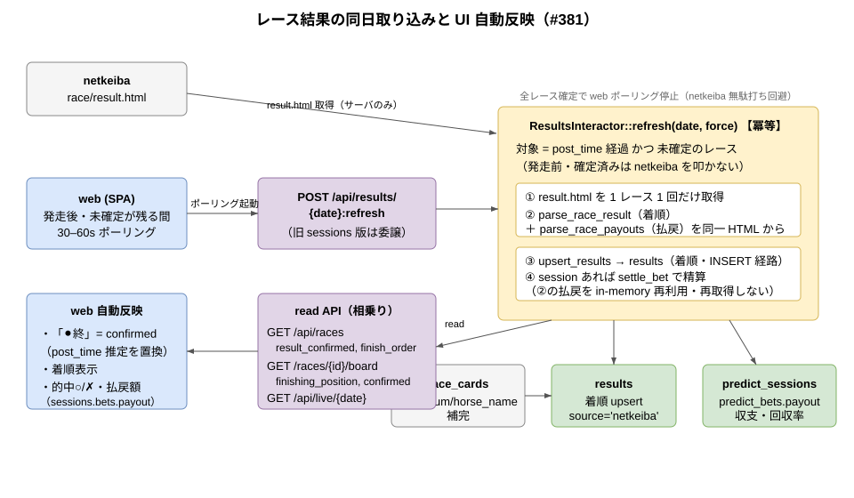

---
# knowledge 規約に基づくメタデータ（docs/knowledge/README.md）。specifications はその場で
# knowledge に昇格（ADR 履歴・相互リンクを壊さないため物理移動しない）。
status: Confirmed
kind: knowledge
doc_class: [D04, D10, D11]
tags: [D04, D10, D11]
updated: "2026-07-17"
---

# レース結果の同日取り込みと UI 自動反映: 設計仕様

[Issue #381](https://github.com/taito-station/paddock/issues/381) / 依存: [#40 確定結果の自動精算](https://github.com/taito-station/paddock/issues/40)・[#33 REST API read 基盤](https://github.com/taito-station/paddock/issues/33)・[#34 Web SPA](https://github.com/taito-station/paddock/issues/34) / 関連 ADR: 0068・0015・0064

## 概要

開催当日のレース結果（着順・的中/不的中・払戻）を DB に取り込み、ライブ UI へ自動反映する。**自動精算エンジン自体は #40 で実装済み**（`settle_bet` / `parse_race_payouts` / `SettleInteractor::settle_session` / `POST /api/sessions/{date}/results:refresh`）。本仕様が足すのは (1) **着順の同日取り込み**（当日は `results` に着順行が無い）、(2) **結果確定フラグの API 公開**（「⚫終」を `post_time` 推定から確定へ）、(3) **web ポーリングによる自動精算・自動反映**の 3 点。

正本の判断規律は CLAUDE.md「予想ワークフロー §4 結果取得」「ライブ監視時のコミュニケーション規律」。本ビューはあくまで **結果照合の自動化**であり、張る/見送り/増額の判断・軸ロック（ADR 0055/0060）には踏み込まない。



> 図は手書き SVG（macOS で drawio エクスポートが不可のため `.svg` を正本として手で保守する）。

## 設計方針（ADR 0068）

**結果確定処理（着順・払戻の同日取り込み）を 1 つの冪等ユースケース `ResultsInteractor::refresh(date, force)` に集約し、UI は既存 read クエリに結果フィールドを相乗りさせ、web ポーリングで自動反映する。**

- **結果確定フラグ `result_confirmed` は派生値**。専用カラム/専用テーブルを増やさず、「当該レースが着順を持つ `results` 行を持つか」で表す。これで**賭けていない・スキップしたレースも**確定でき、着順表示もできる。
- **netkeiba は 1 レース 1 パス 1 取得**。着順と払戻は同一結果ページに載るため、`fetch` 1 回で両方をパースする。`post_time` 前・確定済みは取得しない gating と、取得の pacing・リトライ規律（ADR 0021 タイムアウト＋リトライ・0029 fetcher 集約、運用 pacing は CLAUDE.md）を守る。
- **自動精算エンジンは再実装しない**。`settle_bet`（#40）を再利用し、取得済み払戻を in-memory で渡す（`settle_session` のような netkeiba 再取得をこのパスでは行わない）。

## サーバ設計

### `ResultsInteractor::refresh(date, force)`（新規 use-case）

`PayoutFetcher` に加えて着順取得（`fetch_race_result`）と `results` upsert・`race_cards` 参照が要るため、`SettleInteractor` 同様にメイン `Interactor` へは載せない専用 interactor として切り出す。

処理:

1. 開催日 `date` のレースのうち **`post_time` を過ぎ、かつ未確定**のものを対象に選ぶ（`force=false` の既定）。
   - 発走前（`post_time` 未到達）・確定済み（`result_confirmed=true`）は **netkeiba を叩かずスキップ**。
   - `post_time` が未取得（`race_cards` に無い）のレースは「終了と断定しない」（#391 の縮退方針を踏襲）→ 既定では対象外。
   - **`force=true`（手動フォールバック）** のときは post_time gating を無効化し、post_time 未到達/欠損の未確定レースも取得対象にする（確定済みは `force` でもスキップ）。
2. 各対象レースにつき `race/result.html` を **1 回**取得し、同一 HTML から着順（`parse_race_result` → `Vec<ResultRow>`）と払戻（`parse_race_payouts` → `RacePayouts`）を **両方**パースする。既存の `fetch_race_result` / `fetch_race_payouts` は各々が独立に GET する 2 メソッドのため、**HTML を 1 回取得して両パーサへ渡す新 scraper メソッド**（例 `fetch_race_result_page`）を追加する。
   - 取得失敗（ネット断・BAN 等）・未生成（結果ページ未生成）は当該レースを **pending 据え置き**にして継続（1 レースの失敗で他レースを巻き添えにしない）。既存 `settle_session` の失敗ハンドリングと同方針。
3. **`races` 行を担保**してから着順を `results` へ **upsert**（後述 `upsert_results`）。`races`・`results` とも `source` は **既定の `'pdf'`**（＝実レースのバケット。実装で確定。理由は下記 FK 節）。
4. **セッションがあれば**、②で取得済みの `RacePayouts` を使い `settle_bet` で各 bet を精算し、payout・収支・回収率を再計算する（冪等・返還優先・全額返還 #131 を踏襲）。セッションが無い日は着順取り込みのみ行う。
5. `RefreshReport`（`SettleReport` を拡張し、新規確定レース数・確定 `race_id` 一覧を加えた型）を返す。

**冪等性**: 対象選定が「未確定のみ」＋精算がゼロ再計算のため、繰り返し呼んでも二重加算せず、確定済みレースは netkeiba を再取得しない。ポーリングが叩く write API のため、サーバ側に in-flight ロック or 直近取得の debounce（同一レースを N 秒以内は再取得しない）を設け、複数クライアント同時ポーリング時の取得多重化（IP ブロック要因）を防ぐ。

**中止レースの確定縮退**: 開催中止で netkeiba 結果ページに成績表が生成されない場合、`parse_race_result` は空を返し着順行が入らない（既存 `settle_session` も pending 据え置きとする既知制約）。この場合は「`post_time` から一定時間（既定 N 分）経過しても成績表が無い」タイムアウトで確定扱いにするか手動フォールバックへ委ね、自動では延々 pending にしない。

### `results` への同日 upsert（`upsert_results`）

現状の `update_results`（ADR 0015）は **既存行の UPDATE 専用**で、当日（着順行が存在しない）には効かない。新メソッド `upsert_results` を追加する。**INSERT 列・DO UPDATE 列は既存 `update_results` の更新列集合（`finishing_position`/`status`/`jockey`/`trainer`/`time_seconds`/`odds`/`horse_weight`/`weight_change`/`weight_carried`/`popularity`）と揃える**（`weight_carried` を落とさない）。

```sql
INSERT INTO results
  (race_id, finishing_position, status, gate_num, horse_num, horse_name,
   jockey, trainer, time_seconds, odds, horse_weight, weight_change,
   weight_carried, popularity)                 -- source/horse_id/margin は書かない（DEFAULT/NULL）
VALUES (...)
ON CONFLICT (race_id, horse_num) DO UPDATE SET
  finishing_position = COALESCE(EXCLUDED.finishing_position, results.finishing_position),
  status             = EXCLUDED.status,        -- netkeiba は常に値を持つため無条件上書き
  jockey             = COALESCE(EXCLUDED.jockey, results.jockey),
  ...  -- 列集合は update_results と同一。パース失敗(NULL)は既存値を温存（COALESCE）
```

- **FK `races` の担保 と `source` 値**: `results.race_id` は `races(race_id)` への FK。当日フロー（`card/ingest.rs`）は `race_cards`/`horse_entries`/`race_odds` のみ保存し **`races` 行を作らない**（`races` の INSERT は PDF ingest 経路の `save_race` のみ）。よって `upsert_results` の前に `race_cards` メタから `races` 行を upsert し FK を満たす。この `races`／`results` 行は **`source` を書かず既定の `'pdf'`（実レースのバケット）** とする。`'netkeiba'`（近走由来の合成レース用）を採ると `find_races_by_date` の UNION（`races WHERE source='pdf'` ∪ `races` に無い `race_cards`）から当該レースが漏れて `/api/races` から消えるため。`races` メタ（track_condition/weather）は破壊的上書きせず既存 PDF 値を温存する（過去日を手動 refresh してもデータを消さない・`delete_absent_horse_nums` も呼ばない。`save_race` との差分）。
- **NOT NULL 補完（常時）**: `results.gate_num` / `results.horse_name` は NOT NULL だが **`ResultRow` に含まれない**（結果ページからは取得しない・フィールド自体が無い）。よって `(race_id, horse_num)` で `race_cards`（出馬表・当日取得済み）から **常に**補完する。`race_cards` が無いレース（出馬表未取得）は補完不能のため当該レースを pending 据え置きにし、着順を書かない。
- **`horse_id` は NULL 許容**: `results.horse_id`（`TEXT`・netkeiba 馬 ID）は nullable で、`ResultRow` にも含まれないため当日 upsert では **NULL のまま INSERT**（近走リンク用の任意列・PDF 経路でも None）。NOT NULL 補完の対象は `gate_num`/`horse_name` の 2 列のみ。
- **スキーマ変更なし**: `results` に列は足さない。`result_confirmed` は下記の派生クエリで判定。

### 結果確定フラグ（派生）

```sql
-- ある race_id が「結果確定」か（着順が 1 つでも入っていれば確定）
SELECT EXISTS (
  SELECT 1 FROM results
  WHERE race_id = $1
    AND finishing_position IS NOT NULL
) AS result_confirmed;
```

- **着順の存在のみで判定**する。`ResultStatus` は `finished`/`scratched`/`cancelled`/`did_not_finish` の 4 値で、`status <> 'finished'` を条件に混ぜると、非完走行（取消・中止馬）が 1 行だけ landed した**取り込み途中の中間状態**を確定と誤判定しうるため使わない（通常は完走馬の着順が同時に入る）。
- **全馬取消/中止（着順 NULL）** は「中止レースの確定縮退」（`post_time` からの経過タイムアウト or 手動フォールバック）で確定扱いにする。派生クエリ単独では拾わない。
- 日次一覧向けには `date` の全 `race_id` について一括で確定フラグ・上位着順を引く read クエリを用意する。

### read API（既存 DTO へ相乗り）

| エンドポイント | DTO | 追加フィールド |
|---|---|---|
| `GET /api/races` | `RaceSummary` | `result_confirmed: bool`、`finish_order: Vec<FinishEntry>`（上位 3・`{position, horse_num, horse_name}`。3 着同着で 4 頭以上返る場合も **position ≤ 3 を全件**返す＝件数可変） |
| `GET /api/races/{race_id}/board` | `RaceBoardResponse` / `BoardHorseSchema` | 盤に `result_confirmed: bool`、各馬に `finishing_position: Option<u32>` |
| `GET /api/live/{date}` | `LiveRaceViewSchema` | `result_confirmed: bool`（「⚫終」を推定から確定へ） |

- **的中/払戻の出所**: 別ソースを増やさず、既存 `GET /api/sessions/{date}` の `bets[].payout`（精算済み）から web が per-race に集計する（`payout>0` = 的中、合計 = 払戻額）。
- **OpenAPI**: 全 DTO 追加フィールドに `ToSchema`・`openapi.json` スナップショット更新を DoD 化。

### 書き込み口

- **新設** `POST /api/results/{date}:refresh` → `ResultsInteractor::refresh(date, force)` を起動し `RefreshReport` を返す。`force`（クエリ `?force=true`・既定 false）は **手動フォールバック専用の gating 緩和フラグ**。既定（自動ポーリング）は「`post_time` 経過 かつ 未確定」を対象とするが、`force=true` では **post_time gating を無効化**し、`post_time` 未取得（#391 で対象外にした欠損レース）を含む未確定レースも取得対象にする（確定済みは `force` でもスキップ）。
- **エイリアス** `POST /api/sessions/{date}/results:refresh` は本フローへ委譲する（既存 web「精算」ボタン・CLI 経路のレスポンス互換は保つ）。ただし委譲後は着順 `results` upsert という**副作用が新たに加わる**点で純粋な後方互換ではない（旧経路は精算のみ・着順保存なしだった）。手動ボタンはこのエイリアス経由で `force=true` を渡す。

エラー写像（use-case Error → HTTP）は既存規約どおり（`NotFound`→404 等）。セッション不在の日でも着順取り込みは走るため、`results:refresh`（新）はセッション不在を 404 にせず「精算 0・確定 N」を返す。

## web 設計

### 自動精算トリガー（ポーリング）

- **対象画面**: ライブ一覧（`RaceList.tsx`）／収支サマリ（`SessionSummary.tsx`）。
- **条件**: 表示日が当日で、**`post_time` を過ぎ、かつ未確定（`result_confirmed=false`）のレースが 1 件以上残る間だけ** `POST /api/results/{date}:refresh` を 30–60 秒間隔でポーリング。当日でも全レースが発走前（対象 0）なら**ポーリングしない**（空振りさせない）。
- **停止**: 対象日の全レースが確定したらポーリングを止める（netkeiba への無駄打ち・pacing 逸脱を防ぐ）。前日・過去日は静的表示（ポーリングしない）。
- **フォールバック**: 手動「精算」ボタンは残す（ポーリング失敗・手動再精算の入口）。`post_time` 欠損レース（#391 で対象外にした未確定レース）は自動ポーリングでは確定されないため、手動ボタンは **`force=true`**（前述の書き込み口）を渡して post_time gating を緩め、当該レースの結果取得を試みる（自動ポーリングは常に `force=false`）。
- **鮮度方針の改訂**: `web-spa.md` は現状「SPA は自動ポーリングしない・再現性重視・自動更新なし」と規定しポーリングを非対象に挙げている。本設計はこれを**「当日・未確定レースに限り自動ポーリングを許可」と明示的に上書き**する（ADR 0068・過去日/確定済みは従来どおり自動更新しない）。`web-spa.md` の該当記述も本 PR 承認後の実装 PR で改訂する。

### 表示

- **「⚫終」判定**: `result_confirmed` を一次ソースにする。`post_time` 推定（`web/src/lib/live.ts` の `raceStarted`）は**発走前の予定表示**に用途を限定し、終了確定の根拠から外す。
- **発走済み行**: 着順（`finish_order` 上位）と、賭けたレースは **的中○/✗・払戻額**（session `bets[].payout` 由来）を表示。
- **収支サマリ**: `result_confirmed` を検知して自動精算・自動反映（残高・総払戻・回収率）。手動ボタンはフォールバック。
- **1 レース盤**（`RaceBoard.tsx`）: 各馬に着順、盤に結果確定を反映。

## 不変条件・非対象

- **不変**: `settle_bet` / `parse_race_payouts` / `SettleInteractor` の精算ロジック（冪等・返還優先・全額返還 #131）／`paddock-fetch-results`（過去レース UPDATE 専用・ADR 0015）／`results` スキーマ（列追加なし）／確率モデル・EV 層（ADR 0055）・軸ロック（ADR 0060）／`post_time` 一次ソース（#391）。
- **非対象（YAGNI）**: official 配当そのものの常時表示・専用払戻テーブル（UI 要件は session の的中/払戻で足りる。将来必要なら別 Issue）／サーバ常駐 sweep・predict-watch 相乗り（ADR 0068 で棄却）／新規 read エンドポイント（既存 DTO 相乗りを採用）。

## 受け入れ観点（ブラウザテスト）

実装 PR 用のブラウザテストケースを [tests/browser-test-cases/race-result-ingestion.md](../../tests/browser-test-cases/race-result-ingestion.md) に設計する（TC-01〜）。要点:

- 発走後レースが `result_confirmed` で「⚫終」確定に変わる（`post_time` 推定でなく着順取り込みが根拠）。
- 賭けたレースに的中○/✗・払戻額、全レースに着順が出る。
- 未確定が残る間だけポーリングし、全確定で停止（Network で `results:refresh` の打ち止めを確認）。
- 手動「精算」ボタンがフォールバックとして機能する。
- 前日・過去日はポーリングしない（静的表示）。

---

## 決定ログ

<!-- この節は append-only です。既存エントリの変更・削除は CI が検出します。 -->

### ADR 0015: netkeiba レース結果を results の取得源に追加し jockey/trainer を略名で正規化 (2026-06-12) — 承認済み

#### コンテキスト

predict は出馬表(entry)の `jockey`/`trainer`（netkeiba `td.X a` の **略名**、例「原」「宮地」）を
キーに `jockey_stats`/`trainer_stats` を `results.jockey`/`results.trainer` と**文字列完全一致**で
join する。しかし `results` は結果 PDF 由来で次の不整合があった:

- `results.trainer`: 結果 PDF からの抽出が後付けで、live DB ではほぼ空 → trainer 項が発火しない。
  さらに PDF は**フルネーム**（「田中博康」）で、entry の netkeiba 略名（「田中博」）と一致しない。
- `results.jockey`: 旧 PDF パーサが**馬主名を連結**した汚染値（例「丸田恭介小野」「原優介奈村」）や
  破損値（「ノー」「ギン」）を含み、母数が分散・劣化（live DB で約 5%）。

netkeiba の**レース結果ページ**（`race/result.html?race_id=...`）は着順・騎手・調教師を持ち、
jockey/trainer とも entry と**同一の略名表記**で返す。OCR 不要・HTML で軽量。

#### 決定

netkeiba レース結果ページを `results` の取得源として追加し、既存 `results` 行の
`jockey`/`trainer`/`finishing_position` 等を netkeiba 由来の clean な値で**更新**する。

- 新パーサ `parse_race_result`（`netkeiba-scraper`）: 結果テーブルを列クラスで解析し
  `Vec<ResultRow>`（馬番・着順/status・jockey略名・trainer略名・タイム・人気・オッズ・馬体重）を返す。
- `SqliteRepository::update_results`: `(race_id, horse_num)` 一致行のみ UPDATE。**`races` 行は触らない**
  （track_condition/weather/surface/distance 等の既存メタを保全。`save_race` は races を上書きするため使わない）。
- `fetch-results` アプリ: 既存の確定済みレースを列挙し、`build_race_ids` で netkeiba race_id を機械導出
  → 取得 → 更新。

#### 理由

- entry も results も netkeiba 略名に揃うため、join が噛み合い trainer 項が live で発火し、jockey 母数の
  汚染も解消する（#82 コメントの「略名↔フルネーム正規化」課題への解）。
- netkeiba race_id は `races` の date/venue/round/day/race_num から `build_race_ids` で完全に導出でき、
  追加情報が要らない（場コードは `Venue::as_code`）。
- 結果 PDF の再 OCR（全開催で 5〜8 時間規模）に比べ、HTML 取得は ~分オーダーで現実的。
- 着順は同一レース結果のため PDF 既存値と一致し、母数の連続性が保たれる（実測でも finishing_position 不変）。

#### 影響

- `results.jockey`/`results.trainer` の表記が netkeiba 略名に統一される（PDF フルネーム/汚染から変化）。
  backtest の絶対値は母数表記が変わるため過去の数値とは厳密一致しないが、entry↔results の整合が取れる。
- `results.source` は据え置き（'pdf' のまま）。データ源の混在は将来 source 区別で整理可（本 ADR ではスコープ外）。
- `update_results` は既存行の UPDATE のみで INSERT しない（新規レースは従来フローで取り込む）。
- netkeiba 結果ページに着差(margin)列が無いため margin は更新対象外（集計未使用）。

### ADR 0068: レース結果（着順・払戻）の同日取り込みと UI 自動反映（結果確定フラグ・自動精算） (2026-07-17) — 提案中

#### ステータス

提案中（設計書 PR レビュー中）。対象 Issue: [#381](https://github.com/taito-station/paddock/issues/381)。**本設計書 PR のマージ承認をもって「承認済み」に更新**する。本 ADR に伴う実装は承認後の別 PR（サーバ → web の順）。

#### コンテキスト

開催当日のレース結果（着順・的中/不的中・払戻）が UI のどこにも出ず、結果照合が netkeiba 直接確認と収支画面の手動「精算」ボタンに依存している。ライブボードの「⚫終」判定も **発走時刻（`post_time`）の推定のみ**で、結果が確定したかを表す信号が API に無い（#370・#391 の実装時に確認）。

現状を調査したところ、**自動精算エンジンは #40 で既に実装済み**である。差分は「結果確定の信号化」と「UI への自動反映」に絞られる。

- `settle_bet()`（`domain/payout`）: 券種・組番・賭金・確定払戻から `Hit`/`Refund`/`Miss` を算出する純関数。返還（取消/除外馬）優先・16 ケースのテスト済み。
- `parse_race_payouts()`（`netkeiba-scraper`）: netkeiba 結果ページから確定払戻ブロック・取消馬・全額返還を抽出。
- `SettleInteractor::settle_session(date)`（use-case）: セッションの `predict_bets` を確定払戻と照合し payout・収支・回収率を更新。**毎回ゼロから再計算する冪等**設計。未確定レースは pending 据え置き、全レース確定で `completed=true`。
- `POST /api/sessions/{date}/results:refresh` / 収支画面の「精算」ボタン: 上記を手動起動。

一方、以下が**欠落**している。

- **結果確定フラグが無い**。ライブ一覧の「⚫終」は `post_time`（HH:MM）と現在時刻の相対推定に頼る（`web/src/lib/live.ts`）。実際に結果が出たか（着順確定か）を区別できない。
- **着順が同日は DB に無い**。`results` テーブルは PDF フロー（RO 一次資料）と `paddock-fetch-results`（既存行の **UPDATE 専用**・ADR 0015）でしか埋まらず、当日は出馬表（`race_cards`）しか無く着順行が存在しない。`settle_session` は払戻ブロックの有無だけを見て着順は保存しない。
- **精算が手動**。自動トリガーが無く、収支反映は人が「精算」ボタンを押す前提。

#### 決定

**結果確定処理（着順・払戻の同日取り込み）を 1 つの冪等ユースケースに集約し、UI は既存の read クエリに結果フィールドを足して web ポーリングで自動反映する。**

##### 1. 同日結果取り込み（サーバ）

新ユースケース `ResultsInteractor::refresh(date, force)` を追加する（`force` は §2 書き込み口参照・既定 false）。対象は **開催日のレースのうち `post_time` を過ぎ、かつ未確定**のもの（発走前・確定済みは netkeiba を叩かずスキップ。`force=true` は post_time gating を緩和）。

1. 各対象レースにつき netkeiba 結果ページ（`race/result.html`）を **1 回だけ取得**し、同一 HTML から着順（`parse_race_result`）と払戻（`parse_race_payouts`）を **両方**パースする。結果ページに双方が載るため往復を二重化しない。ただし既存 `fetch_race_result` と `fetch_race_payouts` は各々が独立に GET する 2 メソッドのため、**HTML を 1 回取得して両パーサに渡す新 scraper メソッド**（例 `fetch_race_result_page`）を追加する（実装点）。取得の pacing・リトライ規律は ADR 0021（HTTP タイムアウト＋リトライ）・0029（fetcher 集約）＋運用 pacing（CLAUDE.md）に準拠。
2. **`races` 行の担保**: `results.race_id` は `races(race_id)` への FK だが、当日フロー（`paddock-fetch-card` → `card/ingest.rs`）は `race_cards`/`horse_entries`/`race_odds` のみ保存し `races` 行を作らない（`races` の INSERT は PDF ingest 経路＝`save_race` のみ）。よって着順 upsert の前に、`race_cards` から `races` 行を派生 upsert して FK を満たす。
3. 着順を `results` へ **upsert**（INSERT ... ON CONFLICT `(race_id, horse_num)` DO UPDATE、`source='netkeiba'`）。当日は着順行が無いため **INSERT 経路が新設点**（既存 `update_results` は UPDATE 専用のため別メソッド `upsert_results` を追加）。`results` の NOT NULL 列 `gate_num`/`horse_name` は **`ResultRow` に含まれない**（結果ページからは取得しない）ため、**常に** `race_cards`（出馬表）を `(race_id, horse_num)` で引いて補完する。`race_cards` が無いレース（出馬表未取得）は補完不能のため当該レースを pending 据え置きにする。
4. 同一パスでその払戻を使い、**セッションがあれば** `settle_bet` で精算する（払戻はこのパスで取得済みのものを in-memory で渡し、`settle_session` のような netkeiba 再取得をしない）。精算は従来どおり冪等・pending 据え置き・全額返還（#131）を踏襲する。
5. `SettleReport` を拡張した `RefreshReport`（精算サマリ＋新規確定レース数・確定 `race_id` 一覧）を返す。

**中止レースの確定縮退**: 開催中止で netkeiba 結果ページに成績表が生成されない場合、`parse_race_result` は空を返し着順行が入らない（既存 `settle_session` も同状況を pending 据え置きとする既知制約）。この場合の確定判定は「`post_time` から一定時間（既定 N 分）経過しても成績表が生成されない」タイムアウトで確定扱いにするか、手動フォールバックに委ねる（自動では延々 pending にしない）。

**結果確定フラグ `result_confirmed` は派生値**とし、専用カラムを増やさない（シンプル第一）。定義: 当該 `race_id` の `results` に **`finishing_position IS NOT NULL` の行が 1 つ以上**存在すること（着順が取り込まれた＝確定）。`ResultStatus` は `finished`/`scratched`/`cancelled`/`did_not_finish` の 4 値で、一部の非完走行だけが landed した中間状態を誤って確定としないため、単に `status <> 'finished'` では判定しない。全馬取消/中止（着順 NULL）は前述のタイムアウト縮退で確定扱いにする。これにより **賭けていない・スキップしたレースも**「終」を確定でき、着順表示もできる。

##### 2. API への結果公開（read）

既存 read の DTO に結果フィールドを足す（新規 read エンドポイントは作らず、web の既存クエリに相乗り）。

- `GET /api/races`（`RaceSummary`）: `result_confirmed: bool` と `finish_order: [{position, horse_num, horse_name}]`（上位 3）を追加。ライブ一覧の「終」バッジ・着順表示の一次ソース。
- `GET /api/races/{race_id}/board`（`BoardHorseSchema`）: `finishing_position: Option<u32>` を各馬に、`result_confirmed: bool` を盤に追加。1 レース盤の結果反映。
- `GET /api/live/{date}`（`LiveRaceViewSchema`）: `result_confirmed: bool` を追加（「⚫終」を推定から確定へ置換）。的中/払戻は既存 `GET /api/sessions/{date}` の `bets[].payout` から web が算出する（別ソースを増やさない）。
- 書き込み口: `POST /api/results/{date}:refresh`（`?force=` 付き）を新設し `ResultsInteractor::refresh(date, force)` を起動。自動ポーリングは `force=false`（post_time gating あり）、手動フォールバックは `force=true`（gating 緩和で post_time 欠損レースも救済）。既存 `POST /api/sessions/{date}/results:refresh` は本フローへ委譲するエイリアスに変更し、**同じく `?force=` を受理・転送する**（手動ボタンはこのエイリアス経由で `force=true` を渡す。`force` 既定 false のため旧 CLI 呼び出しは無指定で従来挙動）。**レスポンス互換は保つが、着順の `results` upsert という副作用が新たに加わる**（純粋な後方互換ではない点を明示）。
- **OpenAPI を一級成果物**とする（utoipa コードファースト＋`openapi.json` スナップショット更新・検証を DoD 化）。

##### 3. UI 自動反映（web）

- **自動精算トリガーは web ポーリング駆動**。ライブ一覧／収支サマリで、**`post_time` を過ぎ、かつ未確定のレースが 1 件以上残る間だけ** `POST /api/results/{date}:refresh` を 30–60 秒間隔で叩く（当日でも全レースが発走前なら対象 0 でポーリングしない・空振りさせない）。`ResultsInteractor` は冪等なので何度叩いても安全。**全レース確定でポーリング停止**（netkeiba への無駄打ちを止める）。手動「精算」ボタンは**フォールバックとして残す**。
- **サーバ側の取得多重化ガード**: ポーリングは netkeiba を実取得する write API を叩くため、複数タブ/複数クライアントが同一 `date` を同時ポーリングすると同じ未確定レースへの取得が多重化し IP ブロック（本 PJ の最重要運用リスク）を招く。冪等は「結果の二重加算防止」は担保するが「取得多重化防止」はしないため、サーバ側に in-flight ロック or 直近取得の debounce（同一レースを N 秒以内は再取得しない）を設ける。
- ライブ一覧の発走済み行に **的中○/✗・払戻額**（session `bets[].payout` 由来）と **着順**（`finish_order` 由来）を表示。「⚫終」は `result_confirmed` で判定（`post_time` 推定を置換）。`post_time` は発走前の予定表示に用途を限定する。
- 収支サマリは `result_confirmed` を検知して自動精算・自動反映。手動ボタンはフォールバック。

#### 理由

- **精算エンジンを二重実装しない**。`settle_bet`・`parse_race_payouts`・冪等な再計算は #40 で確定済み。結果確定は「着順を `results` に持つか」という **既存テーブルからの派生**で表し、状態カラムや別テーブルを増やさない（「一時的な修正をしない」「シンプル第一」）。
- **netkeiba を二重取得しない**。着順と払戻は同一結果ページに載る。1 レース 1 パス 1 取得に集約し、`post_time` 前・確定済みは取得しない gating と、取得の pacing・リトライ規律（ADR 0021 タイムアウト＋リトライ・0029 fetcher 集約、運用 pacing は CLAUDE.md・IP ブロック回避）を守る。web ポーリングも確定で止める。
- **SPA 鮮度方針は明示的に改訂する（崩さない、で流さない）**。`web-spa.md` は現状「SPA は自動ポーリングしない・更新は明示的ユーザー操作」「再現性重視・自動更新なし」とし、ポーリングを非対象に挙げている。本設計はこれと正面から衝突するため、**「当日・未確定レースに限り自動ポーリングを許可する」と鮮度方針を明示的に上書きする決定**とする（過去日・確定済みは従来どおり自動更新しない）。取得 → 保存 → 最新値という read の一貫方針は保つ。`web-spa.md` の当該記述の改訂を影響範囲に含める。
- **decision-support の一線を越えない**。自動化するのは「結果照合という手作業（着順・払戻の突合と収支反映）」であり、張る/見送り/増額の判断や軸ロック（ADR 0055/0060）には触れない。

##### 代替案と棄却理由

- **サーバ側 background sweep（api-server が常駐タスクで自動精算）**: ヘッドレスでも回るが、常駐タスクの lifecycle・停止制御・多重起動制御を api-server に持ち込む。ライブ確認は基本ブラウザを開いて行うため、冪等 API への web ポーリングで要件を満たせる。過剰。棄却。
- **predict-watch に相乗り**: 発走前監視ツールに結果取得を足す案。監視を回している時だけ精算が進み、UI（ブラウザ）単独では反映されない。UI 自動反映という主目的から外れる。棄却。
- **結果確定を専用カラム/専用テーブルで持つ**: `results` の着順存在から派生できるため冗長。二重管理で不整合の芽になる。棄却（派生で表す）。
- **払戻の official 配当を新テーブルに永続化**: UI 要件は「的中○/✗・払戻額」（＝ session の bet 払戻）であり、official 配当そのものの常時表示は不要。取り込みパス内で払戻を消費すれば足り、テーブルを増やさない。YAGNI として棄却（将来必要なら別 Issue）。
- **新規 read エンドポイント `GET /api/results/{date}`**: 分離は綺麗だが web は既に `/api/races`・`/api/live`・`/api/sessions` を引いており、結果フィールドを相乗りさせる方が配線が最小。棄却（既存 DTO 拡張を採用）。

#### 影響

- **新規**: use-case `ResultsInteractor::refresh(date, force)`（結果取り込み＋精算の集約・`RefreshReport` 返却）／HTML を 1 回取得して着順・払戻を両パースする scraper メソッド（既存 2 メソッドの二重 GET を避ける）／repo `upsert_results`（INSERT ON CONFLICT・当日着順の INSERT 経路）＋ `race_cards` からの `races` 行派生 upsert（FK 担保）／`POST /api/results/{date}:refresh`（rest-controller・router・api-server 配線）＋サーバ側の取得 debounce/in-flight ガード／read DTO 3 種への結果フィールド追加（`RaceSummary`・`BoardHorseSchema`＋盤・`LiveRaceViewSchema`）＋ OpenAPI スナップショット更新／web のポーリング＋「終」判定置換＋着順・的中/払戻表示／`web-spa.md` 鮮度方針の改訂（当日・未確定に限り自動ポーリング許可）。
- **不変**: `settle_bet`／`parse_race_payouts`／`SettleInteractor` の精算ロジック（冪等・返還優先・#131 全額返還）／確率モデル・EV 層（ADR 0055）・軸ロック（ADR 0060）／`paddock-fetch-results`（過去レース UPDATE・ADR 0015）／`results` スキーマ（列追加なし）。
- **後方互換**: `POST /api/sessions/{date}/results:refresh` は本フローへ委譲するエイリアスとして維持。手動「精算」ボタンはフォールバックとして残す。
- レース結果照合の手作業（netkeiba 直接確認・手動精算）が消え、UI が「発走済み → 着順・的中/払戻・収支」まで自動で追従する。あくまで結果照合の自動化であり、買い方判断（decision-support）は人間側に残る。
- 関連: #40（自動精算エンジン）／#131（全額返還）／#370・#391（終了判定・post_time 一次ソース）／ADR 0015（netkeiba 結果ソース・UPDATE 専用）／0021（HTTP タイムアウト＋リトライ）・0029（fetcher 集約）／0055・0060（EV 層分離・軸ロック）／0064・0066（ライブ EV ビュー）。設計詳細は [docs/specifications/race-result-ingestion.md](../specifications/race-result-ingestion.md)。
