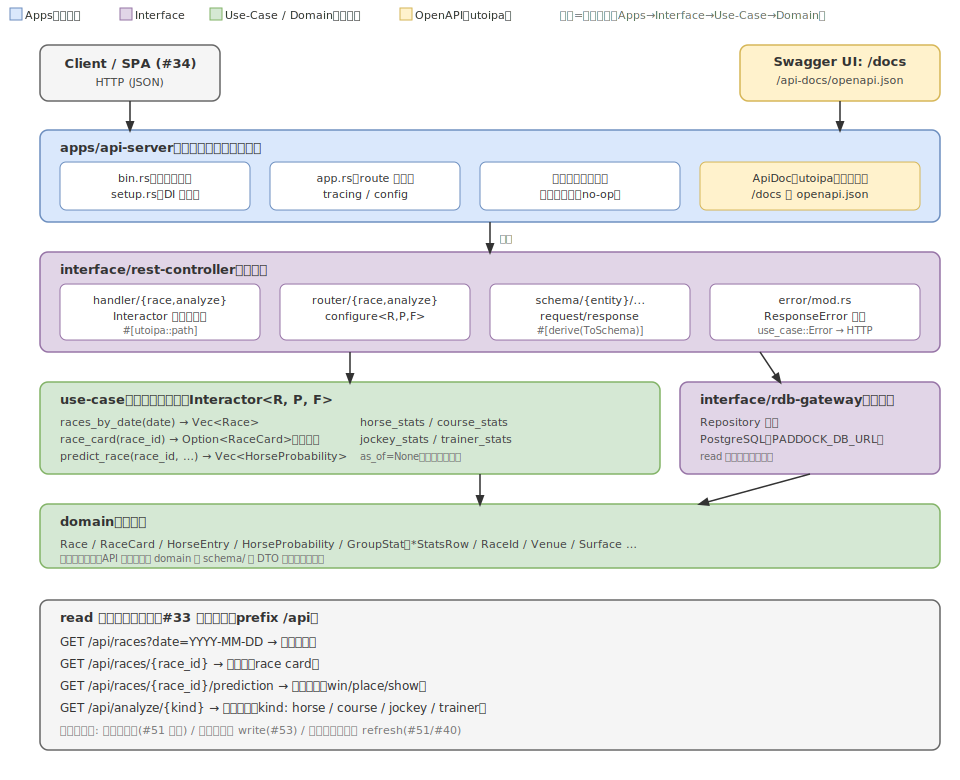

---
# knowledge 規約に基づくメタデータ（docs/knowledge/README.md）。specifications はその場で
# knowledge に昇格（ADR 履歴・相互リンクを壊さないため物理移動しない）。
status: Confirmed
kind: knowledge
sources:
  - docs/adr/0022-rest-api-read-server.md
  - docs/adr/0069-drop-icloud-writes-browser-only-viewing.md
  - docs/api/openapi.json
distilled_from_sha: "f0ee7a3"
updated: "2026-07-21"
---

# REST API（read 基盤）: 設計仕様

[Issue #33](https://github.com/taito-station/paddock/issues/33) / 関連: [#34 Web SPA](https://github.com/taito-station/paddock/issues/34)・[#53 セッション write API](https://github.com/taito-station/paddock/issues/53)・[web-spa.md](web-spa.md)

## 概要

Web GUI（#34）から予想・分析を使うための前段として、既存のクリーンアーキテクチャ（`domain` / `use-case`）を再利用した **REST API サーバ**を追加する。本フェーズのスコープは **read 系エンドポイントの基盤**まで（予想セッションの状態変更を伴う write 系は #53 に切り出す）。

API なので **OpenAPI 仕様を一級の成果物として整備する**。utoipa による**コードファースト**で、handler/schema のコードから OpenAPI を生成し、コードと仕様が乖離しない状態を保つ。



> 図は手書き SVG（macOS で drawio エクスポートが不可のため、`.svg` を正本として手で保守する）。

## スコープ

### 本 Issue（#33）でやること

- 新規 crate: `src/interface/rest-controller`（actix-web の handler / router / schema / error）
- 新規 app: `src/apps/api-server`（常駐バイナリ。DI 構築・route 設定・OpenAPI マウント）
- read 系エンドポイント（後述）
- OpenAPI 仕様（utoipa コードファースト）＋ Swagger UI 配信＋リポジトリへ `openapi.json` をコミットし CI で同期チェック
- 認証ミドルウェアの差し込み口（no-op）を Apps 層に 1 箇所
- 統合テスト（`#[sqlx::test]` の一時 Postgres DB を seed して各エンドポイントを叩く）

### やらないこと（別 Issue）

- 買い目推奨 `GET /api/races/{race_id}/recommendations`（保存オッズ #51 が前提 → #51 完了後）
- セッション write 系（作成 / outcome 記録）→ #53
- オッズ・確定結果の refresh（ライブ取得→保存）→ #51 / #40
- 認証本体（JWT/argon2）→ マルチユーザー化の専用 Issue
- フロントエンド（SPA）→ #34
- DB バックエンドの変更（現状の **PostgreSQL** を継続。`PADDOCK_DB_URL` で接続先を切替可能なまま。別 DB への移行はしない）

### `apps/web-viewer` の退役

かつては予想 Markdown を HTML レンダリングして閲覧する静的ビューア `apps/web-viewer`（`paddock-web`）が併存していたが、SPA（#34）が本 API を消費する形へ一本化されたため、pad MD 書き出しパイプラインとともに退役した（ADR 0069）。予想の閲覧は本 read API + SPA が唯一の経路。

## レイヤー構成と依存方向

`~/.claude/rules/rust/architecture.md`（クリーンアーキテクチャ規約）に従い、依存方向 **Apps → Interface → Use-Case → Domain** を厳守する。確率推定（`interactor/race/predict.rs`）・レース一覧（`interactor/race/races_by_date.rs`）・分析（`interactor/{horse,course,jockey,trainer}/stats.rs`）の use-case は**既存のものをそのまま再利用**する。一方、出馬表単体取得の use-case メソッドは現状存在しない（`find_race_card` は Repository トレイト側にのみあり、use-case では `predict_race` の内部からしか呼ばれていない）ため、**#33 で出馬表取得 use-case メソッド（例 `race_card(race_id)`、`repository.find_race_card` を薄くラップ）を新規追加する**。新規追加はこの 1 メソッドと interface（rest-controller）・apps（api-server）に閉じ、handler から Repository を直接叩いて依存方向を崩すことはしない。

| レイヤー | crate | 本 Issue での扱い |
|---|---|---|
| Apps | `apps/api-server` | 新規。常駐バイナリ・DI・route・OpenAPI マウント・認証フック |
| Interface | `interface/rest-controller` | 新規。handler / router / schema / error |
| Interface | `interface/rdb-gateway` | 既存。read メソッドのみ使用 |
| Use-Case | `use-case` | 既存。read interactor（`races_by_date` / `predict_race` / `*_stats`）を再利用。出馬表取得メソッド（`race_card`）のみ新規追加 |
| Domain | `domain` | 既存。schema で DTO 化して公開 |

### Interactor のジェネリクス（実装上の注意）

現行の `Interactor` は `Interactor<R: Repository, P: PdfParser, F: PdfFetcher>` の 3 ジェネリクスを持つ。read エンドポイントは `R`（Repository）しか使わないが、型としては `P` / `F` も必要になる。**既存の `apps/predict`・`apps/analyze` の `setup.rs` が同じ `Interactor<R,P,F>` を構築済み**なので、api-server の DI もそれを踏襲して同じ具象型を組み立てる（read 経路では P/F は呼ばれない）。

> P/F を read 用途で型から外す（read 専用トレイトへ分離する）リファクタは有効だが影響範囲が広いため本 Issue では行わず、必要になった時点で別 Issue とする。

## エンドポイント仕様

全エンドポイントは prefix `/api` の下に置く。`race_id` はドメインの `RaceId` 値オブジェクトの文字列表現をパスに使う。

### 1. レース一覧

```
GET /api/races?date=YYYY-MM-DD
```

- use-case: `races_by_date(date)`（既存。race_num 昇順、`results` は読まない。実体は `repository.find_races_by_date`）＋ `post_times_by_date(date)`（#391。`race_cards.post_time` の一括引き当て。実体は `repository.find_post_times_by_date`）＋ `race_names_by_date(date)`（#389。`race_cards.race_name` の一括引き当て。実体は `repository.find_race_names_by_date`）
- `date` 必須・`YYYY-MM-DD`。不正フォーマットは `400`。
- レスポンス: レース配列

```json
{
  "date": "2026-03-28",
  "races": [
    { "race_id": "...", "venue": "nakayama", "race_num": 1, "distance": 1800, "surface": "turf", "post_time": "15:45", "race_name": "響灘特別" }
  ]
}
```

- `post_time` は `HH:MM`（race_cards 由来）。出馬表未取得・post_time 未保存のレースは `null`。SPA のライブ一覧はこれを発走時刻・状態判定（未発走/終了）の一次ソースにする（watch 判定記録の有無に依存させない、#391）。
- `race_name` は表示用レース名（race_cards 由来。重賞・特別戦名。未保存/PDF 経路は `null`、#389）。

> 状態バッジ（未処理 / 購入済み / オッズ未取得 等）はセッション(#53)・オッズ(#51) の情報を要するため #33 では返さない。SPA 側が複数 read を合成して表示する（web-spa.md 参照）。

### 2. 出馬表（race card）

```
GET /api/races/{race_id}
```

- use-case: `race_card(race_id)`（**#33 で新規追加**。`repository.find_race_card` をラップ）。`None` は `404`。
- レスポンス: レース諸元 + 出走馬（`HorseEntry`）

```json
{
  "race_id": "...",
  "date": "2026-03-28",
  "venue": "nakayama",
  "distance": 1800,
  "surface": "turf",
  "race_name": "七夕賞",
  "race_class": "g3",
  "entries": [
    { "gate_num": 1, "horse_num": 1, "horse_name": "…", "jockey": "…", "trainer": "…", "weight_carried": 55.0 }
  ]
}
```

`jockey` / `trainer` / `weight_carried` は出典により欠落しうる（PDF 出馬表は騎手・調教師・斤量が無い）ため `null` 許容。
`race_name`（#389）/ `race_class`（#345・スラッグ）も netkeiba 経路のみで、PDF 経路・未判定は `null`。盤（`/board`）レスポンスにも同 2 フィールドを載せ、web はヘッダを「会場 R 馬場距離 レース名(グレード)」で組む（グレード付与は g1/g2/g3/listed のみ）。

### 3. 確率推定

```
GET /api/races/{race_id}/prediction[?track_condition=&blend_alpha=]
```

- use-case: `predict_race(race_id, blend_alpha, track_condition)`
- 既定は **モデルのみ**（`blend_alpha=None`）・馬場未指定（`track_condition=None`）。本番 predict と同じ `EstimationConfig::production()` 経路。
- `track_condition`（任意）: `good|good_to_firm|...`（`TrackCondition` の文字列表現）。不正値は `400`。
- `blend_alpha`（任意）: `0.0..=1.0` の f64。市場オッズ（単勝）とのブレンド係数（#72）。範囲外・非有限は `400`。`alpha < 1.0` を指定しても**当該レースの保存オッズが無ければブレンドは行われずモデル確率をそのまま返す**（#51 未完環境での既定挙動。`predict_race` の実装どおり）。
- 出馬表が無い `race_id` は内部で `NotFound` → `404`。
- レスポンス: 馬ごとの win/place/show 確率（`win ≤ place ≤ show` 単調性は use-case が保証）

```json
{
  "race_id": "...",
  "probabilities": [
    { "horse_num": 1, "horse_name": "…", "win_prob": 0.18, "place_prob": 0.34, "show_prob": 0.49 }
  ]
}
```

### 4. 分析統計

```
GET /api/analyze/horse?name=<馬名>                     # 完全一致（正規化後）で統計
GET /api/analyze/jockey?name=<騎手名>
GET /api/analyze/trainer?name=<調教師名>
GET /api/analyze/horse/candidates?q=<部分>              # 部分一致候補（#401）
GET /api/analyze/jockey/candidates?q=<部分>
GET /api/analyze/trainer/candidates?q=<部分>
GET /api/analyze/course?venue=<場>&distance=<m>&surface=<turf|dirt>
```

- use-case: `horse_stats(name)` / `jockey_stats(name)` / `trainer_stats(name)` / `course_stats(venue, distance, surface)`（いずれも既存ラッパ。**全期間集計**＝内部で Repository に `as_of=None` を固定で渡す。`as_of` は API から制御しない）
- 名前系は `name` 必須（`TryFrom` のドメインバリデーション、不正は `400`）。`course` は `venue`/`distance`/`surface` 必須。
- レスポンス: `*StatsRow` を JSON 化（`overall` と各カテゴリ別 `GroupStat`：`label / starts / wins / places / shows` ＋算出レート `win_rate / place_rate / show_rate`）

```json
{
  "horse_name": "…",
  "overall": { "label": "overall", "starts": 12, "wins": 3, "places": 5, "shows": 7,
               "win_rate": 0.25, "place_rate": 0.417, "show_rate": 0.583 },
  "by_surface": [ /* GroupStat[] */ ],
  "by_distance_band": [ /* … */ ],
  "by_gate_group": [ /* … */ ],
  "by_track_condition": [ /* … */ ],
  "by_popularity_band": [ /* … */ ]
}
```

- **名前あいまい検索（部分一致・カタカナ正規化, #50）は `/candidates` として露出済み（#401）**。`?q=` を
  正規化（取り込み時と共有の normalizer）してから `results` を中間一致 LIKE で引き、`{ names, truncated }` を返す
  （名前昇順・上限 20 件、超過は `truncated=true`）。呼び出し側は 1 件なら `?name=` で統計を引き、多数なら一覧提示する。
  統計本体の `?name=` は従来どおり**完全一致**（正規化後にドメイン値へ変換できた名前のみ、不正は `400`）。

### 5. ライブ盤（race board）

```
GET /api/races/{race_id}/board[?budget=&track_condition=&blend_alpha=]
```

- use-case: `race_board(race_id, budget, blend_alpha, track_condition)`
- 全出走馬（truncate なし）＋ 買い目推奨（`/recommendations` と同経路・同値）＋ 混戦/乖離/重なり 判定を 1 レスポンスで返す（#373 盤の統合エンドポイント）。
- クエリパラメータ（すべて任意）:
  - `budget`: 予算（円、1 以上、既定 5000）。買い目組成の上限。
  - `track_condition`: 馬場状態（`良`/`稍重`/`重`/`不良` または略記）。未指定は馬場項なし。
  - `blend_alpha`: 市場ブレンド係数 `[0,1]`。未指定は本番ブレンド α=0.2。
- レスポンス: `RaceBoardResponse`（スキーマは `docs/api/openapi.json` コンポーネント参照）

レスポンスの主要フィールド:

| フィールド | 型 | 説明 |
|---|---|---|
| `race_id` / `venue` / `race_num` / `date` | string/int | レース識別子 |
| `race_name` / `race_class` | string\|null | 重賞名・格付けスラッグ（未保存は `null`、#389/#345） |
| `surface` / `distance` / `field_size` | string/int | 馬場・距離・出走頭数 |
| `post_time` | string\|null | 発走時刻 `HH:MM`（未取得は `null`） |
| `odds_available` | bool | 保存オッズ（#51）の有無。`false` のとき `bets` は空 |
| `axis` | int\|null | 買い目の軸。`recorded_axis` があればそれ、無ければ `live_axis` |
| `recorded_axis` | int\|null | predict 記録済みの本命◎（#388）。未 predict・取消時は `null` |
| `live_axis` | int\|null | ライブ再計算の軸（市場ブレンド首位）。`recorded_axis` と乖離時に UI 警告 |
| `roi` / `hit_prob` | number\|null | 現時点オッズ基準のポートフォリオ ROI / 的中確率 |
| `result_confirmed` | bool | 結果確定フラグ（#381）。web の「⚫終」判定に使う |
| `horses` | array | `BoardHorseSchema[]`（後述） |
| `bets` | array | 買い目（券種・組合せ・EV・推奨額） |
| `confusion` | object\|null | 混戦判定オブジェクト |

**`BoardHorseSchema` の主要フィールド:**

| フィールド | 型 | 説明 |
|---|---|---|
| `horse_num` / `horse_name` / `gate_num` | int/string | 馬番・馬名・枠番 |
| `jockey` | string\|null | 騎手（出馬表未取得は `null`） |
| `win_prob` / `place_prob` / `show_prob` | number | ブレンド勝率・連対率・複勝率 |
| `pure_win_prob` / `pure_place_prob` / `pure_show_prob` | number | 純モデル α=1.0 の各確率（#373） |
| `win_odds` | number\|null | 単勝オッズ（未取得は `null`） |
| `market_implied` | number\|null | 市場 implied 勝率（`1/単勝` 正規化） |
| `popularity` | int\|null | 単勝人気順（1=1番人気） |
| `model_rank` | int | モデル勝率順位（1=最上位） |
| `mark` | string\|null | 機械印スラッグ（honmei/taikou/tanana/hoshi）。無印は `null` |
| `is_value` | bool | 乖離馬（モデル上位×市場人気低＝妙味候補） |
| `is_overlay` | bool | 重なり馬（モデル勝率 1 位 かつ 単勝人気 1 位） |
| `comment` | string\|null | 馬書評の一行寸評（#348） |
| `detail_lines` | array | 展開パネル用の根拠 bullet（条件別 factor・枠 lift・近走・前走・斤量） |
| `finishing_position` | int\|null | 確定着順（#381。未確定・除外/中止は `null`） |
| `morning_win_odds` | number\|null | **朝時点の単勝オッズ**（後述「朝比較」参照）。朝 snapshot 無し・当該馬未取得は `null` |

#### 朝比較フィールド（#448）

`RaceBoardResponse` の以下フィールドが朝比較機能（ADR 0055/0060 の可視化）を担う:

| フィールド | 型 | 説明 |
|---|---|---|
| `morning_at` | string\|null | 朝時点 snapshot の取得時刻（RFC3339）。朝 complete と最新が別時刻のレースで非 `null`。UI はこれが非 `null` の時だけ「朝↔現比較」を表示する |
| `current_at` | string\|null | 現時点（最新スイープ）の取得時刻（RFC3339）。`morning_at` と対 |
| `morning_roi` | number\|null | 朝時点オッズで再計算したポートフォリオ ROI（確率・軸・budget は現時点と同一） |
| `morning_hit_prob` | number\|null | 朝時点オッズで再計算したポートフォリオ的中確率 |

「朝時点」の定義: is_complete を満たす最古の snapshot（早朝の単複のみ snapshot は is_complete=false なので含まれない）。buy `morning_win_odds`（`BoardHorseSchema`）は各馬のこの snapshot での単勝オッズ。

**設計意図（ADR 0055/0060）**: 「確率・軸を固定したまま、参照する snapshot だけを朝↔現で差し替えて ROI/hit_prob を再計算する」apples-to-apples 方式。「朝 +EV が発走直前に剥がれる」を数値で体感できるようにするための可視化。軸（◎）は朝比較によって変更しない（軸ロック思想の UI 体現）。

## OpenAPI（utoipa コードファースト）

API の仕様乖離を防ぐため、OpenAPI はコードから生成する（spec-first の手書き YAML は採用しない）。

- **依存**: `utoipa`（derive で `ToSchema` / `IntoParams` / `#[utoipa::path]`）、`utoipa-swagger-ui`（Swagger UI 配信）。いずれも自己完結ライブラリで外部 API には依存しない。
- **スキーマ注釈**: `schema/` の request/response 型に `#[derive(ToSchema)]`、handler に `#[utoipa::path(...)]` を付け、`#[derive(OpenApi)]` の `ApiDoc` に paths/components を集約する。
- **配信**: api-server が
  - `GET /api-docs/openapi.json` … OpenAPI ドキュメント（JSON）
  - `GET /docs` … Swagger UI
  をマウントする。
- **リポジトリへのコミットと同期チェック**: `ApiDoc::openapi()` をシリアライズした `docs/api/openapi.json`（配置先は新設。`docs/` 直下ではなくサブディレクトリ）をコミットする。`api-server` の統合テスト（または `cargo test`）に「生成結果が `docs/api/openapi.json` と一致する」スナップショットテストを置き、差分があれば失敗させる（仕様の更新漏れを CI で検出）。
  - **生成 JSON の安定化**: 偽陽性 fail を避けるため、serde の構造体定義順を正本とし `serde_json::to_string_pretty` の整形のみで安定化する（`preserve_order` 等のフィールド順入れ替えには依存しない）。utoipa のバージョン更新で生成差が出た場合は再生成して差分をレビューする。
  - **再生成手順**: `UPDATE_OPENAPI=1 cargo test -p api-server openapi_snapshot`（環境変数でスナップショット更新を許可する方式）等、テスト自身に再生成パスを用意し、手順を本節と同テストの doc コメントに明記する。
- **認証**: no-op 段階のため security scheme は定義しない（マルチユーザー化 Issue で `bearerAuth` 等を追加）。

## エラーマッピング

`rest-controller` の `error/mod.rs` に HTTP 用 `Error` enum と `ResponseError` 実装を置き、`use_case::Error` から `From` で変換する（規約のマッピングどおり）。

| use_case::Error | HTTP | 例 |
|---|---|---|
| `InvalidArgument` | 400 | 不正な日付・クエリ・ドメイン値変換失敗 |
| `NotFound` | 404 | 出馬表が無い race_id |
| `Internal` | 500 | DB エラー等 |

> 実体の `use_case::Error` は `InvalidArgument` / `NotFound` / `Internal` の 3 値（`src/use-case/src/error.rs`）。規約 `architecture.md` は `Unauthorized`/`Forbidden`/`AlreadyExist`/`PreconditionFailed`/`ExternalServer` 等も挙げるが、本プロジェクトの use-case は現状この 3 値のみ。read API では認証なし・更新なしのため不足しない。

エラーレスポンスは JSON で返す（例 `{ "error": { "code": "not_found", "message": "race card: ..." } }`）。この error response 型も `#[derive(ToSchema)]` で schema 化し、`openapi.json` のコンポーネント・各エンドポイントのエラー応答に含める（契約として網羅する）。

## Apps 層（api-server）

- 設定: DB 接続は既存の共有 crate `src/infrastructure/config`（`paddock-config`）の `Config { paddock_db_url, .. }` / `from_env()` を**再利用**する（規約 `architecture.md` どおり config は Infrastructure 層に集約し、app ローカルで `PADDOCK_DB_URL` を再実装しない）。ログ設定は同 crate の `paddock_log` を流用する。bind アドレス/ポート（`SERVER_*`）は `paddock-config` に無いため同 crate を拡張して足す。
- `setup.rs`: ロガー初期化 → Postgres プール（`PgPool`, sqlx）→ `PostgresRepository`（Repository 実装）→ `Interactor<R,P,F>` 構築（predict/analyze と同じ具象 P/F）。
- `app.rs`: `configure_routes<R,P,F>` で rest-controller の各 router を `/api` 配下にマウント。**認証ミドルウェアの差し込み口を 1 箇所**用意（現状 no-op：素通し。将来ここに JWT 検証を挿す）。OpenAPI（`/docs`・`/api-docs/openapi.json`）もここでマウント。
- `bin.rs`: エントリポイント（`HttpServer` 起動）。

## マルチユーザー化への布石（今は実装しない）

- セッション系のパスは将来 `user_id` スコープを差し込めるリソース指向にする（#53 で `/sessions/{date}` を設計）。本 Issue の read パスも `/api/...` 配下で破壊せず拡張できる形にする。
- 認証ミドルウェアの差し込み口（no-op）を Apps 層に 1 箇所だけ用意する（上記）。

## テスト方針

- 統合テスト `src/apps/api-server/tests/`（規約どおり `helper/mod.rs` に seed・`App` 構築を集約）。DB は既存の統合テスト（`apps/ingest-predictions/tests/`）と同じく **`#[sqlx::test]` の一時 Postgres DB** を使う（実 PostgreSQL に接続するため `--test-threads=1` で直列実行）。
  - 各 read エンドポイントの正常系（200 + JSON 形状）、`404`（未存在 race_id）、`400`（不正クエリ）。
  - OpenAPI: `GET /api-docs/openapi.json` が 200 で返り、コミット済み `docs/api/openapi.json` と一致すること。
- 既存の CLI 群（parse-pdf / predict / analyze 等）はバッチ用途として変更しない。

## 関連 Issue / 参考

- #33 本 Issue（read 基盤）
- #53 セッション write API / #34 SPA / #35 docker-compose
- #51 単複オッズ永続化（recommendations の前提）/ #40 確定結果自動取得 / #50 名前あいまい検索（REST 露出は #401 で完了）
- `~/.claude/rules/rust/architecture.md`・`conventions.md`（クリーンアーキテクチャ／コーディング規約）
- ADR: `docs/adr/0022-rest-api-read-server.md`
