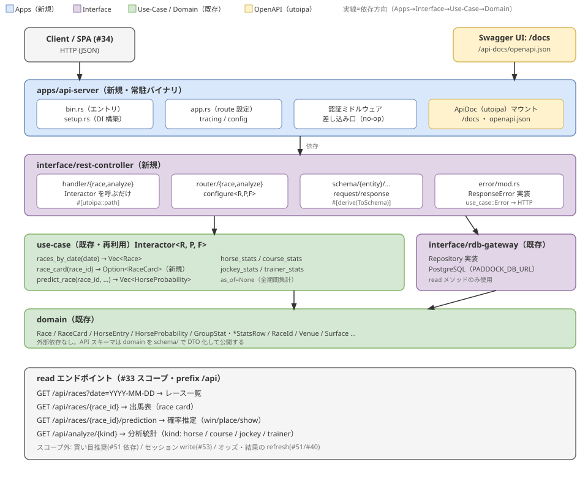

---
# knowledge 規約に基づくメタデータ（docs/knowledge/README.md）。specifications はその場で
# knowledge に昇格（ADR 履歴・相互リンクを壊さないため物理移動しない）。
status: Confirmed
kind: knowledge
doc_class: [D10, D19, D09]
tags: [D10, D19, D09]
sources:
  - docs/api/openapi.json
distilled_from_sha: "8e998b8"
updated: "2026-08-26"
---

# REST API（read 基盤）: 設計仕様

[Issue #33](https://github.com/taito-station/paddock/issues/33) / 関連: [#34 Web SPA](https://github.com/taito-station/paddock/issues/34)・[#53 セッション write API](https://github.com/taito-station/paddock/issues/53)・[web-spa.md](web-spa.md)

## 概要

Web GUI（#34）から予想・分析を使うための前段として、既存のクリーンアーキテクチャ（`domain` / `use-case`）を再利用した **REST API サーバ**を追加する。本フェーズのスコープは **read 系エンドポイントの基盤**まで（予想セッションの状態変更を伴う write 系は #53 に切り出す）。

API なので **OpenAPI 仕様を一級の成果物として整備する**。utoipa による**コードファースト**で、handler/schema のコードから OpenAPI を生成し、コードと仕様が乖離しない状態を保つ。



> 図は手書き SVG（macOS で drawio エクスポートが不可のため、`.svg` を正本として手で保守する）。

## スコープ

### 本 Issue（#33）でやること

- 新規 crate: `src/interface/rest-controller`（actix-web の handler / router / schema / error）
- 新規 app: `src/apps/api-server`（常駐バイナリ。DI 構築・route 設定・OpenAPI マウント）
- read 系エンドポイント（後述）
- OpenAPI 仕様（utoipa コードファースト）＋ Swagger UI 配信＋リポジトリへ `openapi.json` をコミットし CI で同期チェック
- 認証ミドルウェアの差し込み口（no-op）を Apps 層に 1 箇所
- 統合テスト（`#[sqlx::test]` の一時 Postgres DB を seed して各エンドポイントを叩く）

### やらないこと（別 Issue）

- 買い目推奨 `GET /api/races/{race_id}/recommendations`（保存オッズ #51 が前提 → #51 完了後）
- セッション write 系（作成 / outcome 記録）→ #53
- オッズ・確定結果の refresh（ライブ取得→保存）→ #51 / #40
- 認証本体（JWT/argon2）→ マルチユーザー化の専用 Issue
- フロントエンド（SPA）→ #34
- DB バックエンドの変更（現状の **PostgreSQL** を継続。`PADDOCK_DB_URL` で接続先を切替可能なまま。別 DB への移行はしない）

### `apps/web-viewer` の退役

かつては予想 Markdown を HTML レンダリングして閲覧する静的ビューア `apps/web-viewer`（`paddock-web`）が併存していたが、SPA（#34）が本 API を消費する形へ一本化されたため、pad MD 書き出しパイプラインとともに退役した（ADR 0069）。予想の閲覧は本 read API + SPA が唯一の経路。

## レイヤー構成と依存方向

`~/.claude/rules/rust/architecture.md`（クリーンアーキテクチャ規約）に従い、依存方向 **Apps → Interface → Use-Case → Domain** を厳守する。確率推定（`interactor/race/predict.rs`）・レース一覧（`interactor/race/races_by_date.rs`）・分析（`interactor/{horse,course,jockey,trainer}/stats.rs`）の use-case は**既存のものをそのまま再利用**する。一方、出馬表単体取得の use-case メソッドは現状存在しない（`find_race_card` は Repository トレイト側にのみあり、use-case では `predict_race` の内部からしか呼ばれていない）ため、**#33 で出馬表取得 use-case メソッド（例 `race_card(race_id)`、`repository.find_race_card` を薄くラップ）を新規追加する**。新規追加はこの 1 メソッドと interface（rest-controller）・apps（api-server）に閉じ、handler から Repository を直接叩いて依存方向を崩すことはしない。

| レイヤー | crate | 本 Issue での扱い |
|---|---|---|
| Apps | `apps/api-server` | 新規。常駐バイナリ・DI・route・OpenAPI マウント・認証フック |
| Interface | `interface/rest-controller` | 新規。handler / router / schema / error |
| Interface | `interface/rdb-gateway` | 既存。read メソッドのみ使用 |
| Use-Case | `use-case` | 既存。read interactor（`races_by_date` / `predict_race` / `*_stats`）を再利用。出馬表取得メソッド（`race_card`）のみ新規追加 |
| Domain | `domain` | 既存。schema で DTO 化して公開 |

### Interactor のジェネリクス（実装上の注意）

**現行（#453 以降）の `Interactor` は `Interactor<R: Repository>` で、Repository のみを持つ**。read エンドポイントに余計なジェネリクスは要らず、api-server の DI は `Interactor<PostgresRepository>` を組み立てるだけでよい（`setup.rs` の `ApiInteractor`）。オッズ read-through（#51）と結果取り込み（#381）はそれぞれ `OddsInteractor` / `ResultsInteractor` の別 facade。

> **旧記述の訂正**: #33 当時は `Interactor<R, P: PdfParser, F: PdfFetcher>` の 3 ジェネリクスで、read 経路でも `P`/`F` の具象型（no-op スタブ）を注入していた。「read 用途で P/F を型から外すリファクタは影響範囲が広いので別 Issue」としていたそれは **#453 で実施済み**で、PDF 系ユースケースは `PdfInteractor<R, P, F>` に分離された（[app-bootstrap.md](../knowledge/app-bootstrap.md)）。

## エンドポイント仕様

全エンドポイントは prefix `/api` の下に置く。`race_id` はドメインの `RaceId` 値オブジェクトの文字列表現をパスに使う。

### 1. レース一覧

```
GET /api/races?date=YYYY-MM-DD
```

- use-case: `races_by_date(date)`（既存。race_num 昇順、`results` は読まない。実体は `repository.find_races_by_date`）＋ `post_times_by_date(date)`（#391。`race_cards.post_time` の一括引き当て。実体は `repository.find_post_times_by_date`）＋ `race_names_by_date(date)`（#389。`race_cards.race_name` の一括引き当て。実体は `repository.find_race_names_by_date`）
- `date` 必須・`YYYY-MM-DD`。不正フォーマットは `400`。
- レスポンス: レース配列

```json
{
  "date": "2026-03-28",
  "races": [
    { "race_id": "...", "venue": "nakayama", "race_num": 1, "distance": 1800, "surface": "turf", "post_time": "15:45", "race_name": "響灘特別" }
  ]
}
```

- `post_time` は `HH:MM`（race_cards 由来）。出馬表未取得・post_time 未保存のレースは `null`。SPA のライブ一覧はこれを発走時刻・状態判定（未発走/終了）の一次ソースにする（watch 判定記録の有無に依存させない、#391）。
- `race_name` は表示用レース名（race_cards 由来。重賞・特別戦名。未保存/PDF 経路は `null`、#389）。

> 状態バッジ（未処理 / 購入済み / オッズ未取得 等）はセッション(#53)・オッズ(#51) の情報を要するため #33 では返さない。SPA 側が複数 read を合成して表示する（web-spa.md 参照）。

### 2. 出馬表（race card）

```
GET /api/races/{race_id}
```

- use-case: `race_card(race_id)`（**#33 で新規追加**。`repository.find_race_card` をラップ）。`None` は `404`。
- レスポンス: レース諸元 + 出走馬（`HorseEntry`）

```json
{
  "race_id": "...",
  "date": "2026-03-28",
  "venue": "nakayama",
  "distance": 1800,
  "surface": "turf",
  "race_name": "七夕賞",
  "race_class": "g3",
  "entries": [
    { "gate_num": 1, "horse_num": 1, "horse_name": "…", "jockey": "…", "trainer": "…", "weight_carried": 55.0 }
  ]
}
```

`jockey` / `trainer` / `weight_carried` は出典により欠落しうる（PDF 出馬表は騎手・調教師・斤量が無い）ため `null` 許容。
`race_name`（#389）/ `race_class`（#345・スラッグ）も netkeiba 経路のみで、PDF 経路・未判定は `null`。盤（`/board`）レスポンスにも同 2 フィールドを載せ、web はヘッダを「会場 R 馬場距離 レース名(グレード)」で組む（グレード付与は g1/g2/g3/listed のみ）。

### 3. 確率推定

```
GET /api/races/{race_id}/prediction[?track_condition=&blend_alpha=]
```

- use-case: `predict_race(race_id, blend_alpha, track_condition)`
- 既定は **本番ブレンド**（`blend_alpha` 省略時は `RECOMMENDED_MARKET_BLEND_ALPHA` = α 0.2 にフォールバック。ADR 0031）・馬場未指定（`track_condition=None`）。本番 predict と同じ `EstimationConfig::production()` 経路。
- `track_condition`（任意）: `good|good_to_firm|...`（`TrackCondition` の文字列表現）。不正値は `400`。
- `blend_alpha`（任意）: `0.0..=1.0` の f64。市場オッズ（単勝）とのブレンド係数（#72）。範囲外・非有限は `400`。
  **省略時の既定はサーバが持つ**（ADR 0031）。クライアント側にハードコードしない——省略時の解釈が
  呼び出し元ごとに割れると本命が食い違う。素モデルが欲しいときは `blend_alpha=1.0` を明示する
  （省略を「素モデルを望む」とは解釈しない）。既定値の単一正本は domain の
  `RECOMMENDED_MARKET_BLEND_ALPHA` で、ADR 0031 当時の 0.3 から **ADR 0034 で 0.2 に更新**されている
  （ハンドラは定数を参照するだけなので、本番 α の変更が API 既定へ自動追従する）。`alpha < 1.0` を指定しても**当該レースの保存オッズが無ければブレンドは行われずモデル確率をそのまま返す**（#51 未完環境での既定挙動。`predict_race` の実装どおり）。
- 出馬表が無い `race_id` は内部で `NotFound` → `404`。
- レスポンス: 馬ごとの win/place/show 確率（`win ≤ place ≤ show` 単調性は use-case が保証）

```json
{
  "race_id": "...",
  "probabilities": [
    { "horse_num": 1, "horse_name": "…", "win_prob": 0.18, "place_prob": 0.34, "show_prob": 0.49 }
  ]
}
```

### 4. 分析統計

```
GET /api/analyze/horse?name=<馬名>                     # 完全一致（正規化後）で統計
GET /api/analyze/jockey?name=<騎手名>
GET /api/analyze/trainer?name=<調教師名>
GET /api/analyze/horse/candidates?q=<部分>              # 部分一致候補（#401）
GET /api/analyze/jockey/candidates?q=<部分>
GET /api/analyze/trainer/candidates?q=<部分>
GET /api/analyze/course?venue=<場>&distance=<m>&surface=<turf|dirt>
```

- use-case: `horse_stats(name)` / `jockey_stats(name)` / `trainer_stats(name)` / `course_stats(venue, distance, surface)`（いずれも既存ラッパ。**全期間集計**＝内部で Repository に `as_of=None` を固定で渡す。`as_of` は API から制御しない）
- 名前系は `name` 必須（`TryFrom` のドメインバリデーション、不正は `400`）。`course` は `venue`/`distance`/`surface` 必須。
- レスポンス: `*StatsRow` を JSON 化（`overall` と各カテゴリ別 `GroupStat`：`label / starts / wins / places / shows` ＋算出レート `win_rate / place_rate / show_rate`）

```json
{
  "horse_name": "…",
  "overall": { "label": "overall", "starts": 12, "wins": 3, "places": 5, "shows": 7,
               "win_rate": 0.25, "place_rate": 0.417, "show_rate": 0.583 },
  "by_surface": [ /* GroupStat[] */ ],
  "by_distance_band": [ /* … */ ],
  "by_gate_group": [ /* … */ ],
  "by_track_condition": [ /* … */ ],
  "by_popularity_band": [ /* … */ ]
}
```

- **名前あいまい検索（部分一致・カタカナ正規化, #50）は `/candidates` として露出済み（#401）**。`?q=` を
  正規化（取り込み時と共有の normalizer）してから `results` を中間一致 LIKE で引き、`{ names, truncated }` を返す
  （名前昇順・上限 20 件、超過は `truncated=true`）。呼び出し側は 1 件なら `?name=` で統計を引き、多数なら一覧提示する。
  統計本体の `?name=` は従来どおり**完全一致**（正規化後にドメイン値へ変換できた名前のみ、不正は `400`）。

### 5. ライブ盤（race board）

```
GET /api/races/{race_id}/board[?budget=&track_condition=&blend_alpha=]
```

- use-case: `race_board(race_id, budget, blend_alpha, track_condition)`
- 全出走馬（truncate なし）＋ 買い目推奨（`/recommendations` と同経路・同値）＋ 混戦/乖離/重なり 判定を 1 レスポンスで返す（#373 盤の統合エンドポイント）。
- クエリパラメータ（すべて任意）:
  - `budget`: 予算（円、1 以上、既定 5000）。買い目組成の上限。
  - `track_condition`: 馬場状態（`良`/`稍重`/`重`/`不良` または略記）。未指定は馬場項なし。
  - `blend_alpha`: 市場ブレンド係数 `[0,1]`。未指定は本番ブレンド α=0.2。
- レスポンス: `RaceBoardResponse`（スキーマは `docs/api/openapi.json` コンポーネント参照）

レスポンスの主要フィールド:

| フィールド | 型 | 説明 |
|---|---|---|
| `race_id` / `venue` / `race_num` / `date` | string/int | レース識別子 |
| `group_venues` | array | 条件別実績の場グループ（#628。洋芝場の芝のみ 2 場・他は空配列） |
| `distance_tolerance_m` | int | 距離「経験あり」の許容幅[m]（#628）。判定に使った値そのもので、UI はこれを表示に使う |
| `race_name` / `race_class` | string\|null | 重賞名・格付けスラッグ（未保存は `null`、#389/#345） |
| `surface` / `distance` / `field_size` | string/int | 馬場・距離・出走頭数 |
| `post_time` | string\|null | 発走時刻 `HH:MM`（未取得は `null`） |
| `odds_available` | bool | 保存オッズ（#51）の有無。`false` のとき `bets` は空 |
| `axis` | int\|null | 買い目の軸。`recorded_axis` があればそれ、無ければ `live_axis` |
| `recorded_axis` | int\|null | predict 記録済みの本命◎（#388）。未 predict・取消時は `null` |
| `live_axis` | int\|null | ライブ再計算の軸（市場ブレンド首位）。`recorded_axis` と乖離時に UI 警告 |
| `roi` / `hit_prob` | number\|null | 現時点オッズ基準のポートフォリオ ROI / 的中確率 |
| `unpriced_legs` | int | 賭金が乗っているのにオッズ未取得の脚数（#631）。**`roi` は priced 脚のみ・`total_stake` は全脚**なので、0 より大きいとき 2 つの数字は別の母集団を指す。`roi` と `total_stake` を並べて読むときはこれを併せて見る |
| `morning_unpriced_legs` | int\|null | `morning_roi` の被覆率＝**現時点の買い目を朝オッズで値付けした**ときの値（`morning_roi` と同じく確率・軸・budget は現時点と同一で、差し替わるのは払戻本だけ）。`morning_at` が `null` なら `null`。朝 snapshot の complete 保証は「各券種が空でない」だけで全組合せが priced とは限らない。UI は朝ROI→現ROI を並べるので、朝と現で被覆率が違えば別母集団同士の比較になる |
| `result_confirmed` | bool | 結果確定フラグ（#381）。web の「⚫終」判定に使う |
| `horses` | array | `BoardHorseSchema[]`（後述） |
| `bets` | array | 買い目（券種・組合せ・EV・推奨額） |
| `confusion` | object\|null | 混戦判定オブジェクト |

**`BoardHorseSchema` の主要フィールド:**

| フィールド | 型 | 説明 |
|---|---|---|
| `horse_num` / `horse_name` / `gate_num` | int/string | 馬番・馬名・枠番 |
| `jockey` | string\|null | 騎手（出馬表未取得は `null`） |
| `win_prob` / `place_prob` / `show_prob` | number | ブレンド勝率・連対率・複勝率 |
| `pure_win_prob` / `pure_place_prob` / `pure_show_prob` | number | 純モデル α=1.0 の各確率（#373） |
| `win_odds` | number\|null | 単勝オッズ（未取得は `null`） |
| `market_implied` | number\|null | 市場 implied 勝率（`1/単勝` 正規化） |
| `popularity` | int\|null | 単勝人気順（1=1番人気） |
| `model_rank` | int | モデル勝率順位（1=最上位） |
| `mark` | string\|null | 機械印スラッグ（honmei/taikou/tanana/hoshi）。無印は `null` |
| `is_value` | bool | 乖離馬（モデル上位×市場人気低＝妙味候補） |
| `is_overlay` | bool | 重なり馬（モデル勝率 1 位 かつ 単勝人気 1 位） |
| `comment` | string\|null | 馬書評の一行寸評（#348） |
| `detail_lines` | array | 展開パネル用の根拠 bullet（条件別 factor・枠 lift・近走・前走・斤量） |
| `finishing_position` | int\|null | 確定着順（#381。未確定・除外/中止は `null`） |
| `morning_win_odds` | number\|null | **朝時点の単勝オッズ**（後述「朝比較」参照）。朝 snapshot 無し・当該馬未取得は `null` |
| `handicap` | object\|null | **手動ハンデ精査の材料**（#628・後述）。**`null` = 材料未取得**（「該当なし」ではない） |

#### 手動ハンデ精査の材料（#628）

現時点で実在が確認できているエッジは「手動のハンデ精査」と「執行の規律（軸ロック＋ズレ増額）」の 2 つだけ
（ADR 0055 / 0060 / 0076）。盤は買い目を blended（本番 α=0.2＝市場 8 割）で組むため、それだけでは
**「市場が何番人気に置いたか」の言い換え**にしかならない。そこで手動精査が実際に使う**事実**を併せて返す。

- **確率にも買い目にも入らない**。条件別実績を特徴量へ投入するのは ADR 0058 / 0059 が閉じた路線の再訪になる。
  軸・相手の選択ロジック（`build_portfolio`・相手 top5）は不変。
- **閾値で go/no-go を出さない**（ADR 0079 と同じ理由——盤面のバッジが go シグナルとして誤読される事故を作らない）。
  休養明けは日数を出すだけで「久々」の判定はしない。

`RaceBoardResponse` 側:

| フィールド | 型 | 説明 |
|---|---|---|
| `group_venues` | array | `handicap.group_runs` の母集団になった**場スラッグ**。**洋芝場（札幌・函館）の芝レースでのみ** 2 場が入り、それ以外は**空配列**＝グループが当場のみで完全一致と同じ集合になる（UI は 2 行目を出さない）。洋芝の根拠は「**芝の**適性が通じる」なので、同じ 2 場でも**ダート戦は空配列**。日本語ラベルの組み立ては web が持つ |

`BoardHorseSchema.handicap`（`HandicapNoteSchema`）:

| フィールド | 型 | 説明 |
|---|---|---|
| `course_runs` | array | **今回と同じ 場 × 芝ダ × 距離**（完全一致・距離の許容幅なし）の過去走。date 降順。空配列＝該当なし |
| `group_runs` | array | 場グループ（`group_venues`）まで広げた過去走。**非空のときは `course_runs` を包含する上位集合**。非空になるのは**洋芝場の芝レース**だけで、それ以外（ダート戦を含む）は**空配列** |
| `layoff_days` | int\|null | 前走からの間隔[日]。過去走なしは `null` |
| `distance_untried` | bool | 今回距離が未経験（**過去走すべて**に今回距離 ± `distance_tolerance_m` が 1 走も無い）。距離の経験は場・芝ダを問わず数える |
| `surface_untried` | bool | 今回の芝ダが未経験（**過去走すべて**で当該芝ダを走っていない） |
| `no_past_runs` | bool | 過去走（着順ありの走）が 0 件。モデルは欠損馬をベースライン近くに置くため「純モデル高 vs 市場低」の**偽の妙味**として出る。UI は差pt と同じ行にこのフラグを並べる。**これが `true` のとき `distance_untried` / `surface_untried` も必ず `true` になるが、意味は「未経験」ではなく「データが無い」**——UI は未経験バッジを出さず欠損フラグに一本化する |

`ConditionRunSchema` は `date` / `finishing_position` / `race_name`（netkeiba 近走のみが持つ。PDF 経路は `null`）。
**着順が付いた走りだけ**を載せる（取消・除外・中止は「走っていない」ので母集団外＝他の stats 集計と同じ規約）。

**`handicap` は `null` を取りうる。`null` は「材料を引けていない」であって「該当なし（走っていない）」ではない。**
既定値で埋めると `distance_untried: false` 等が**計算していない事実を断言**することになるため、型で区別する。
材料取得は提示専用なので、失敗しても盤全体は 200 で返す（確率・買い目・軸ロックはこれに依存しない）。
このとき `group_venues` も空配列に倒す——「`group_runs` の母集団になった場」という定義と食い違わせないため。
クライアントは `null` を「未取得」として表示し、**`該当なし` と書かないこと**。

**着順のソース優先は他経路と逆で netkeiba を優先する。** 両ソースに存在する 31,585 走の実測で
**3,503 走（11.1%）が食い違い**、うち 76% が `pdf = netkeiba + 1` の系統的な 1 つズレだった（既知の PDF パーサ制約：
EdiF フォントで着順カラムが欠落し以降が繰り上がる）。人が読む着順そのものを出す経路なので直接ソースを採る。
**スコア経路（`find_recent_runs` の pdf 優先）は変えていない**ため確率・バックテストへの影響は無い。

#### 朝比較フィールド（#448）

`RaceBoardResponse` の以下フィールドが朝比較機能（ADR 0055/0060 の可視化）を担う:

| フィールド | 型 | 説明 |
|---|---|---|
| `morning_at` | string\|null | 朝時点 snapshot の取得時刻（RFC3339）。朝 complete と最新が別時刻のレースで非 `null`。UI はこれが非 `null` の時だけ「朝↔現比較」を表示する |
| `current_at` | string\|null | 現時点（最新スイープ）の取得時刻（RFC3339）。`morning_at` と対 |
| `morning_roi` | number\|null | 朝時点オッズで再計算したポートフォリオ ROI（確率・軸・budget は現時点と同一） |
| `morning_hit_prob` | number\|null | 朝時点オッズで再計算したポートフォリオ的中確率 |

「朝時点」の定義: is_complete を満たす最古の snapshot（早朝の単複のみ snapshot は is_complete=false なので含まれない）。なお `morning_win_odds`（`BoardHorseSchema`）は各馬のこの snapshot での単勝オッズ。

**設計意図（ADR 0055/0060）**: 「確率・軸を固定したまま、参照する snapshot だけを朝↔現で差し替えて ROI/hit_prob を再計算する」apples-to-apples 方式。「朝 +EV が発走直前に剥がれる」を数値で体感できるようにするための可視化。軸（◎）は朝比較によって変更しない（軸ロック思想の UI 体現）。

### 6. ヘルスチェック（稼働プロセスの世代）

```
GET /api/health
```

- **DB 非依存・Repository 非依存**。DB 未接続でも 200 を返すので liveness プローブも兼ねる。
- レスポンス: `HealthResponse`（`{ status, git_sha, build_time }`）

```json
{ "status": "ok", "git_sha": "6fd6400", "build_time": "2026-08-02T22:30:50Z" }
```

- `build_time` は **UTC rfc3339・秒精度**（`build_info::build_time_rfc3339()`。埋め込まれる env は epoch 秒だが、レスポンスでは rfc3339 に変換する）。`git_sha` / ビルド時刻は `rest-controller/build.rs` が `cargo:rustc-env` で埋め込む（git CLI + std のみ。`.git` 不在時に `unknown` へ落ちるのは `git_sha` だけで、ビルド時刻は常に入る）。sha は短縮形で、作業ツリーが dirty ならその旨が付く。
- **用途**: 長期稼働した api-server が古い成果物を配信し続けても HTTP 200 のままで外形監視に映らない、という #570 の穴を塞ぐ。`git_sha` を現在の checkout（`git rev-parse --short HEAD`）と突き合わせれば世代ずれを機械検知できる。同じ情報は起動ログにも出る。

## OpenAPI（utoipa コードファースト）

API の仕様乖離を防ぐため、OpenAPI はコードから生成する（spec-first の手書き YAML は採用しない）。

- **依存**: `utoipa`（derive で `ToSchema` / `IntoParams` / `#[utoipa::path]`）、`utoipa-swagger-ui`（Swagger UI 配信）。いずれも自己完結ライブラリで外部 API には依存しない。
- **スキーマ注釈**: `schema/` の request/response 型に `#[derive(ToSchema)]`、handler に `#[utoipa::path(...)]` を付け、`#[derive(OpenApi)]` の `ApiDoc` に paths/components を集約する。
- **配信**: api-server が
  - `GET /api-docs/openapi.json` … OpenAPI ドキュメント（JSON）
  - `GET /docs/` … Swagger UI（末尾スラッシュが要る。`/docs` は 404）
  をマウントする。
- **リポジトリへのコミットと同期チェック**: `ApiDoc::openapi()` をシリアライズした `docs/api/openapi.json`（配置先は新設。`docs/` 直下ではなくサブディレクトリ）をコミットする。`api-server` の統合テスト（または `cargo test`）に「生成結果が `docs/api/openapi.json` と一致する」スナップショットテストを置き、差分があれば失敗させる（仕様の更新漏れを CI で検出）。
  - **生成 JSON の安定化**: 偽陽性 fail を避けるため、serde の構造体定義順を正本とし `serde_json::to_string_pretty` の整形のみで安定化する（`preserve_order` 等のフィールド順入れ替えには依存しない）。utoipa のバージョン更新で生成差が出た場合は再生成して差分をレビューする。
  - **再生成手順**: `UPDATE_OPENAPI=1 cargo test -p api-server openapi_snapshot`（環境変数でスナップショット更新を許可する方式）等、テスト自身に再生成パスを用意し、手順を本節と同テストの doc コメントに明記する。
- **認証**: no-op 段階のため security scheme は定義しない（マルチユーザー化 Issue で `bearerAuth` 等を追加）。

## エラーマッピング

`rest-controller` の `error/mod.rs` に HTTP 用 `Error` enum と `ResponseError` 実装を置き、`use_case::Error` から `From` で変換する（規約のマッピングどおり）。

| use_case::Error | HTTP | 例 |
|---|---|---|
| `InvalidArgument` | 400 | 不正な日付・クエリ・ドメイン値変換失敗 |
| `NotFound` | 404 | 出馬表が無い race_id |
| `Internal` | 500 | DB エラー等 |

> 実体の `use_case::Error` は `InvalidArgument` / `NotFound` / `Internal` の 3 値（`src/use-case/src/error.rs`）。規約 `architecture.md` は `Unauthorized`/`Forbidden`/`AlreadyExist`/`PreconditionFailed`/`ExternalServer` 等も挙げるが、本プロジェクトの use-case は現状この 3 値のみ。read API では認証なし・更新なしのため不足しない。

エラーレスポンスは JSON で返す（例 `{ "error": { "code": "not_found", "message": "race card: ..." } }`）。この error response 型も `#[derive(ToSchema)]` で schema 化し、`openapi.json` のコンポーネント・各エンドポイントのエラー応答に含める（契約として網羅する）。

## Apps 層（api-server）

- 設定: DB 接続は既存の共有 crate `src/infrastructure/config`（`paddock-config`）の `Config { paddock_db_url, .. }` / `from_env()` を**再利用**する（規約 `architecture.md` どおり config は Infrastructure 層に集約し、app ローカルで `PADDOCK_DB_URL` を再実装しない）。ログ設定は同 crate の `paddock_log` を流用する。bind アドレス/ポート（`SERVER_*`）は `paddock-config` に無いため同 crate を拡張して足す。
- `setup.rs`: ロガー初期化 → Postgres プール（`PgPool`, sqlx）→ `PostgresRepository`（Repository 実装）→ `Interactor<R,P,F>` 構築（predict/analyze と同じ具象 P/F）。
- `app.rs`: `configure_routes<R,P,F>` で rest-controller の各 router を `/api` 配下にマウント。**認証ミドルウェアの差し込み口を 1 箇所**用意（現状 no-op：素通し。将来ここに JWT 検証を挿す）。OpenAPI（`/docs/`・`/api-docs/openapi.json`）もここでマウント。
- `bin.rs`: エントリポイント（`HttpServer` 起動）。

## マルチユーザー化への布石（今は実装しない）

- セッション系のパスは将来 `user_id` スコープを差し込めるリソース指向にする（#53 で `/sessions/{date}` を設計）。本 Issue の read パスも `/api/...` 配下で破壊せず拡張できる形にする。
- 認証ミドルウェアの差し込み口（no-op）を Apps 層に 1 箇所だけ用意する（上記）。

## テスト方針

- 統合テスト `src/apps/api-server/tests/`（seed・service 構築は各テストファイル内のローカル `fn`／マクロに置く。共通の `helper/mod.rs` は置かない。例: `session.rs` / `prediction.rs` の `build_service!` マクロ、`prediction.rs` の `async fn seed`）。DB は既存の統合テスト（`apps/ingest-predictions/tests/`）と同じく **`#[sqlx::test]` の一時 Postgres DB** を使う（実 PostgreSQL に接続するため `--test-threads=1` で直列実行）。
  - 各 read エンドポイントの正常系（200 + JSON 形状）、`404`（未存在 race_id）、`400`（不正クエリ）。
  - OpenAPI: `GET /api-docs/openapi.json` が 200 で返り、コミット済み `docs/api/openapi.json` と一致すること。
- 既存の CLI 群（parse-pdf / predict / analyze 等）はバッチ用途として変更しない。

## 関連 Issue / 参考

- #33 本 Issue（read 基盤）
- #53 セッション write API / #34 SPA / #35 docker-compose
- #51 単複オッズ永続化（recommendations の前提）/ #40 確定結果自動取得 / #50 名前あいまい検索（REST 露出は #401 で完了）
- `~/.claude/rules/rust/architecture.md`・`conventions.md`（クリーンアーキテクチャ／コーディング規約）
- ADR: `docs/docs-original/0022-rest-api-read-server.md`

---

## 決定ログ

<!-- この節は append-only です。既存エントリの変更・削除は CI が検出します。 -->

### ADR 0022: REST API（read 基盤）サーバの追加 (Issue #33) (2026-06-18) — 承認済み

> 採番注記: 一時期この `0022` が「jra-fetcher 集約」(Issue #155) と重複していたが、後発の集約 ADR を
> `0029` へ退避して解消した（2026-06-20）。本 ADR が `0022` の正本。

#### コンテキスト

Web GUI（#34）から予想・分析を利用できるようにする前段として、HTTP 経由で read 系機能を提供する REST API が必要になった。確率推定・レース一覧・出馬表・分析統計のロジックは既に `use-case`（`interactor/race`・`interactor/{horse,course,jockey,trainer}`）と Repository 実装（`rdb-gateway`）に存在し、現状は CLI バイナリ（predict / analyze 等）からのみ呼べる。

加えて、API である以上は仕様（OpenAPI）を一級の成果物として整備し、フロント（#34）との契約を明確にしたい。手書き仕様はコードと乖離しやすい。

本 Issue のスコープは read 基盤に限定し、状態変更を伴う write 系（セッション作成・outcome 記録）は別 Issue（#53）に分離する（1 PR = 1 トピック維持）。

#### 決定

- クリーンアーキテクチャ規約（`~/.claude/rules/rust/architecture.md`）に従い、新規 crate `interface/rest-controller` と新規 app `apps/api-server` を追加する。
- read 系の use-case / Repository は基本的に**既存実装を再利用**する（`races_by_date` / `predict_race` / `*_stats`）。ただし出馬表単体取得の use-case メソッドは現状存在しない（`find_race_card` は Repository 側のみ）ため、依存方向を崩さないよう **use-case に `race_card(race_id)` を 1 つだけ新規追加**する。それ以外の新規追加は interface / apps 層に閉じる。
- read エンドポイント: `GET /api/races`・`GET /api/races/{race_id}`・`GET /api/races/{race_id}/prediction`・`GET /api/analyze/{kind}`。
- DB は現状の **PostgreSQL** を継続（`PADDOCK_DB_URL` で接続先を切替可能）。
- **OpenAPI は utoipa による*コードファースト***で生成する。Swagger UI（`/docs`）と `openapi.json`（`/api-docs/openapi.json`）を配信し、`docs/api/openapi.json` をコミットして CI でコード生成結果との一致をスナップショット検証する。
- 認証ミドルウェアの差し込み口（no-op）を Apps 層に 1 箇所だけ用意する（認証本体は別 Issue）。

#### 理由

- **既存ロジック再利用**: 確率推定（`predict_race`）・レース一覧（`races_by_date`）・分析（`*_stats`）は use-case に集約済みで、interface/apps を足すだけで API 化できる。出馬表取得だけは use-case メソッドが無いため `race_card` を 1 つ追加するが、handler から Repository を直叩きしてレイヤー責務を崩すことは避ける。
- **OpenAPI コードファースト（utoipa 採用）**: handler/schema の型注釈から生成するためコードと仕様が乖離しない。spec-first の手書き YAML は二重管理でズレやすく却下。utoipa は自己完結ライブラリで外部 API に依存せず、本プロジェクトの「自己完結する解を優先」方針に合致する。生成物を `docs/api/openapi.json` にコミットしスナップショット検証することで、レビューで仕様差分を可視化し更新漏れを防ぐ。
- **read / write 分離**: write 系（残高更新・トランザクション）は関心事が異なり、テスト・レビューの粒度を保つため #53 に分離する。
- **PostgreSQL 継続**: 現データソース（`PostgresRepository` / sqlx-Postgres）のまま GUI 化を進めるのが最小ステップ。接続先は `PADDOCK_DB_URL` で切替可能。

> 補足: Issue #33 本文は「DB は当面 SQLite を継続」と書いているが、これは issue 起票時の前提で、現行コードベースは既に PostgreSQL（`paddock-config` の既定 `postgres://…`）へ移行済みのため、実態に合わせて PostgreSQL 継続とする。
- **認証フックの口だけ用意**: 現状シングルユーザーだが、将来のマルチユーザー化を非破壊で迎えるための最小の布石（web-spa.md の方針）。

#### 影響

- 新規 crate / app が増え、ワークスペースのビルド・テスト対象が広がる。
- `Interactor<R, P, F>` の 3 ジェネリクスを read 用途でも引き回す必要がある（predict/analyze の DI を踏襲）。read 専用トレイトへの分離は将来課題。
- OpenAPI 生成物 `docs/api/openapi.json` のスナップショットテストにより、API スキーマ変更時はコミットの更新が必須になる（意図しない契約変更の検出にもなる）。
- 状態バッジ等、複数リソースを合成した表示は SPA（#34）側の責務になる（#33 は素の read のみ）。

### ADR 0031: API の blend_alpha 既定を本番ブレンド（α=0.3）に変更 (Issue #200) (2026-06-21) — 承認済み

#### コンテキスト

`GET /api/races/{id}/prediction` と `GET /api/races/{id}/recommendations` の
`blend_alpha` クエリパラメータを省略した場合、現状は素のモデル確率（α 未設定 = 市場オッズ不使用）
を返す。

一方、CLI の `paddock-predict`・ライブ EV (`paddock-analyze predict`) はいずれも α=0.3 を
本番パラメータとして使用しており、ADR 0027 でも「精度の主レバーは市場オッズブレンドである」と
確認済み。Web SPA (#34) は PR #202 で `blend_alpha=0.3` をクライアント側でハードコードする
暫定対処を取っているが、これは「API の既定がおかしい」という根本問題を先送りしたものに過ぎない。

#### 決定

`GET /api/races/{id}/prediction` および `GET /api/races/{id}/recommendations` において、
`blend_alpha` が省略された場合のデフォルト値を **0.3**（本番ブレンド係数）にする。

- ハンドラ内で `PRODUCTION_BLEND_ALPHA: f64 = 0.3` 定数を定義し、`None` の場合に
  `Some(PRODUCTION_BLEND_ALPHA)` へフォールバックする。
- 明示指定（`blend_alpha=0.0`〜`1.0`）は引き続き尊重され、素モデル(`blend_alpha=1.0`)への
  アクセスも可能。
- SPA 側の暫定ハードコード (`PREDICT_BLEND_ALPHA = 0.3`) は削除し、API の既定に委ねる。
- OpenAPI 仕様（ドキュメントコメント）を更新して "未指定なら本番ブレンド α=0.3 を使用" と
  明示する。

#### 理由

- **CLI・SPA・ライブ EV の全コンシューマが α=0.3 を使う**: 省略時のデフォルトを揃えないと
  呼び出しごとに結果が変わり、本命が食い違う（PR #202 の背景）。
- **素モデルは開発・検証時の特殊ケース**: `alpha=1.0` を明示すれば引き続きアクセスできる。
  省略を「素モデルを望む」と解釈するのは不自然。
- **クライアント側ハードコードは保守負担**: 新しいクライアントが `blend_alpha` を知らずに
  呼ぶと本番と異なる結果を返す。サーバ側で正しいデフォルトを持つべき。

#### 影響

- 後方互換の破壊: **あり**（`blend_alpha` 省略時の返却値が変わる）。
  現時点の既知コンシューマは SPA（`RaceDetail.tsx`）・CLI（`paddock-predict`）・
  ライブ EV（`paddock-analyze predict`）の 3 つで、いずれも α=0.3 相当の動作を前提としている。
  `blend_alpha` を省略するだけの素の呼び出しは想定コンシューマに存在しない。
- `blend_alpha=1.0` を明示すれば旧来の素モデル挙動を再現できる。
  既知コンシューマ以外（将来のクライアント含む）が旧挙動を必要とする場合も
  同様に `blend_alpha=1.0` を指定すること。
- SPA 側の暫定回避コード（PR #202 で追加した `PREDICT_BLEND_ALPHA = 0.3`）が撤廃可能になり、
  新規クライアントが `blend_alpha` を意識せずに呼んでも本番挙動が得られる。

### #628: 盤に手動ハンデ精査の材料を出す（提示専用・条件別実績は netkeiba の着順を採る） (2026-08-26) — 承認済み

#### コンテキスト

盤（`/board`）が出しているのは `build_portfolio` が blended（本番 α=0.2＝市場 8 割）で選んだ軸と相手だけで、
blended はほぼ市場の人気順をなぞる。つまり**盤面は「市場が何番人気に置いたか」の言い換え**になっていた。
一方 ADR 0055 / 0060 / 0076 が示すとおり、実在が確認できているエッジは「手動のハンデ精査」と
「執行の規律（軸ロック＋ズレ増額）」の 2 つだけで、その片方である手動精査が盤から一切支援を受けていない。

2026-08-16 新潟6R 稲妻S（芝1000＝千直）が具体例。市場は一般的な近走の good/bad で人気を作り、
2・3 番人気が**千直では 8 着・12 着**という事実は盤のどこにも出ていなかった（手動で相手を組み替えて回収率 235%。
ただし n=1 なので手法の証明ではない——問題は「判断に使った事実が全部 DB にあるのに盤に出ていなかった」点）。

既存の `horse_stats` は `by_surface` / `by_distance_band` / `by_venue` という**周辺分布**しか持たず、
「新潟芝1000」のような**交差条件**を表せない。

#### 決定

1. **交差条件（場 × 芝ダ × 距離）の実績を新しい read（`horse_handicap_notes`）で取り、盤に表示する。**
   併せて休養明け日数・今回距離/芝ダの未経験・近走 0 件を返す。
2. **提示専用に閉じる。** 確率推定にも `build_portfolio`（軸・相手 top5）にも入れない。
3. **閾値で go/no-go を出さない。** 休養明けは日数を出すだけ。「久々」等の判定語にしない。
4. **距離は完全一致**（許容幅なし）。ただし**洋芝（札幌⇄函館）の芝レースだけはグループとして
   別ラベルで併記**し、完全一致の行と混ぜない。`group_venues` を返し、日本語ラベルの組み立ては
   web が持つ。**グループを広げるのは芝のときだけ**——洋芝の根拠は「**芝の**適性が通じる」なので、
   同じ 2 場でもダートには当てない。
5. **この経路の着順は netkeiba（`horse_past_runs`）を優先する**（`find_recent_runs` の pdf 優先とは逆）。
6. 戦績欠損フラグは「純モデル vs 市場」の差pt と**並べて**読めるようにカードへ出す
   （モデル列のトグルと直交する事実なので、差pt を畳んでも欠損印は残す）。
7. **`handicap` は `null` を取りうる契約にする**（`null` = 材料未取得）。既定値で埋めると
   「計算していない事実」を断言することになるため、型で区別する。材料取得の失敗では
   盤を 500 にせず 200 + `null` で返す（提示専用なので確率・買い目には影響しない）。
8. **距離の許容幅はレスポンスに載せる**（`distance_tolerance_m`）。UI は判定に使われた値を
   表示するだけにし、web 側に同値を持たない（サーバだけ変えたとき画面が定義を偽るのを防ぐ）。

#### 理由

- **交差条件でないと市場との割れ目が見えない**: 周辺分布（芝が得意・1400m 以下が得意）は市場も織り込んでいる。
  適性が支配的な条件（千直・ダート短距離・障害）で効くのは交差条件の実績で、そこが手動精査の入口になる。
- **モデルに入れないのは路線が閉じているから**: 純モデルの resolution 天井は ADR 0058 / 0059 で決着済み。
  条件別実績を特徴量へ投入するのは閉じた路線の再訪になる。ここでやるのは**表示**であって推定ではない。
- **バッジを go シグナルにしない**: ADR 0079 で 🔶/🔍 が go シグナルとして誤読される構図を潰したばかりで、
  同じ事故を盤面のバッジで作らない。同じ休養明けでも 10ヶ月半（前走 2025-10-05）と 4ヶ月半（春 GI 後の
  王道ローテ）では質が違い、機械閾値では区別できない。
- **洋芝を別行にするのは事実が違うから**: 実測で 2026-08-16 札幌の**芝**レース 85 頭中
  **20 頭（24%）が「当場 0 走だが洋芝では走っている」**。取りこぼすと材料が消えるが、
  黙って混ぜると「札幌で走った」と誤読される。ラベルを分けて両方出す。
- **その洋芝グループを芝に限るのも同じ理由**: gate しないと札幌ダ1700 の馬に
  「洋芝(札幌/函館)ダ1700m」という成立しないラベルが出る（両場ともダ1000/1700/2400 が実在し、
  実測では 2026-08-16 札幌のダート戦 23 頭中 **11 頭（48%）**でこの偽グループ行が発火した）。
- **netkeiba 優先は着順の正確さのため**: 両ソースに存在する 31,585 走のうち **3,503 走（11.1%）で着順が食い違い**、
  うち 2,666 走（76%）が `pdf = netkeiba + 1` の系統的な 1 つズレ。原因は既知の PDF パーサ制約
  （EdiF フォントで着順カラムが欠落し以降が繰り上がる）。実例: 2025-08-10 新潟8R 驀進特別で
  netkeiba はエコロジーク 1 着（1 番人気 1.9 倍）、pdf は同馬 2 着、共通 9 頭すべてが pdf 側で +1。
  9 走に 1 走ズレる着順列は手動精査の材料として機能しない。
- **差pt と欠損を同じ行に置くのは誤読防止**: モデルはデータ欠損馬をベースライン近くに置くため、
  差pt だけを見ると「純モデル高 vs 市場低」＝妙味に見える（2026-08-15 札幌9R ④キャトルブランシュ:
  純 10.4% vs 市場 1.1% だが実体は門別 3 走のみの地方所属馬）。並べて出せば即座に棄却できる。

#### 却下した代替案

- **距離を段階的に緩める（完全一致 0 件なら ±200m へ）**: 行の意味が馬ごとに変わり、
  横並び比較が成立しなくなる。「該当なし」を明示するほうが読み手の負担が小さい。
- **完全一致のみ（洋芝グループ無し）**: 最もシンプルだが、上記の実測どおり札幌開催では 24% の馬で
  直接効く材料を落とす。
- **すべて書評パネルに入れる（カードは現状維持）**: 情報密度は上がらないが、
  本機能の主用途は**人気馬同士の条件別実績を横並びで見比べる**ことなので、
  クリックしないと見えない配置では目的を果たせない。要点はカード・内訳はパネルに分けた。
- **スコア経路（`find_recent_runs`）の pdf 優先も同時に netkeiba へ倒す**: 着順ズレは確率側にも
  効いている可能性が高い（前走フォーム特徴量が pdf 由来）が、それは確率・バックテストの挙動を変える
  変更であって本 issue のスコープ（表示）ではない。別 issue で扱う。

#### 影響

- API: `RaceBoardResponse` に `group_venues`、`BoardHorseSchema` に `handicap` が増える（**追加のみ・後方互換**）。
- 確率・買い目・バックテストの挙動は**不変**（`build_portfolio` も `find_recent_runs` も触っていない）。
- 盤 1 回あたり `horse_handicap_notes` のクエリが 1 本増える（全出走馬を 1 クエリで一括取得）。
  **盤は未発走の間 `BOARD_POLL_INTERVAL_MS`（60 秒）でポーリングする**ので、このクエリも
  同じ間隔で再実行される。`LIMIT` を持たない（キャリア全体が母集団）ぶん転送行が多く、
  共有 Postgres の輻輳は既知の運用リスク。当面は「1 レース × 60 秒に 1 本」の水準なので許容するが、
  **過去走は当日中は不変**なので、負荷が問題になったら board 全体の再取得と分離してキャッシュする
  （本 issue のスコープ外）。
- `StatsRepository` に既定実装のない必須メソッドが 1 つ増える。集計を持たない実装が黙って空を返すと
  盤が「該当なし」と「まだ引いていない」を区別できないまま出荷されるため、あえて既定を置かなかった。
- 残課題: スコア経路が pdf 由来の着順ズレを取り込んでいる可能性（上記「却下した代替案」）は未検証のまま。
