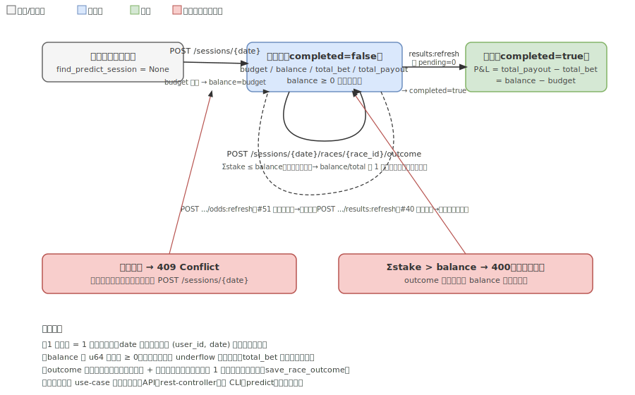
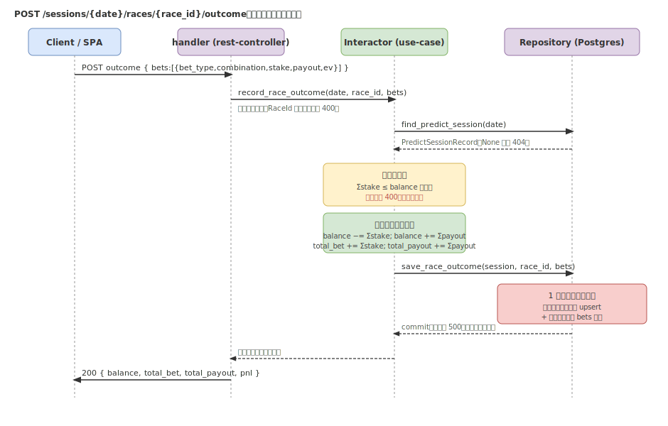

# 予想セッション write 系 REST API: 設計仕様

[Issue #53](https://github.com/taito-station/paddock/issues/53) / 依存: [#33 REST API read 基盤](https://github.com/taito-station/paddock/issues/33)・[#51 オッズ永続化](https://github.com/taito-station/paddock/issues/51)・[#40 確定結果自動取得](https://github.com/taito-station/paddock/issues/40) / 消費側: [#34 Web SPA](https://github.com/taito-station/paddock/issues/34)

## 概要

Web SPA（#34）が予想セッションを GUI 上で完結できるよう、**状態変更を伴うセッション write 系 REST API** を追加する。CLI `predict`（`apps/predict/src/session.rs`）の対話セッション（残高管理・賭け金/払戻記録・自動精算）を HTTP 経由で提供する。read 基盤（#33）の `rest-controller` / `api-server` をそのまま拡張し、同じ `domain` / `use-case` を再利用する。

CLI 側の UX・不変条件の正本は [`predict-session.md`](predict-session.md) を参照。本書は **HTTP API 層の設計**（エンドポイント・スキーマ・不変条件の強制位置・エラー写像・トランザクション境界）に絞る。

> 図は手書き SVG（macOS で drawio エクスポートが不可のため、`.svg` を正本として手で保守する）。

## スコープ

### 本 Issue（#53）でやること

- `rest-controller` にセッション write 系エンドポイント（後述）を追加。
- **不変条件を use-case 層に集約**し、API（rest-controller）と CLI（predict）で共有する（後述「不変条件の強制位置」）。
- OpenAPI（utoipa コードファースト）を #33 と同方式で拡張し、`docs/api/openapi.json` を更新。
- 統合テスト（`#[sqlx::test]` 一時 Postgres）でセッション作成 → outcome 記録 → summary の収支整合・二重作成ガード・残高ガードを検証。

### やらないこと

- 認証本体（差し込み口は #33 で用意済みの no-op を踏襲）。
- Web SPA 本体（#34）。
- オッズ取得・結果取得のロジック自体（#51 / #40 で実装済みのものを呼ぶだけ）。

## エンドポイント

prefix は #33 と同じ `/api`。パスは将来 `user_id` スコープを非破壊で差し込めるリソース指向（`/api/sessions/{date}/...`）とする。`{date}` は `YYYY-MM-DD`。

| メソッド | パス | 用途 | 主な status |
|---|---|---|---|
| POST | `/api/sessions/{date}` | セッション新規作成（budget 指定） | 201 / 400 / 409 |
| GET | `/api/sessions/{date}` | 収支サマリ + 買い目明細 | 200 / 404 |
| POST | `/api/sessions/{date}/races/{race_id}/outcome` | 賭け金・払戻を記録し残高更新（1 トランザクション） | 200 / 400 / 404 |
| POST | `/api/sessions/{date}/races/{race_id}/odds:refresh` | オッズをライブ取得して保存（#51） | 200 / 404 |
| POST | `/api/sessions/{date}/results:refresh` | 確定結果を取得して払戻を自動補完（#40） | 200 / 404 |

> **refresh 系の取得失敗の扱い**: 再利用する `OddsInteractor::race_odds` / `SettleInteractor::settle_session` は、**取得失敗（ネット断・BAN・サイト改変・開催日外）をエラーにせず `Ok` に畳む**設計（1 レースの失敗でセッション全体を止めない／冪等再実行）。`race_odds` は失敗・未公開を `None`、`settle_session` は当該レースを `pending` として継続する。したがって本 API でも **refresh 失敗は HTTP エラー（5xx）にせず、200 で「未取得／pending 件数」を本文で返す**。取得失敗を 502 等で表現するには両 interactor をエラー伝播するよう改修する必要があり、本 Issue のスコープ外（「呼ぶだけ」を維持）。

> `GET /api/sessions/{date}` は read だが、CLI `--summary` 相当でセッション操作と対になるため本 Issue に含める（web-spa.md の整理に従う）。

### POST /api/sessions/{date} — 作成

- リクエスト: `{ "budget": <u64> }`。`budget` 必須（0 も拒否）。
- 既にその日のセッションがある場合は **409 Conflict**（二重作成ガード）。
- 成功時 201 + 作成直後のサマリ（`balance == budget`、`total_bet == 0`、`total_payout == 0`、`completed == false`）。

### GET /api/sessions/{date} — サマリ

- 未作成は 404。
- レスポンス: `{ date, budget, balance, total_bet, total_payout, pnl, completed, bets: [...] }`。`pnl = total_payout − total_bet`。

### POST /api/sessions/{date}/races/{race_id}/outcome — 記録

- リクエスト: `{ "bets": [ { "bet_type", "combination", "stake": <u64>, "payout": <u64>, "ev": <f64> } ] }`（空配列 = スキップ相当も許容）。
- セッション未作成は 404。
- **残高ガード**: `Σstake ≤ balance` を満たさなければ **400**（状態は一切変えない）。
- 成功時、`balance -= Σstake; balance += Σpayout; total_bet += Σstake; total_payout += Σpayout` を計算し、**セッションヘッダ更新 + 当該レースの買い目追記を 1 トランザクション**（`save_race_outcome`）で保存。200 + 更新後サマリ。
- `payout` は記録時点で判っていれば手入力（不明なら 0）。後から `results:refresh` を呼ぶと確定結果から payout を **bet_id 指定で上書き再計算**する（毎回ゼロから再集計するため二重計上しない）。outcome 時の payout は暫定値、`results:refresh` が確定値で上書きする関係。
- `completed` は outcome では立てない（`results:refresh` が全レース確定時に立てる。本 API に明示の complete エンドポイントは設けない）。

### POST /api/sessions/{date}/races/{race_id}/odds:refresh（#51）

- `OddsInteractor<O: OddsScraper, R: Repository>::race_odds(race_id)`（read-through 取得＋保存, #51 / ADR 0010）を呼ぶ。未保存ならライブ取得して `race_odds` に保存し、保存済みなら再取得しない。
- セッション未作成は 404（セッション文脈下の操作として存在を要求する。`race_odds` 自体はセッションに依存しないが、SPA のセッション画面からの操作を一貫させるため）。
- レスポンス: 取得できたオッズの要約、または「未取得（`None`）」フラグ。取得失敗・未公開はいずれも 200 + 未取得（5xx にしない、上記の取得失敗の扱い参照）。

### POST /api/sessions/{date}/results:refresh（#40）

- `SettleInteractor<S: PayoutFetcher, R: Repository>::settle_session(date)`（#40）を呼ぶ。確定レースの per-bet payout を **毎回ゼロから再計算（冪等・bet_id 指定 UPDATE で上書き）**し、`total_payout` / `balance` を再計算、`pending_races == 0` なら `completed = true` にして 1 トランザクションで保存する。
- レスポンス: `SettleReport`（`settled_races` / `pending_races` / `voided_races` / `refunded_bets` / `total_bet` / `total_payout` / `balance` / `roi`）。未確定が残るレースは `pending_races` に出る（HTTP は 200）。
- セッション未作成は 404（`settle_session` が `NotFound` を返す）。

## 不変条件の強制位置（重要な設計判断）

現状、残高ガード・状態遷移・確定額計算の不変条件は **CLI app 層（`apps/predict/src/session.rs`）にのみ**あり、use-case の session 系メソッド（`save_predict_session` / `save_race_outcome` 等）は薄い委譲で**ガードを持たない**。API がこれらをそのまま呼ぶと不変条件が二重実装・乖離する。

→ **不変条件を use-case 層の新メソッドに集約**する:

- `create_predict_session(date, budget)` — budget 検証 + 二重作成ガード（既存なら `Conflict`）→ `balance=budget` で保存。
- `record_race_outcome(date, race_id, bets)` — セッション取得（無ければ `NotFound`）→ 残高ガード（`Σstake > balance` なら `InvalidArgument`）→ 残高/累計を計算 → `save_race_outcome` で 1 トランザクション保存 → 更新後レコードを返す。
- サマリ取得 `session_summary(date)` — セッション + bets をまとめて返す。

API（rest-controller）はこれらを呼ぶだけにする。**CLI も同メソッド経由に寄せる**ことで不変条件の単一実装を保つ（CLI の対話 UX 部分は残す）。CLI 移行を本 PR に含めるか別 PR とするかは実装時に判断するが、**不変条件の二重実装は作らない**方針を本設計の核とする。

## エラー写像（use_case::Error の拡張）

read API（#33）は `InvalidArgument`/`NotFound`/`Internal`（+ `Fetch`/`Timeout`）のみ使った。write では二重作成の **409** を表現したいが、現状 enum に該当がない。

→ `use_case::Error` に **`Conflict(String)`** を追加し、rest-controller 側で 409 に写像する。残高超過・budget 不正は `InvalidArgument`（400）。

| use_case::Error | HTTP |
|---|---|
| `InvalidArgument` | 400 |
| `NotFound` | 404 |
| `Conflict`（新規） | 409 |
| `Internal` | 500 |

- **rest-controller の `Error` enum にも `Conflict`(409) variant を追加**し、`status_code()` / `code()` / `error_response()` / `From<use_case::Error>` の網羅分岐を更新する（read 系 #33 の `From` は `Conflict` 追加でコンパイラが網羅性を要求する）。`ErrorBody`（`{ "error": { code, message } }`）で返し、500 は #33 同様に内部詳細を伏せてログのみに出す。
- **502 は導入しない**。refresh 系の取得失敗は再利用 interactor が `Ok`（None / pending）に畳むため HTTP エラーにならず、200 で本文に状態を載せる（上記「refresh 系の取得失敗の扱い」）。`use_case::Error::Fetch`/`Timeout` は read 系（#33）の既存写像（500）のまま変更しない。

## OpenAPI

#33 と同じ utoipa コードファースト。新スキーマ（`CreateSessionRequest` / `SessionSummaryResponse` / `BetRecord` / `RecordOutcomeRequest` / 各 refresh のレスポンス）に `#[derive(ToSchema)]`、handler に `#[utoipa::path]` を付け、`ApiDoc` の `paths`/`components` に追加する。`docs/api/openapi.json` を再生成してコミットし、スナップショットテストで一致を担保する。

## マルチユーザー化への布石（今は実装しない）

- パスは `/api/sessions/{date}` のリソース指向。将来 `/api/users/{user_id}/sessions/{date}` 等へ非破壊拡張できる形にする。
- `predict_sessions` の一意制約は現状 `date`。将来 `(user_id, date)` へ拡張できる前提を崩さない（DDL 変更は別 Issue）。
- 認証は #33 の no-op 差し込み口を踏襲（本体は別 Issue）。

## テスト方針

- 統合テスト `src/apps/api-server/tests/`（`#[sqlx::test]` 一時 Postgres、#33 と同方式）:
  - 作成 → outcome 記録 → `GET summary` で `pnl = total_payout − total_bet = balance − budget` の収支整合。
  - 二重作成で 409。
  - `Σstake > balance` で 400 かつ**状態不変**（再取得で balance が変わらないこと）。
  - 未作成日への outcome / summary で 404。
- 実行は Postgres 接続環境が前提（#160 の CI 整備で実走）。

## 関連

- 正本: [`predict-session.md`](predict-session.md)（CLI セッションの不変条件）・[`web-spa.md`](web-spa.md)（API 一覧）・[`rest-api-read.md`](rest-api-read.md)（read 基盤）
- ADR: `docs/adr/0023-session-write-api.md`
- 依存 Issue: #33（基盤）/ #51（odds:refresh）/ #40（results:refresh）
